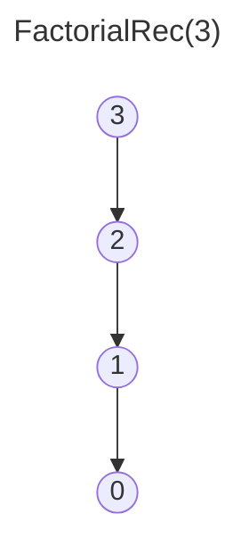
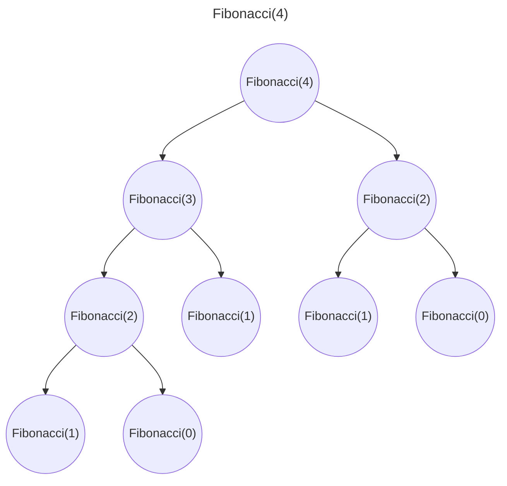

[<- Índice](../AnalisisAlgoritmos.md)
# Algoritmos Iterativos

Algoritmos que se ejecutan mediante ciclos, sentencias que ejecutan una secuencia de instrucciones repetidamente una cierta cantidad de veces o hasta que se cumpla una condición de paro.

### Invariantes de ciclo

Dado que el número de veces que un ciclo se ejecuta es un número natural, podemos utilizar inducción matemática en este valor para demostrar que el resultado de su ejecución es el resultado esperado y uitilizar esta información para demostrar que un algoritmo iterativo es correcto.

Queremos que el enunciado de la hipostesis de inducción refleje la relación entre variables durante la ejecución del ciclo.
Llamamos a esta hipótesis de unducción una **invariante de ciclo**.

> Es una afirmación sobre las variables que se mantiene correcta independientemente del número de veces que se ejecute un ciclo.

==La parte más importante es encontrar una invariante adecuada==: queremos una hiótesis de inducción que utilice precondiciones del ciclo para probar que se obtienen las 2 condiciones deseadas.

Una vez propuesta la invariante de ciclo debemos demostrar lo siguiente:

1. **Inicialización**: Es verdadera antes de la primera iteración del ciclo (*Caso base*)

2. **Mantenimiento**: Si es verdadera antes de una iteración del ciclo entonces permanece verdadera al final de la siguiente iteración. (*Paso inductivo*)

3. **Finalización**: Considerar y enunciar en que casos termina el ciclo y que implica eso en conjunto con la invariante propuesta.

Entonces, una vez probada la invariante, nos proporciona una propiedad útil para demostrar que el algoritmo es correcto.

#### Ejemplo de demostración:

```pseudo
\begin{algorithm}
	\caption{InsertionSort(A)}
	\begin{algorithmic}
		\For{j=2 hasta n}
			\State val = A[j]
			\State i = j - 1
			\While{i > 0 y A[i] > val}
				\State A[i + 1] = A[i]
				\State i = i - 1
            \EndWhile
			\State A[i + 1] = val
	    \EndFor
    \end{algorithmic}
\end{algorithm}
```

###### Invariante
Al iniciar cada iteración, el subarreglo $A[i,\cdots,j-1]$ consiste de los elementos originales en $A[1,\cdots,j-1]$ pero ordenados, donde $j$ es la variable entera declarada en el **For**.

###### Inicialización
Al iniciar la primera iteración $j=2$ por lo que $A[1,\cdots,j-1]$ consiste de un solo elemento ($A[1]$) que cumple trivialmente con la condición propuesta.

###### Mantenimiento
Recalcemos que por H.I, $A[1,\cdots,j-1]$ está ordenado.
En las líneas 4-6 movemos los elementos $A[j-1]$, $A[j-2]$, ... $A[j-m]$ una posición a la derecha, hasta encontrar el lugar correcto de $A[j]$. Necesitamos probar ese cilo while con otra invariante...

(

###### Invariante (While)
Antes de la iteración $k$ los últimos $k-1$ elementos de $A[1, \cdots,j-1]$ se encuentran en $A[j-(k-2), \; j]$ en su orden original. (Es decir, se recorrieron)

###### Inicialización (While)
En la iteración 1, tenemos $k-1=0$, es decir 0 elementos se han recorrido por lo que cumple trivialmente la afirmación.

###### Mantenimiento (While)
Al iniciar la iteración $k$, tenemos que $i=j-k > 0$.
> (Ya que en cada iteración se le ha restado 1 a $i$ y han pasado $k-1$ iteraciones, además de considerar que $i$ se inicializo como $j-1$, por lo que $i=j-1 - (k-1) = j-k$).

Por H.I sabemos que $A[j-(k-2), \; j]$ o expresado de otra manera, $A[i+2,\; j]$ contiene los últimos $k-1$ elementos de $A[1,\cdots,j-1]$.

Por lo tanto al copiar $A[i+1] = A[i]$ se cumple que $A[i+1,j] = A[j-(k-1),j-1]$ contiene los últimos $k$ elementos de $A[1,\cdots,j-1]$ en su orden original.

###### Finalización (While)
El ciclo termina cuando se acaban los elementos por recorrer o cuando se encuentra $A[i] \leq val$. La invariante implica que todos los elementos que no cumplieron esta última condición se movieron una posición a la derecha.

)

Al cumplirse la condición en el ciclo interno, podemos pensar que se mueven todos los elementos mayores a $A[j]$ hasta su posición.

Además la línea $A[i+1] = val$ implica que el valor de $A[j]$ se asigna en la posición que le corresponde pues todos los elementos siguientes (y mayores a él) se han recorrido una posición y este se asigna en la posición donde esa propiedad dejo de cumplirse.

Siendo así, podemos notar que ahora el subarreglo $A[1,\cdots,j]$ contiene a los elementos originales pero ordenados, cumpliendo así el paso inductivo para este invariante.

###### Finalización
La condición del paro es $j>n$, como incrementa en 1 cada iteración tenemos $j=n+1$ cuando se detuvo el ciclo.
Por tanto, tomando en cuenta la invariante, el subarreglo $A[1,\cdots,n]$ (que es el arreglo completo) está ordenado.

Entonces el algoritmo es **correcto**.

> Hay más ejemplos en las notas

#### Recomendaciones para demostraciones de algoritmos con múltiples ciclos

1. **Ciclos consecutivos no anidados**: Probar las invariantes de forma consecutiva asumiendo para cada ciclo que el anterior se cumple con la iteración actual del ciclo principal.

2. **Ciclos anidados**: Trabajar de adentro hacia afuera. Probar terminación e invariante de ciclo interior para valores arbitrarios del exterior.

# Algoritmos recursivos

La **recursión** es una forma de especificar un objeto o proceso basandose en su propia definición.

> Un algoritmo es recursivo si tiene una o más llamadas a si mismo.

Se suele tener 2 tipos de casos bien diferenciados:

- **Casos base**: Casos en los que el problema tiene una ==solución directa==. Son los últimos casos en los que se ejecuta la recursión.
- **Casos recursivos**: Casos en los que se reduce el problema a una o más instancias del mismo problema que son casos más simples. Estos casos más simples corresponden a las llamadas recursivas.

> **Tips para demostraciones**: Por lo general este tipo de construcciones consisten en suponer que el algoritmo regresa la respuesta correcta en instancias de tamaño menor que $n$ y luego en el paso inductivo mostrar que se puede producir la respuesta global a partir de las soluciones a los subproblemas dadas por la hipostesis inductiva.

**Recursión indirecta**: Se da cuando el agoritmo tiene una llamada a otro algoritmo que es el que lo llama de vuelta a el primer algoritmo.

### Árbol de recursión

La herramienta fundamental y principal para el análisis de complejidad asintótica de algoritmos recursivos es el árbol de recursión.

> El árbol de recursión de un algoritmo A con entrada *x* es un vértice con entrada *x*. Si esa ejecución hace llamadas recursivas entonces tiene como hijos los árboles de recursión de esas llamadas recursivas.

Por ejemplo para el siguiente algoritmo:

**Prerrequisitos**: $n \geq 0$
```pseudo
\begin{algorithm}
\caption{FactorialRec($n$)}
\begin{algorithmic}
	\If{$n$ = 0}
		\Return 1
	\Else
		\Return $n \; \times$ FactorialRec($n-1$)
    \EndIf
\end{algorithmic}
\end{algorithm}
```

El árbol de recursión para $FactorialRec(3)$ sería:



---

Otro ejemplo sería para el algoritmo:

**Prerrequisitos**: $n \geq 0$
```pseudo
\begin{algorithm}
\caption{Fibonacci(n)}
\begin{algorithmic}
	\If{$n \leq 1$}
		\Return $n$
	\Else
		\Return Fibonacci(n-1) + Fibonacci(n-2)
    \EndIf
\end{algorithmic}
\end{algorithm}
```

Su árbol de recursión para $Fibonacci(4)$ sería:


# Enlaces

[<- Anterior](AA_Complejidad.md) | [Siguiente ->](AA_DivideVenceras.md)