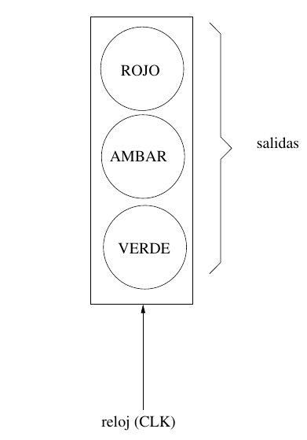
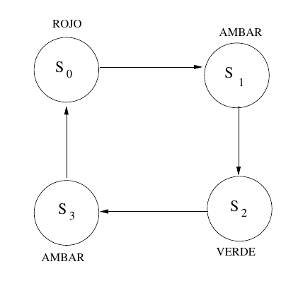
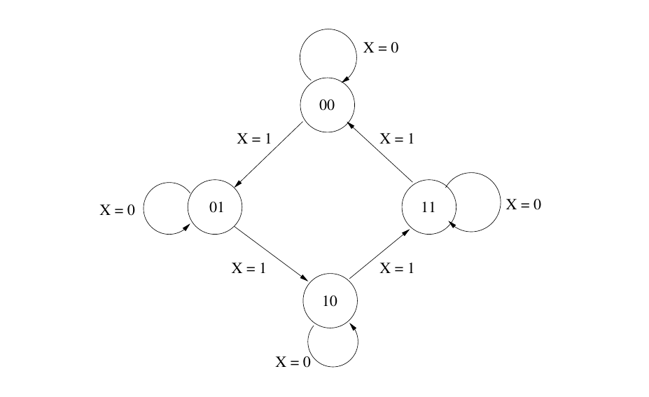
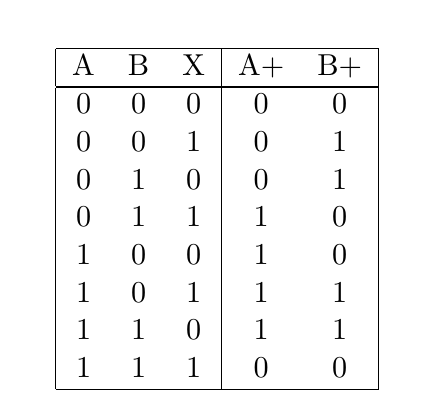

# Lógica Secuencial y maquinas de estado finito

En muchos diseños digitales hay la necesidad de circuitos lógicos cuya salida depende no sólo de las entradas presentes, sino también de la historia pasada o secuencia de acciones del circuito.
Esto se puede lograr mediante construir circuitos con memoria, los cuales son capaces de almacenar información acerca de la historia pasada del propio circuito.
Tales circuitos se conocen como **circuitos de lógica secuencial**.

Un ejemplo sencillo del uso de tales circuitos secuenciales es un semáforo para control de tráfico vehicular:

El semáforo funciona como sigue: si el color que se muestra es verde, en alguno de las siguientes señales de reloj *(CLK)* debe de cambiar a ámbar, y luego a rojo.
Después de un tiempo, el rojo debeb cambiar de nuevo a verde.
Nótese que el siguiente color a mostrarse depende del color que se muestra actualmente.

El **estado** de un sistema se refiere a su condición interna en nun momento en particular, que se describe mediante el valor de sus salidas o variables.

El semáforo requiere de cuatro estados: $S_0$, $S_1$, $S_2$, $S_3$. El circuito que loc ontrola va cambiando de estado a estado bajo el control de la señal de reloj *(CLK)*. De tal modo, estos circuitos secuenciales se les conoce como ***síncronos***.

Un circuito secuencial con $n$ variables de estado tiene hasta $2^n$ posibles estados.
Cómo el número de posibles estados es siempre finito, los circuitos secuenciales se les conoce comúnmente como máquinas de estado finito (*Finite State Machines* o *FSM*).
El comportamiento de una *FSM* se describe mediante tablas de estado, que normalmente contienen las siguientes columnas: entradas, estado presente, estado siguiente, y salidas.

Por ejemplo, a continuación se presenta el diagrama y la tabla de estados de un contador en binario del 0 al 3:

# Flip-flops

El circuito secuencial más sencillo es el **flip-flop**, que es un elemento de memoria y/o almacenamiento de un solo bit.

Un **flip-flop** o **multivibrador biestable** es un circuito cuya variable de salida permanece con un valor de 0 o 1 hasta que uno o más valores binarios se apliquen a sus terminales de entrada, en cuyo caso el valor de la variable de salida cambia en el siguiente tiempo.
Ya que la salida del *flip-flop* no cambia hasta que los valores adecuados se aplqieun a sus entradas, este dispositivo es capaz de recordar el valor de un solo bit.

![[flip-flop.png]]

- Comúnmente, el valor Q es llamado el estado del flip-flop.
- Q' representa la negación o *complemento de Q*

A continuación, en las siguientes secciones se mecionan algunos de los flip-flops más utiles y conocidos.

### El flip-flop RS 