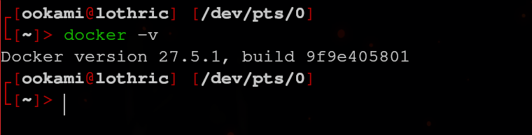
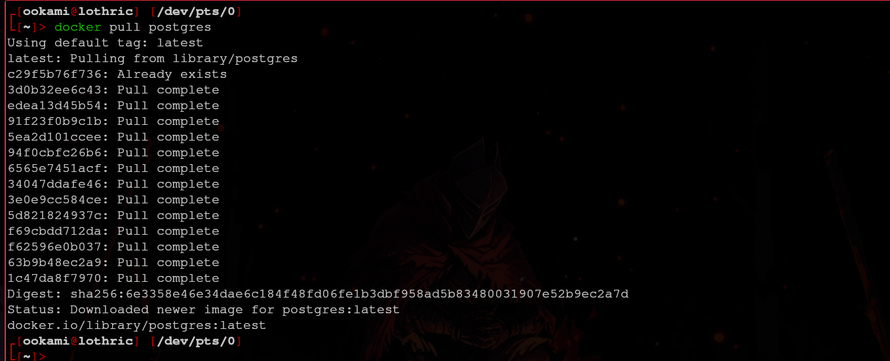
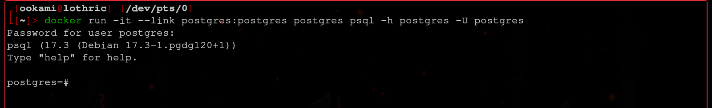
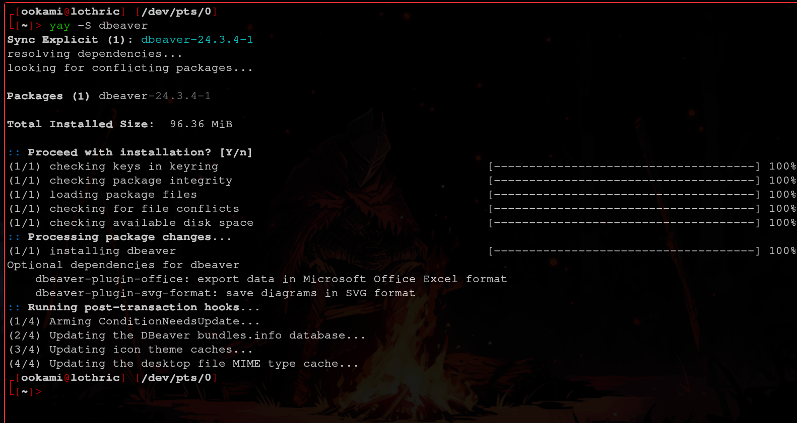
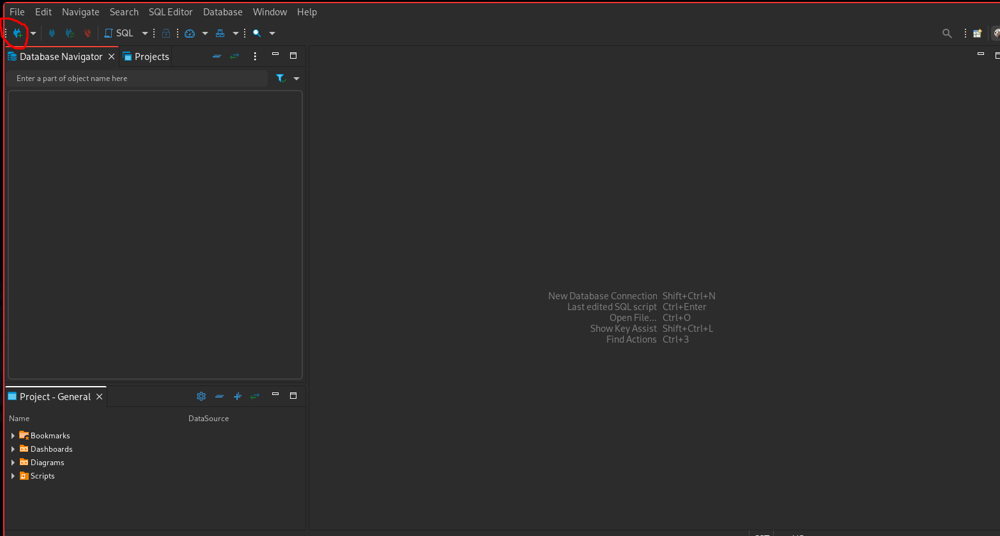
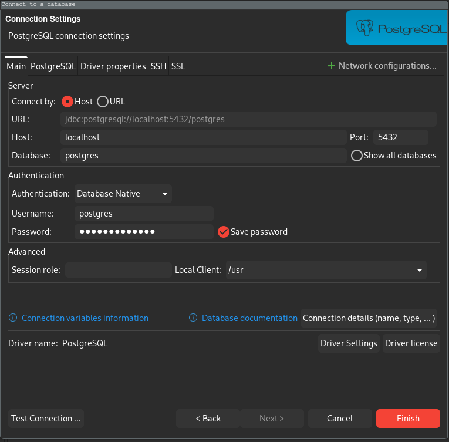
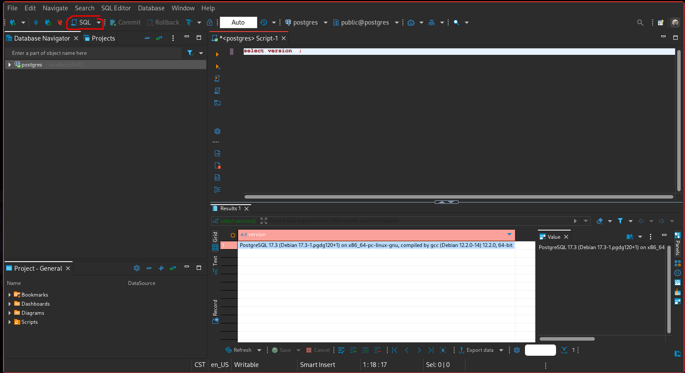

# Bitácora Práctica 1
#### > Fernando Romero Cruz 319314256

### Pregunta

**¿Por qué una empresa debería escoger una base de datos *Open Source*?**

Utilizar una base de datos de código abierto provee varios tipos de ventajas principalmente en costos, flexibilidad y seguridad .
Los costos se reducen, pues el código libre es gratuito y accesible para todas las personas, lo que implica menos tarifas y montos de licencias o actualizaciones que tendríamos que pagar en muchas otras opciones.
La capacidad de acceder, modificar y adaptar el código de la aplicación permite un control flexible de la base de datos, que podemos ejercer enfocada a las necesidades de la empresa.
Además, gracias a la disponibilidad del código fuente, es sencillo realizar auditorías de seguridad en busca de vulnerabiidades y bugs presentes en éste, garantizando el bienestar, seguridad y confianza de los clientes.

### Información

1. **Sistema Operativo y Versión**: GNU/Linux 6.13.2-arch1-1
2. **Distribución**: *Arch Linux*
3. **Versión de la instalación**: *Docker* version 27.5.1, *DBeaver* 24.3.4-1 y *PostgreSQL 17.3 (Debian 17.3-1.pgdg120+1) on x86_64-pc-linux-gnu, compiled by gcc (Debian 12.2.0-14) 12.2.0, 64-bit*
4. **Tiempo requerido**: Aproximadamente 20 minutos

### Procedimiento

No tuve que hacer la instalación de *Docker*, pues ya lo había tenido que instalar anteriormente para un curso de ciberseguridad que tome el semestre pasado.

Entonces simplemente ejecute los comandos *Docker* indicados en el *PDF* de la práctica:

Ya con mi contenedor corriendo, procedí a instalar *DBeaver* con el siguiente comando:

Ya en la aplicación, procedi a conectar el servicio de la **base de datos** con *DBeaver* mediante la opción resaltada:

Seleccione que deseaba conectar una base de datos *PostgreSQL* y se genero el siguiente cuadro donde indique la contraseña provista anteriormente y seleccioné *Finalizar*.

Finalmente, para verificar la instalación, imprimí la versión de la base de datos en la sección **SQL** de *DBeaver*:

#### Comentarios

> No tuve realmente demasiados problemas para instalar estos programas, generalmente instalar programas en mi distribución no es muy complicado. Aunque desconozco el funcionamiento de *Docker*, lo he utilizado brevemente antes y me parece muy interesante poder levantar una imágen de una base de datos de forma tan cómoda.