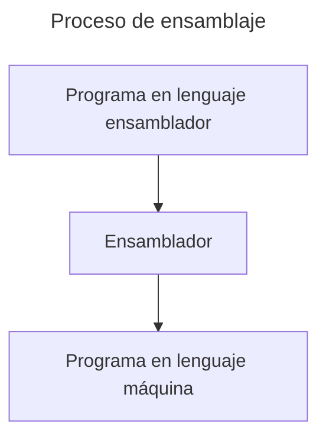
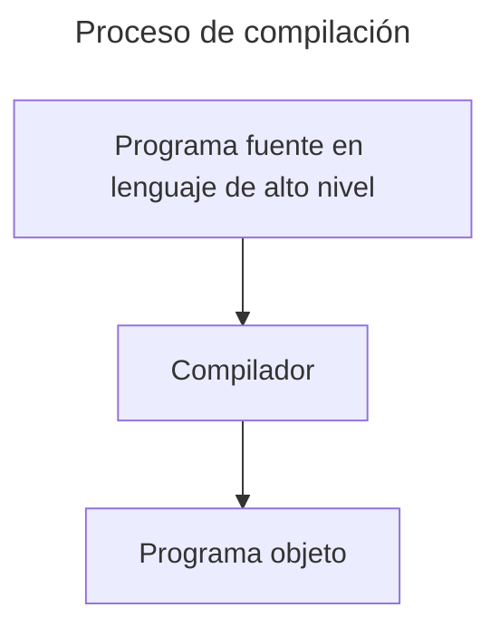
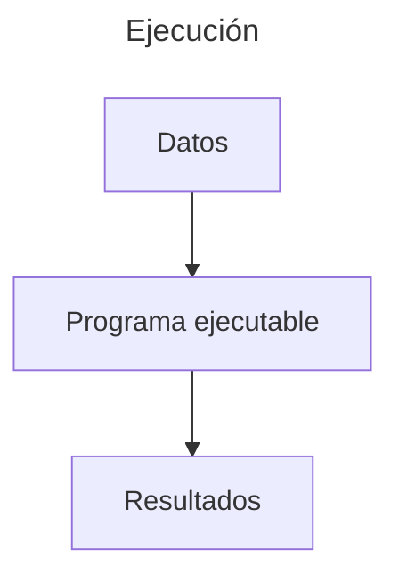
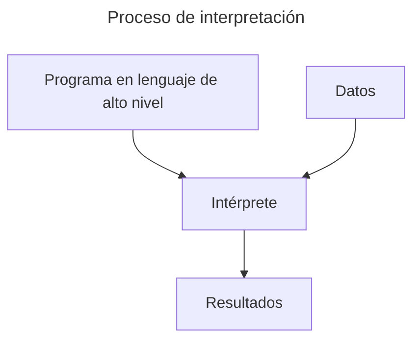
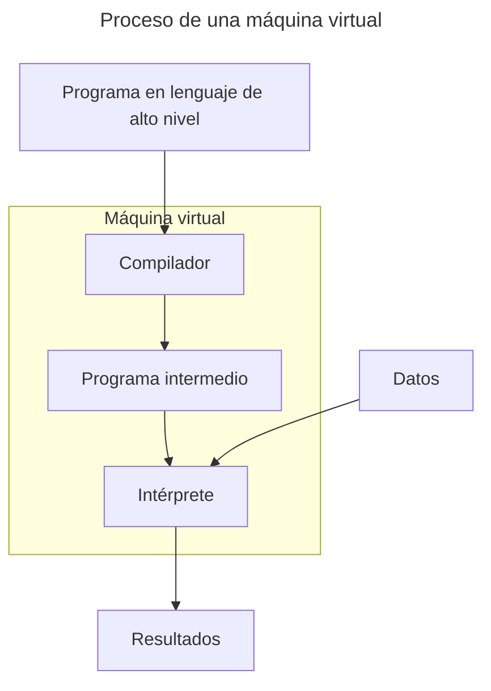

[<- Índice](../Compiladores.md)
# Introducción

> Los **compiladores** son herramientas esenciales, ya que permiten traducir programas escritos en **lenguajes de alto nivel** a **código máquina ejecutable** por una computadora.
> El desarrollo de un **compilador** es un esfuerzo complejo tanto teórico como práctico.

El concepto de ***compilador*** surgió en los años 50, cuando *Grace Hopper* desarrolló el primer compilador para el lenguaje de programación *Flow-Matic*, precursos de *COBOL*.
Desde entonces, los compiladores han evolucionado significativativamente en eficiencia y capacidad.

### Historia

- **Década de los cuarenta**
	- Primeras computadoras
	- Programación en código máquina
	- Primero ensambladores
	- Se automatiza el proceso de ensamblado

- **Década de los cincuenta**
	- *John Backus* dirige en *IBM* un proyecyo de lenguaje algebraico.
	- Se desarrolla el primer compilador de *FORTRAN* entre 1954-1958.
	- Se desarrolla la primera versión del compilador de *FORTRAN* para *IBM* modelo 704.
	- *Noam Chomsky* publica sus estudios sobre la estructura de los lenguajes formales.
	- Se define **IAL** (*International Algebraic Language*), posteriormente llamado *ALGOL58* y precursor de *Pascal*, *Ada* y *Modula*, con características como:
		- Definido en notación **BNF** (*Backus-Naur Form*)
		- Declaración de variables
		- Estructura modular
		- Funciones recursivas
		- Paso de parámetros por valor o por nombre
	- ==Primeras técnicas de desarrollo de compiladores==
	- Se divide la fase de compilación en 2 etapas: **front-end** y **back-end** y también, se promueve la creación de *UNCOL*, lenguaje intermedio universal.

- **Década de los sesenta**
	- Primer analizador sintáctico descendente recursivo
	- Se estudian las gramáticas *LL*

- **Década de los setenta**
	- Se estudian las gramáticas *LR*
	- Se definen los métodos de análisis ascendente *SLR* y *LALR*
	- Se crean muchas herramientas para ayuda de diseño de compiladores
	- Aparecen *lex*, *yacc*, *flex* y *bison*
	- Generación de código utilizando:
		- Gestión de **memoria estática**
		- **Pila** como forma de gestionar la memoria
		- **Memoria dinámica** con apoyo del montículo (*heap*) como zona de este tipo de memoria.
		- Con problemas respecto a **perdidas de referencia** o **recolección de basura**.

- **Últimos años**
	- Optimización de código
	- Máquinas virtuales y auge de los lenguajes interpretados

## Traductor

> Un **traductor** es un *Software* que realiza la traducción de un programa escrito en un lenguaje de programación *A* y genera otro programa escrito en otro lenguaje de programación *B*, preservando su significado.

Existen varios tipos de traductores en los que profundizaremos:

### Ensamblador

> Un ***ensamblador*** es un **programa** que convierte código escrito en **lenguaje ensamblador** a **código máquina** o **binario**, que el *CPU* es capaz de ejecutar. 

##### Características de los programas en lenguaje ensamblador

- Son rápidos
- Ocupan poco espacio de almacenamiento
- Son programas independientes del ensamblador
- Solo se ensamblan una vez y se ejecutan las veces que sean
- No son portables

##### Ejemplos de lenguajes ensamblador

- **68HC11**
- **MIPS**
- **x86**
- **SPARC**

### Compilador

> Un **compilador** es un **traductor** de ***código fuente*** escrito en un ***lenguaje de programación de alto nivel*** a ***código máquina o intermedio*** ejecutable por el *CPU*.

Un **programa objeto** es un archivo en **lenguaje máquina** pero que no suele ser completamente ejecutable, requiriendo una fase adicional de **enlazado** para convertirse plenamente en un **ejecutable**.

##### Tipos de compiladores

***Compilador cruzado***: Genera **código objeto** para una **plataforma diferente** de la que se está ejecutando el compilador.

***Compilador fuente a fuente***: Tambien conocido como **transcompilador**, convierte código fuente de un **lenguaje de programación de alto nivel** a otro **lenguaje de programación de alto nivel**.
Esto contrasta con los demás compiladores que buscan traducir el código a un archivo ejecutable.

***Metacompilador***: Es un tipo especial de compilador que ==genera código de otro compilador== capaz de compilar convencionalmente un **lenguaje de programación** determinado.

##### Características de los programas compilados

- Son rápidos.
- Son independientes del compilador.
- No son portables.
- Se compilan una vez y se ejecutan todas las veces que se requiera.

##### Ejemplos de lenguajes compilados

- **C**
- **FORTRAN**
- **PASCAL**
- **ADA**

### Intérprete

> Un intérprete es un **programa** que **interpreta** y ejecuta, en tiempo real, código fuente directamente, línea por línea, sin la necesidad de generar un código ejecutable o intermedio como lo hace un compilador.

##### Características de los programas interpretados

- Son programas más lentos que los programas compilados
- Son programas dependientes del intérprete
- Cada vez que se ejecutan tienen que ser interpretados
- Son portables a cualquier entorno que cuente con el **intéroprete**.

### Máquina Virtual

> Estos tipos de **traductores** forman una abstracción de una máquina real que pueda compilar y/o ejecutar el programa objeto, en lugar de ejecutarlo en el *hardware* de la máquina real.

Esto se realiza con el objetivo de **facilitar la ejecución de programas** en un entorno aislado e independiente del sistema operativo subyacente.

##### Características de los programas en máquina virtual

- Solo se compilan una vez
- Cada vez que se ejecutan son interpretados
- Son más lentos que los programas compilados
- Son portables
- Garantizan un programa libre de errores a la entrada del intérprete virtual

# Enlaces

[Siguiente ->](Compi_30_01_2025.md)