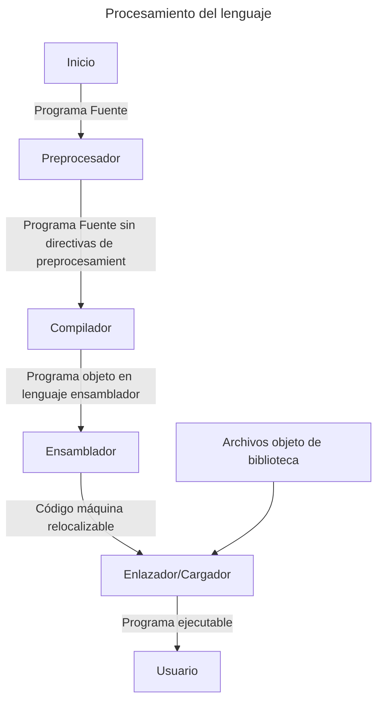
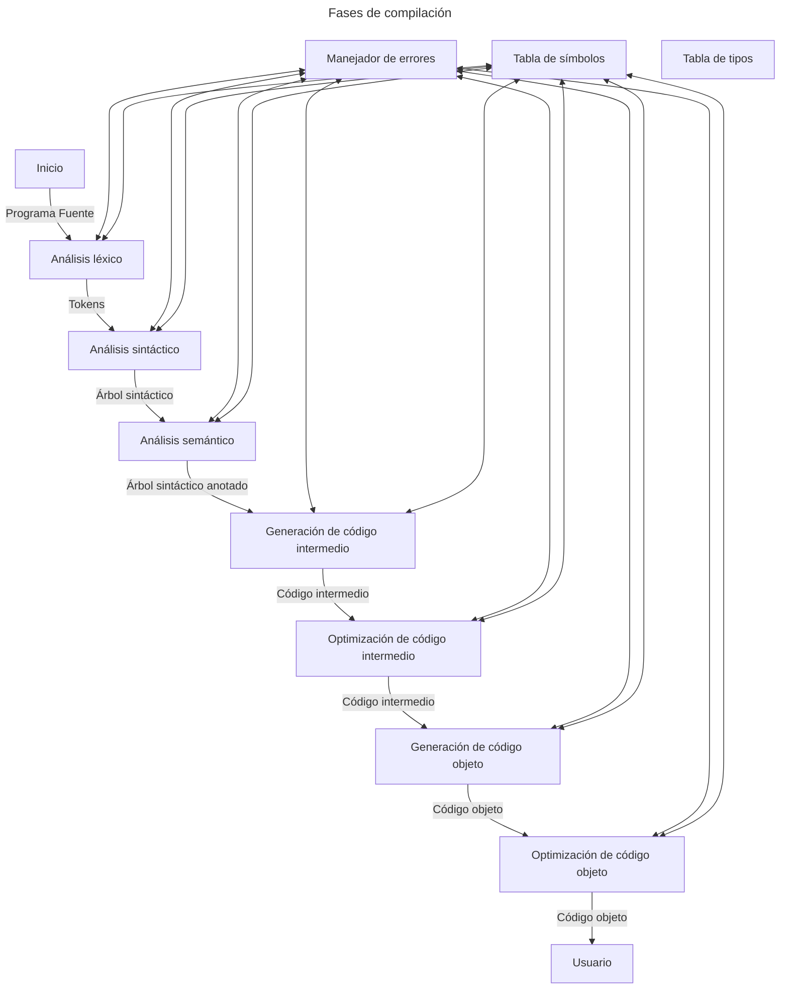

[<- Índice](../Compiladores.md)
# Sistema de procesamiento de lenguaje

- El ***preprocesador*** se encarga de eliminar *directivas de preprocesamiento*, como lo son la inclusión de bibliotecas, la definición de macros, compilación condicional, etc.
- El ***compilador*** realiza una traducción a programa objeto en **lenguaje ensamblador**.
- El ***ensamblador*** transforma este programa objeto a **código máquina relocalizable**.
- El ***enlazador*** agrupa los programas objetos resultantes en un solo archivo y el ***cargador*** asigna las direcciones de memoria definitivas al código.

### Fases de compilación

# Enlaces

[<- Anterior](Compi_29_01_2025.md) |