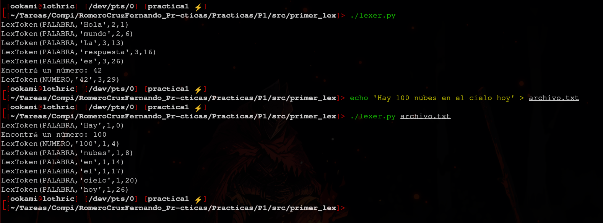

# Práctica 2 - Compiladores

> Fernando Romero Cruz - 319314256

### Pasos

Almacené el código brindado en la práctica en el archivo `lexer.py`, agregué un *shebang* (`#!`), y le brindé permisos de ejecución.
Verifiqué que no hubiera problemas en la ejecución, almacené en un archivo la frase indicada, `Hay 100 nubes en el cielo`, y se la indiqué al analizador léxico:



### Preguntas

1. ¿Qué ocurre si agregamos una regla simple como `t_espacio = r'\ +'` y nada más? (0.5 pts)

> Nos anuncia un error, pues no definimos ningún token `espacio` al que le corresponda ésta regla.

```
ERROR: Rule 't_espacio' defined for an unspecified token espacio
Traceback (most recent call last):
  File "/home/ookami/Tareas/Compi/RomeroCruzFernando_Pr-cticas/Practicas/P1/src/primer_lex/./lexer.py", line 60, in <module>
    lexer = lex.lex()
  File "/usr/lib/python3.13/site-packages/ply/lex.py", line 909, in lex
    raise SyntaxError("Can't build lexer")
SyntaxError: Can't build lexer
```

2. ¿Qué ocurre si quitamos algún elemento de la lista de tokens? (0.5 pts)

> Por ejemplo, al quitar `PARDER`, se obtiene un error similar al anterior, pues ahora hay una regla `t_PARDER` definida sin el *Token* correspondiente.

3. ¿Cómo podemos calcular la posición en columna en caso de un error léxico? (0.5 pts)

> Basandonos en cuantos *Tokens* se procesaron antes del problemático.

4. ¿Qué significa el valor que se aloja en `t.value`? (0.5 pts)

> Es el objeto o valor de *Python* que el *Analizador Léxico* asignaŕa a cada *Token* en el código fuente. Ya sea un número, booleano, cadena u otro objeto.

5. ¿Qué pasa al ejecutar el programa e introducir cadenas de caracteres y de dígitos sin espacios en el archivo de entrada? (0.5 pts)

> Separa los números y los caracteres en las cadenas introducidas, pues las expresiones regulares los delimitan.

6. ¿Qué ocurre si introducimos caracteres como "\*" en el archivo de entrada? (0.5 pts)

> Anuncia un error léxico, pues no se reconoce el caracter `*` al no estar definido en ningún *Token*.

7. Modificar al código anterior en un archivo nuevo, de tal manera que ejecute una acción léxica al detectar lo siguiente: (2 pts)
    1. La expresión regular para los hexadecimales en lenguaje C.
    2. 5 palabras reservadas del lenguaje Python.
    3. Los identificadores válidos del lenguaje Java, con longitud máxima de 32 caracteres (**Sugerencia**: use el operador {m,n}).
    4. Los espacios en blanco.

> Primero, se deben agregar los nuevos *Tokens* al arreglo especial `tokens` en un archivo `lexer2.py`:

```python
# Lista de tokens. Siempre REQUERIDO
tokens = (
    "PALABRA",
    "NUMERO",
    "PARIZQ",
    "PARDER",
    "HEXNUM",
    "FOR",
    "IN",
    "IF",
    "ELIF",
    "ELSE",
    "JIDENT",
    "ESPACIO"
)
```

Y ya indicados, declaré las acciones léxicas en cada caso:

```python
# Definición de reglas para números hexadecimales
@TOKEN(r'0x[0-9a-f]+')
def t_HEXNUM(t):
    print(f'Encontre un hexadecimal {t.value}')
    t.value = int(t.value,16)
    return t

# Definición de palabras reservadas
@TOKEN(r'for')
def t_FOR(t):
    print('Palabra reservada for')
    return t

@TOKEN(r'in')
def t_IN(t):
    print('Palabra reservada in')
    return t

@TOKEN(r'if')
def t_IF(t):
    print('Palabra reservada if')
    return t

@TOKEN(r'elif')
def t_ELIF(t):
    print('Palabra reservada elif')
    return t

@TOKEN(r'else')
def t_ELSE(t):
    print('Palabra reservada else')
    return t

# Identificadores Java
@TOKEN(r'[a-zA-Z_$][a-zA-Z0-9_$]{0,31}')
def t_JIDENT(t):
    print(f'Identificador java: {t.value}')
    return t

# Espacios en blanco
@TOKEN(r'\ ')
def t_ESPACIO(t):
    print('Espacio en blanco!')
    return t
```