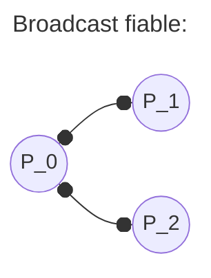

## Multicast Fiable

Cada nodo o proceso $p$ guarda un número de secuencia $S_g^p$ (por cada grupo $g$ al que pertenece) el cual indica el número de mensajes enviados previamente desde $p$ a $g$.

También guarda, por cada otro nodo $q$ en $g$, un contador $R_g^q$ del número de mensajes recibidos desde $q$ (en $g$).

**Todos los contadores inician en 0**

### Procedimiento

#### Emisor $p$

$F-multicast(g,\; m)$:
- Adjunta $S_g^p$ a $m$.
- Adjunta también $<q,R_g^q>$ por cada $q$.
- Envia todo junto $<m,\; S_{g}^{p},\{<q, \; R_{g}^{q}> | \; \forall q\}>$
- Aumenta en 1 el valor de $S_{g}^{p}$

#### Receptor $q$

**Prerrequisitos**: Recibe $<m,\; S,\; <r,\; T_{g}^{r}>>$ desde $p$

$F-entrega(m,\; p)$:
- Si $S=R_{j}^{p}+1$, entonces el mensaje es el siguiente y es recibido:
	- $R_{g}^{p} = R_{g}^{p}+1$
	- $recv(m)$

- Si $S \leq R_{g}^{p}$, entonces el mensaje esta repetido y se descarta:
	- descarta $m$
	
- Si $S > R_{g}^{p}$ o $T_{g}^{r} > R_{g}^{r}$ para cualquier $r$: Entonces se perdió algún mensaje y se solicita que se vuelva a enviar:
	- envía $<nack,S>$ a $p$ o envía $<nack,R_{g}^{r}>$ a r según sea el caso
	- retiene $m$ (o lo descarta, según se haya implementado particularmente)

### Ejemplo:

%%Falta explicación de casos%%