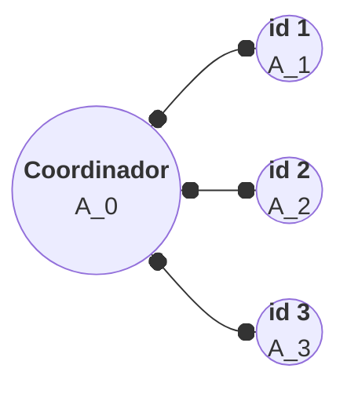

[<- Índice](../ComputacionDistribuida.md)

# Algoritmos Distribuidos

Recordemos que un **algoritmo distribuido** es un algoritmo diseñado para ser ejecutado en conjunto de nodos (computadoras, dispositivos, proces, etc) que colaboran y se comunican entre sí para resolver un problema común.

Estos nodos trabajan de manera ==autónoma== y se encuentran interconectados a través de una red, como unred local (*LAN*) o *Internet*.

## Características

#### - Concurrencia
Los nodos trabajan simultáneamente y ejecutan partes del algoritmo al mismo tiempo.

#### - Comunicación
Los nodos se comunican entre sí a través de mensajes para coordinar sus acciones y compartir información.

#### - Fallas
Los algoritmos deben ser tolerantes a **fallos**, ya que alguno de los nodos o enlaces de comunicación puede fallar.

#### - Sincronización
Muchos algoritmos distribuidos requieren sincronizar las acciones de los nodos, lo que puede ser complicado debido a cualquier desperfecto en la comunicación.

#### - Escalabilidad
Los algoritmos distribuidos deberían estar diseñados para escalar eficientemente, es decir, que se puedan agregar más nodos sin pérdida significativa en el rendimiento del algoritmo.

## Ejemplo: Encontrar el máximo

Sea $A$ una secuencia de $n$ elementos, sea $p$ el número de nodos y sea el nodo con $id=0$ el nodo **coordinador**.

Planteamos el algoritmo tal que cada nodo (tambien denominados *trabajadores*) con $id=t \neq 0$ recibe el arreglo $A_t$ con $(n/p)$ elementos del arreglo original, para su procesamiento.

Por ejemplo para 4 nodos:



Tanto el coordinador como los trabajadores van a realizar una busqueda del máximo de sus arreglos locales (*máximos locales*), pero los algoritmos que ejecutan son ligeramente diferentes dada su naturaleza jerárquica:

```pseudo
\begin{algorithm}
\caption{Coordinador}
\begin{algorithmic}
	\For{$t=1$ to $p-1$}
		\State \textit{send}($t$, "s")
    \EndFor
	\State $m_{0}= max(A_0)$
	\For{$t=1$ to $p-1$}
		\State \textit{recv}($t$, $m_t$)
    \EndFor
	\State $m=max([m_0, m_1, ..., m_{p-1}])$
	\Return m
\end{algorithmic}
\end{algorithm}
```

```pseudo
\begin{algorithm}
\caption{Trabajador $t$}
\begin{algorithmic}
	\State \textit{recv}(0, "s")
	\State $m_{t}= max(A_t)$
	\State \textit{send}(0, $m_t$)
\end{algorithmic}
\end{algorithm}
```

**Aclaraciones**:
- La función $send(t, \;$ "s" $)$ envia la bandera "s" al nodo con identificador $t$.
- La bandera "s" representa una solicitud de información (Les esta pidiendo los resultados que obtuvieron)
- La función $recv(t, \; m_t)$, similar a $send$, recibe $m_t$ (el máximo local del nodo con $id=t$) del nodo con identificador $t$.

- Las funciones $send$ y $recv$ tienen complejidad $O(1)$.
- Por tanto, los fors en el algoritmo del coordinador tienen una complejidad $O(p-1)$
- Obtener el máximo local de cualquiera de los nodos tiene una complejidad $O(n/p)$, pues revisa los $(n/p)$ elementos a los que tiene acceso.
- Obtener el máximo de todos los máximos locales tiene complejidad $O(p)$.

Ahora sabiendo los algoritmos involucrados en la resolución de este problema, podemos enunciar su complejidad, tanto de comunicación, como de cómputo.

- **Complejidad en pasos de comunicación**: $O(p)$ ya que se toma en cuenta únicamente el número de envios o recepciones de mensajes.

- **Complejidad en pasos de cómputo**: La complejidad en general es $O(p+n/p)$, ya que obtener el máximo toma complejidad $O(n/p)$ aunado a la complejidad de obtener el máximo de los máximos locales que es $O(p)$.

Por supuesto, el tiempo del sistema abarca desde que el primer nodo inicia su trabajo hasta que el último nodo termina.

## Características deseables de un algoritmo distribuido

### 1. Balance de trabajo

Es deseable que la carga de trabajo de todos los nodos sea lo más equilibrada posible, para evitar tiempos inactivos (desperdiciandose recurso de cómputo) en los nodos con menor carga.

### 2. Granularidad

Primero pensemos que por "granos" de un algoritmo nos referimos a la los ==segmentos (secuenciales) del algoritmo en los que lo dividimos== para su procesamiento en el sistema distribuido.

Entonces cuando hablamos de granularidad, nos referimos a la ==complejidad== de dichos segmentos.

#### Granularidad alta o fina
Tiene "granos" pequeños, es decir, el algoritmo se segmenta en un mayor número de segmentos de complejidades muy simples.

#### Granularidad baja o gruesa
Los segmentos del algoritmo, son más complejos y por tanto, el número de segmentos es menor.

---

En general, se prefiere una **granularidad baja**, ya que eso implica menos pasos de comunicación durante toda la ejecución del algoritmo.

Sin embargo, en ocasiones puede ser útil tener segmentos secuenciales más pequeños, por ejemplo, para equilibrar la carga de trabajo más precisamente.

# Enlaces

[<- Anterior](CPNotasIntro.md) | [Siguiente ->](CP_MetricasDesempeno.md)