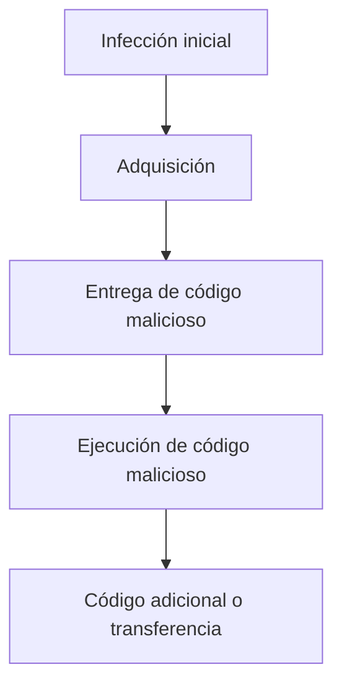

[<- Índice](../AnalisisMalware.md)
# Tipos de *Malware*

## *Ransomware*

> Es un tipo de *malware* que hace uso del cifrado para deshabilitar el acceso a la información de su víctima

El actor malicioso mantiene secuestrada la información y los datos hasta que sea realizado un pago por la víctima.

Despues de una infección inicial, el *Ransomware* busca propagarse a otras unidades de almacenamiento y sistemas accesibles.

Existe el modelo de negocio *RaaS* (*Ransomware as a Service*) donde los desarrolladores de *Ransomware* venden su *malware* a otros *hackers*.

Se clasifican en 3 tipos de *Ransomware*:

- ==*Ransomware-crypto*==: El *Ransomware* convencional que encripta los archivos de la víctima dejandolos inaccesibles.

- ==*Ransomware-locker*==: Una variante que simplemente impide al usuario usar su dispositivo sin cifrar nada.

- ==*Master boot record - Ransomware*==: Impide que la computadora inicie adecuadamente, impidiendo su uso.

## Backdoor

> Código malicioso que se instala en una computadora para permitir el acceso del atacante

Las *backdoors* generalmente permiten que el atacante se conecte al equipo con poca o ninguna información de autenticación, de este modo el actor malicioso puede ejecutar comandos en el sistema local.

==El principal objetivo es mantener el acceso al equipo.==

## Botnet

Similar a una *Backdoor*, en el sentido que permite al atacante acceder al sistema, pero todas las computadoras infectadas con la misma *botnet* reciben las mismas instrucciones desde un único servidor de comando y control.

> Una *botnet* representa un conjunto de máquinas (*bots*) que reciben comandos de un servidor (*botmaster*)

Puede poseer una arquitectura centralizada (responden a un único servidor) o distribuido, el cual permite que los nodos actuén como clientes y servidores segun sea el caso.

Los *bots* y *botnets* tienen múltiples usos maliciosos:

- Ataques *DDoS*
- Segunda fase de otra infección
- Intercambio de ancho de banda
- *Backdoors*
- Almacenar datos de manera ilegal

## Dropper

Este tipo de *malware* está diseñado para almacenar, ofuscar, desofuscar y finalmente lanzar un *payload* malicioso.

> El *dropper* es una pieza de *malware* que se caracteriza por ser autónoma ya que por si misma es capaz de ejecutar la carga maliciosa.

Realizan descubrimiento y evasión de defensas

Usualmente, este tipo de *malware* suele incluirse dentro de ==archivos comprimidos== enviados como adjuntos de correos en *phishing*.

El *dropper* se elimina para no dejar rastros de cómo fue el proceso de infección.

## Remote Access Trojan (RATS)

Es una herramienta desarrollada para obtener acceso total al equipo

Permite controlar remotamente al sistema de un usuario, incluyendo *hardware*, acceso a sus archivos y a sus recursos de red.

Son muy utilizados para **espionaje**.

Los *RATs* suelen ser descargados una vez que el usuario interactuó con algún *software* que pareciera ser legítimo o descargando *software* desde internet.

## Rootkit

> Originalmente, el término *rootkit* se refería a un conjunto de herramientas que permitia el control del usuario *root* y de procesos propios del sistema operativo.

- El término evolucionó con la creación de nuevos permisos de acceso en sistemas operativos *Windows*

> Logran acceso al sistema y obtienen control privilegiado.

- Es capaz de ocultar información privilegiada dentro del sistema como pueden ser procesos, puertos de comunicación y llaves de registro.

- Son piezas de *malware* que dejan pocos registros en los sistemas, ya que suele ser reconocido como un usuario legitimo.

- Existen *rootkits* de modo usuario y de modo kernel

## Downloader

> Es una muestra maliciosa que tiene cargadas instrucciones para realizar la descarga de una muestra maliciosa desde internet.

- No contiene un *payload* en su estructura, lo cual le ayuda con diferentes mecanismos de detección.

- Comúnmente se alojan en programas que se hacen pasar como legítimos.

- El comportamiento es diferente al del *Dropper*, ya que este no es autónomo y requiere forzosamente realizar la descarga desde el exterior.

- El *Downloader* requiere la interacción de la víctima, ya que es necesario que ejecute la muestra que realizará la descarga.

## Worms

> Es un virus informático que se propaga a si mismo a través de una red para infectar una mayor cantidad de equipos

- Los gusanos informáticos tienen la capacidad de auto ejecutarse, esto quiere decir que no requieren interacción del usuario

> Este tipo de *malware* tiene la capacidad de ralentizar a los equipos que han sido comprometidos, por un alto consumo en recursos de red y del sistema operativo.

- Pueden propagarse a través de correo electrónico,

**Flujo de infección**:

## MalSpam

- Es la abreviatura de spam malicioso o spam que contiene *malware*

> Es un correo electrónico no deseado que entrega *malware* como carga útil maliciosa, como archivos adjuntos corruptos o enlaces maliciosos.

- Los actores maliciosos utilizan amplias técnicas de difusión para sus cargas de *malware* a través del correo electrónico.

## Scareware

> *Malware* diseñado para asustar a un usuario infectado para que compre algo o realice alguna acción.

- Por lo general, tiene una interfaz de usuario que lo hace parecer un antivirus u otro programa de seguridad.

- Informa a los usuarios que hay un código malicioso en su sistema y que la única forma de deshacerse de él, es comprar su *software*, cuando en realidad dicho *software* solo elimina el *scareware*.

# Tipos de análisis de *malware*

## Técnicas de análisis de *malware*

Cuando realizamos análisis de *malware* frecuentemente nos encontraremos solamente con el archivo ejecutable, lo cual no es entendible sin el conocimiento necesario.

Para darle sentido al análisis, ahremos uso de una gran cantidad de herramientas que nos permitiran ahondar en la investigación.

El análisis de *malware* comprende 2 enfoques esenciales:

1. **Análisis de *malware* estático**
2. **Análisis de *malware* dinámico**

### Análisis de *malware* estático

El análisis de *malware* estático, consiste en examinar la muestra de *malware* sin ejecutarla.

Este análisis se divide en 2 categorías de acuerdo a su complejidad y obtención de información

#### Análisis estático básico

- Consiste en examinar el archivo ejecutable sin ver las instrucciones reales.

- Permite confirmar si un archivo es malicioso, proporcionar información sobre funcionalidad y en ocasiones obtener firmas de red.

- Es sencillo y rápido

- Es ineficaz contra *malware* sofisticado y pasa por alto comportamientos relevantes.

#### Análisis estático avanzado

- Consiste en la aplicación de ingeniería inversa a los componentes internos del *malware*.

- Las instrucciones son ejecutadas por la *CPU*, por lo que podemos saber exactamente que hace el *malware*

- Es complejo y requiere conocimientos avanzados de ensamblador

### Análisis de *malware* dinámico

El análisis de *malware* dinámico consiste en examinar la muestra de *malware* haciendo la ejecución de la misma en un entorno controlado. Al igual que el análisis estático, el análisis dinámico se divide en 2 categorías de acuerdo a su complejidad y obtención de información.

#### Análisis dinámico básico

- Permite obtenerl el comportamiento del *malware* en tiempo de ejecución

- Permite generar firmas eficientes y/o eliminar la infección

- Permite visualizar comunicaciones en red, cambios en el sistema de archivos y cambios en el registro.

- Es sencillo y rápido

- Es ineficaz contra *malware* sofisticado

#### Análisis dinámico avanzado

- Utiliza depuradores (*debuggers*) para examinar el *malware* en tiempo de ejecución

- Proporcionan una forma diferente de extraer información de un binario

- Es de utilidad cuando las técnicas anteriores no dan visibilidad completa

- Es complejo y requiere conocimientos avanzados de programación.

| Estático básico                                                                                                                               | Estático avanzado                                                                                      | Dinámico básico                                                                                                                                                          | Dinámico avanzado                                                                                                                                     |
| --------------------------------------------------------------------------------------------------------------------------------------------- | ------------------------------------------------------------------------------------------------------ | ------------------------------------------------------------------------------------------------------------------------------------------------------------------------ | ----------------------------------------------------------------------------------------------------------------------------------------------------- |
| - Escaneo de antivirus  - Funciones *hash*  - Búsqueda de cadenas  - Identificar empaquetadores  - Recursos embebidos | - Desensamblar  - IDA PRO  - Ingeniería Inversa  - Arquitectura de sistema operativo | - *Sandboxes*  - Ejecución de *malware*  - Análisis de paquetes  - Monitoreo de procesos  - Comparación de registros  - Monitoreo de redes | - *Debugging*  - *Debugging* a nivel *kernel*  - Análisis de *rootkits*  - Análisis de *DLL's*  - *Ollydbg*  - *WinDbg* |

# Técnicas de análisis estático básico

## Antivirus

Es pŕactico par buscar amenazas que ya han sido detectadas y analalizadas por motores de antivirus.

Son ==poco eficientes== puesto que las detecciones las realizan a través de firmas de los archivos maliciosos, así como de análisis de comportamiento y patrones (heurísticas) pero estas pueden cambiar de acuerdo al desarrollo del *malware*.

Nos da una ==visualización muy general== de las muestras

Es útil para descartar que se trata de una amenaza nueva.

## Hashing

> Es un método común utilizado para identificar de forma única el *malware*.

Es común utilizar diferentes algoritmos de digestión para obtener la firma de una muestra de *malware*. Los mas comunes son **SHA-1**, **SHA-256** y **MD5**.

Podemos utilizar la firma *hash* como una etiqueta.

El *hash* nos permite identificar si este ya ha sido previamente analizado.

Es un indicador de compromiso relevante para generar ==bloqueos de infraestructura==.

## Análisis de cadenas

> El programa contiene cadenas que pueden imprimir un mensaje, conexiones a una *URL* o realizar la copia de un archivo a una ruta en específico.

El realizar un análisis de cadenas es importante para identificar indicadores de compromiso que sean legibles previo a la ejecución.

Las cadenas normalmente son almacenadas en formato *Unicode* o *ASCII*.

## Empaquetamiento y ofuscación de *malware*

Los desarrolladores de *malware* utilizan técnicas de empaquetamiento u *ofuscación* para hacer más dificil la detección y análisis de una muestra.

> Los ==programas ofuscados== son aquellos en donde el autor y el desarrollador de *malware* ha ocultado la ejecución de la muestra y hace que el código no pueda ser leído por una persona de manera clara.

> Los ==programas empaquetados== son un subconjunto dentro de la *ofuscación*, en los que el programa malicioso se encuentrq comprimido y no es posible su análisis.

Es decir, cuando se ejecuta el programa empaquetado, se ejecuta un programa para descomprimir el archivo. Esta proción de código es la única que podremos analizar en un análisis estático.

## Portable Executable

Analizar el formato del archivo, nos puede ayudar a entender mucha de la funcionalidad de un programa.

> El formato ==*Portable Executable (PE)*== es utilizado por *Windows* para ejecutables, *DLLs* y código objeto.

> Es una estructura de datos que contiene la información necesaria para que el cargador del sistema operativo administre el código del archivo.

Los archivos *PE* comienzan con un ==encabezado== que incluye información sobre el código, el tipo de aplicación, las funciones de biblioteca requeridas y los requisitos de espacio.

La **estructura básica** de un *PE* es:

| DOS Header                                           |
| ---------------------------------------------------- |
| **DOS stub**                                         |
| **PE Header** *(NT Header)*                       |
| **Section Table**                                    |
| **Sections**  - *text* - *data* - *rsrc* |

## Librerias y funciones

Dentro de la información más importante que podemos recabar de un ejecutable, se encuentran las funciones importadas por el programa.

> Las *"imports"* son funciones utilizadas por un programa que realmente se encuentran ubicadas en un programa diferente, como bibliotecas de código que contiene funcionalidades entre muchos programas.

Las bibliotecas se pueden contectar a través de un concepto llamado *"linking"*

Se pueden ligar de manera estática o dinámica.

# Enlaces

[<- Anterior](HFC11_10_2024.md) | [Siguiente ->](HFC15_10_2024.md)