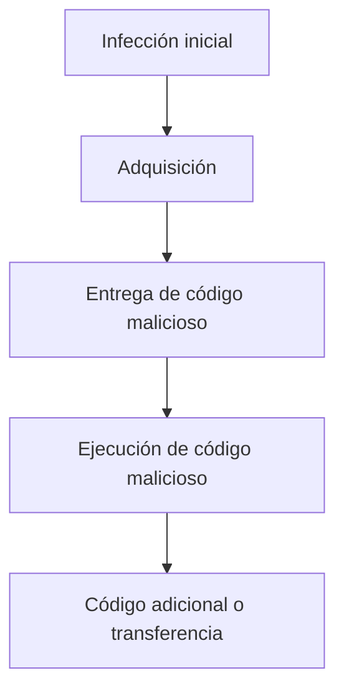

[<- Índice](../AnalisisMalware.md)
# Tipos de *Malware*

## *Ransomware*

> Es un tipo de *malware* que hace uso del cifrado para deshabilitar el acceso a la información de su víctima

El actor malicioso mantiene secuestrada la información y los datos hasta que sea realizado un pago por la víctima.

Despues de una infección inicial, el *Ransomware* busca propagarse a otras unidades de almacenamiento y sistemas accesibles.

Existe el modelo de negocio *RaaS* (*Ransomware as a Service*) donde los desarrolladores de *Ransomware* venden su *malware* a otros *hackers*.

Se clasifican en 3 tipos de *Ransomware*:

- ==*Ransomware-crypto*==: El *Ransomware* convencional que encripta los archivos de la víctima dejandolos inaccesibles.

- ==*Ransomware-locker*==: Una variante que simplemente impide al usuario usar su dispositivo sin cifrar nada.

- ==*Master boot record - Ransomware*==: Impide que la computadora inicie adecuadamente, impidiendo su uso.

## Backdoor

> Código malicioso que se instala en una computadora para permitir el acceso del atacante

Las *backdoors* generalmente permiten que el atacante se conecte al equipo con poca o ninguna información de autenticación, de este modo el actor malicioso puede ejecutar comandos en el sistema local.

==El principal objetivo es mantener el acceso al equipo.==

## Botnet

Similar a una *Backdoor*, en el sentido que permite al atacante acceder al sistema, pero todas las computadoras infectadas con la misma *botnet* reciben las mismas instrucciones desde un único servidor de comando y control.

> Una *botnet* representa un conjunto de máquinas (*bots*) que reciben comandos de un servidor (*botmaster*)

Puede poseer una arquitectura centralizada (responden a un único servidor) o distribuido, el cual permite que los nodos actuén como clientes y servidores segun sea el caso.

Los *bots* y *botnets* tienen múltiples usos maliciosos:

- Ataques *DDoS*
- Segunda fase de otra infección
- Intercambio de ancho de banda
- *Backdoors*
- Almacenar datos de manera ilegal

## Dropper

Este tipo de *malware* está diseñado para almacenar, ofuscar, desofuscar y finalmente lanzar un *payload* malicioso.

> El *dropper* es una pieza de *malware* que se caracteriza por ser autónoma ya que por si misma es capaz de ejecutar la carga maliciosa.

Realizan descubrimiento y evasión de defensas

Usualmente, este tipo de *malware* suele incluirse dentro de ==archivos comprimidos== enviados como adjuntos de correos en *phishing*.

El *dropper* se elimina para no dejar rastros de cómo fue el proceso de infección.

## Remote Access Trojan (RATS)

Es una herramienta desarrollada para obtener acceso total al equipo

Permite controlar remotamente al sistema de un usuario, incluyendo *hardware*, acceso a sus archivos y a sus recursos de red.

Son muy utilizados para **espionaje**.

Los *RATs* suelen ser descargados una vez que el usuario interactuó con algún *software* que pareciera ser legítimo o descargando *software* desde internet.

## Rootkit

> Originalmente, el término *rootkit* se refería a un conjunto de herramientas que permitia el control del usuario *root* y de procesos propios del sistema operativo.

- El término evolucionó con la creación de nuevos permisos de acceso en sistemas operativos *Windows*

> Logran acceso al sistema y obtienen control privilegiado.

- Es capaz de ocultar información privilegiada dentro del sistema como pueden ser procesos, puertos de comunicación y llaves de registro.

- Son piezas de *malware* que dejan pocos registros en los sistemas, ya que suele ser reconocido como un usuario legitimo.

- Existen *rootkits* de modo usuario y de modo kernel

## Downloader

> Es una muestra maliciosa que tiene cargadas instrucciones para realizar la descarga de una muestra maliciosa desde internet.

- No contiene un *payload* en su estructura, lo cual le ayuda con diferentes mecanismos de detección.

- Comúnmente se alojan en programas que se hacen pasar como legítimos.

- El comportamiento es diferente al del *Dropper*, ya que este no es autónomo y requiere forzosamente realizar la descarga desde el exterior.

- El *Downloader* requiere la interacción de la víctima, ya que es necesario que ejecute la muestra que realizará la descarga.

## Worms

> Es un virus informático que se propaga a si mismo a través de una red para infectar una mayor cantidad de equipos

- Los gusanos informáticos tienen la capacidad de auto ejecutarse, esto quiere decir que no requieren interacción del usuario

> Este tipo de *malware* tiene la capacidad de ralentizar a los equipos que han sido comprometidos, por un alto consumo en recursos de red y del sistema operativo.

- Pueden propagarse a través de correo electrónico,

**Flujo de infección**:

## MalSpam

- Es la abreviatura de spam malicioso o spam que contiene *malware*

> Es un correo electrónico no deseado que entrega *malware* como carga útil maliciosa, como archivos adjuntos corruptos o enlaces maliciosos.

- Los actores maliciosos utilizan amplias técnicas de difusión para sus cargas de *malware* a través del correo electrónico.

## Scareware

> *Malware* diseñado para asustar a un usuario infectado para que compre algo o realice alguna acción.

- Por lo general, tiene una interfaz de usuario que lo hace parecer un antivirus u otro programa de seguridad.

- Informa a los usuarios que hay un código malicioso en su sistema y que la única forma de deshacerse de él, es comprar su *software*, cuando en realidad dicho *software* solo elimina el *scareware*.

# Enlaces

[<- Anterior](HFC11_10_2024.md) | [Siguiente ->](HFC15_10_2024.md)