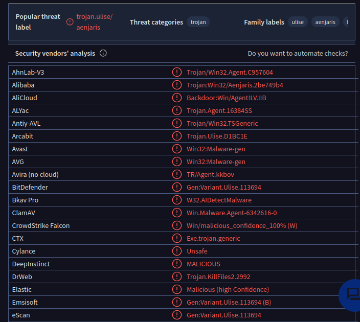

[<- Índice](../AnalisisMalware.md)
# Análisis de Malware - Práctica 1

### Integrantes

- Márquez Corona Danna Lizette
- Legorreta Esparragoza Juan Luis
- Romero Cruz Fernando

1. **Buscar la definición de firmas basadas en *host* y firmas basadas en *red* para el análisis de *Malware***

==Indicadores basados en host==: Están relacionados con la actividad en una estación de trabajo o servidor, como los nombres de archivo *hash*, las claves de registro o los procesos sospechosos que se ejecutan en el *host*

==Indicadores basados en red==: Como direcciones *IP*, dominios o *URL*s maliciosas. Tambien pueden incluir tráfico de red, actividad inusual del puerto, conexiones de red a *hosts* maliciosos conocidos o patrones de exfiltración de datos.

---
2. **Obtener la firma *hash (SHA-256)* de los 2 archivos**

- **exe**: 58898BD42C5BD3BF9B1389F0EEE5B39CD59180E8370EB9EA838A0B327BD6FE47

- **dll**: F50E42C8DFAAB649BDE0398867E930B86C2A599E8DB83B8260393082268F2DBA

---
3. **¿Cuando fueron compilados los archivos?**

> Ambos fueron compilados el 19 de Diciembre del 2010 a las 10 am

---
4. **¿Existe algún indicador que que estas muestras fueron empaquetadas previamente?**
 
 > Si, al analizar la muestra *.exe* con la herramienta *Exeinfo* obtenemos una firma ***Sign.3823: \[Armadillo v.1.71\]*** que nos indica que la muestra ha sido empaquetada con *Armadillo* que es una herramienta de empaquetamiento de *software* y ejecutables, ademas de indicarnos con cual versión.

---
5. **¿Existen archivos o indicadores basados en host que te permitan buscar en otros sistemas infectados?**

> Encontramos ciertas cadenas en ambos archivos utilizando *IDA Pro*, como *"WARNING_THIS_WILL_DESTROY_YOUR_MACHINE"*, la cadena *"Lab01-01.dll"* y *"SADFHUHF"*
> 
> Además encontramos una ruta sospechosa con un archivo pretendiendo ser *kernel32.dll* solo que con un *1* en lugar de la letra *L* minúscula:
> 
> *C:\\windows\\system32\\kerne132.dll*

---
6. **¿Que funciones importadas o exportadas consideras que serían importantes de revisión?**

> Pensamos que se deberían revisar las funciones *CreateProcessA*, *CreateMutexA*, *CreateFileA*, *WSAStartup*

---
7. **¿Qué indicadores basados en red podrían usarse para encontrar este malware en maquinas infectadas?**

> Únicamente encontramos la IP *127.26.152.13* incrustada en el *.dll*

---
8. **¿Cuál te imaginas que es el propósito de estas muestras?**

> Pensamos que esta muestra es un *troyano* sigiloso que exfiltra información a un actor malicioso o incluso que le brinda control como un *Rat*.

---
9. **Lista todos los indicadores basados en host que encuentres**

> ***Cadenas***:
- *WARNING_THIS_WILL_DESTROY_YOUR_MACHINE*
- *C:\\Windows\\System32\\Kernel32.dll*
- *C:\\windows\\system32\\kerne132.dll*
- *Lab01-01.dll*
- *C:\\\**
- *127.26.152.13*
- *SADFHUHF*

---
10. **Sube los archivos a virus total e indica si existen detecciones previas para estas muestras**

> Encontramos todas estas detecciones:

---
11. **Menciona alguno de los nombres que tenga asociada esta muestra**

> La muestra esta asociada a los nombres *ulise* y *aenjaris*