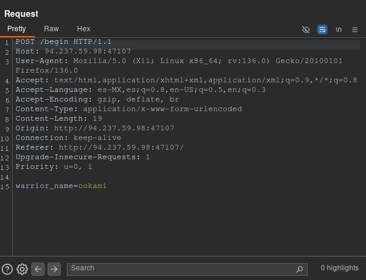
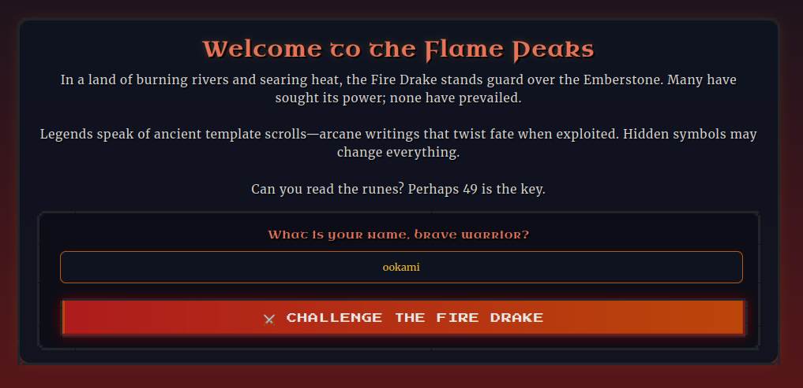
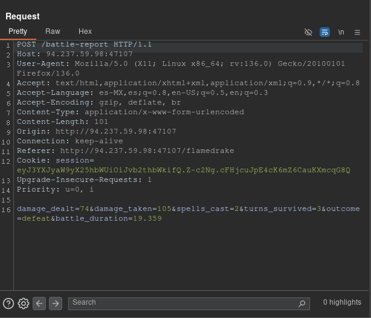
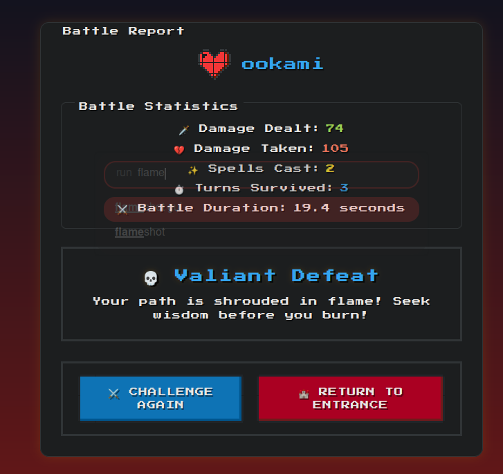

# Trial By Fire

> Este reto consistió de una breve **inyección de plantillas en el servidor** o *SSTI* por sus siglas en inglés.

### Descripción

La instancia del reto consistía de un breve juego de ataques por turnos contra un temible dragón, donde registras tu *username*, realizas algunos ataques y una vez que te derroten (porque siempre lo harán), se despliega un reporte de tu batalla.

En un enfoque técnico, al registrarse se realiza una petición *POST* al *endpoint* `/begin` con el nombre que definiste:

Una vez, registrado se te redirige al *endpoint* donde ocurrirá todo el juego de la pelea y finalmente, una vez que perdamos todos nuestros puntos de vida se realiza una petición *POST* al *endpoint* `/battle-report` con varias estadisticas de la pelea ocurrida.

La **vulnerabilidad** reside en que el *endpoint* `/battle-report` introduce los datos recibidos por el usuario en una plantilla y posteriormente la renderiza:

![[Pasted image 20250328181521.png]]