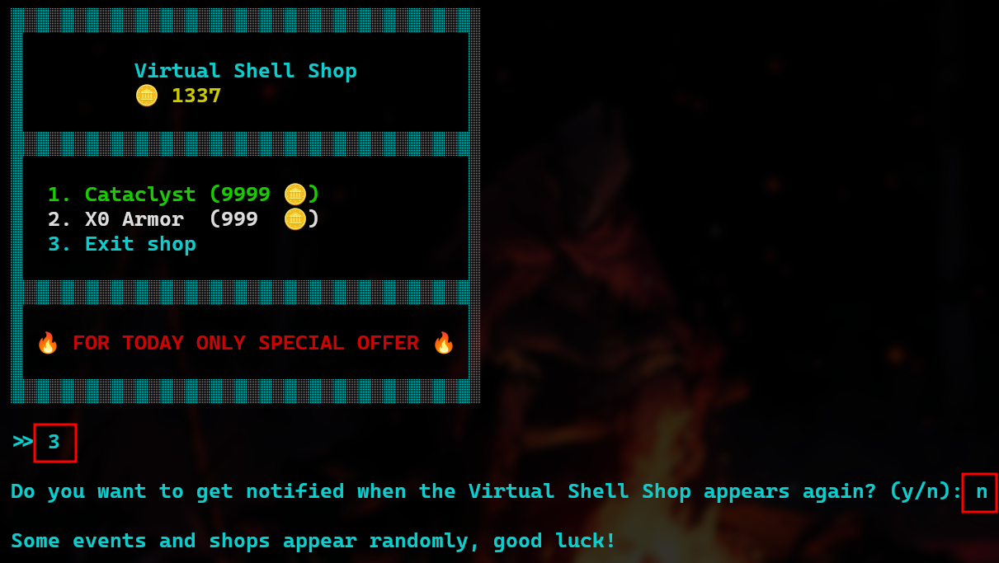
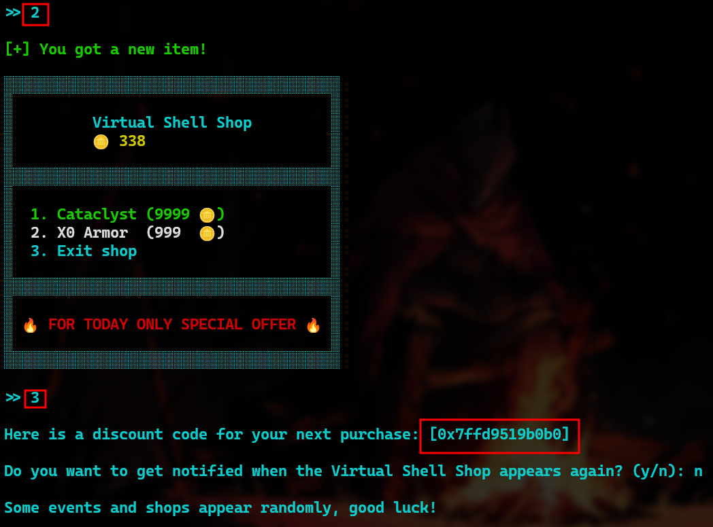

# Shell Shop

  

> **Autor**: *Ookami*
> **CTF**: *Bugcrowd Student's Qualifier*
> **Categoría**: *PWN* (*Binary Explotation*)
> **Dificultad**: Media

### Descripción

Para este reto, se nos brindó un **comprimido** `pwn_shellstore.zip` del **ejecutable principal** `shell_shop`, acompañado de las librerías necesarias en un directorio `glibc`.
La idea es analizar estos recursos para preparar un `exploit` contra este binario como servicio, en un contenedor `docker` que desplegaba la página del *CTF*.

En cuanto al **ejecutable**, este despliega un menú básico para la compra de un par de productos fantasiosos y una opción para terminar el programa, no sin antes preguntar si deseas ser notificado cuando la tienda reaparezca.

### Análisis

Antes de profundizar en el análisis, me dispuse a interactuar y probar a mano las distintas opciones en el menú del programa.

Particularmente, hubo un comportamiento que llamó mi atención. Con nuestro saldo inicial de **1337** monedas, únicamente se puede comprar el objeto `X0 Armor`.
Tras comprar este objeto y terminar el programa, el programa nos ofrece un **"código de descuento"**:

Este *"código"* parece más una dirección de memoria, por el formato `hexadecimal`.
Además, el hecho de que inicie con los dígitos `7f` sugiere que se trata de una dirección en la **pila** del ejecutable.

Para un **análisis** más **avanzado** del binario, utilicé principalmente [Radare2](https://github.com/radareorg/radare2) con el *plugin* [R2Ghidra](https://github.com/radareorg/r2ghidra) y el `depurador` **GDB** acompañado de la extensión [PwnDBG](https://github.com/pwndbg/pwndbg).
