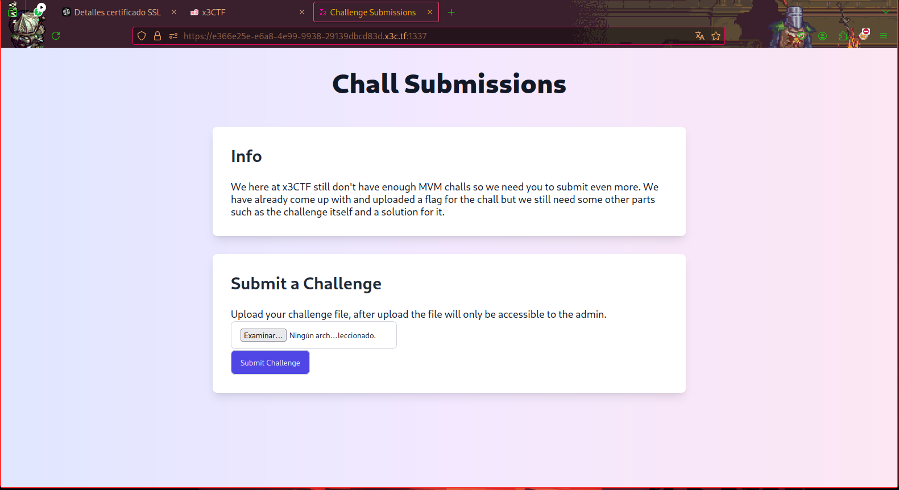
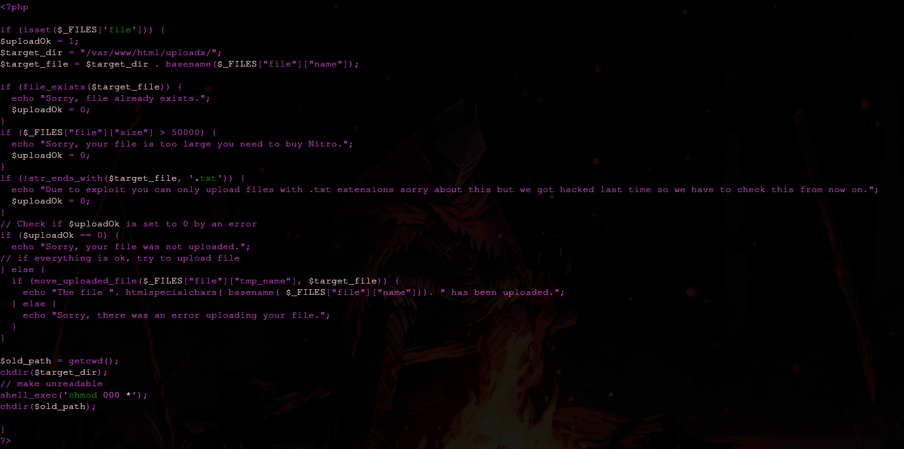
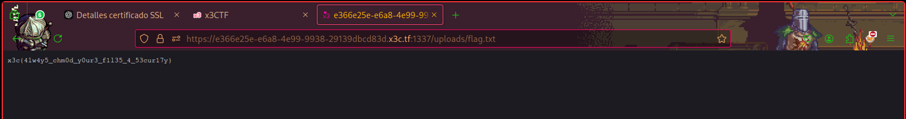

[<- Índice](../CTF.md)
# x3CTF - 2025

Mi **primer** competencia *Capture The Flag*, adjunto soluciones y anotaciones de retos que me parecieron interesantes:

## WEB

#### `submission`

> Este reto, consistia de una **muy** simple página web que nos permite subir archivos cuya terminación sea obligatoriamente `.txt`.

Los archivos se suben mediante un formulario `multipart/form-data` a una carpeta `uploads` donde esta ubicada la bandera en un archivo `flag.txt`.



**¿Cuál es el problema?** Los archivos en `uploads` son despojados de cualquier tipo de permiso de lectura, escritura o ejecución que posean.

Esto nos lo indica el código fuente de la misma página (con el que contamos) y además, presenta una serie de verificaciones y sanitizaciones de seguridad que podemos examinar a detalle a continuación.



##### Solución

En esta ocasión, la vulnerabilidad recide en la línea:

```php
shell_exec('chmod 000 *')
```

Como se puede ver, el comando `chmod` se utiliza sobre un *wildcard*  `*`, que remplaza de forma **insegura** y **literal** los nombres de los archivos presentes en la carpeta.
Esto permite la *"inyección"* de banderas sobre el comando, siendo de principal interés la bandera `--reference`.
Esta es totalmente compatible con el contexto que tenemos, pues anula los valores especificados en el comando (`000`) al especificar un modo de *"copia"* de permisos con el archivo que se le indique, lo que a su vez permite que el nombre del archivo termine en `.txt`.

Sin desviarme más, el procedimiento es el siguiente:
1. Subir un archivo de nombre `--reference=nombre.txt`, lo cual **prepara** el contexto para la explotación.
2. Subir un archivo `nombre.txt`

En este momento, al momento de evaluar el comando `chmod 000 *`, dada la naturaleza del *wildcard*, se sustituiran todos los nombres de los archivos y se estará procesando un comando similar a:

```bash
chmod 000 --reference=nombre.txt nombre.txt flag.txt
```

En este, se ignoran los `000` indicados, y se asignan o copian los permisos de `nombre.txt` sobre `nombre.txt` (si mismo) y `flag.txt` .
Como `nombre.txt` posee los permisos por defecto (y particularmente de lectura) al momento de subirlo, estos mismos permisos se aplican a `flag.txt`, volviendola accesible y solucionando el reto.



El orden en el que subimos los archivos es de vital importancia, pues de subir primero `nombre.txt`, se le estarían retirando sus permisos, lo que causaría que al subir el archivo con el nombre de la bandera `--reference`, se copien estos permisos `000` a `flag.txt`, lo cual no sería de ninguna ayuda.

- ### CRYPTO
- ### REV
- ### PWN