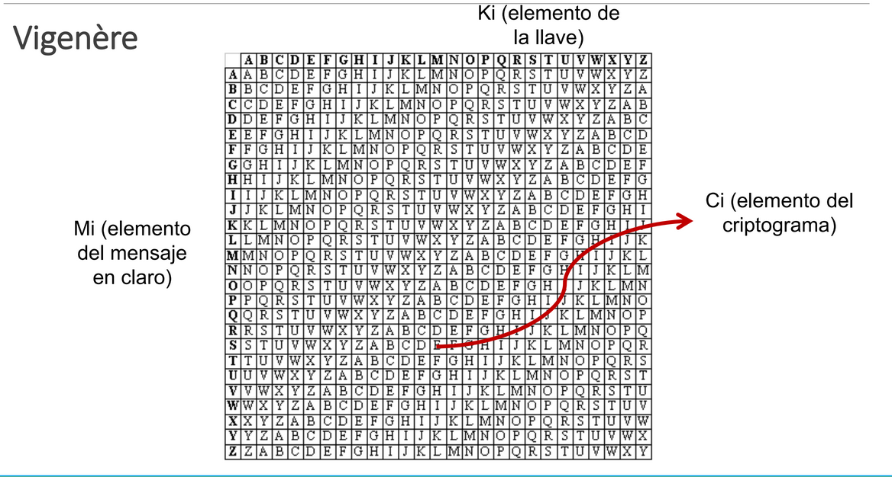
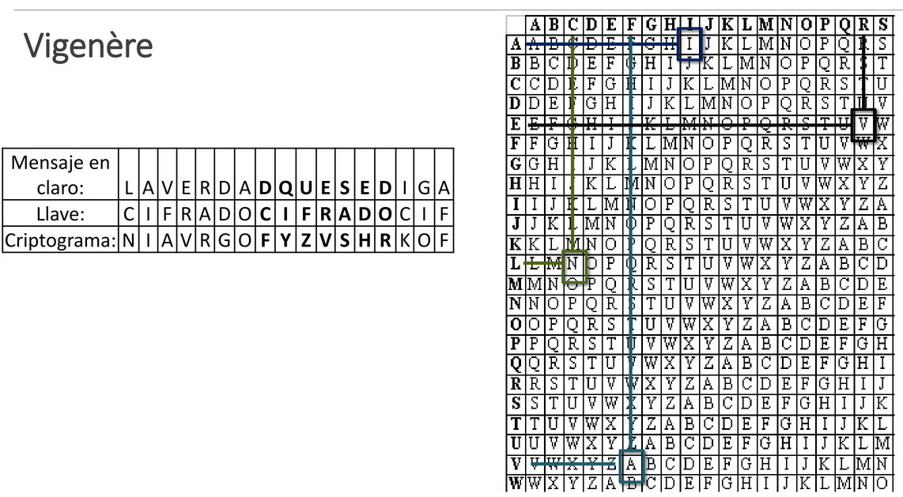
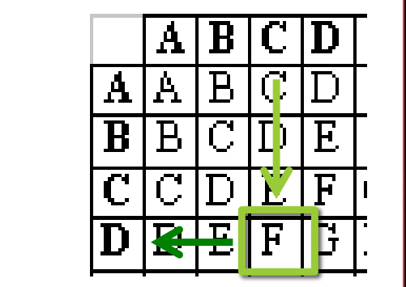

[<- Índice](../Crypto.md)
# Criptografía clásica

### Afín

> Una mezcla de la **decimación** con el **desplazamiento**, en ese orden, con la fórmula generalizada como:

$$
C_{i} = ((a * M_{i})+k) \mod n
$$

Recordemos que los valores son:
- $C_{i}$ : Caracter cifrado que ocupa la posición $i$
- $M_{i}$ : Caracter en claro que ocupa la posición $i$
- $a$ : Factor de decimación
- $k$ : Valor de desplazamiento
- $n$ : Longitud del alfabeto

## Complejidad y complicación

> Si se pretende hacer criptoanálisis para tratar de descifrar un mensaje con alguno de los métodos descritos, sin tener la información necesaria para hacerlo.

Por ejemplo, para descifrar un criptograma realizado por desplazamiento se necesita conocer el **valor de desplazamiento**, para el alfabeto decimado se requiere conocer el **factor de decimación**, para Afín se necesitan ambos, etc.

Pensemos en algo, mientras que en el cifrado de desplazamiento en un alfabeto inglés regular tenemos 26 posibles llaves, (25 no triviales sin el 1), para un alfabeto decimado solo tenemos $\varphi(26)=12$ llaves (11 no triviales) a pesar de que el alfabeto decimado se considera un algoritmo más sofisticado.

***La complicación y la complejidad no siempre van de la mano.***

## Algoritmos de sustitución monoalfabética poligrámica

### Hill

> Este algoritmo se dio a conocer por el matemático *Lester S. Hill* en 1929 a través de un artículo publicado en el diario de Nueva York.

Dicho algoritmo se basa en el uso de **álgebra lineal**, especificamente en las **matrices**, enfocandose a mejorar las técnicas de cifrado utilizadas hasta entonces.

Las reglas a seguir son las siguientes:

1. Se asigna un valor numérico a cada letra del alfabeto a utilizar iniciando en 0.
2. La llave debe constar de tantas letras como se desee siempre que sea posible formar una matriz cuadrada $K$ de $N$ filas por $N$ columnas (basicamente que la llave sea de cualquier longitud $N^{2}$).
3. El mensaje en claro se divide en bloques de caracteres denominados $N$-gramas, tal que sus equivalentes numéricos sean representados como una matriz $M_{i}$ de $N$ filas $\times$ $1$ columna.
4. El **criptograma** se obtiene realizando una multiplicación de matrices de *K* por $M_{i}$
5. Para recuperar el mensaje en claro con el proceso inverso se debe multiplicar la matriz inversa de $K$, $K^{-1}$, con el **criptograma**.

Cabe mencionar que todas las operaciones aritméticas se realizan bajo **módulo** $n$, donde $n$ es la longitud del alfabeto que se emplea.

#### Ejemplo

***Mensaje en claro***: *CONSUL*
***Llave***: *FORTALEZA*
***Módulo***: 27 (Alfabeto castellano)

Alfabeto:

| A   | B   | C   | D   | E   | F   | G   | H   | I   | J   | K   | L   | M   | N   | Ñ   | O   | P   | Q   | R   | S   | T   | U   | V   | W   | X   | Y   | Z   |
| --- | --- | --- | --- | --- | --- | --- | --- | --- | --- | --- | --- | --- | --- | --- | --- | --- | --- | --- | --- | --- | --- | --- | --- | --- | --- | --- |
| 0   | 1   | 2   | 3   | 4   | 5   | 6   | 7   | 8   | 9   | 10  | 11  | 12  | 13  | 14  | 15  | 16  | 17  | 18  | 19  | 20  | 21  | 22  | 23  | 24  | 25  | 26  |

$$
K = \begin{pmatrix}
F & O & R \\ 
T & A & L \\ 
E & Z & A
\end{pmatrix}
= \begin{pmatrix}
5  &  15 & 18 \\ 
20 & 0 & 11 \\ 
4 & 26 & 0
\end{pmatrix}
$$

Del mensaje en claro, se obtienen 2 trigramas, los cuales son:

$$
M_{0} = \begin{pmatrix}
C \\ O \\ N \end{pmatrix}
= \begin{pmatrix}
2 \\ 15 \\ 13
\end{pmatrix}
$$
$$
M_{1} = \begin{pmatrix}
S \\ U \\ L
\end{pmatrix}
= \begin{pmatrix}
19 \\ 21 \\ 11
\end{pmatrix}
$$
Ahora para obtener las representaciones cifradas realizamos las respectivas multiplicaciones:

$$
C_{0} = K \cdot M_{0}
= \begin{pmatrix}
5  &  15 & 18 \\ 
20 & 0 & 11 \\ 
4 & 26 & 0
\end{pmatrix} \cdot
\begin{pmatrix}
2 \\ 15 \\ 13
\end{pmatrix}
= \begin{pmatrix}
469 \\ 183 \\ 398
\end{pmatrix}
$$
$$
\begin{pmatrix}
469 \\ 183 \\ 398
\end{pmatrix}
\mod 27
= \begin{pmatrix}
10  \\ 21 \\ 20
\end{pmatrix}
= \begin{pmatrix}
K \\ U \\ T
\end{pmatrix}
$$

De manera análoga, el segundo trigrama:

$$
C_{1} = K \cdot M_{1}
= \begin{pmatrix}
5  &  15 & 18 \\ 
20 & 0 & 11 \\ 
4 & 26 & 0
\end{pmatrix} \cdot
\begin{pmatrix}
19 \\ 21 \\ 11
\end{pmatrix}
= \begin{pmatrix}
608 \\ 501 \\ 622
\end{pmatrix} \mod 27
= \begin{pmatrix}
14 \\ 15 \\ 1
\end{pmatrix}
= \begin{pmatrix}
Ñ \\ O \\ B
\end{pmatrix}
$$
 
 El ***criptograma*** obtenido entonces, es *KUTÑOB*

Para descifrar este criptograma, solo hay que repetir este proceso utilizando la matriz inversa $K^{-1}$, obtenida con tu método de Álgebra Lineal favorito, con los trigramas del criptograma.

## Algoritmos de sustitución polialfabética periódica
### Vigenère

> Este algoritmo basa su operación en el uso de tantos alfabetos como letras tenga el **alfabeto base** (26 por ejemplo para el diccionario inglés), formando con ellos una **cuadrícula secuencial** en la que se ubican los siguientes elementos.

- **Renglones o filas**: Elementos correspondientes al mensaje en claro.
- **Columnas**: Elementos correspondientes a las llaves.
- **Celdas**: Intersección del elemento que conforma el criptograma.

Existen 2 procesos principales de cifrado de *Vigeniere*, ambos aceptados y válidos.

#### Primer método

Para el ***cifrado***, con el fin de cubrir toda la longitud del **mensaje en claro** con la **llave**, en caso de que sea de menor longitud, se repite tantas veces como sea necesario.

***Mensaje en claro***: laverdadquesediga
***Llave***: cifrado $\rightarrow$ cifradocifradocif

Con el mensaje y la llave extendida, procedemos a realizar el cifrado donde por cada caracter en claro $M_{i}$ con su correspondiente caracter de la llave $k_{i}$, identificamos la celda en la fila $M_{i}$ con la columna $k_{i}$ pues esa será la representación cifrada del caracter.
Por ejemplo, para el alfabeto inglés.

Siguiendo el ejemplo, podemos obtener las representaciones del mensaje de la siguiente forma:

Siguiendo este proceso, obtenemos el criptograma *"niavrgofyzvshrkof"*.

Para el proceso de ***descifrado*** no hace falta más que encontrar la columna que corresponde al caracter de la llave $k_{i}$, identificar la celda con la letra correspondiente al caracter del criptograma $C_{i}$ en esa misma columna y averiguar a que caracter le corresponde la fila en la que se encuentra esta celda, pues ese será nuestro caracter en claro $M_{i}$.

En conclusión, el cifrado de *Vigenère* también se trata de un **desplazamiento** solo que ya no es constante, pues cada caracter se desplaza $k_{i}$ posiciones hacia adelante, según el caracter de la llave que le corresponda.

***Fórmula para cifrar***: $C_{i} = (M_{i}+k_{i}) \mod n$

***Fórmula para descifrar***: $M_{i} = (C_{i} - k_{i}) \mod n$

# Enlaces

[<- Anterior](Crypto_30_01_2025.md) |