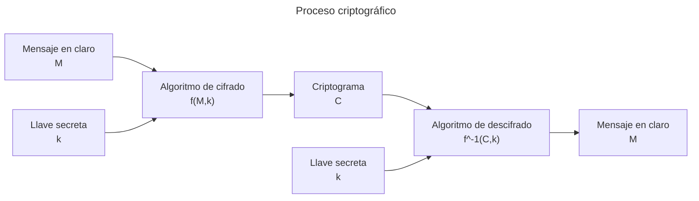

# Criptografía clásica

> Los algoritmos de la criptografía clásica constan principalmente de 2 técnicas de manipulación, la **sustitución** y la **transposición**.
> La **sustitución** se refiere a intercambiar unidades, por ejemplo caracteres, por otras unidades.
> Mientras que la **transposición** se refiere a alterar el orden de estas unidades.

En los casos en los que se **cifra** y **descifra** con la misma llave, se considera que es un algoritmo ***simétrico***, mientras que si se utilizan llaves diferentes para **cifrar** y **descifrar** se trata de un algoritmo ***asimétrico***.

### Cifrado de Cesar

> Debe el nombre a las presunciones de su uso por el emperador romano **Julio Cesar**, y consiste en mover el caracter a representar **2** posiciones adelante del alfabeto a utilizar.

ABCDEFGHIJKLMNOPQRSTUVWXYZ $\rightarrow$ CDEFGHIJKLMNOPQRSTUVWXYZAB