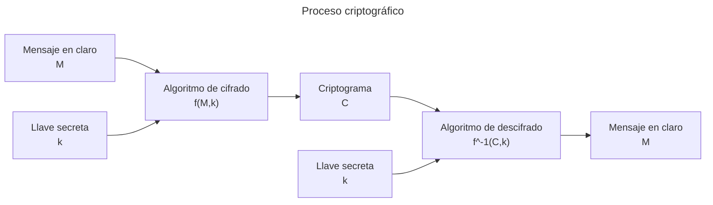
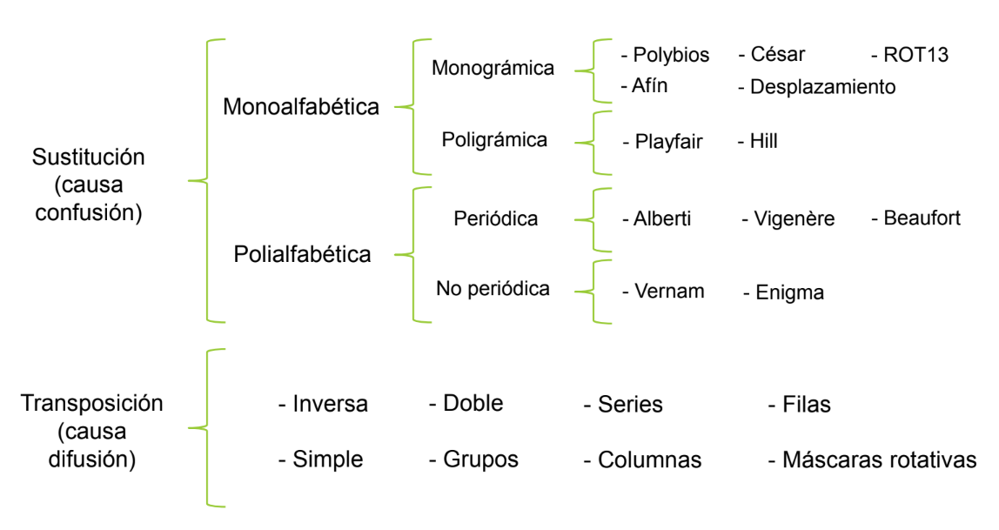

[<- Índice](../Crypto.md)
# Criptografía clásica

> La criptografía ***clásica*** se refiere a las técnicas usadas hasta 1948, cuando es desarrollada la ***Teoría matemática de la comunicación*** por *Claude Shannon*.

Por lo que a partir de entonces, la criptografía deja de considerarse como un **arte** y se formaliza como una **rama de las matemáticas** gracias a su relación con campos como:

- Estadística (*criptoanálisis*)
- Teoría de la información
- Teoría de números (grupos)
- Sistemas de comunicación
- Teoría de la complejidad computacional (proceso, dato, almacenamiento)

> Los algoritmos de la **criptografía clásica** constan principalmente de 2 técnicas de manipulación, la **sustitución** y la **transposición** de caracteres.

La **sustitución** se refiere a intercambiar unidades, por ejemplo caracteres, por otras unidades.
Mientras que la **transposición** se refiere a alterar el orden de estas unidades.

Además, consideran siempre una **llave secreta** conocida únicamente por el emisor y el receptor autorizado para acceder a ella, puesto que se usa para **cifrar** y **descifrar** durante la comunicación.

Esto es así porque las **técnicas criptográficas** utilizadas en el cifrado clásico son casi en su totalidad orientadas a **sistemas simétricos**.

Estos algoritmos fueron empleados **históricamente**, pero en la actualidad ==la mayoría está en desuso==, pues son vulnerables a **ataques sobre el criptograma** (*ciphertext-only attacks*) donde se puede deducir el texto en claro-

En los casos en los que se **cifra** y **descifra** con la misma llave, se considera que es un algoritmo ***simétrico***, mientras que si se utilizan llaves diferentes para **cifrar** y **descifrar** se trata de un algoritmo ***asimétrico***.

A lo largo del curso, profundizaremos tanto en algoritmso de **sustitución** como de **transposición**, como indica el siguiente diagrama.

## Algoritmos de sustitución

> Como se mencionó anteriormente, cada caracter en el **mensaje en texto claro** es ***remplazado*** por otro que le corresponda según el alfabeto de cifrado para formar el **criptograma**.

La sustitución causa confusión, puesto que se oculta la relación entre el mensaje en claro y el texto cifrado.

Este tipo de algoritmos se clasifican **principalmente** en 2 grupos: **monoalfabética** y **polialfabética**.

### Algoritmos de sustitución monoalfabética

> Se refieren a la utilización de ==un solo alfabeto== tanto para el cifrado como para el descifrado, y se divide en 2 formas distintas: ***monográmica*** y ***poligrámica***.

#### Sustitución monoalfabética monográmica

> También llamados de **sustitución simple**, son aquellos en los que el cifrado se realiza ==caracter a caracter==, es decir, se cifra uno a uno los símbolos del mensaje claro.

- *Polybios*
- *César*
- *ROT13*
- *Afín*
- *Desplazamiento*

#### Sustitución monoalfabética poligrámica

> El cifrado se lleva a cabo por ==bloques de caracteres== con la finalidad de aumentar la seguridad en el mensaje cifrado.

Por ejemplo, cifra cada grupos de 2 en 2, (*digramas/bigramas*), 3 en 3 (*trigramas*) o de *N* en *N* (*n-gramas*).

- *Playfair*
- *Hill*

### Algoritmos de sustitución polialfabética

> Se refieren a aquellos que remplazan cada caracter del mensaje en claro por otro correspondiente a un **grupo de alfabetos**, aplicando diferentes sustituciones por lo que es fundamental saber cuándo aplicar cada alfabeto.

Se clasifican en 2 grupos: **sustitución periódica** o **sustitución no periódica**.

#### Sustitución polialfabética periódica

> Son aquellas que las sustituciones se repiten con frecuencia a intervalos específicos, es decir, ==con un periodo igual al tamaño de la llave==.

- *Alberti*
- *Vigenère*
- *Beaufort*

#### Sustitución polialfabética no periódica

> Son aquellas que se **repiten a intervalos indeterminados**, es decir, cuando la llave tiene la misma longitud del mensaje en claro.

- *Vernam*
- *Enigma*

## Algoritmos de transposición

> También llamado ***algoritmos por permutación***, ==cambian de lugar los caracteres== que conforman el mensaje en claro.

De esta manera, resulta incomprensible el criptograma a simple vista ==causando lo que denominamos ***difusión***==.

La ***difusión*** no es más que una medida de la **relación** entre el mensaje original y el criptograma, por ejemplo mediante el impacto que un solo caracter tiene en todo el mensaje, dificultando el análisis de patrones por parte de un tercero.

# Enlaces

[Siguiente ->](Crypto_30_01_2025.md)