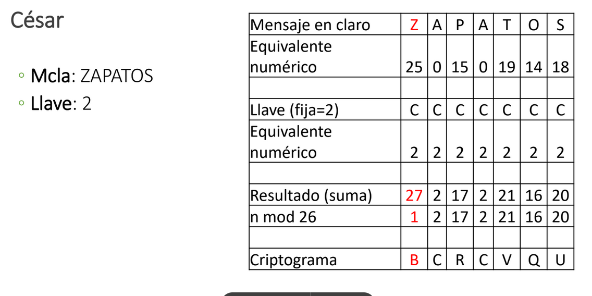
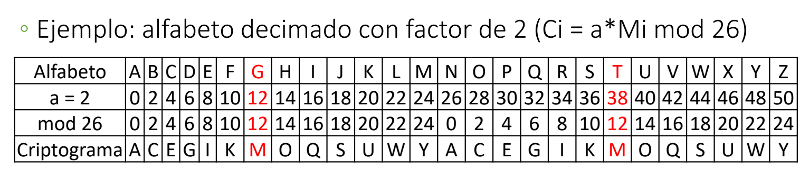
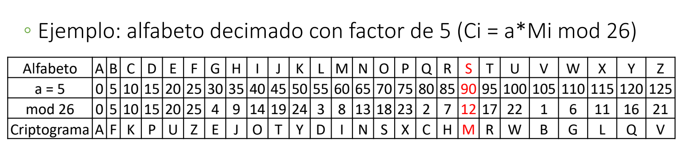

[<- Índice](../Crypto.md)
# Criptografía clásica
## Ejemplos

### Sustitución monoalfabética monográmica
#### Algoritmos de la división modular

Primero, contextualicemos un poco con el algoritmo de la división modular:

> Dados $a,b \in \mathbb{Z}$, con $b \neq 0$, existen 2 enteros únicos $q$ y $r$ tales que:
> 
> $a = bq +r \;$ con $0 \leq r \leq |b|$ 

Este principio se cumple, por ejemplo, para la expresión $9 = 7 \times 1 +2 \;$ o con la expresión $-5 = 3 \times (-2) + 1$.

Este **residuo**, tambien se le conoce como ***módulo***, expresado de la siguiente forma: $a \; mod \; b = r$.

Siguiendo el ejemplo, $9 \mod 7 = 2 \;$ o $\; -5 \mod 3 = 1$

#### Cifrado de César

> Debe el nombre a las presunciones de su uso por el emperador romano **Julio Cesar**, y consiste en desplazar/rotar el caracter a representar **2** posiciones adelante del alfabeto a utilizar.

**ABCDEFGHIJKLMNOPQRSTUVWXYZ** $\rightarrow$ **CDEFGHIJKLMNOPQRSTUVWXYZAB**

Es importante recalcar que se trata de una ***rotación***, no de un corrimiento, es decir, se le da vuelta al alfabeto.

Entonces, por ejemplo, podemos cifrar de la siguiente manera:

- **Mensaje en claro**: MENSAJECIFRADO
- **Llave**: 2 (El numero de desplazamientos a la derecha)
- **Criptograma**: OGPUCLGEKHTCFQ

Una explicación más **formal** del algoritmo sería la siguiente:

**Fórmula para cifrar**: $C_i = (M_i+2) \mod  n$
**Fórmula para descifrar**: $M_i = (C_i-2) \mod n$

Donde:
- $C_i$ es el caracter cifrado que ocupa la osición $i$
- $M_i$ es el caracter en claro que ocupa la posición $i$
- $n$ es la longitud del alfabeto utilizado (26 para el alfabeto regular inglés)

Y podemos representar el procedimiento como:

#### ROT13

> Este algoritmo consiste de la rotación de 13 posiciones en el alfabeto inglés, el nombre se originó en los foros de *Usenet* a principios de los 80.

Dado que la longitud del alfabeto inglés es 26 letras, *ROT13* funciona como su propia inversa, es decir, cifra y descifra mediante el mismo procedimiento.

**ABCDEFGHIJKLM** $\iff$ **NOPQRSTUVWXYZ**

Formalmente, su **fórmula** sigue la forma del **cifrado César**:

- $C_{i}= (M_{i} + 13) \mod 26$
- $M_{i} = (C_{i}+13) \mod 26$

#### Algoritmo de desplazamiento

> Este algoritmo es la generalización del **cifrado César** y **ROT13** para cualquier llave $k$ entre 0 y $n-1$, con $n$ como la longitud del alfabeto utilizado.

Consiste, al igual que los anteriores, en desplazar $k$ posiciones el caracter en claro para obtener el caracter cifrado, sin salirnos del alfabeto con apoyo del módulo.

Este desplazamiento es constante para cualquier caracter del alfabeto.

**Fórmula de cifrado**: $C_{i} = (M_{i} + k) \mod n$
**Fórmula de descifrado**: $M_{i}= (C_{i} + k) \mod n$

#### Algoritmo de alfabeto decimado

> En esta ocasión, en lugar de sumar undesplazamiento como en algoritmos anteriores, el símbolo (su posición en el alfabeto) es multiplicado por una constante $a$.

**Fórmula de cifrado**: $C_{i} = (a * M_{i}) \mod n$

El término **decimado** es analogo a diezmar, que significa eliminar uno de cada diez.
Se le denominó así porque en este esquema criptográfico de **alfabeto decimado** se remplaza únicamente ==uno de cada *a*== símbolos en cada recorrido del alfabeto.
Es decir, se "saltan" $a-1$ símbolos del alfabeto al cifrar, lo que causa potencialmente la pérdida de caracteres.

Por eso mismo, esta asociación ==no sirve para cifrar== puesto que la función ==no es biyectiva==.
Por ejemplo, supongamos un **factor de decimación** $a$ de 2:

Observamos, por ejemplo, que cifrar tanto la letra **G** como la **T** resulta en la letra **M** en ambos casos, de modo que no podemos descifrar deterministamente esta letra.

**¿Cómo lo solucionamos?** Para que este tipo de cifrado sea operativo y aprovechando las propiedades de la **aritmética modular**, el **factor de decimación** $a$ y la longitud del alfabeto $n$ deben ser **coprimos/primos relativos**.

En pocas palabras, que el **máximo común divisor** entre ambos números sea la unidad.

$mcd(a,n) = 1$

Por ejemplo, si tomamos *5* como **factor de decimación**, sabemos que $mcd(5,26) = 1$, entonces este tipo de cifrado es posíble:

En esta ocasión, la relación es **biyectiva** y es posible descifrar la *M* a un caracter *S*.

##### Función $\phi$ de Euler

Ya sabiendo el requisito para esta encriptación, podemos apoyarnos de la función $\phi$ (*phi*) de *Euler* para identificar todas las posibles llaves que posee un alfabeto de longitud $n$.

Esta se basa en 4 propiedades esenciales:

$\varphi(1) = 1$
$\varphi(p) = p-1$ siempre que $p$ sea un número primo.
$\varphi(p^{k})=(p-1)p^{k-1}$ si $p$ es primo y $k$ un número natural
$\varphi$ es una función multiplicativa, es decir, $\varphi(mn) = \varphi(m)\varphi(n)$

Entonces para cualquier número $n$, que expresable como producto de números primos $p_{1}^{k_{1}} \cdot p_{2}^{k_{2}} \cdots p_{r}^{k_{r}}$, la función $\varphi$ se calcula como:

$\varphi(n) = (p_{1}-1)p_{1}^{k_{1}-1} \cdot (p_{2} -1)p_{2}^{k_{2}-1}\cdots (p_{r}-1)p_{r}^{k_{r}-1}$

Que puede rescribirse de la forma conocida como **Fórmula de Producto de Euler** como:

$$
\displaystyle \varphi(n) = n \prod_{p|n}\left( 1-\frac{1}{p} \right)
$$

# Enlaces

[<- Anterior](Crypto_29_01_2025.md) |