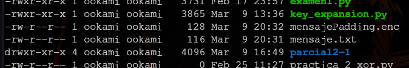
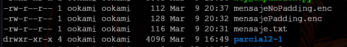
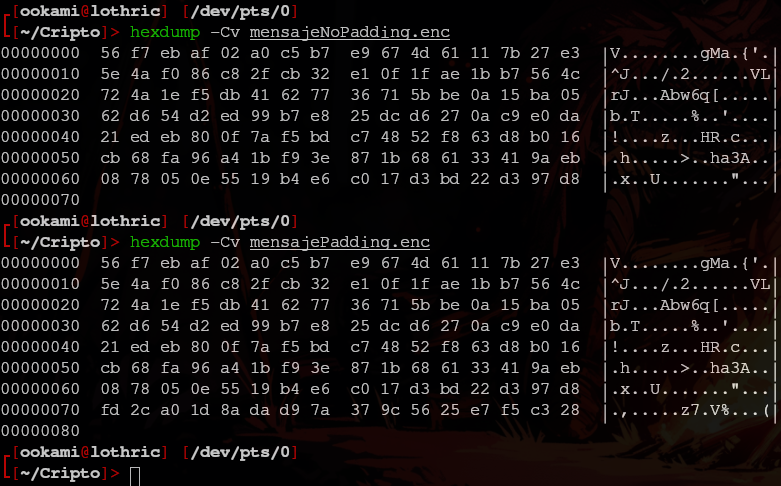
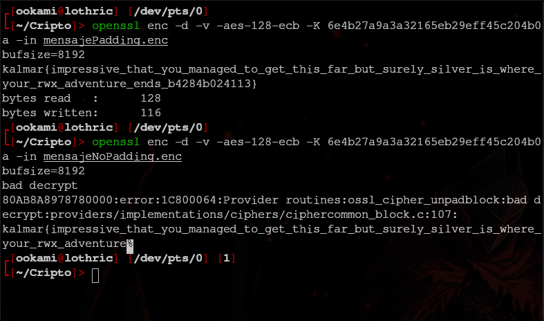
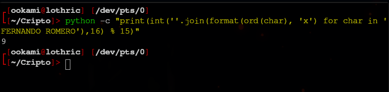
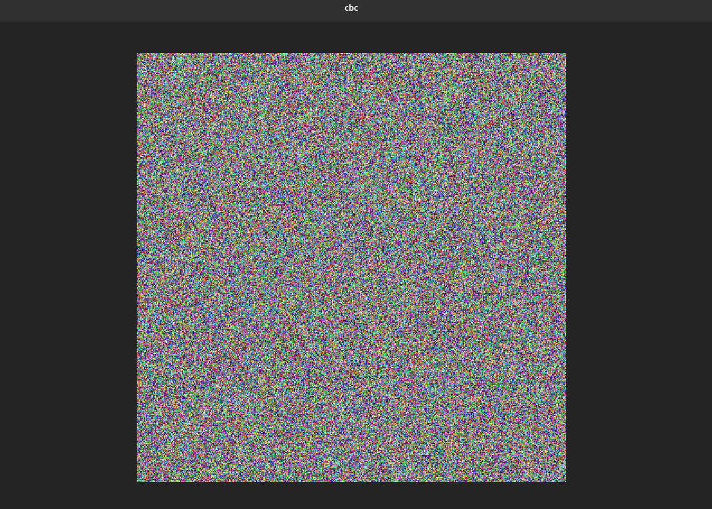
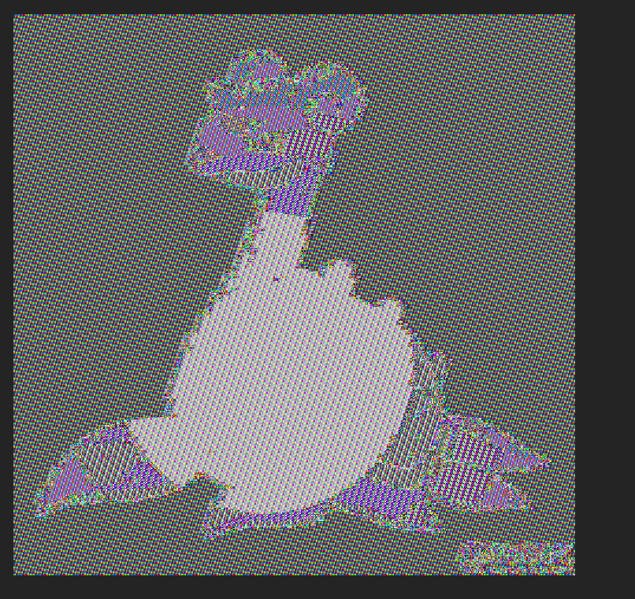

# Práctica 3
## Criptografía y Seguridad 2025-2

> Fernando Romero Cruz - *319314256*

### Reporte

#### Parte 1

Para la **primera parte** de la práctica, decidi almacenar para el mensaje la cadena `kalmar{impressive_that_you_managed_to_get_this_far_but_surely_silver_is_where_your_rwx_adventure_ends_b4284b024113}` en el archivo `mensaje.txt` y procedí a encriptarlo como indica la práctica con:

```bash
openssl enc -v -aes-128-ecb -K 6e4b27a9a3a32165eb29eff45c204b0a -in mensaje.txt -out mensajePadding.enc
```

Efectivamente, escribio 128 *bytes* como menciona se menciona en el documento.



En cuanto a la versión sin *Padding*, ejecute el siguiente comando:

```bash
openssl enc -v -aes-128-ecb -K 6e4b27a9a3a32165eb29eff45c204b0a -in mensaje.txt -nopad -out mensajeNoPadding.enc
```

Al comprobar el tamaño podremos notar que en esta ocasión, el cifrado mantuvo el mismo tamaño que el mensaje en claro:



Revisando los volcados **hexadecimales** podemos ver también que el mensaje sin *Padding* carace de una línea completa que el mensaje con *Padding* si tiene:



Ahora, al realizar un descifrado de ambos archivos, podemos ver que aquel con *Padding* se descifro completo y sin problemas, mientras que el que no tiene *Padding* se comrrompió y únicamente se recuperó una parte del mensaje original.



En cuanto al punto **8** de la práctica:
- Retiré la bandera `-K` y su argumento (la llave especificada) para que el comando solicite interactivamente la contraseña
- Agregué la bandera `-pbkdf2` para **omitir la advertencia** sobre la derivación de la contraseña de modo que se utilicé la versión 2 de la función de derivación.
- Agregué la bandera `-p` para que imprima en pantalla la llave **derivada** que se está utilizando para el cifrado.

De modo que el comando queda de la siguiente manera:

```bash
openssl enc -v -aes-128-ecb -in mensaje.txt -out mensajePadding.enc -pbkdf2 -p
```

Para el último punto de esta parte de la práctica (9), simplemente modifiqué la bandera `-aes-128-ecb` por `-aes-128-cbc`.

```bash
openssl enc -v -aes-128-cbc -in mensaje.txt -out mensajePadding.enc -pbkdf2 -p
```

#### Parte 2

Para determinar mi carpeta, ejecute el comando indicado:



Ya decidida mi carpeta, descargue los archivos y empecé a interactuar con ellos.

Intuitivamente, si se tiene la cabecera con los *magic numbers* de una imágen `ppm`, solo haría falta concatenarlos con el cuerpo **cifrado** de la imágen para poder visualizar el estado de estas imágenes.

Entonces ejecute los comandos:

```
cat data.ppm split_image-ecb.encrypted > ecb 
cat data.ppm split_image-cbc.encrypted > cbc 
```

Ahora que puedo visualizar estas 2 imágenes, pude darme cuenta que aquella cifrada con **cbc** es totalmente imperceptible, es una imágen con puro ruido.



Por otra parte, la imágen cifrada con **ecb** no presenta una mezcla tan homogenea, de modo que es fácil identificar de que trata la imágen.



Podemos ver que se trata potencialmente de un pokemon **Lapras**.

### Cuestionario

1. ¿De cuántos bits es la llave **6e4b27a9a3a32165eb29eff45c204b0a** que se usó tanto para cifrar como para descifrar los archivos? Justifique su respuesta.

> En vista de que dicha llave posee **32** caracteres **hexadecimales**, es clave pensar que cada dígito hexadecimal representa 4 bits, de modo que $32 \times 4 = 128$. La llave es de **128** bits

2. Ejecute el siguiente comando `openssl enc -v -aes-128-ecb -K 64f3ad6017h65eb2f5f4e0b82f5ceb31 -in mensaje.txt > mensajeCifrado.enc`. Tome en cuenta que la llave cambió. ¿Se cifró el archivo?, ¿qué error indica OpenSSL?, ¿a qué le atribuye la causa de ese error?

> No se cifro el archivo, indica un error pues existe un caracter **no-hexadecimal** y precisamente ocurre porque hay una letra `h` en la llave, la cual no pertenece a los símbolos de los números hexadecimales.

3. ¿Cuál es el riesgo de introducir la llave en el mismo comando?

> Que queda registrada en el historial de la *linea de comandos* utilizada.

4. ¿Qué opciones de OpenSSL necesitó indicar para evitar la advertencia sobre la derivación de llave y para desplegar la llave derivada de la contraseña que usted ingresó? ¿Qué otra información se despliega?

> Necesitó las opciones `-pbkdf2` y `-p`. La primera para utilizar la versión 2 de la función de derivación de llaves y la segunda para mostrar en pantalla la llave derivada. La bandera `-p` despliega, a parte de la llave derivada, la **sal** utilizada para el cifrado.

5. ¿Cuál es la opción en el comando de OpenSSL que se usa para indicar que se descifrará el archivo?

> La bandera `-d` junto con el algoritmo de cifrado utilizado.

6. Investigue las diferentes técnicas de padding para el cifrado de archivos.

> Existen múltiples técnicas de *Padding*, por ejemplo, rellenar de puros 00s, rellenar con el número de *bytes* que se requieren como *padding*, comenzar el *padding* con un *byte* **80** seguido de todos los **00s** necesarios, etc.

7. ¿En qué modo de operación sí se puede obtener (parcialmente) la imagen, y por qué?

> Se puede obtener parcialmente la imágen en el modo *ECB* pues a mismos bloques corresponden las mismas salidas, de modo que los bloques del mismo color, al cifrarse se obtienen bloques iguales, manteniendo parcialmente la separación de colores de la imágen original.

### Conclusiones

> Durante esta práctica pude experimentar con la utilidad `openssl` para cifrar y descifrar los mensajes indicados. Me gustó el acercamiento que se nos dio a las opciones que esta posee y a las distintas banderas que conforman su funcionalidad. Pienso que estaría bien incluirla en siguientes prácticas.
> 
> En cuanto a la parte 2, pienso que es un muy buen ejemplo representar el contraste de los modos de operación *ECB* y *CBC* mediante las imágenes proporcionadas. Me quedó más claro como el *CBC* permite una mezcla más homogénea mientras que *ECB* mantiene de alguna forma la estructura visual de la imágen original.
> Sin embargo, creo que fue demasiada directa la solución a este reto, pues simplemente con 2 comandos podemos recuperar las imágenes deseadas.