# Práctica 6
## Criptografía y Seguridad 2025-2

> Romero Cruz Fernando - *319314256*

### Reporte

Para la primera sección de la práctica, cloné el repositorio indicado en mi espacio de trabajo con el comando:

```bash
git clone https://github.com/corkami/collisions.git
```

Dentro de esta misma carpeta, también almacené mis 2 imágenes como `imagen1.jpg` e `imagen2.jpg`.
Para crear las colisiones, puede utilizarse esta secuencia de comandos:

```bash
(cd collisions/scripts/ && ./jpg.py ../../imagen1.jpg ../../imagen2.jpg && mv collision?.jpg ../../.)
```

Una vez que contamos con las colisiones, verificamos que efectivamente su *hash* **MD5** coincide, pero su *hash* **SHA256** no.

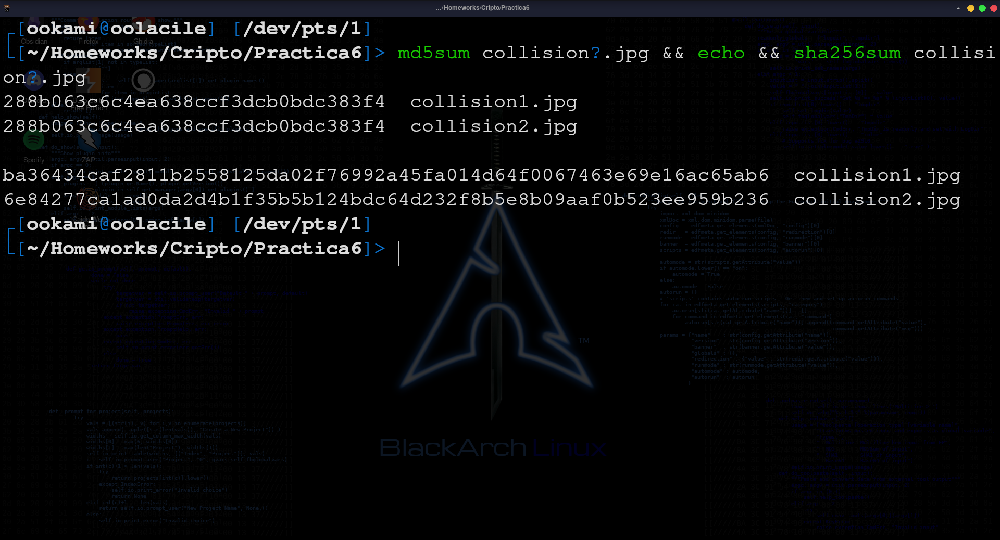

#### Creación de imágenes de disco

Para esta segunda parte, ejecute los siguientes comandos para la creación, formateo y montado de una nueva imágen de disco en mi sistema.
Además copie de una vez una de las colisiones creadas a esta imágen.

```bash
dd if=/dev/zero of=partition1.dd bs=1M count=32
sudo mkfs.ext4 partition1.dd
sudo mount partition1.dd /mnt
sudo cp collision1.jpg /mnt
```

Una vez con dicho volumen montado bajo mi directorio `/mnt`, verifique nuevamente sus *hashes* para verificar su integridad.

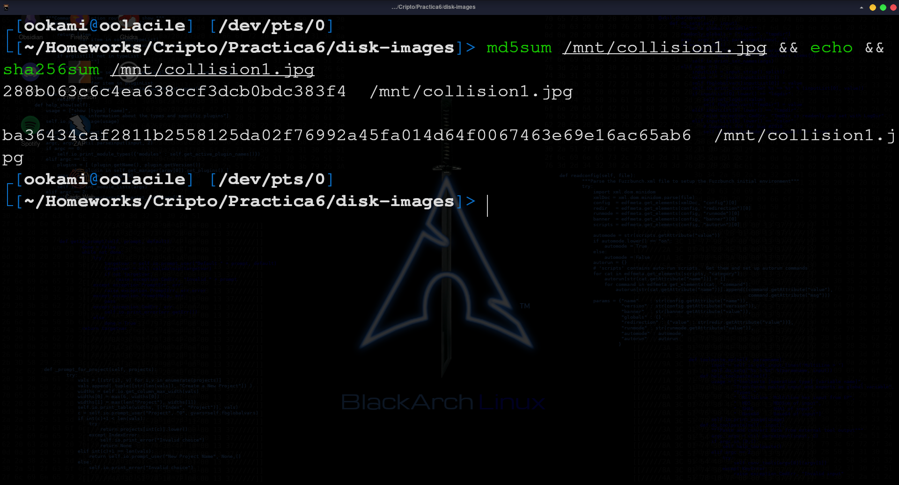

Con todo correcto, desmonte la imágen de mi sistema y realicé una copia de la imágen de disco cruda con los siguientes comandos:

```bash
sudo umount /mnt
cp partition1.dd partition2.dd
```

Ahora, debemos identificar el *offset* del archivo que introducimos para poder remplazarlo por la otra colisión.
Primero se identifica los primeros *bytes* o *"magic numbers"* del archivo con apoyo de la utilidad `xxd`:

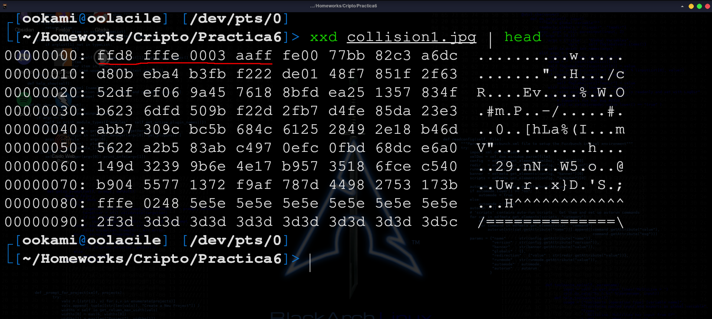

Buscando esta secuencia de *bytes* en la segunda imágen de disco `partition2.dd`, la encontramos en el siguiente *offset*:

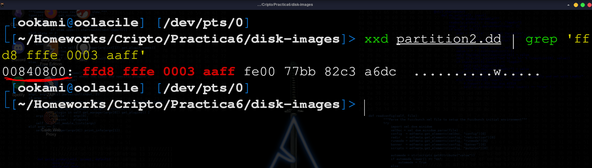

El número `00840800`, se encuentra en formato **hexadecimal** y representa cuantos *bytes* hay que desplazarse para encontrar el inicio de nuestra primera imágen colisión.
En formato decimal este número corresponde a `8652800`, y como nos disponemos a remplazar la primera colisión en esta segunda imágen cruda, nos es de utilidad para indicarle a la utilidad `dd` a partir de donde comenzar el grabado de nuestra segunda imágen, de la siguiente manera:

```bash
dd if=collision2.jpg of=partition2.dd bs=1 conv=notrunc seek=8652800
```

Adapte un poquito el comando provisto en la descripción de la práctica para mi *distro Linux*, cambiando la opción `conversion` por `conv`.
El resultado es el siguiente:

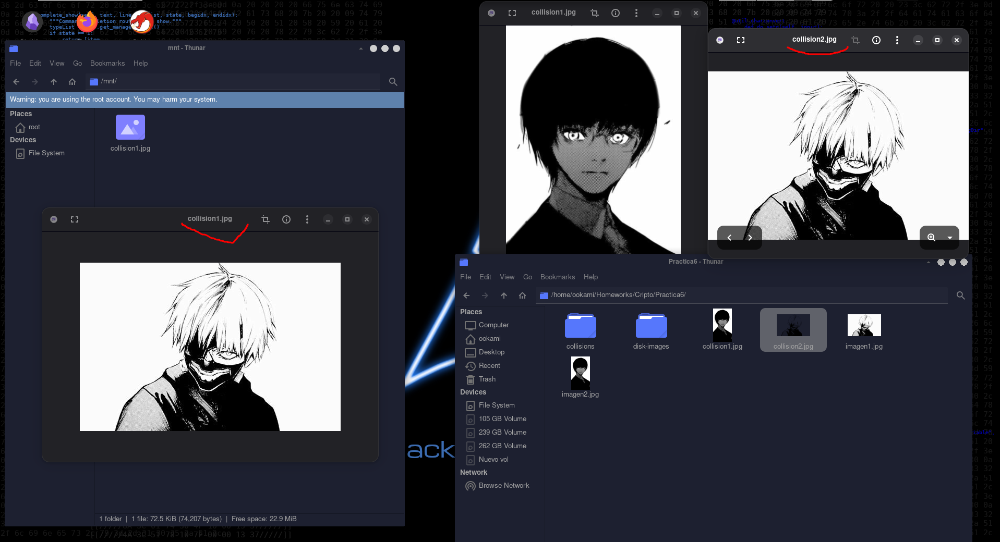

Podemos ver que aunque se nos indica que la imágen es `collision1.jpg`, realmente se trata de nuestra segunda imágen `collision2.jpg`, pues hemos sustituido correctamente dicho archivo en la segunda imágen cruda.

Comparando los *hashes* en esta segunda imágen, también podemos notar que mantiene el *hash* **MD5**, pues de eso trata la colisión, pero el *hash* **SHA256** ha cambiado, pues ya no se trata de la misma imágen:

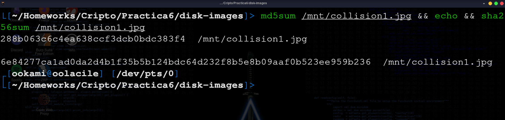

Ahora solo resta comparar las firmas *hash* de ambas imágenes de disco crudas:

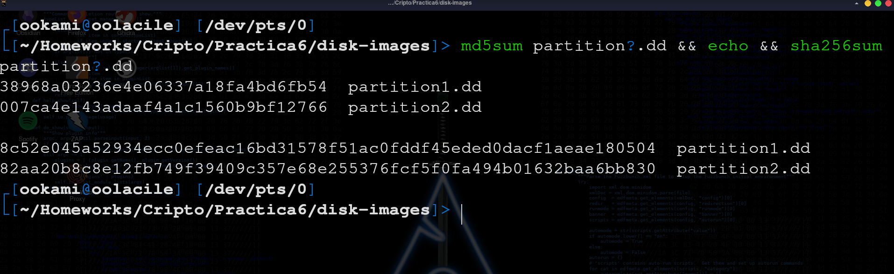

Aunque manipulamos la misma sección en ambas imágenes de disco, las firmas resultantes son distintas.

#### Colisiónes de SHA1

Para la última sección de la práctica, obtuve los *PDF* colisiones de **SHA-1** del sitio oficial:

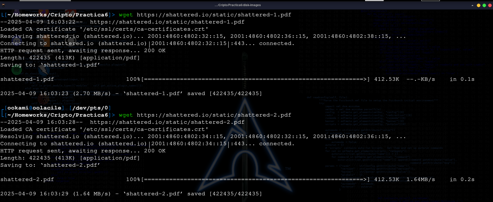

Los pasos a partir de aquí, fueron totalmente análogos a la sección anterior, de modo que voy a obviar las explicaciones a detalle. Ocupe la siguiente secuencia de comandos para preparar las nuevas imágenes crudas de disco:

```bash
dd if=/dev/zero of=partition3.dd bs=1M count=32
sudo mkfs.ext4 partition3.dd
sudo mount ./partition3.dd /mnt
sudo cp ./shattered-1.pdf /mnt
sudo umount /mnt
cp ./partition3.dd ./partition4.dd
```

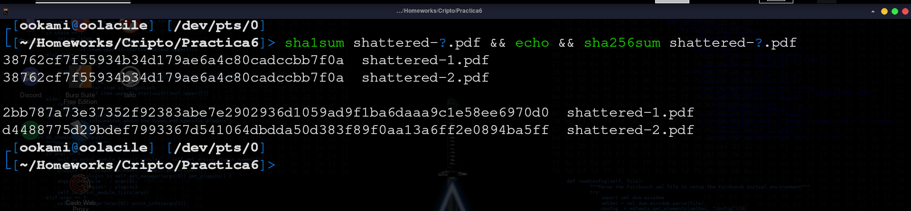

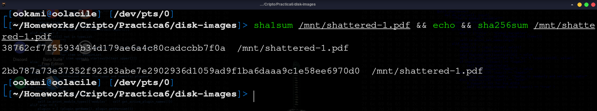

Identifiqué los *"magic numbers"* como `2550 4446 2d31 2e33` y el *offset* como `00840800` (igual al anterior), con apoyo de `xxd`.

Finalmente, remplacé el archivo por el segundo *PDF* colisión en `partition4.dd` con el siguiente comando:

```bash
dd if=shattered-2.pdf of=partition4.dd bs=1 conv=notrunc seek=8652800
```

Ahora, si comparamos las firmas del nuevo archivo alojado en esta imágen, podremos notar que se trata de `shattered-2.pdf` realmente.

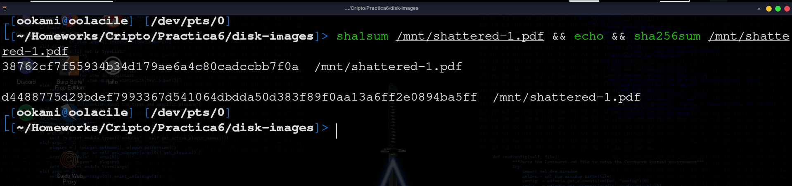

Y nuevamente, las firmas de las imágenes crudas **difieren** en ambos casos:

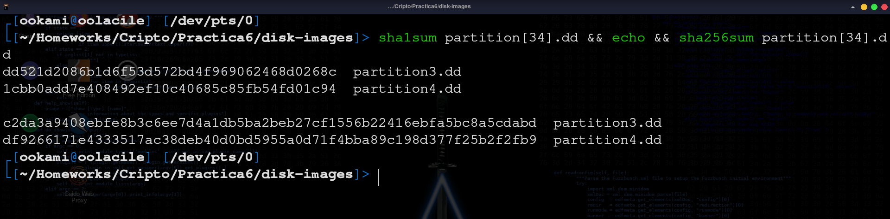

### Conclusiones

De ésta práctica aprendí acerca del impacto que pueden tener las **colisiones** de *hash* en algoritmos inseguros como *MD5* y *SHA-1*, donde podemos generar (al menos en *MD5*) nuestros propios archivos con el mismo *hash*, de ahí que estos algoritmos se encuentren en desuso, al menos para verificaciones de integridad.
También pude experimentar con la utilidad `dd` para la creación de imágenes crudas y la manipulación de éstas, de forma similar a procedimientos forenses sencillos.
Particularmente, podría decir que me dió una idea más clara de las posibles aplicaciones de las **colisiones** *hash* y como podrían utilizarse para contaminar o suplantar otros archivos.