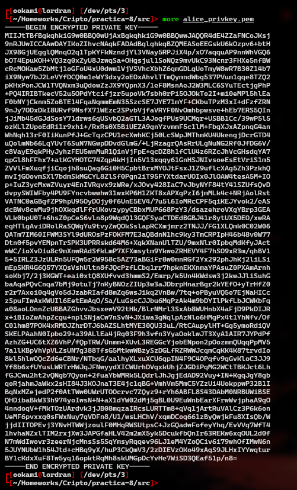
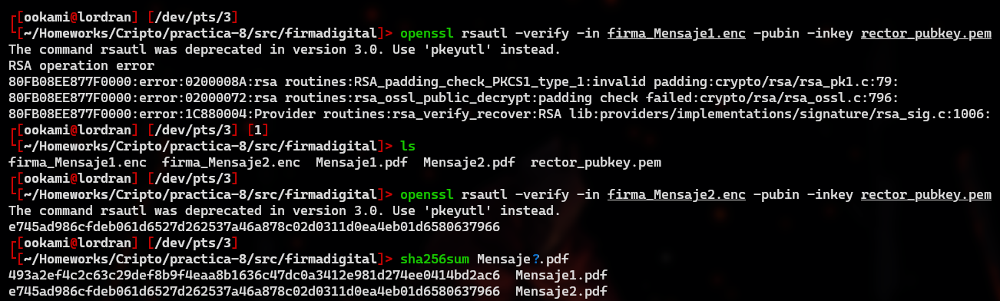

# Práctica 8: Firma y sobre digital

> Fernando Romero Cruz - *319314256*

## Reporte

### Ejercicio de sobre digital

#### Generación de la llave

Para la primera parte de este ejercicio, y en representación de **Alice**, generé mi llave **privada** *RSA* utilizando el comando:

```bash
openssl genpkey -algorithm RSA -out alice_privkey.pem -pkeyopt\nrsa_keygen_bits:4096 -aes-256-cbc
```

Aqui se solicita una contraseña para proteger la llave, de modo que indico una contraseña adecuada y recibo mi llave en el archivo `alice_privkey.pem`.

Con `more` podemos ver el contenido **crudo** del archivo, que es una cadena codificada en **base64** con todos los datos pertinentes a esta llave.



Podemos diseccionar la información con apoyo de la misma utilidad `openssl` de la siguiente manera:

```bash
openssl rsa -in alice_privkey.pem -text -modulus

# Private-Key: (4096 bit, 2 primes)
# 
# modulus:
#     00:df:cd:20:fd:9d:46:f7:e6:dc:e7:aa:af:10:4e:
#     8d:fa:7a:54:a2:ed:e4:39:81:93:be:b8:a1:3f:d0:
# 	... ...
# 	
# publicExponent: 65537 (0x10001)
# 
# privateExponent:
#     19:48:a7:6d:7f:93:40:f6:88:06:74:36:0a:f5:94:
#     fc:b3:4d:54:8a:e3:b9:cb:75:d1:9a:32:3d:6f:6d:
# 	... ...
# 
# prime1:
#     00:fb:29:d1:e4:d0:81:24:e8:eb:2f:54:77:d2:ee:
#     8d:4e:ae:ae:d4:27:2e:3e:d9:1c:d3:38:a5:3c:91:
# 	... ...
# 
# prime2:
#     00:e4:1c:6b:82:dc:c1:a3:bf:a3:84:18:65:2f:69:
#     8a:3c:aa:20:19:e2:24:8f:b2:38:14:96:39:54:11:
# 	... ...
# 
# exponent1:
#     00:97:86:69:5c:b3:f5:d5:c0:b7:72:7c:71:35:ce:
#     39:6e:08:b0:ec:c9:1e:7b:48:1c:bd:c9:64:d6:9f:
# 	... ...
# 
# exponent2:
#     36:a2:bb:f9:77:08:86:40:f3:58:43:43:91:0c:95:
#     48:9c:72:dd:e0:35:63:99:8b:27:1b:28:16:03:cd:
# 	... ...
# 
# coefficient:
#     05:44:86:49:1b:81:03:58:02:26:09:87:b7:b7:d1:
#     07:2a:6c:03:67:bc:2d:6c:56:7f:c2:fa:03:02:2b:
# 	... ...
```

Ahora, si pretendo recibir mensajes cifrados, debo habilitar la llave **pública** correspondiente a mi llave **privada**.
Esto puede realizarse con el comando indicado:

```bash
openssl rsa -in alice_privkey.pem -pubout -out alice_pubkey.pem
```

Y de igual manera, podemos ver con `more` que el archivo crudo consiste de la información codificada en **base64**:

```bash
more alice_pubkey.pem

# -----BEGIN PUBLIC KEY-----
# MIICIjANBgkqhkiG9w0BAQEFAAOCAg8AMIICCgKCAgEA380g/Z1G9+bc56qvEE6N
# +npUou3kOYGTvrihP9DNKXgTtf1kNcS7hKfod36x26zlic/yVzTbSGC8pg5Mc9Ny
# zYUJb3QykifoOt1RkNK8Bh+9J/QErA4xV8XHy7l9Y2bdIiX19RcnBuuFV0LJsKiO
# ijGf5WFs6pDQUvcJVeQ8GSam+owoqHuEn/ZqrsnNHxvhO0fK4lCn1+C6FetcWAXr
# 387Pw9or+Jujw6hP2E6B8kMhWekM1W9eNKI3vJLiSeew4h/0cSTiehX+6i2nzYH6
# zgCYxj2ygT7B3/pst7A5WyYJornf8SVKyXHU4kADQfZA/gV+EF/YnM9InhoDMQyI
# 7vN1YklnYVWqsHj87uNij5QbQyZuUx8ibesZ7VcPHAJdZ4Wmyt4Jhmr2CQ28bIdX
# wTsB2sgbtyMye0qdqoeqye/AYdfof8fUEaMjSFIQ6x6dxLu0iG0YHmiKQpe05qF3
# knncCvUexqdJAM1qedzZY0a5JNSK/cXo9v4RrhQjI+x6X+e2idTKjsuxiKtFZEvg
# YL1ibt+LGbYIgt69bC7SzWNpX2zMO1twU7mTA8XGvYqeMNPWhKW8Sgvwq3r0+c8o
# 9vZNChwWT0nvsfXgh/D4bPyDYdsGWsY6D6U5SUfq/hCpiBOtQQ0m0STBRevGnZbM
# Bc+uS8Q6gCQ9p7UbI7RLs28CAwEAAQ==
# -----END PUBLIC KEY-----
```

Mientras que con `openssl` podemos ver algunos detalles de esta llave, pero notamos que no todos los que posee la llave privada:

```bash
openssl rsa -in alice_pubkey.pem -pubin -text -modulus

# Public-Key: (4096 bit)
# 
# Modulus:
#     00:df:cd:20:fd:9d:46:f7:e6:dc:e7:aa:af:10:4e:
#     8d:fa:7a:54:a2:ed:e4:39:81:93:be:b8:a1:3f:d0:
# 	... ...
# 	
# Exponent: 65537 (0x10001)
```

Ahora, compartimos nuestra llave privada con **Bob** (representado por usted *Tonah*), para que pueda indicarnos su mensaje bajo un esquema de **sobre digital**.

#### Descifrado del mensaje

**Bob** nos ha proporcionado 2 archivos, `password.enc` y `mensaje_secreto.enc`, el **sobre digital** que proteje su mensaje.

Lo primero es descifrar la contraseña del **sobre** con el siguiente comando:

```bash
openssl pkeyutl -decrypt -inkey alice_privkey.pem -in password.enc -out
password.txt
```

Este comando generará un archivo `password.txt` que contiene la contraseña del sobre.

```bash
cat password.txt 
# [REDACTED]
```

Ya conociendo la contraseña, podemos descifrar el mensaje proporcionado con apoyo de esta, ejecutando el siguiente comando:

```bash
openssl enc -d -aes-256-cbc -pass file:password.txt -pbkdf2 -in mensaje_secreto.enc -base64 -out mensaje_secreto.txt
```

Este genera un archivo `mensaje_secreto.txt` con la pregunta realizada por **Bob** a nosotros.

```bash
cat mensaje_secreto.txt

# ¿A qué lugar me refiero si te digo que "allá el tiempo es muy largo. Nadie lleva la cuenta de las horas ni a nadie le preocupa cómo van amontonándose los años. Los días comienzan y se acaban. Luego viene la noche. Solamente el día y la noche hasta el día de la muerte, que para ellos es una esperanza."?
```

#### Dar respuesta al mensaje

Para dar respuesta a este mensaje bajo el **esquema** indicado, primero debemos crear nuestro propio mensaje en un archivo `answer.txt`.

```bash
echo "Sinceramente no lo sé, una carcel tal vez?" > answer.txt
```

Por otra parte, creamos una contraseña adecuada para el cifrado **simétrico** de este mensaje:

```bash
cowsay -f tux "Hola Tonah, mira mi contraseña es super segura" > pass_answer.txt
```

Con esta contraseña, ciframos nuestro respuesta bajo un esquema **simétrico**, en este caso, bajo `aes-256-cbc`.

```bash
openssl enc -aes-256-cbc -pass file:pass_answer.txt -pbkdf2 -in answer.txt -out answer.enc -base64
```

Para concluir el **sobre**, solo resta encriptar la contraseña con la llave **pública** de **Bob**, provista en la carpeta compartida, de modo que se debe ejecutar:

```bash
openssl pkeyutl -encrypt -pubin -inkey bob_pubkey.pem -in pass_answer.txt -out password_answer.enc
```

Este genera el cifrado en el archivo `password_answer.enc`, de modo que completamos nuestro esquema de **sobre digital** y podriamos enviar los archivos `answer.enc` y `password_answer.enc`.

#### Firma digital de Alice

Pero en esta ocasión, antes de enviarselo a **Bob**, adjuntaremos nuestra firma digital de este mensaje.

Primero, obtenemos la **huella** mediante **SHA-256** del mensaje original `answer.txt` y lo almacenamos en un archivo `anser.sha256`.

```bash
openssl dgst -sha256 -binary -out answer.sha256 answer.txt
```

Despues, debemos cifrar este nuevo archivo utilizando nuestra llave **privada** (de **Alice**), de modo que ejecutamos:

```bash
openssl pkeyutl -sign -in answer.sha256 -inkey alice_privkey.pem -out digital_sign_answer.enc
```

Este comando genera el archivo `digital_sign_answer.enc`, que representa nuestra **firma digital** de este mensaje en específico.

Con esto ahora si estamos listos para enviar a **Bob** el **sobre digital**, con la respectiva **firma** del mensaje.

### Ejercicio de firma digital

Para este ejercicio, simplemente se utilizó el comando provisto en la práctica, para determinar el **hash** en la firma del mensaje, remplazando `N` por 1 o 2 según se desee.

```bash
openssl rsautl -verify -in firma_MensajeN.enc -pubin -inkey rector_pubkey.pem
```

Esto con apoyo de `sha256sum` nos ayuda a determinar fácilmente que el mensaje auténtico es el **Mensaje 2**, pues el comando directamente falla al intentar determinar el **hash** del primer mensaje:



---
## Preguntas

1. **¿Por qué es necesario resguardar con una contraseña el archivo que contiene la llave privada mientras que el archivo con la llave publica no?**

> Porque aún si algun actor malicioso logra hacerse con nuestra llave, no podrá analizarla ni utilizarla para cifrar sin nuestra contraseña, jamas es suficiente seguridad.

2. **¿Por qué es necesario cifrar tanto el primer mensaje que envía Bob como el mensaje de respuesta que envía Alice, con un algoritmo simétrico como AES? ¿no bastaría cifrarlos con un algoritmo asimétrico como RSA?**

> Por una parte, es una capa adicional de seguridad sobre los mensajes además de que mejora mucho el **rendimiento** en comparación a un sistema puramente **asimétrico**.

3. **¿Cuál es el mensaje de bienvenida legítimo enviado por el rector en el ejercicio de la Firma Digital?**

> Aquel con un meme de **Los Juegos del Hambre**.

4. **Si la firma digital no proporciona confidencialidad, ¿qué servicio de seguridad proporciona?**

> Proporciona la **integridad** y **autenticación** sobre los mensajes.

5. **¿En cuál de las prácticas anteriores se utilizó un esquema parecido al de Sobre digital?**

> Yo pensaría que en la **práctica 5**, pues protegiamos la información sensible de los pacientes bajo un cifrado simétrico, donde la llave debia ser provista cada vez que alguien deseaba consultar el historial.