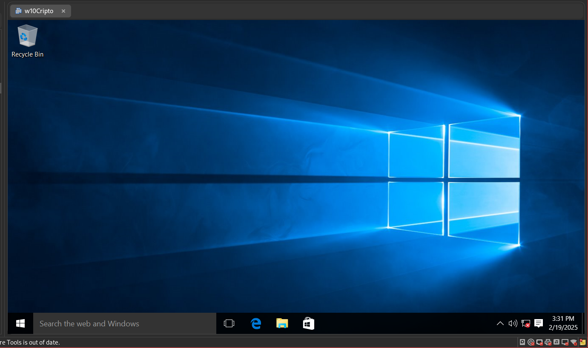
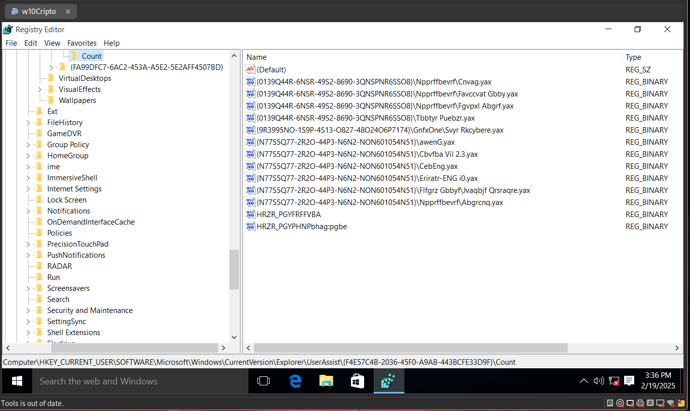
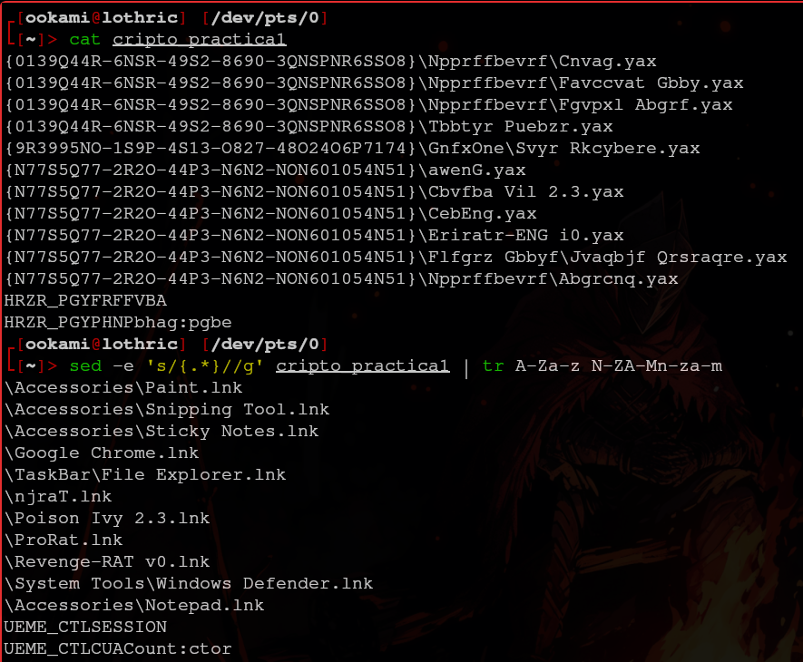

# Práctica 1

> Fernando Romero Cruz - 319314256

### Reporte

Posterior a una tediosa descarga de la máquina virtual y de otra casi tan tediosa descompresión, pude abrirla en mi *VMware Workstation* sin problemas e iniciar sesión con las credenciales provistas `cripto:cripto`, para obtener un vistazo a un sistema operativo *Windows 10*.



Siguiendo los pasos de la práctica, abrí el *Editor de Registro Windows* y busque la llave indicada en el documento, y encontre los valores esperados, presuntamente encriptados en *Rotacional 13*:



De modo que extraí todos los nombres llamativos de estos valores y los almacene en un archivo en mi computadora de forma nativa, posterior a esto, con la utilidad `sed` limpie los valores entre llaves (`{}`) y después con `tr` descifré los nombres definiendo las sustituciones de caracteres pertinentes.



Es de particular interés las siguientes entradas:

```
\njraT.lnk
\Poison Ivy 2.3.lnk
\ProRat.lnk
\Revenge-RAT v0.lnk
```

Todos estos programas, por su nombre, parecen referirse a **Troyanos de acceso remoto**, o *RAT*'s por sus siglas en inglés (*Remote Access Trojan*).
El uso no autorizado de estos programas es un delito, pues permiten el espionaje y control malicioso del dispositivo.

### Preguntas

1. ¿Encontró indicios de la ejecución de software malicioso? En caso afirmativo, liste el software considerado malicioso y explique brevemente para que se usa cada uno.

> **Si**, se encontraron al menos 4 aplicaciones que se sospecha que son **troyanos**, njraT, Poison Ivy 2.3, ProRat, Revenge-RAT v0. Todas ellas, como mencioné anteriormente, son **malware** con el objetivo de brindar acceso remoto del dispositivo a un atacante.

2. ¿En qué directorios se encontraba cada link (.lnk) de los programas de reciente uso listados en el UserAssist? ¿Por qué cree que se encontraban en esas ubicaciones?

> Se encontraban en el directorio `{A77F5D77-2E2B-44C3-A6A2-ABA601054A51}`, que indica que estos programas se ejecutaron desde el **Menu de inicio** de *Windows*

3. ¿Por qué cree que en un análisis previo no se encontraron los programas instalados en el equipo asegurado?, y ¿Por qué cree que, aunque se tienen los rastros del acceso al software malicioso, ya no se encuentra ese software instalado en el equipo?

> Yo sospecharía que los programas una vez activos buscan esconder su rastro y alojarse en el sistema haciendose pasar por otros programas **legítimos** de modo que sus procesos no se encuentren bajo nombres conocidos o predecibles. Aunque se encontraron los rastros de su acceso, por ejemplo en el *Registro* de *Windows*, ya no podemos encontrar las instalaciones u los procesos bajo estos nombres.

4. ¿Qué relación tiene esta práctica con el análisis forense?

> El **análisis forense** consiste precisamente de investigar, bajo una metodología formal y válida, los incidentes ocurridos en un dispositivo, usualmente con el objetivo de recopilar toda la evidencia admisible en un procedimiento judicial. En este caso particular, estamos investigando un incidente ocurrido en este equipo para descubrir exactamente qué ocurrió y con que objetivo.

5. Investigue por qué Windows usa ROT13 para cifrar esta información e indíquelo en su reporte

> *Windows* utiliza *ROT13* como una técnica de ofuscación simple para evitar que usuarios casuales o poco experimentados modifiquen este *Registro* por error o confusión. Para un usuario inexperto, ver estos valores no tiene ningún sentido lo que evita que lo confundan con cualquier otra opción que estén buscando.

6. Investigue sobre las siguientes herramientas UserAssistView v1.02 y UserAssist v2.6.0, y emita un comentario sobre su utilidad.

> Ambas son herramientas forenses desarrolladas para analizar el historial de herramientas ejecutadas a partir del registro *UserAssist* antes visto. Son útiles por que permiten visualizar de forma rápida, sencilla y descifrada los valores de estos registros que pueden aportar información valiosa a la investigación.

### Conclusión

Puedo concluir a partir de esta práctica que encriptaciones clásicas como *ROT13* aun pueden ser relevantes, si bien no como opciones seguras, como convenciones para la presentación de la información. También que el registro *UserAssist*, aunque muchas veces ignorado, posee valiosa información de los programas ejecutados recientemente y que podría no haber sido modificada por su presentación cifrada.