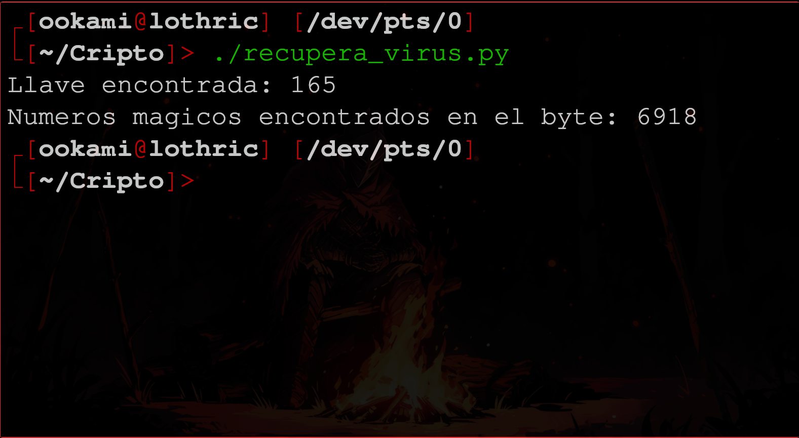
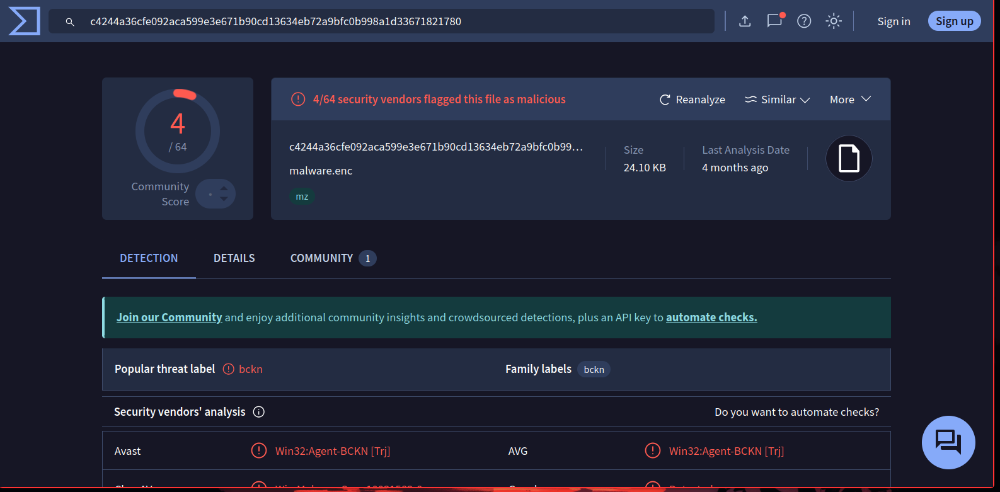

# Práctica 2 - Criptografía y Seguridad

> Fernando Romero Cruz - *319314256*

### Reporte

#### Parte 1

> Para esta sección, se utilizó un *Script* simple de *Python* para abrir el archivo y realizar las iteraciones de descifrado hasta dar con aquella que contuviera la cadena `DOS`. Una vez encontrada, se almacenó la llave y se escribio el contenido descifrado con la llave correcta, retirando la cabecera, en el archivo `virus`.

```python
#!/usr/bin/env python

reader = open('57FD6325.VBN','rb')
mis_bytes = reader.read()
llave = 0

for i in range(256):
     temp = ''.join([chr(b^i) for b in mis_bytes])
     if 'DOS' in temp:
        llave = i
		break

print(f'Llave encontrada: {llave}')
desofus = ''.join([chr(b^llave) for b in mis_bytes]).encode()

start = desofus.find(b'MZ')
print(f'Numeros magicos encontrados en el byte: {start}')

writer = open('virus','wb')
writer.write(desofus[start:])
```

Este *Script* nos da una salida como la siguiente, ademas de crear el archivo especificado, que podemos comprobar que efectivamente es un **ejecutable** de *Windows*:



Tambien podemos comprobar que efectivamente es un virus subiendo el archivo a la página *Virus Total*:



#### Parte 2

### Cuestionario

1. ¿Para qué se usa la herramienta XORsearch? https://blog.didierstevens.com/programs/xorsearch/

> Es una utilidad que permite buscar cadenas en archivos **posiblemente** codificados en *XOR*, *ROL* o *ROT*, precisamente realizando varias de estas desencriptaciones y analizando si la cadena buscada se encuentra en esta nueva información.
> 
> Particularmente para *XOR*, prueba todas las posibles llaves de un solo *byte*, de 0 a 255.

2. ¿De cuántos bytes es la cabecera que le agregó el antivirus al malware?

> De ***13536*** *bytes*, pues los números mágicos comienzan en el **13537**.

3. ¿Qué son los números mágicos? (relacionado con archivos)

> Los números mágicos buscados son `0x4d` y `0x5a`, o tambien representable como la cadena `MZ`.

4. ¿Qué es VirusTotal?

> Una base de datos que almacena las información, características y funcionalidades de *Malware* previamente detectado y cargado a ésta página.
> Este *Malware* es identificado principalmente por sus firmas *hash*.

5. De acuerdo a VirusTotal, ¿qué tipo de malware es?

> *VirusTotal* parece indicar que se trata de un **virus tipo troyano**.

6. En la parte 2 de la práctica, ¿a qué obra y a qué autora pertenecen los textos que logró descifrar?

