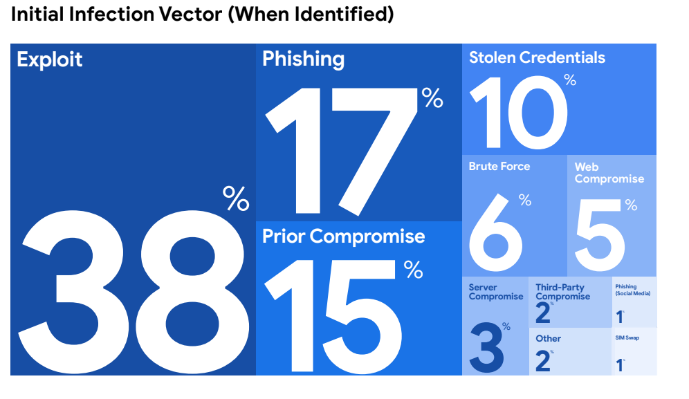
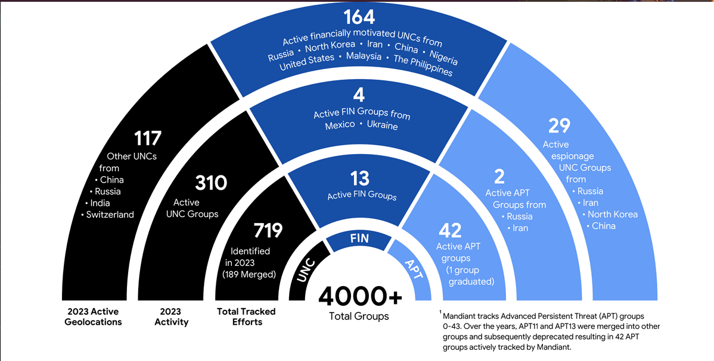
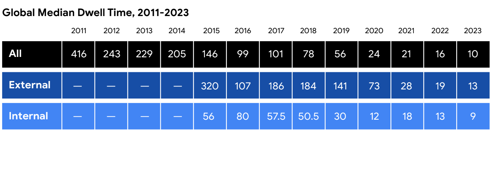
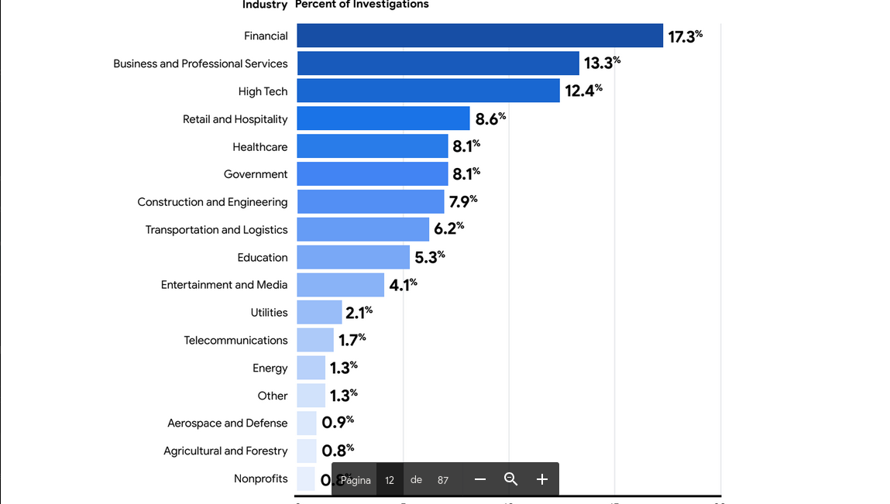
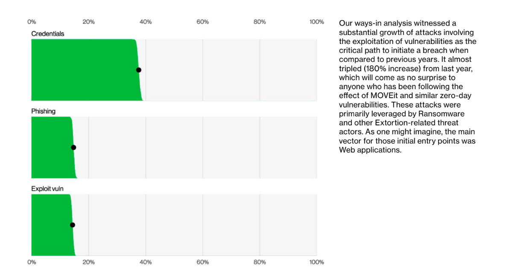
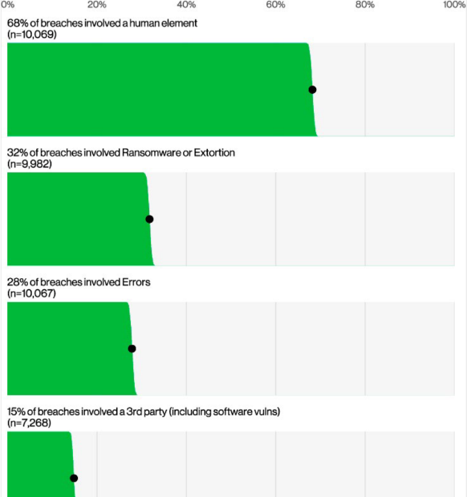

[<- Índice](../DeteccionIntrusos.md)
# Detección de intrusos
## Temario

- **Introducción**
	- Panorama actual de amenazas
	- Postura actualizada de ciberdefensa
- **Deteccion de intrusos en red**
	- Infraestructura clave para la detección
	- Escenarios de evaluación
- **Detección de intrusos en dispositivos finales (endpoint)**
	- Bitácoras de sistema operativo
	- Aplicaciones, privilegios, autenticación

---
> ***"Si conces al enemigo y te conoces a ti mismo, no debes temer el resultado de cien batallas.
> 
> Si te conoces a ti mismo, pero no al enemigo, por cada victoria obtenida también sufrirás una derrota.
> 
> Si no sabes nada ni del enemigo ni de ti mismo, sucumbirás en todas las batallas."***

*\- Sun Tzu, El arte de la guerra*

---
# Introducción
## Antes de empezar...

Debemos reflexionar y hacernos una serie de preguntas para entender el estado actual de la ciberseguridad defensiva:

- ***¿Cuál es el estadfo actual?***
	- *¿Cual es el panorama actual de amenazas?*

- ***¿Qué se esta haciendo bien?***
	- *¿Cuál es la protección tradicional?*

- ***¿Qué se esta haciendo mal?***
	- *¿Porqué hay cosas que fallan?*

- ***¿Qué se busca?***

## ¿Contra qué nos enfrentamos?

Es importante estar al tanto y actualizados acerca de los amenzas que enfrentamos como especialistas de ciberseguridad.

Existen múltiples documentos que recopilan información y estadisticas sobre estos ataques, como lo son:

- ***Mandiant, M-Trends 2024 Special Report***
- ***Verizon Bussiness, 2024 Data Breach Investigations Report***

Precisamente de estos documentos, se destacan los siguientes rubros dada su relevancia:

#### Vector inicial de Ataque

> Como iniciaron su ataque los actores de amenaza:

#### Grupos de Amenaza

> Agrupaciones de actores de amenaza reconocidas y activas:

#### Tiempo promedio de detección

> Línea de tiempo sobre los días promedio que tarda una organización en detectar un intruso en su sistema:

#### Objetivos de las campañas

> El tipo de organizaciones más atacadas por los actores de amenaza:

#### Técnicas más utilizadas

> Técnicas más utilizadas este año, cabe mencionar que se observo un gran crecimiento de incidentes aprovechandose de *exploits* de vulnerabilidades.

#### Elementos involucrados en el ataque

> Que elementos se involucraron en el éxito del ataque:

## Problemas de ciberseguridad

==Para prevenir un compromiso en la organización es necesario tapar cada hueco==, corregir cada debilidad, arreglar toda vulnerabilidad, lo cuál no es precisamente fácil,

==El atacante, por su parte, solo tiene que encontrar un único elemento vulnerable==, ya sea un equipo, una aplicación, un servicio o hasta un usuario.

> ***"Una cadena no es más fuerte que su eslabón más débil"***

A consecuencia de esto, las organizaciones continúan siendo víctimas de perdidas monetarias.

Estos problemas están presentes, incluso en grandes organizaciones con gran presupuesto, personal y recursos destinados a ciberseguridad.

***Sin importar el hecho de ser comprometidos o no, sin duda el adversario tiene una ventaja importante***

## Nueva postura de seguridad

Para la postura de defensa tradicional, se perseguía un ideal de un sistema totalmente seguro, sin fallas ni huecos, generando una falsa noción de seguridad.

Sin embargo, ahora sabemos que eso es falso, que ningún sistema es seguro porque siempre estaremos en desventaje, por lo que ==se replanteó totalmente la postura de de seguridad bajo 2 ideas principales==:

- ***El compromiso es inevitable***
- ***Cualquier organización puede ser comprometida, incluso aquellas con arquitecturas de seguridad robustas***

**Postura tradicional**: Prevenir el compromiso.
**Postura actual**: prevenir que el oponente tenga éxito.

Sabemos que los adversarios quieren información o control sobre algún sistema.

Entonces incluso si son capaces de comprometer todos los sistemas, si no consiguen lo que quieren entonces no pueden ganar.

Reformular el paradigma de seguridad defensiva requiere el planteamiento de neuvos objetivos:

1. **Primer objetivo**. Detectar la actividad del adversario hacia su objetivo
2. **Segundo objetivo**. Responder rápidamente a la detección

**Herramientas del nuevo paradigma de ciberseguridad**:
- Arquitectura de seguridad defendible
- Monitorización de seguridad en red (*NSM*)
- Monitorización de seguridad continua (*CSM*)

---
## Adversarios/Ataques tradicionales

- **Atacantes oportunistas o aficionados**
	- Frustrados por arquitecturas tradicionales
	- No invierten mucho tiempo para sus objetivos

- **Ataques hacia servidores/servicios expuestos**
	- *DoS*, servicio vulnerable o mal configurado: *Web*, *DNS*, *SMPT*, *FTP*.

## Defensas/Arquitecturas tradicionales

- **Orientada a la prevención**
	- Mantener a los adversarios fuera
	- Bloquear la maldad

- **Orientada en capa 3/4**
	- Direcciones *IP*, puertos

- **Enfocada en el perímetro**

- **Basada en dispositivos**
	- *IPS*, *Anti malware*, *Firewall*

## Adversarios/Ataques actuales

- **Adversarios motivados/financiados**
	- Ciber crimen
	- Sabotaje
	- Espionaje

- **Ataques enfocados en los usuarios**
	- Email
	- Web
	- Redes sociales
	- Medios físicos
	- Dispositivos móviles

### Post-Explotación avanzada

- Basada en datos
- Robo de información
- Movimiento lateral
- Comando y control (*C2/C&C/CNC*)
- Persistencia
- Ocultamiento

---
# Detección de Intrusos de Red
## Técnicas de detección de red

Es posible detectar intrusos mediante el análisis de:
- ==***Datos estadísticos***==
- ==***Datos de contenido completo***==
	- Red
	- Transporte
	- Aplicación
- ***Datos de cabecera***
- ==***Datos de alerta***==

## Objetivos de análisis de tráfico

El análisis de tráfico permite:

- Detectar problemas en la red.
- Analizar el tráfico de red.
- Conocer el tráfico entrante o saliente.
- Detectar posibles ataques a la infraestructura de la red.
- Determinar la carga de tráfico y conocer las causas, en caso que la carga sea anormal.

## Análisis de visibilidad

La detección requiere fundalmente la habilidad para ver datos, paquetes, conexiones, bitácoras

> El análisis de visibilidad es una práctica que considera todos los puntos fuertes y débiles de los dispositivos en nuestra arquitectura de red y su (in)capacidad para apoyar a la detección o prevención de ataques.

==El objetivo del *análisis de visibilidad* es determinar las fuentes de recolección de gran valor, además de detectar puntos ciegos.==

Para este tipo de análisis se consideran los siguientes conceptos clave:

1. ***Artefacto***: El dato que pretendemos analizar para determinar si es malicioso (*URL*, *Nombre de archivo*, *Extensión de un archivo*, *Hash de un archivo*)
2. ***Producción***: Dispositivo en nuestra red que produce  o procesa un artefacto (*Router*, *DNS*, *IDS*, *Proxy*, etc)
3. ***Regla de detección/prevención***: Regla para discernir entre un artefacto bueno de un artefacto malicioso o inadecuado.

# Siglas de Conceptos de Defensa

Aqui anotaré algunas definiciones sobre herramientas utilizadas en el ámbito de ciberseguridad enfocada en defensa que estaremos utilizando a lo largo de este curso.

***SIEM***: (*Security Information and Event Management*) el objetivo principal de un *SIEM* es ==centralizar la recopilación, almacenamiento y análisis de logs o registros de eventos de seguridad== generados por diversos sistemas, dispositivos y aplicaciones de una organización

El objetivo principal es ==detectar comportamientos sospechosos o maliciosos en tiempo real==.

***MFA***: (*Multifactor Authentication*) Es un método de seguridad que ==requiere que los usuarios proporcionen 2 o más formas de verificación== antes de acceder al sistema, añadiendo capas adicionales de protección al sistema.

***XDR***: (*Extended Detection and Response*) es un enfoque de ciberseguridad que busca ==integrar y correlacionar múltiples fuentes de seguridad==, para mejorar la detección y respuesta ante amenazas.

A diferencia de otro tipo de herramientas que se enfocan en un solo vector de ataque (*endpoints*, *redes*, *aplicaciones web*), ***XDR*** busca ofrecer una visión amplia sobre todos ellos.

# Enlaces

[Siguiente ->](HFC23_10_2024.md)