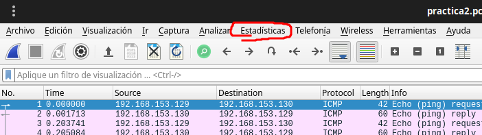
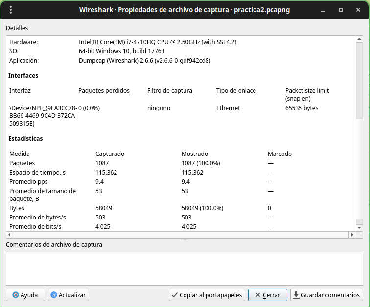

[<- Índice](../DeteccionIntrusos.md)
### Ejercicio 2 - Análisis de contenido completo

#### Hallazgos del análisis

- En la red se utilizó mucho *UDP*
- Una comunicación de 10.42.0.8 a 52.2.229.189 con muchos bytes transferidos (222 kb)
- La IP 10.42.0.8 tuvo mucha más actividad que su contraparte
- Tamaño de paquetes de 160 a 319

## IDS

> Es una ==herramienta de seguridad que monitorea el tráfico de red y/o los eventos de un sistema para identificar actividades sospechosas== o posibles ataques mediante la ==definición de reglas==.

De acuerdo a las técnicas de análisis de datos se pueden clasificar como:

- Basado en anomalías
- Basado en patrones o firmas

### Detección basada en anomalías (Whitelist)

> Consiste en el análisis de tráfico de red para reportar comportamiento anómalo o inusual respecto a los patrones de tráfico normal para una red.

Existen 3 principales técnicas para detectar una anomalía:

- **Basado en estadísticas**: Según estadisticas comúnes de tráfico de red
- **Base de conocimiento**: Según las convenciones y reglas de los usos de los protocolos
- **Aprendizaje automatizado**: Con técnicas que intentan imitar un aprendizaje de las anomalías adecuadas

> Requiere de una base inicial de comportamiento, es decir, necesitamos datos estadísticos o algo con que realizar la comparación de lo bueno y lo malo.

- Tiempo finito
- Detección de desviaciones
- Fases de aprendizaje
- Identificación de violaciones de protocolo
	- Basadas en *RFC*
	- Requiere de bases de conocimiento

Desde un punto de vista más rígido, ==la detección de anomalías es considerada un problema de clasificación==.

### Detección basadas en firmas (Blacklist)

> Consiste en la creación de patrones específicos de tráfico anómalo o malicioso previamente conocido

Entonces, la detección se realiza cuando el tráfico analizado coincide con algún patron previamente creado.

La mayoria de las firmas consisten en patrones reconocidos como maliciosos hallados en el *payload*, como *exploits*, *exfiltraciones*, ciertas cadenas, etc.

> ==Este método falla ante nuevos ataques==, porque *NIDS* no cuenta aún con firmas que detecten estos patrones

**Herramientas**:
- ==Snort==, Suricata
- Marcas como *SourceFire*, *Tipping Point*, *Palo Alto Network*

## NIDS

> Un *NIDS* es un *IDS* enfocado principalmente para el monitoreo y seguridad de una ***red***, suele colocarse en puntos estratégicos de la red que faciliten su defensa.

Busca detectar anomalías tales como ataques de denegación de servicios, escaneadores de puertos o intentos de entrar en un ordenador, todo en ==tiempo real==.

Es importante mencionar que el *NIDS* no cuenta con ninguna capacidad preventiva, unicamente detecta y lanza una alerta que debe ser interpretada y respondida adecuadamente por la persona responsable.

## NIPS

Se refiere a un Sistema de Prevención de Intrusos en Red, similar a un *NIDS* pero con capacidades preventivas, es decir, puede tomar acciones activas para bloquear o mitigar las amenazas que detecte..

> Es una categoría de sistemas de seguridad diseñados  para examinar el tráfico de red en busca de actividades maliciosas o no autorizadas, y tomar medidas para prevenir o bloquear estas actividades en tiempo real.

Utiliza técnicas como inspección profunda de paquetes, análisis de anomalías, correlación de eventos y aplicación de reglas o plíticas de seguridad.

En este curso nos enfocamos principalmente en ***Snort*** como *NIPS* y como definir reglas en este.

---
## Wireshark

> Es una herramienta muy poderosa utilizada para analizar paquetes y protocolos de red. Permite capturar y analizar la red en tiempo real a un nivel detallado.

En este curso se usará para analizar algunos archivos de capturas `.pcap`, `pcapng`. `.cap`, o cualquier similar.

#### Estadísticas

> Nos interesa particularmente la sección de estadísticas de *Wireshark*.



En la subsección ***Propiedades del archivo*** podemos encontrar algunos metadatos referentes al archivo de captura, como el número de paquetes, con que interfaz de red y sistema operativo se capturo, hashes de la captura, etc.



Otras secciones importantes son:

- ***Ressolved Hosts***: Donde se resuelven (o al menos se intentan resolver) las direcciónes *IP* y *MAC* a nombres de dominio y de *host* respectivamente.

- ***Protocol Hierarchy***: Se despliegan los protocolos utilizados en los paquetes de forma *"anidada"*, indicando bajo que protocolos se enviaron ciertos protocolos.

- ***Conversations***: Flujos o conversaciones presentes en la captura, junto con estadísticas relevantes a ellos.

- ***Endpoints***: Dispositivos finales, usualmente representados por direcciones *IP*, presentes en la captura, además de estadísticas útiles para cada uno de ellos.

---
#### Filtros

Además de estos datos estadísticos, podemos observar que *Wireshark* posee en su sección principal una barra de *"búsqueda"* donde ==podemos definir filtros para que muestre solo los paquetes que deseamos ver==.

Por ejemplo, si introducimos `icmp`, nos mostrará unicamente los paquetes que posean una capa o sección *ICMP*.

Podemos filtrar paquetes que contengan una dirección *IP*, ya sea origen o destino con `ip.addr == *.*.*.*` o especificar si es una dirección destino u origen con `ip.src == *.*.*.*` o `ip.dst == *.*.*.*` .

Existe una variedad de filtros útiles, por lo que *Wireshark* nos ofrece autocompletado para facilitarnos introducir el filtro que deseamos.

## TShark

> *TShark* es la versión en línea de comandos de *Wireshark* y posee todas las características relevantes de este.

Puede ser utilizado para obtener datos de las capturas directamente en terminal y procesarlos por otros comandos a nuestro gusto.

No daremos un uso profundo a esta herramienta pero las opciones más destacadas son:

***Leer un archivo de captura***:

```bash
tshark -r captura.pcap
```

***Aplicar un filtro al archivo de captura***:

```bash
tshark -r captura.pcap -Y '[filtro]'
```

***Extraer un campo de todas las capturas mostradas***:

```bash
tshark -r captura.pcap -Y '[filtro]' -T fields -e '[campo]'
```

# Enlaces

[<- Anterior](HFC23_10_2024.md) | [Siguiente ->](HFC25_10_2024.md)