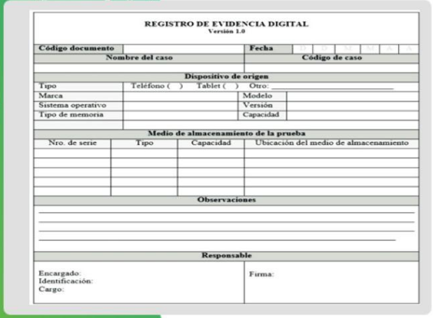

[<- Índice](../Forense.md)
# Contenidos

1. ***Introducción y Antecedentes***
2. ***Sistema de archivos***
3. ***Forense en Sistemas Linux***
4. ***Forense en Dispositivos Moviles***
5. ***Forense en Sistemas Windows***
6. ***Forense en memoria volátil***

# Antecedentes

> Conocer las bases y fundamentos de las técnicas de análisis forense digital visto de una manera teórico/práctica enfocada en el uso de herramientas especializadas.

## Conceptos Esenciales

***Evento***: Es cualquier ocurrencia

***Incidente***: Evento anómalo y de relevancia el cual de acuerdo con las reglas del negocio hacia algún activo de información ==**afecta**== cualquier elemento de la triada de la ciberseguridad.

#### ¿Qué es la informática forense?

> *"Es una rama de la computación dedicada a la aplicación de técnicas, científicas y analíticas para la captura, procesamiento, análisis e investigación de información almacenada en computadoras utilizando una ==metodología== donde la evidencia descubierta es aceptable en un proceso legal."*

El análisis forense se basa en un importante estatuto de hace más de 100 años:

###### *Principio de Locard*

> *"Siempre que 2 objetos entran en contacto transfieren parte del material que incorporan al otro objeto"*

\> *Edmond Locard*

## Fundamentos del análisis forense

1. **Imparcialidad**: Esta debe regir sobre toda la investigación y sobre los demás fundamentos.
2. **Generar registro de absolutamente todo**
3. **Minimizar la perdida de evidencia**
4. **Analizar la evidencia recopilada**
5. **Generar un informe**

## Objetivos del análisis forense

> Se desarrollan hipótesis explicando eventos y se determina si los hallazgos identificados las respaldan o las contradicen.

Además se definen características generales del objeto que se está buscando.

***Preguntas clave***:

- ¿Qué estamos buscando?
- ¿En dónde esperamos encontrarlo?

### *Guia del Qué*

- ¿Qué ocurrió?
- ¿Cuando ocurrió?
- ¿Cómo ocurrió?
- ¿Desde dónde lo hizo?
- ¿Quién lo hizo?
- ¿Por qué lo hizo?

## Evidencia Digital

> Todo aquel elemento de información que respalda una hipótesis durante un proceso de investigación se denomina ***evidencia***.

Podemos extraer evidencia de dispositivos:

- Computadoras personales
- Teléfonos inteligentes
- Tabletas electrónicas
- Servidores
- Drones
- Electrodomésticos

#### Tipos de contenedores

***Dispositivos físicos de almacenamiento***:
- Volumen
	- Sistema de archivos
		- Aplicaciones
	- *Swap*
- Memoria

***Dispositivos de red***

#### Escala de volatibilidad

> Hace referencia a que tan volátiles son los datos, es decir, que tan rápido se *"pierden"*.

De mayor a menor volatibilidad:

1. Tablas de ruteo
2. Tráfico de red
3. Memoria RAM
4. Disco duro y dispositivos extraibles.

## Respuesta a incidentes y Análisis Forense

Un breve repaso de las etapas de una respuesta a incidentes es:

1. **Preparación**: Tecnológica y presonalmente, capacitación, manuales y protocolos.
2. **Identificación**: Cuando reconocemos un evento como ==incidente==.
3. **Contención/Recolección de Inteligencia**: Asociar, catalogar, clasificar y recopilar toda la información sobre el incidente.
4. **Erradicación/Remediación**: Acciones orientadas a corregir y recuperar el estado sano del sistema.
5. **Recuperación**: Implica intentar recuperarse o ponerse al dia con todo el trabajo perdido durante el compromiso.
6. **Seguimiento y lecciones aprendidas**: Evaluar las causas, aprendizajes y posibles mejoras al sistema en base a la experiencia del incidente.

> El ***análisis forense*** se ubica entre las etapas de identificación y recolección.

## Metodología del Análisis Forense

> La metodología convencional del análisis forense es:

1. ***Respuesta a incidentes y adquisición de evidencia***:
	1. Verificación
	2. Descripción del sistema

2. ***Adquisición de evidencia***

3. ***Análisis e investigación***:
	1. Análisis de línea del tiempo
	2. Análisis de medios
	3. Búsqueda de cadenas
	4. Recuperación de datos

4. ***Reporte de resultados***

---
### Verificación

> ***Los primeros momentos una vez que ha sucedido un incidente de ciberseguridad son fundamentales para una respuesta adecuada.***

Dependiendo del tipo de incidente, es necesario realizar tareas puntuales (captura de tráfico, adquisición de memoria volátil, entrevistas con los usuarios o responsables de equipos) antes de iniciar con el proceso de respuesta a incidentes.

##### Primera respuesta al incidente

> El ***primer respondiente*** debe estar capacitado para identificar el incidente y evaluar la situación para brindar la respuesta adecuada, con apoyo del manejo de herramientas de recolección de información.

1. **Ejecutar**: Debe manejar adecuada y correctamente las herramientas dispuestas para la respuesta.

2. **Acercamiento**: Involucra el ==primer trato con las personas== más allá de las herramientas, recolectando toda la información importante de ellas.

3. **Entrevistar**: El **primer respondiente** debe dirigir entrevistas con todas las personas que se vean involucradas en el incidente, desde el que reporto el incidente hasta los administradores encargados del área.

### Descripción del sistema

> Recolección de toda la información disponible del sistema a analizar, por ejemplo:

- Ubicación física y lógica del sistema.
- Principal uso del sistema.
- Configuraciones del sistema.
- Programas/Servicios instalados en el sistema.
- Usuarios válidos.

### Adquisición de evidencia

> El objetivo principal es la preservación del estado original de la evidencia y todas las acciones realizadas en esta etapa deben ser correctamente documentadas con puntualidad.

Se pueden encontrar principalmente 2 escenarios:

- **Equipo encendido**: Se le conoce como *sistema vivo*, evidencia volátil.
- **Equipo apagado**: Se le conoce como *sistema muerto*, evidencia no volátil.

##### Equipo encendido

- La recolección de memoria volátil consiste en realizar una copia de todos los bits de la memoria *RAM* y redirigirlos a un archivo.
- Existen múltiples herramientas que permitan realizar este *"volcado de memoria"*

##### Equipo apagado

- Unidades de almacenamiento
- Sistemas de archivos
- Bitácoras
- Artefactos del sistema operativo

La decisión de apagar o desconectar el equipo de la red durante la etapa de respuesta a incidentes ==dependerá de las políticas de cada organización==.

Realizar un **análisis vivo** y además un **análisis muerto** permitirá obtener mayor evidencia y por lo tanto, realizar un análisis más completo con conclusiones mejor fundamentadas.

#### *Imagen Forense*

La **evidencia** más importante que podemos adquirir es una ***imagen forense***.

> Una ***imagen forense*** es una copia bit a bit del contenido de un dispositivo de almacenamiento digital, se lleva a cabo con la ayuda de alguna herramienta avanzada que realiza el copiado a nivel bits.

Es importante remarcar que se diferencia con un **respaldo común** ya que éstos solo copian el espacio asignado del medio de almacenamiento.

Existen varias formas de almacenar este tipo de imágenes, los formatos más comúnes son:

- *RAW*
- *EWF* - (*Expert Witness Format*)
- *AFF* - (*Advance Forencisc Format*)

Una vez generada cada imágen forense será necesario garantizar su integridad, ya que la mínima modificación puede poner en riesgo toda la investigación, este proceso se denomina ***cadena de custodia***.

- ***Algoritmos de digestión*** para el dispositivo original y para la copia generada.
- Generar ==más de una copia== y *NUNCA* trabajar con el dispositivo original.

Ya que priorizamos la ==velocidad de digestión== sobre las colisiones, debido al tamaño de los discos, se opta por utilizar funciones *hash* más básicas como ***MD*** y ***SHA****.

La posible ==falta de seguridad== se remedia utilizando 2 firmas para las imágenes, de manera que si una presenta colisiones, la otra no.

Las opciones más comúnmente utilizadas son:

- *MD5*
- *SHA-1*
- *SHA-2*

#### Principios de una adquisición

- **Preservación**: Preservar el estado de la escena del crimen.
- **Cambios**: Reducir los cambios que afecten la evidencia.
- **Recopilación**: Recopilar toda la información útil del sistema o dispositivo por investigar.
- **Documentación**: Documentar el estado de los equipos afectados, con **fotografías**.
- **Legislación**: Se deben tomar en cuenta los requirimientos legales, operacionales o del negocio.
- **Cadena de Custodia**: Llevar un registro acerca del manejo de la evidencia, respecto a quién ha interactuado con ella desde su creación hasta el final del análisis.

##### Cadena de custodia

> Se refiere a un registro detallado y descriptivo de la interacción de cualquier persona con la evidencia, con el objetivo de dar seguimiento a los cambios en ella y en dado caso, asignar responsabilidades acerca de las acciones realizadas sobre la evidencia.

Se conforma de un registro detallado de los equipos, personas y hasta herramientas involucradas en la investigación, pudiendo incluir fotografías, documentos y cualquier elemento que garantice la integridad de la evidencia.

Por supuesto esta información es crucial para una investigación interna cuando se ha afectado de alguna manera engativa a la evidencia.

Es importante, contar con la presencia de un tercero que dé fé de las acciones realizadas con la evidencia y respalde el registro.

### Análisis de Linea de Tiempo

> Se busca generar una línea de tiempo del ==sistema de archivos== para su correspondiente análisis.

- Marcas de tiempo de archivos
- Considerar eventos relevantes
	- Fecha de instalación del sistema operativo
	- Fecha de instalación de actualizaciones mayores
	- Fecha de último apagado o reinicio.
- Incluir cualquier otro evento que se considere relevante.

### Análisis de Medios

También conocida como análisis de artefactos.

> Se debe analizar a fondo toda la evidencia generada en la fase de adquisición.

En esta etapa se definen las herramientas por utilizar, su justificación y la demostración de que el uso de dichas herramientas no modificará la evidencia durante su análisis.

### Búsqueda de cadenas

> Consiste de una búsqueda de palabras clave sobre la evidencia.

Se define un diccionario de palabras clave relacionadas con el incidente a investigar y se utiliza para buscar coincidencias en el artefacto investigado.

Tambien se buscan coincidencias a nivel bajo (*bits*).

### Recuperación de datos

> Busca reestablecer información, datos o archivos eliminados o almacenados en el espacio de holgura.
 
También se busca identificar fechas de borrado.

***Se debe describir el proceso realizado para la recuperación de datos.***

Puede (y debería ser) realizado a bajo nivel o simplemente utilizando herramientas.

### Presentación/Reporte

>El éxito del análisis forense depende en gran medida de la elaboración de un buen informe, si el análisis es bueno pero el informe deficiente, es probable que el esfuerzo sea en vano.

**Es importante identificar el tipo de audiencia al que va dirigido, ya sea ejecutivo o técnico.**

Debe tener ==bien documentados== **todos** los procesos reaizados en la investigación, además de ser claro e imparcial.

# Herramientas

> Entre las herramientas que deben ser consideras en el maletín para la primera respuesta, están:

- ***Equipo de red***: Cables de red, cables cruzados, *hub*, *switch*, etc.
- ***Software***: *SysInternals*, herramientas de volcado de memoria, *scripts* personalizados, *live CD* y *USB* con alguna distribución *Linux*.
- ***Hardware***: Duplicador o clonadora de discos, cables o adaptadores para discos, entradas y conectores, **bloqueadores de escritura** y dispositivos de almacenamiento sanitizados además de camara fotográfica y/o de video.

La incorporación de más herramientas al maletín estará en función del equipo, su experiencia, objetivo y características de la organización.

### Herramientas de Preservación

> Las ***herramientas de preservación*** son utilizadas para evitar la modificación de información al momento de realizar el análisis, estas pueden ser de tipo *software* y *hardware*.

#### Bloqueadores de escritura

> Las **herramientas de preservación** más importantes son los ==bloqueadores de disco==, pues reducen la posibilidad de modificar accidentalmente el contenido del dispositivo, bloqueando cualquier instrucción de escritura.

Sin embargo ==permite el paso== de instrucciones de elctura de modo que podamos generar un respaldo o imágen forense del artefacto sin (casi) ningún riesgo de perdida.

##### Bloqueadores por Software

> Utilizan la tabla de interrupciones para bloquear la entrada el servicio de escritura desde la *BIOS*. En lugar de contener la dirección del código del *BIOS*, ==contiene la del código del bloqueador de escritura==.

##### Bloqueadores por Hardware

> Verifica los comandos emitidos y previene que la computadora escriba los datos en el medio de almacenamiento.

Se interpone entre la computadora y el medio de almacenamiento.

---

No olvidemos, que el ***objetivo final*** de un analista forense es presentar y defender un dictámen forense ante instituciones legales como puede ser la *Fiscalía General de la Republica*, algún juzgado cívico, etc.

# Enlaces

[Siguiente ->](HFC13_11_2024.md)