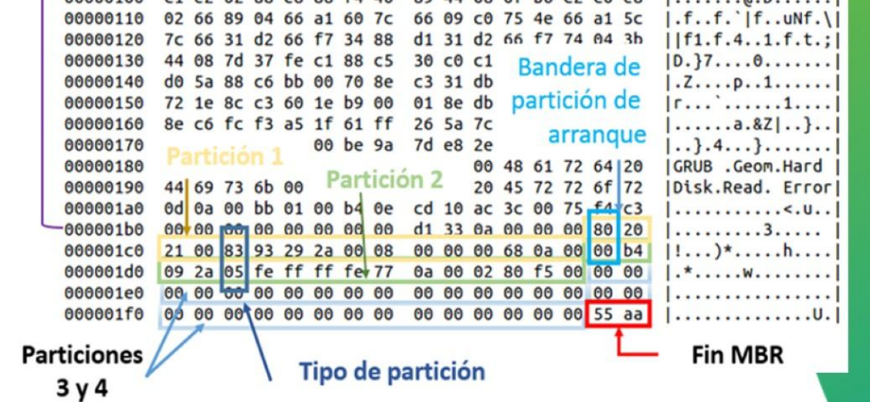
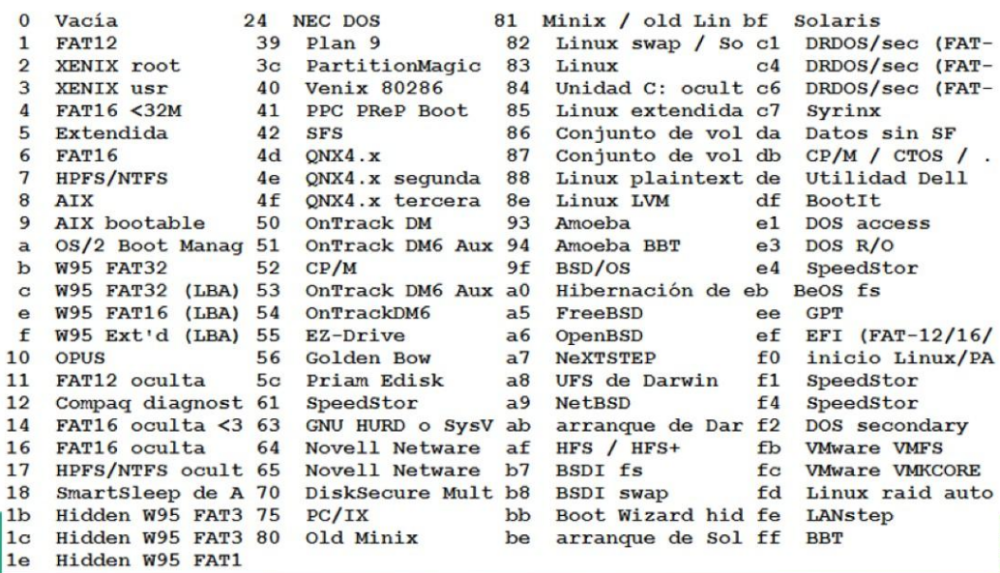

[<- Índice](../Forense.md)

# Sistema de Archivos

> Un sistema de archivos es un **modelo organizacional** de la información almacenada en un dispositivo, por ejemplo, un disco duro.

Su **principal función** consiste en determinar las reglas para que el sistema operativo pueda recuperar la información almacenada.

Los sistemas de archivos utilizan un esquema de almacenamiento jerárquico y estructuras de datos para almacenar metadatos de la esta información, independientemente del sistema operativo.
## Formato de almacenamiento de datos

Dependiendo del equipo, algunos datos pueden ser almacenados con uno de los siguientes formatos:

En ambios casos, analizaremos el valor hexadecimal *EC FE 01 11*.

#### *Big Endian*

> La información se almacena en un "orden natural", donde el *byte* más significativo se almacena en la dirección más baja

| Byte 0 | Byte 1 | Byte 2 | Byte 3 |
| ------ | ------ | ------ | ------ |
| *EC*   | *FE*   | *01*   | *11*   |

Es utilizada por procesadores como:

- Arquitecturas *IBM*
- Freescale Coldfire (*Motorola*)
- Atmel AVR32
- Open RISC

#### *Little Endian*

> El *byte* más significativo se escribe en la dirección de memoria más alta, resultando en una lectura del dato no tan natural.

| Byte 0 | Byte 1 | Byte 2 | Byte 3 |
| ------ | ------ | ------ | ------ |
| *11*   | *01*   | *FE*   | *EC*   |

Frecuente en procesadores como:

- Series x86-64 Intel x86 y AMD64
- Nios II
- Andes technology
- Qualcomm Hexagen

## Capas de un Sistema de Archivos

1. ***Fisica*** (*Fierros*)
2. ***Sistema de archivos*** (*Directorio*)
3. ***Datos*** (*Unos y ceros*)
4. ***Metadatos*** (*Datos de los datos*)
5. ***Nombre de archivo*** (*Referencias*)
6. ***Aplicación*** (*Cuotas*)

### Capa Física

#### Composición física

Se consideran los siguientes componentes de *hadware* como parte de la composición física:

- Disco
- Brazo
- Cabeza
- Motor

#### Composición lógica

Los dispositivos de almacenamiento pueden ser seleccionados o *"repartidos"* de manera lógica para organizar mejor los datos.

### Capa de sistema de archivos

> Contiene los datos generales que identifican como éste sistema de archivos es único y dónde se encuentran demás datos importantes.

En la mayoría de los casos estos datos se encuentran almacenados en una estructura de datos estándar en los primeros sectores del sistema de archivos.

> Podemos verla como un *lobby* con un mapa acerca de otras ubicaciones importantes.

#### Volumen

> Conjunto de sectores direccionables que pueden ser usados para almacenamiento de datos por un sistema operativo o aplicación. Por ejemplo, RAID

***Pueden ser sectores no consecutivos***

#### Particion

> Tipo particular de volumen, es una colección de sectores ***consecutivos*** en un volumen.

##### Esquemas de particionamiento

> Definen de que forma se almacena la información en un dispositivo.

###### *DOS* (Disk Operating System)

- Ampliamente utilizado debido a que fue el primer esquema de particionamiento.
- Solo para discos menores a 2 TB
- Define una estructura de datos en los primeros 512 *bytes* del dispositivo, recibe el nombre de *MBR* (*Master Boot Record*)
- La Estructura *MBR* se conforma de los siguientes elementos:
	- Código de arranque
	- Tabla de particiones
	- Identificador de fin de la estructura *MBR*
- La tabla de particiones únicamente puede describir 4 particiones.

###### *GPT* (GUID Partition Table)

- Ampliamente utilizado en servidores
- Para sistemas *x64*
- Utiliza estructuras de datos redundantes

En este curso nos centraremos en el aprticionado tipo **DOS**.

#### Estructura MBR

##### Código de arranque

Serie de instrucciones que define la elección de la partición a iniciar, que es donde se encuentra el sistema operativo principal.

##### Tabla de particiones

Esta tabla reserva ==16 *bytes*== para definir una partición, ==es posible especificar hasta cuatro particiones en la *MBR*==. Una de esas particiones puede ser de tipo extendida.

##### Identificador de fin de la estructura

> El valor ==*0xAA55*== expresa el final del *MBR*.

---

Cada entrada de partición tiene 16 *bytes* de longitud.

1. Primera partición -> 0x1BE o 445 *bytes*
2. Segunda partición -> 0x1CE o 462 *bytes*
3. Tercera partición: 0x1DE o 478 *bytes*
4. Cuarta partición 0x1EE o 494 *bytes*

| Offset (dec) | Longitud (bytes) | Contenido                                                                                                 |
| ------------ | ---------------- | --------------------------------------------------------------------------------------------------------- |
| **0**        | **1**            | Bandera de partición de arranque: `0x80` boot                                                             |
| **1**        | **1**            | Cabezal donde inicia la partición                                                                         |
| **2**        | **2**            | Sector y cilindro donde inicia la partición                                                               |
| **4**        | **1**            | Tipo de partición                                                                                         |
| **5**        | **1**            | Cabezal donde finaliza la partición                                                                       |
| **6**        | **2**            | Sector y cilindro donde finaliza la partición                                                             |
| **8**        | **4**            | Distancia en sectores, desde la tabla de particiones al primer sector de la partición (sector de inicio). |
| **12**       | **4**            | Número de sectores en la partición (longitud de la partición)                                             |

Esto gráficamente, en un volcado de código hexadecimal se vería así:



No hay que olvidarnos del *Endianess*, en este caso, el ejemplo esta en ***Little Endian*** de modo que lo tomemos en cuenta para ==interpretar correctamente== los datos.

Por ejemplo, antes se menciono que el valor que marca el final del *MBR* es *0xAA55* que podemos verlo representado, en ***Little Endian*** al final del volcado.

##### Tipos de particiones

> Los siguientes códigos de partición identifican un tipo específico de partición con distintos propósitos.



Es importante destacar ciertos tipos como

###### Sistemas de archivos

> Su objetivo, como el nombre dice, es almacenar un ***sistema de archivos***.

- ***Primaria***

Unicamente son configurables en el *MBR* principal de la unidad de almacenamiento.

Solo pueden existir un ==máximo de 4 particiones primarias de sistemas de archivos por unidad de almacenamiento==.

- **Secundaria**

Se encuentran asociadas a las particiones que son configuradaas en la ***partición extendida primaria***.

*"Únicamente"* existe una partición de sistemas de archivo secundaria por cada partición extendida secundaria.

###### Particiones extendidas

> La tabla de particion tiene solo cuatro entradas, las cuales no son suficientes para los sistemas actuales.

Cada partición extendida contiene su propia tabla de particiones donde se define *"solo"* una nueva partición de archivos.

- ***Primaria***

Únicamente existe una por cada unidad de almacenamiento.

Únicamente son configurables en el MBR principal de la unidad de almacenamiento.

- ***Secundaria***

Son utilizadas para almacenar únicamente una ***particion de sistemas de archivos secundaria***.

Contiene su propio *MBR* donde además de definir la partición de sistema de archivos secundaria se define una nueva ***partición extendida secundaria***.

---

Por toda esta información disponible en la **Capa de Sistema de Archivos** el análisis de ésta es requerido para todos los demás tipos de análisis del **Sistema de archivos** debido a que es durante esta fase que se encontrará la ubicación de las ==demás estructuras de datos de interés==.

Además puede mostrar información valiosa como la versión del sistema de archivos, la aplicación que creó el sistema de archivos, la fecha de creación, etiqueta del sistema de archivos y más.

Sin emargo, es importante recalcar que, en esta categoría, hay muy pocos datos que un usuario típico pueda ver o configurar sin la ==ayuda de un editor hexadecimal==.

#### Sistemas de archivos *Ext2/Ext3*

> Contiene los datos que describen la estructura del sistema de archivos como:

- **Tamaño del sector** (unidad mínima de almacenamiento)
- **Información del montaje**
- La mayoría de estos datos están en estructuras llamadas **Superbloque** o **sector de arranque**.

##### El superbloque

> Es un estructura de datos ubicada *1,024 bytes* a partir del inicio del sistema de archivos, contiene valores de configuración y existen copias del mismo en el primer bloque de cada grupo de bloques.

Entre los valores que contempla se encuentran:

- Tamaño del bloque
- Número total de bloques
- Número de bloques por grupo
- Número de bloques reservados antes del primer grupo de bloques
- Número total de i-nodos
- Número de i-nodos por grupo de bloque.

| Byte Offset | Rango   | Longitud   | Descripción                            |
| ----------- | ------- | ---------- | -------------------------------------- |
| 0           | 0-3     | 4 *bytes*  | Número total de i-nodos                |
| 4           | 4-7     | 4 *bytes*  | Número total de bloques                |
| 24          | 24-27   | 4 *bytes*  | Tamaño del bloque (o *desplazamiento*) |
| 32          | 32-35   | 4 *bytes*  | Número de bloques en cada grupo        |
| 40          | 40-43   | 4 *bytes*  | i-nodos en cada grupo                  |
| 88          | 88-89   | 2 *bytes*  | Tamaño de un i-nodo                    |
| 120         | 120-135 | 16 *bytes* | Nombre del volúmen                     |

##### Definición de Bloques

Pero espera, ¿qué es un bloque?

> Es una ==unidad básica== de almacenamiento, definido al formatear en el superbloque.

***Se conforma de varios sectores (cada uno de 512 bytes)***

El **sector** es la **unidad de tamaño más pequeña** que usa el *Ext3/4*.

##### Grupos de Bloques

> Todos los bloques son agrupados en conjuntos definidos en el superbloque.

Se puede asignar a cada grupo una dirección, comenzando con el grupo 0.

El **grupo 0** comienza inmediatamente después de los bloques reservados.

Un grupo de bloques contiene:

- Un respaldo del superbloque
- Tabla de descripción de grupos
- Mapa de bloques
- Mapa de i-nodos
- Tabla de i-nodos
- Datos de bloques

## SleuthKit

> ***SleuthKit*** contiene una utilidad que nos apoya con el análisis del **Sistema de Archivos**, `fsstat` que proviene de *File System Statistics*.

Esta herramienta muestra detalles y estadísticas del sistema de archivos incluyendo el diseño, tamaños de las unidades de almacenamiento como bloques, i-nodos, grupos y etiquetas.

Se utilizando pasandole como argumento un archivo de una imagen forense.

```bash
fsstat nombre.dd
```

# Enlaces

[<- Anterior](HFC12_11_2024.md) | [Siguiente ->](HFC14_11_2024.md)