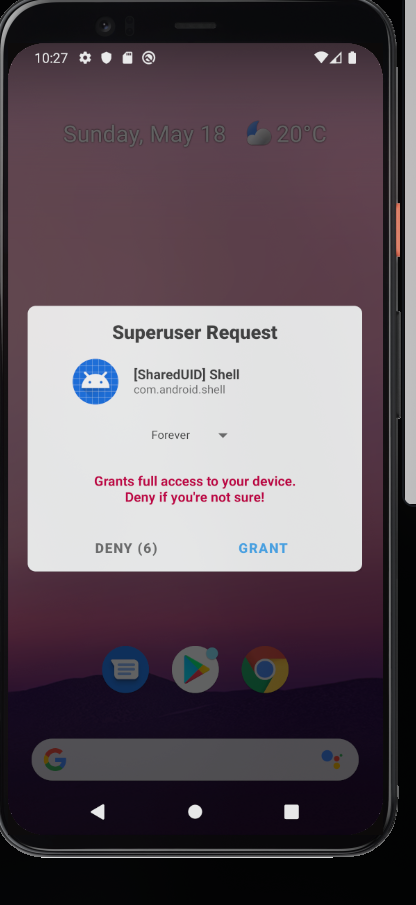
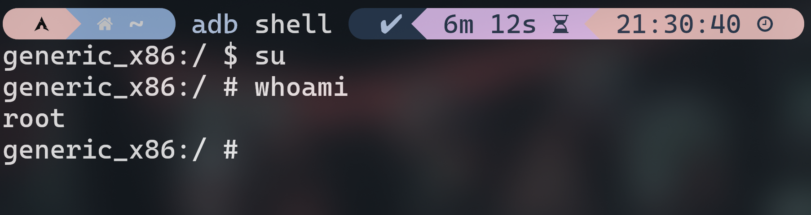
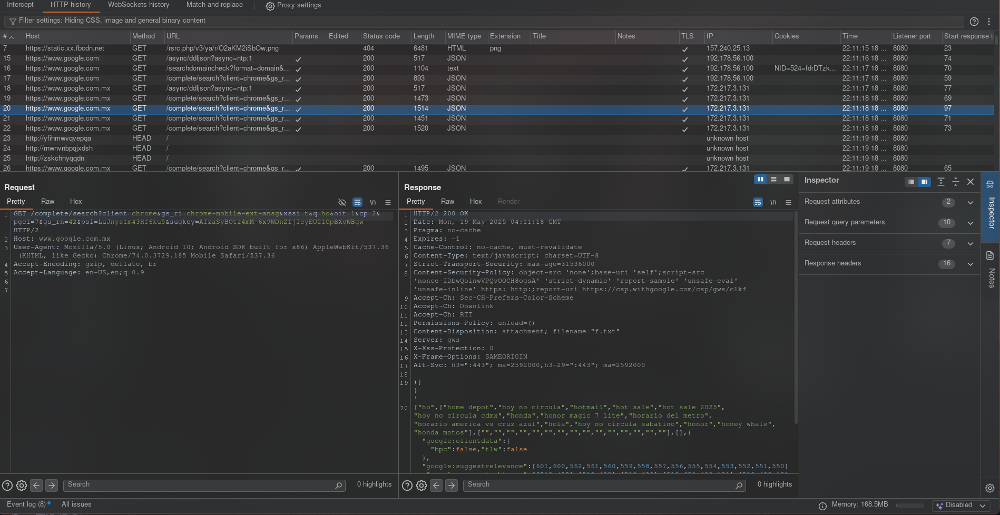
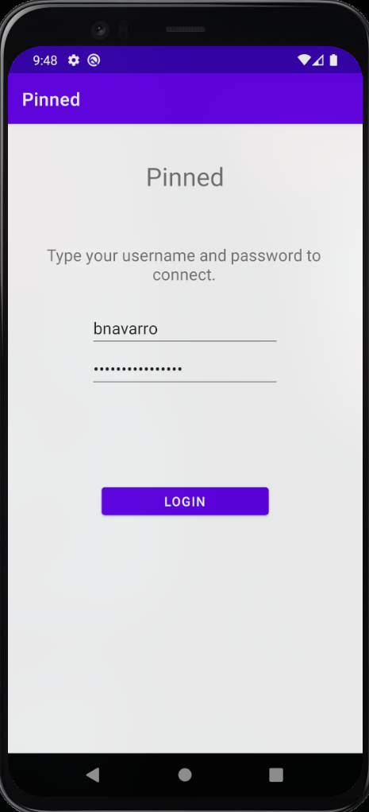
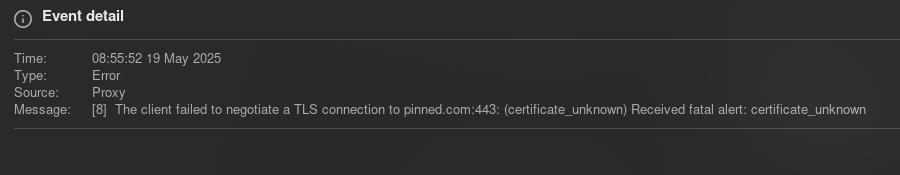
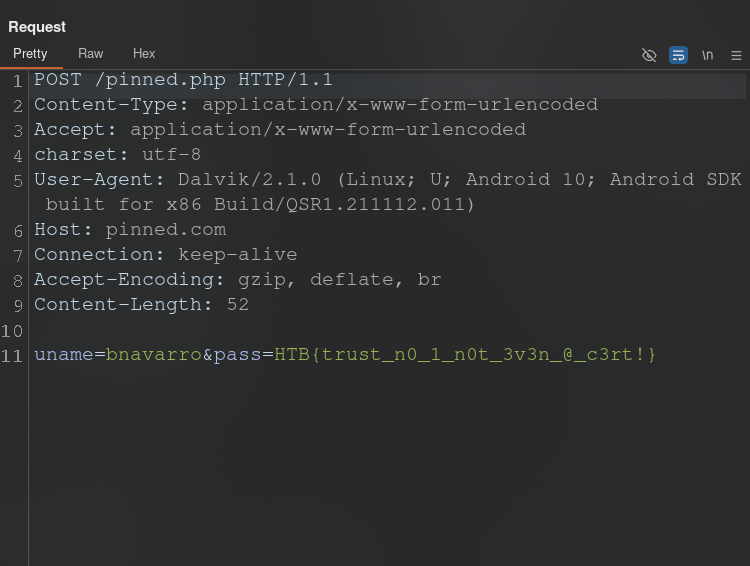

# Pentesting Android 101

## Conceptos clave

#### Android Studio

> Es el **IDE** oficial para **desarrollo Android** y como auditores de seguridad nos sirve, entre otras cosas, para:

- **Compilar maldad**: Inserción de *payloads* y creación de *apps* maliciosas.
- **Permite realizar pentest sobre aplicaciones**: Pruebas a aplicaciones vulnerables (*Flujos*, *Endpoints*, *API keys*, etc)
- **Reversing**: Permite analizar funcionalidades integradas en las apps y encontrar defectos o debilidades en su implementación.

#### Android Virtual Device

> Comunmente llamado **AVD**, es básicamente una máquina virtual o emulador de dispositivos *Android*, sirve para:

- **Ejecutar apps**: Permite instalar nuestros archivos *APK*
- **Depurar aplicaciones**

Usualmente, los dispositivos virtuales utilizan 10.0.2.1 como **Gateway** y las demas direcciones se asignan a partir de 10.0.2.3, pues la dirección 10.0.2.2 identifica a nuestra máquina *host*.

#### rootAVD

> Es un **proyecto multiplataforma** que permite rootear de manera sencilla *AVDs* utilizando determinadas *API* mediante la aplicación maliciosa **Magisk**.

#### Frida

> Es un *Framework* utilizado para depuración y *pentest* de aplicaciones móviles. Destaca principalmente por:

- **Automatización**: Cuenta con *scripts* diseñados para facilitar el análisis y explotación
- **Versatilidad**: Permite interceptar y modificar funciones en tiempo real con nuestro código.

#### `adb`

> Es una herramienta **CLI** que permite comunicarse con dispositivos *Android*, similar a *SSH* pero mediante *USB*.

## Rootear android

1. Abrir **Android Studio**
2. Abrir *Virtual Device Manager*
3. Para este ejercicio se seleccionó Pixel 4 con *Android Q* como **AVD**
4. Iniciar el **AVD** recien creado.
5. Descargar [**rootAVD**](https://gitlab.com/newbit/rootAVD)
6. Utilizar **rootAVD** para listar los **AVD** presentes en el dispositivo:

```bash
./rootAVD ListAllAVDs

# rootAVD A Script to root AVD by NewBit XDA
#
# Usage:	rootAVD [DIR/ramdisk.img] [OPTIONS] | [EXTRA ARGUMENTS]
# or:	rootAVD [ARGUMENTS]
#
# ...
#
# ./rootAVD.sh system-images/android-36/google_apis_playstore/x86_64/ramdisk.img
# ./rootAVD.sh system-images/android-36/google_apis_playstore/x86_64/ramdisk.img FAKEBOOTIMG
# ./rootAVD.sh system-images/android-36/google_apis_playstore/x86_64/ramdisk.img DEBUG PATCHFSTAB GetUSBHPmodZ
# ./rootAVD.sh system-images/android-36/google_apis_playstore/x86_64/ramdisk.img restore
# ./rootAVD.sh system-images/android-36/google_apis_playstore/x86_64/ramdisk.img InstallKernelModules
# ./rootAVD.sh system-images/android-36/google_apis_playstore/x86_64/ramdisk.img InstallPrebuiltKernelModules
# ./rootAVD.sh system-images/android-36/google_apis_playstore/x86_64/ramdisk.img InstallPrebuiltKernelModules GetUSBHPmodZ PATCHFSTAB DEBUG
# ./rootAVD.sh system-images/android-36/google_apis_playstore/x86_64/ramdisk.img AddRCscripts
```

Esta herramienta despliega por defecto el menu de ayuda indicando todas las opciones que posee y hasta el final despliega los archivos pertinentes de **AVD**s reconocidos en el equipo.

7. Utilizar **rootAVD** para insertar la aplicación **Magisk** en el **AVD**. Esto se realiza ejecutando uno de los primeros comandos ejemplo con los archivos que reconoció antes, siempre que la API sea compatible con **rootAVD**, por ejemplo:

```bash
./rootAVD.sh system-images/android-29/google_apis_playstore/x86_64/ramdisk.img

# ...
# ...
# ...
# [*] repacking back to ramdisk.img format
# [!] Rename Magisk.zip to Magisk.apk
# [*] Pull ramdiskpatched4AVD.img into ramdisk.img
# [-] 
# [*] Pull Magisk.apk into 
# [-] 
# [*] Pull Magisk.zip into .
# [-] 
# [-] Clean up the ADB working space
# [-] Install all APKs placed in the Apps folder
# [*] Trying to install Apps/Magisk.apk
# [*] Performing Streamed Install
# [*] Success
# [-] Shut-Down & Reboot (Cold Boot Now) the AVD and see if it worked
# [-] Root and Su with Magisk for Android Studio AVDs
# [-] Trying to shut down the AVD
# [!] If the AVD doesn't shut down, try it manually!
# [-] Modded by NewBit XDA - Jan. 2021
# [!] Huge Credits and big Thanks to topjohnwu, shakalaca, vvb2060 and HuskyDG
```

El **AVD** debería **apagarse** automáticamente.

8. Iniciar el **AVD** nuevamente y una vez encendido, al entrar a la nueva app **Magisk** dentro del **AVD** se nos solicitará reiniciar el dispositivo para concluir las configuraciones faltantes.

Tras este último reinicio, el dispositivo ya debería estar correctamente configurado, de modo que podemos utilizar el comando `adb`, parte del paquete **android-tools**, para establecer una conexión.

```bash
adb shell
```

9. En esta nueva interfaz de comandos, utilizamos la instrucción `su` para elevar nuestros privilegios a **root**, pero deberemos aceptar en el **AVD** la solicitud de superusuario que se genere.



FInalmente, hemos **rooteado** nuestro **AVD**.



## Burpsuite x Android

Lo primero es obtener un certificado de tu aplicación *Burpsuite*, en **Ajustes** -> **Proxy** -> **Importar/Exportar certificado CA**.

Despues subimos este certificado al dispositivo con apoyo de `adb`:

```bash
adb push ./burp.cert /sdcard/Download/.

# Downloads/burp.cer: 1 file pushed, 0 skipped. 15.3 MB/s (939 bytes in 0.000s)
```

Ahora, en el dispositivo debemos instalar este certificado en la app **Configuración** -> **Seguridad** -> **Avanzado** -> **Encryption & Credentials** -> **Install from SD Card** y seleccionamos nuestro certificado.

#### Plugin AlwaysTrustUserCerts

Por defecto, el certificado que acabamos de cargar se considera como un certificado de usuario y se le tiene menor confianza.
Por esto siempre es buena idea disponer del módulo [**Always Trust User Certs**](https://github.com/Benojir/Always-Trust-User-Certs-Magisk) para **Magisk**, que configura el dispositivo para brindar confianza completa a estos certificados.

Para esto, debemos descargar el archivo *AlwaysTrustUserCerts.zip* de la seccion *Releases* del repositorio del plugin.

Después cargamos el plugin al dispositivo con `adb` y desplegar una línea de comandos en el dispositivo.

```bash
adb push plugin.zip /sdcard/
adb shell
```

Dentro de esta *Shell*, ascendemos a **root** e instalamos el plugin con apoyo de la utilidad `magisk`:

```sh
su
magisk --install-module /sdcard/plugin.zip

# - Device is system-as-root
# ***************************************
#  Always Trust User Certificates (2024) 
#  by Benojir Sultana 
# ***************************************
# *******************
#  Powered by Magisk 
# *******************
# - Extracting module files
# - Done
```

---

Ahora, que el certificado esta configurado correctamente, debemos configurar el *proxy HTTP* del dispositivo con apoyo de `adb` de la siguiente forma:

```bash
adb shell settings put global http_proxy 10.0.2.2:8080
```

Podemos verificar que el *proxy* haya sido configurado correctamente con el siguiente comando, donde deberiamos ver la IP y puerto que acabamos de indicar:

```bash
adb shell settings get global http_proxy
```

Finalmente, nuestra aplicación **Burpsuite** ya debería poder interceptar el tráfico *HTTP* del dispositivo móvil sin ningún problema.



## SSL Pinning

> El **SSL Pinning** es una técnica de seguridad usada en aplicaciones *Android*, relacionada con los certificados *TLS/SSL* y su verificación. Básicamente, la aplicación conoce el certificado *TLS/SSL* o llave pública del servidor al que desea comunicarse de modo que al establecer la conexión verifica que sea el mismo, de lo contrario deshecha la conexión como insegura.

Por eso mismo, se considera que la aplicación tiene **fijado** el certificado del servidor, de modo que aunque el certificado sea técnicamente válido, no se establece la conexión con ningún otro servidor.

#### Unpinning

Como *pentesters* es vital que podamos contrarrestar esta técnica, anulando el **fijado** del certificado para que establezca conexiones con cualquier servidor y podamos analizar su tráfico *web*.

### Ejercicio: Pinned

La plataforma **Hack The Box** ofrece este desafío para practicar *SSL Unpinning*:

> [Pinned](https://app.hackthebox.com/challenges/Pinned)

El **objetivo** en este desafio es simplemente recuperar la contraseña de una aplicación Android **Pinned**.

El desafio nos brinda un archivo comprimido *Pinned.zip* protegido con contraseña, la cual es *hackthebox*, y que al descomprimir obtenemos un archivo *pinned.apk* e instrucciones de cual *API Android* es compatible con esta aplicación.

El **AVD** instalado en esta sesión ya es compatible con esta *App*, además para la primera parte del desafío hanriamos tenido que *rootear* el dispositivo y configurar *Burpsuite* para analizar su tráfico de red, cosa que ya hicimos en este **AVD**.

Entonces podemos continuar directamente a instalar el *APK* provisto, utilizando `adb` de la siguiente forma:

```bash
adb install ./pinned.apk
```

Ahora, deberiamos poder ver la aplicación **Pinned** en el **AVD** e interactuar con ella.
Al entrar deberíamos ver este *login*:



Podemos notar que tiene las credenciales cargadas por defecto, pero no hay forma de visualizar libremente la contraseña, ni de copiarla.

Una primera idea, bien podría ser capturar la petición *HTTP* creada al presionar **LOGIN**, pero al intentarlo, no solo no se refleja ninguna petición, además notaremos la aparición de errores en el *log* de Eventos de **Burpsuite** que indican lo siguiente:



Podemos ver que la aplicación **Pinned** rechazó la conexión con el *Proxy*, ya que se trata de un **certificado desconocido**.
Claramente, se trata del **SSL Pinning** haciendo su función, pues el certificado de *Burpsuite* no coincide con el que la aplicación espera.

Primero tendremos que **desfijar** el certificado cargado en la aplicación y para eso utilizaremos el *Framework* de **Frida**.

##### Carga de `frida-server`

Lo primero es ir a la sección de *Releases* en la página del repositorio oficial de [Frida](https://github.com/frida/frida/releases), navegaremos a una versión compatible con el dispositivo, en mi caso utilicé la **16.7.18**, y descargamos el comprimido correspondiente a la herramienta **frida-server** para la arquitectura **Android x86** que deberia estar nombrado algo similar a: `frida-server-16.7.18-android-x86.xz`.

Podemos descomprimir este archivo con el comando:

```bash
xz -d frida-server-16.7.18-android-x86.xz
```

Y obtendremos un binario ejecutable con el mismo nombre, que debemos introducir en el **AVD** a la ruta `/data/local/tmp`. Esto se realiza facilmente con la ayuda de `adb`, así:

```bash
adb push ./frida-server-16.7.18-android-x86 /data/local/tmp/.
```

Despues, desplegamos la *shell* en el **AVD** con `adb shell` y dentro de esta, como **root**, debemos darle permisos de ejecución al binario y ejecutarlo en segundo plano. Esto se realiza con estos comandos:

```sh
su
chmod +x /data/local/tmp/frida-server-16.7.18-android-x86
/data/local/tmp/.frida-server-16.7.18-android-x86 &

# [1] 9581
```

En otra terminal de nuestra maquina local, podemos verificar que efectivamente se esta ejecutando con el siguiente comando, y deberiamos ver el proceso de frida-server con el *PID* que se nos brindó antes:

```bash
frida-ps -U

# ...
# 9581  frida-server-16.7.18-android-x86
# ...
```

##### Unpinning con Script

Ya configurado el servidor, debemos buscar un buen *script* para **frida**, en *Javascript*, que realice este *Unpinning* por nosotros.

Para el ejercicio, utilice [este](https://codeshare.frida.re/@pcipolloni/universal-android-ssl-pinning-bypass-with-frida/) *script*. Primero, descargue el *script* como `ssl-unpin.js`.

Si analizamos el código, notaremos que quiere disponer de un certificado `cert-der.crt` que este ubicado en `/data/local/tmp`, para hacer que la aplicación reconozca y confie en dicho certificado.

Como pretendemos interceptar la comunicación con nuestro *proxy*, utilizaremos el certificado de **Burpsuite** que descargamos antes, y le daremos los permisos adecuados para que **frida** pueda leerlos, de modo que debemos ejecutar lo siguiente dentro de `adb shell`:

```sh
cp /sdcard/Download/burp.cert /data/local/tmp/cert-der.crt
chmod 666 /data/local/tmp/cert-der.crt
```

Posteriormente, en nuestra maquina local, identificamos el *PID* de la aplicación con apoyo de `frida-ps`:

```bash
frida-ps -U 

# ...
# 9257  Pinned
# ...
```

Y finalmente, activamos el *script* en la aplicación **Pinned** del **AVD** con el siguiente comando:

```bash
frida -U -p 9257 -l ssl-unpin.js

#      ____
#     / _  |   Frida 16.7.7
#    | (_| |
#     > _  |   Commands:
#    /_/ |_|       help      -> Displays the help system
#    . . . .       object?   -> Display information about 'object'
#    . . . .       exit/quit -> Exit
#    . . . .
#    . . . .   More info at https://frida.re/docs/home/
#    . . . .
#    . . . .   Connected to Android Emulator 5554 (id=emulator-5554)
# Attaching...                                                            
# 
# [.] Cert Pinning Bypass/Re-Pinning
# [+] Loading our CA...
# [o] Our CA Info: CN=PortSwigger CA, OU=PortSwigger CA, O=PortSwigger, L=PortSwigger, ST=PortSwigger, C=PortSwigger
# [+] Creating a KeyStore for our CA...
# [+] Creating a TrustManager that trusts the CA in our KeyStore...
# [+] Our TrustManager is ready...
# [+] Hijacking SSLContext methods now...
# [-] Waiting for the app to invoke SSLContext.init()...
# [Android Emulator 5554::PID::9257 ]-> [o] App invoked javax.net.ssl.SSLContext.init...
# [+] SSLContext initialized with our custom TrustManager!
```

Hemos realizado correctamente **SSL Unpinning** sobre la aplicación, de modo que la siguiente vez que iniciemos sesión en la aplicación, si veremos reflejada la petición en nuestro *Proxy* y podremos ver claramente la contraseña, resolviendo así el reto.

