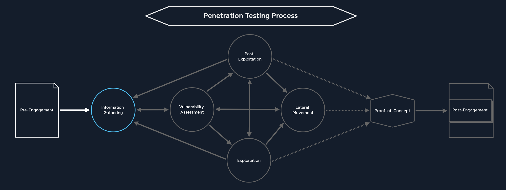

[<- Índice](../Pentesting.md)
# Introducción y Conceptos Importantes

### ¿Qué es un hacker?

El término *"hacker"* nació en la segunda mitad del siglo *XX* y su origen está ligado con los clubs y laboratorios del **Instituto Tecnológico de Massachusetts**.

> El término *hack* hacía referencia a bromas inocentes que se hacían entre ellos los miembros del **Laboratorio de Inteligencia Artificial del MIT** por lo cual fueron los primeros en autodenominarse *"hackers"*.

Desde entonces se afianzo la definición como una comunidad de entusiastas programadores y diseñadores de sistemas.

Sin embargo, la definición ha evolucionado a lo largo de los años, brindando incluso distinas definiciones:

- Una persona que practica la programación informática, como una especie de pasión artística.
- Persona experta en el manejo de computadoras, que se ocupa de la seguridad de los sistemas y de desarrollar técnicas de mejora.
- Individuo que accede ilegalmente a sistemas informáticos ajenos para apropiarselos u obtener información secreta.

## Ética hacker

1. **El acceso a las computadoras y cualquier cosa que pueda enseñar algo acerca de la forma en que funciona el mundo debería ser ilimitado y total**. Este acceso ayuda a la expansión de la tecnología

2. **Toda la información debe ser libre**. Un sistema abierto con libre intercambio de información permite una mayor creatividad en general.

3. **Desconfía en la autoridad, promueve la descentralización**. Los hackers creen que las burocracias son sistemas defectuosos.

4. **Los hackers deben ser juzgados por su capacidad, no por criterios como titulos, edad, etnia, sexo o posición**. La ética *hacker* es un sistema meritocrático.

5. **Puedes crear arte y belleza en un ordenador**

6. **Las computadoras pueden cambiar tu vida para mejor**

## Actitud hacker

1. **El mundo está lleno de problemas fascinantes que esperan ser resueltos**

2. **Ningún problema tendría que resolverse 2 veces**. Cada vez que resuelvas un problema, compartelo con la comunidad.

3. **El aburrimiento y el trabajo rutinario son perniciosos**. Ninguna persona debería hacer un trabajo para el que no está motivado.

4. **La libertad es buena**

5. **La actitud no es sustituto para la competencia**. Un hacker siempre debe estar dispuesto a afinar sus habilidades y competencias.

---
## Conceptos importantes

- **Perimetro**: Todo aquello que esta destinado a proteger aquello que esta aislado, como infromación, recursos, etc.

- **Información**: Es un conjunto de datos organizados con un significado.

- **Privilegio**: En este contexto, es la capacidad de acceder a ciertos datos "restringidos".

- **Información privilegiada**: Información que solo debe ser accedida personas con el privilegio adecuado.

### Las 3 propiedades de la información (CIA)

#### Confidencialidad
Propiedad de la información de mantenerse oculta o restringida ante entes sin los privilegios adecuados.

#### Integridad
Propiedad de la información de mantenerse inalterable.

#### Disponibilidad o Accesibilidad
Capacidad de la información de ser consultada en cualquier momento que la requiera alguién con la autorización adecuada.

### Triple A (AAA)

- **Autentificación**
- **Autorización**: Por eje,plo los permisos de *Linux*
- **Registro**: Llevar un registro o historial de las acciones en el ordenador

---
## Definición de prueba de penetración

> Es el acto de evaluar la seguridad de un "sistema", organización o ente.

Debe ser:
- Organizado
- Dirigido
- Autorizado

> Sus objetivos son **identificar**, **evaluar** y **reportar** vulnerabilidades en un sistema.

### Entornos de prueba

- Físico
- Ingeniería Social (Entiendase abusar o aprovecharse de los descuidos de una persona)
- IoT
- Red
- Aplicaciones móviles
- Aplicaciones *web*

## Tipos de pruebas de penetración

> La clasificación de una prueba de penetración puede darse según 2 métricas importantes:

#### Según el entorno

***Externa***: 

- Es una prueba de penetración simulando que eres una persona ajena al sistema, sin acceso.
- No se considera que haya activos previamente comprometidos (No se ha hackeado nada)
- Se debe evaluar el perímetro y priorizar el ==sigilo==.

***Interna***:

- En este tipo de pruebas se simula que eres una persona interna al sistema con intenciones maliciosas.
- Posees acceso e información útil sobre el sistema.
- Se suponen atravesadas las defensas perimetrales.

#### Según el conocimiento que poseemos

Otra clasificación de las pruebas de penetración según la información que poseemos sobre el entorno:

***Caja negra***: En este tipo de pruebas se carece de información sobre la organización, recursos o disposición del sistema. Se relaciona con las pruebas de penetración externas.

***Caja blanca***: En este tipo de pruebas se cuenta con total información acerca del sistema, la red, se tiene acceso al intranet y se han superado las defensas perimetrales.

***Caja gris****: Es un punto en medio entre los 2 ejemplos anteriores, donde nos brindan un "punto de inicio" de conocimiento acerca del sistema.

## Implicaciones legales!

> Cualquier violación no autorizada de un perimetro tiene como consecuencia directa ==la carcel==.

---
## Fases del *Pentesting*

> A continuación, daremos una breve descripción de las fases que componen todo el procedimiento de un *Pentesting*.

1. Precompromiso

2. Reconocimiento
3. Evaluación
4. Explotación
5. Post-explotación
6. Movimiento lateral
7. Prueba de concepto (*PoC*)

8. Post-compromiso

### Pre-compromiso

> Consiste en establecer los objetivos, alcance, limitaciones y cualquier acuerdo respecto a la **prueba de penetración**, además de documentarlos adecuadamente.

En esta etapa, se firman acuerdos y contratos legales además de intercambiarse información relevante a la **prueba de penetración**, dependiendo del tipo de prueba.

- Acuerdos legales y delimitaciones
- RoE (*Rules of Engagement*)

Como se puede ver en el diagrama, de esta etapa seguimos directamente al ***Reconocimiento***.

### Reconocimiento

> Sin duda una ==***parte esencial***== de cualquier prueba de penetración, consiste en recopilar toda la información disponible de la organización, los equipos y cualquier fuente de información en el alcance de la prueba.

Es tan importante por el conocimiento y entendimiento que obtenemos de la organización, así como de los equipos permitiendonos plantear posibles vectores de ataque sobre este.

En esta fase, es crítico saber extraer e interpretar toda la información disponible, además de identificar toda aquella útil para el objetivo de nuestra prueba.

> La **información** que extraigamos en esta fase muchas veces es crítica durante la fase de explotación y los resultados obtenidos en esta.
   Por eso es importante tener tiempo, paciencia y dedicación en esta fase pues muchas veces marca la diferencia entre el éxito y el desperdicio de recursos y tiempo.

- Reconocimiento pasivo (*OhSint*)
- Reconocimiento activo

Como indica el diagrama, desde esta etapa continuamos directamente a la ***Evaluación de vulnerabilidades***, aunque muchas veces sea necesario *"revisitar"* la fase de reconocimiento según sea necesario.

### Evaluación de Vulnerabilidades

> La **evaluación de vulnerabilidades** se divide principalmente en 2 áreas. Por una parte, se realiza un escaneo de vulnerabilidades ya conocidas, usualmente con herramientas automatizadas. Por otra, se realiza un análisis manual de vulnerabilidades no reconocidas y potenciales según la información reunida previamente.

Este último análisis consiste principalmente de *"pensar fuera de la caja"*, intentado descubrir debilidades y oportunidades de aprovechar el sistema de formas no convencionales o esperadas.

De nuevo, el **reconocimiento** juega un papel importante, pues entre más conozcamos del funcionamiento, más fácil es que hallemos una debilidad que aprovechar.

Desde esta fase, podemos revisitar el ***Reconocimiento*** de ser necesario, proceder a la ***Explotación*** o continuar en procesos de ***Post-Explotación*** y ***Movimiento lateral*** en caso de ya encontrarnos en dichas situaciones.

### Explotación

> La **explotación** consiste en la realización de un ataque hacia el sistema, aplicación o recurso basandonos en una vulnerabilidad previamente descubierta y analizada en anteriores etapas.

En esta fase, se realiza un ataque al equipo con un objetivo en mente, ya sea obtener información privilegiada, ejecución de comandos, autorización, etc.

Es una fase muy abstracta pues hay diversas tecnologías, formas de explotar, además de muchisimos objetivos o resultados.

De esta fase, podemos revisitar el ***Reconocimiento*** desde el nuevo estado o información obtenida de la explotación, podemos continuar a la ***Post-Explotación***, podemos continuar al ***Movimiento Lateral*** o concluir la prueba al avanzar a la ***Prueba de Concepto***, usualmente al obtener el máximo privilegio posible en la organización.

### Post-Explotación

> Una vez explotado el sistema, podemos encontrarnos en una posición donde somos capaces de interactuar de forma más avanzada con el sistema e incrementar nuestro control sobre este. Esto se conoce como **Post-explotación**.

Por ejemplo, al conseguir acceso remoto a un servidor, probablemente querramos escalar de privilegios.

Esta fase, de nuevo puede resultar un poco abstracta pues depende directamente de la explotación, pero se refiere a las acciones que tomamos una vez comprometido un sistema **sobre el mismo**.

Desde aqui, podemos una vez más retroceder al ***Reconocimiento*** desde la nueva posición privilegiada en la que nos encontramos, podemos optar por el ***Movimiento Lateral***, podemos revisitar la ***Explotación*** en caso de encontrar nuevas vulnerabilidades que nos permitan seguir escalando en el sistema o podemos concluir la prueba avanzando a la ***Prueba de Concepto***.

### Movimiento Lateral

> El **Movimiento Lateral** es un componente esencial durante una **prueba de penetración** pues consiste en enumerar e interactuar con los demás equipos en la red, una vez que comprometimos el equipo inicial.

Puede ser que encontremos información más valiosa en otro equipo o que podamos utilizar algún equipo privilegiado a nuestro favor.

Es una alternativa independiente a la **Post-Explotación** pues al movernos por la red, no conservaremos los privilegios obtenidos en el equipo inicial, teniendo que repetir este proceso en el nuevo equipo.

De aqui, podemos revisitar el ***Reconocimiento*** y la ***Evaluación de Vulnerabilidades*** desde nuestro nuevo punto de vista o concluir la prueba avanzando a la ***Prueba de Concepto***.

### Prueba de concepto (PoC)

> La **Prueba de Concepto** se realiza una vez hemos revisado exhaustivamente los recursos dispuestos para la **prueba de penetración** y no es más que un escrito que describe las vulnerabilidades halladas además del procedimiento seguido para explotarlas, probando que es posible la reproducción de la explotación siguiendo estos pasos.

Puede tratarse desde una simple lista de pasos hasta un código o *script* que reproduzca automáticamente la explotación.

Es importante, pues busca concientizar al cliente de la prueba sobre el impacto de los hallazgos además de motivarlo a remediarlos de ser posible y necesario.

Desde esta etapa, continuamos directamente al ***Post-Compromiso*** para concluir legal y formalmente la prueba.

### Post-compromiso

> El **Post-Compromiso** consiste de limpiar todos los sistemas y recursos comprometidos de cualquier procedimiento llevado a cabo durante la prueba, por ejemplo la creación de cuentas, *backdoors*, *web shells*, etc con el objetivo de devolver la organización a su estado original.

Adicionalmente, debemos reportar todas las explotaciones realizadas, credenciales obtenidas y archivos creados al cliente de modo que puedan indentificar nuestras acciones como parte de la prueba y no como un ataque real.

Durante todo el transcurso de la prueba, se debio haber documentado todos los procedimientos realizados de manera ordenada y con sus correspondientes pruebas de modo que podamos presentarlo al cliente en un reporte profesional.

Usualmente se realizan 2 tipos de reporte, un **reporte ejecutivo** y un **reporte técnico**.
El **ejecutivo** busca ser presentando con los ejecutivos correspondientes de la empresa y busca explicarles de forma clara, concisa y breve los hallazgos de la prueba y el impacto para la empresa.
Mientras que el **técnico**, busca relatar a lujo de detalles toda la prueba para que el departamento correspondiente de **seguridad** pueda remediar adecuadamente los hallazgos y entender como se descubrieron.

# Enlaces

[Siguiente ->](Precompromiso.md)