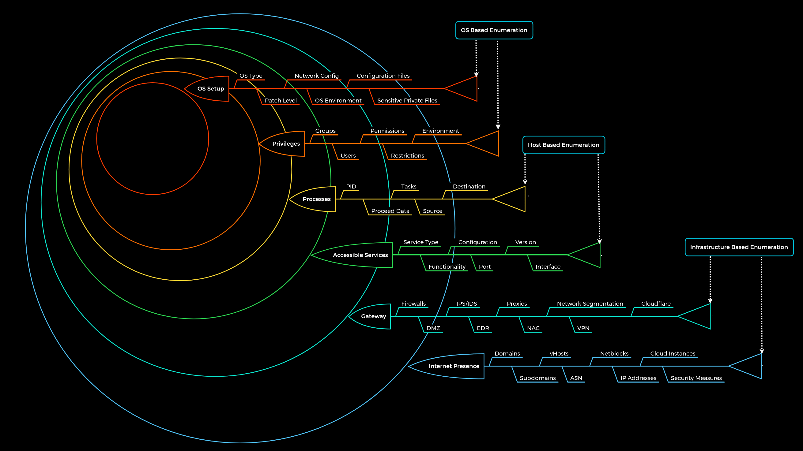
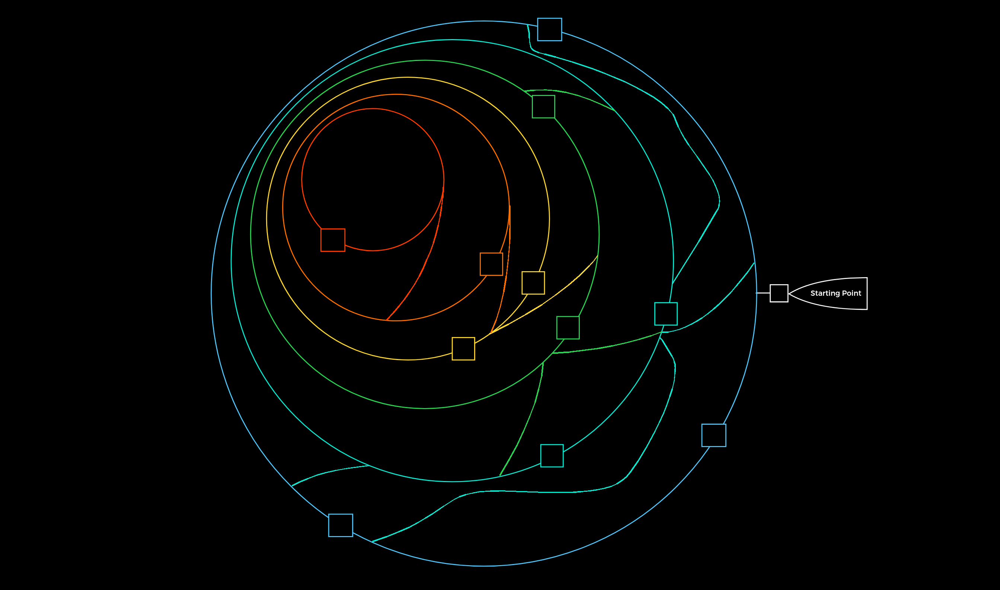

[<- Índice](../Pentesting.md)
# Principios de Enumeración

> La ***Enumeración*** se refiere a la recolección de información utilizando tecnicas tanto activas (**escaneos**) como pasivas (**a partir de terceros**). La ***información*** puede obtenerse a partir de dominios, direcciones *IP*, servicios accesibles, etc.

Es importante mencionar que *OSINT* se considera una técnica independiente que se basa exclusivamente en técnicas pasivas de recolección de información a partir de fuentes **públicas** de información.

Una vez que identificamos la infraestructura del cliente, necesitamos examinar individualmente cada dispositivo, servicio, protocolo y servicio, pues en la mayoría de los casos, nos brindan información acerca de la comunicación, administración y demás recursos del cliente.

> *"Nuestro objetivo no es acceder al sistema, si no identificar todas las posibles maneras de hacerlo"*

Si carecemos de la información necesaria acerca del cliente, los ataques que podamos realizar sobre este son una probable perdida de tiempo, energía y esfuerzos, además de que incluso podemos causar daños en la infraestructura de ignorar las consecuencias de nuestras acciones.

Los principios de enumeración se basan en unas preguntas que facilitan el enfoque de la exploración y su repetición.
Por supuesto, es importante considerar todo lo que podemos ver y con lo que podemos interactuar pero tampoco debemos perder de vista aquello que no vemos.
Nuestro objetivo, por ende, es empezar a ver aquellos aspectos, componentes y funcionalidades que no se notan a primera vista.

***Preguntas***:

- ¿Que podemos ver?
- ¿Por que podemos verlo? Que objetivo tiene?
- ¿Cómo lo podemos usar?
- **¿Que no podemos ver?**
- **¿Porqué no podemos verlo?¿Que buscan al ocultarlo?**
- **¿Como se relaciona con lo que sabemos?**

Como en todo, existen excepciones, a estas preguntas y su utilidad, pero los principios no cambian sin importar la situación.

#### Principios

1. Hay mas de lo que se percibe de primeras. Considera todos los puntos de vista.
2. Distingue entre lo que puedes ver y lo que no.
3. Siempre hay más maneras de obtener información. Comprende al objetivo.

# Metodología

Los procesos complejos requieren de metodologías precisas para ayudarnos a mantener los aspectos importantes y evitar omitir o perdernos de alguna parte del proceso.
Especialmente bajo la variedad de casos que representa una enumeración tan compleja como la de una infraestructura completa.

> Sin embargo, ==no existe una receta mágica de reconocimiento== que se siga al momento de realizar una enumeración, si no que se sigue la lógica que hayamos desarrollado a través de la eperiencia, la práctica y el estudio. Por supuesto, podemos plantear una metodología con una serie de fases importantes que no podemos imitir durante cualquier enumeración.

Una ***Prueba de Penetración***, y por tanto la **enumeración**, es un proceso dinámico, por lo que requiere flexibilidad y adaptabilidad a todos los ambientes a los que nos enfrentemos.

Entonces, ésta metodología se divide en 6 capas y se representa, metafóricamente hablando, como una serie de fronteras que deseamos superar.
Estas 6 capas se dividen principalmente en 3 niveles:

- ***Enumeración de Infraestructura***
- ***Enumeración de Dispositivo***
- ***Enumeración de Sistema Operativo***

Resumidamente, las capas se definen de la siguiente manera:

| Capa                                      | Descripción                                                                                                                  | Tipo de información                                                                                                           |
| ----------------------------------------- | ---------------------------------------------------------------------------------------------------------------------------- | ----------------------------------------------------------------------------------------------------------------------------- |
| ***Presencia en Internet***               | Se identifica la infraestructura presente y accesible desde el *Internet*.                                                   | Nombres de dominio, *Hosts virtuales*, Direcciones *IP*, Instancias en la Nube, Medidas de seguridad.                         |
| ***Perímetro y acceso***                  | Buscamos identificar los controles de seguridad que protegen el **perímetro** y el **acesso** de la infraestructura interna. | *Firewall*, *DMZ*, *IPS/IDS*, *EDR*, *Proxies*, Segmentaciones de red, *VPN*, *Cloudflare*                                    |
| ***Servicios accesibles***                | Identificamos todas las interfaces y servicios accesibles de los dispositivos identificados externa e internamente.          | Tipo de servicio, Protocolo, Puerto, Versión, Funcionalidad, Configuración.                                                   |
| ***Procesos***                            | Se identifica los procesos internos, y las relaciones entre dispositivos, servicios y demás interacciones.                   | *PID*, Información procesada, Tareas, etc.                                                                                    |
| ***Privilegios***                         | Identificamos los permisos asignados a recursos accesibles y a recursos internos.                                            | Grupos, Usuarios, Permisos, Restricciones                                                                                     |
| ***Configuración del Sistema Operativo*** | Se identifican los componentes internos del sistema operativo y su configuración.                                            | Tipo de Sistema Operativo, Parches de seguridad, Configuración de red, Archivos de configuración, archivos privados sensibles |

Volviendo a la metáfora, podemos pensarlo como un laberinto con distintos puntos de acceso (vulnerabilidades) que podemos aprovechar para ir atravesando cada pared.

## *Enumeración de Infraestructura*
### Capa 1: Presencia en Internet

> Durante la primera capa buscamos encontrar todos aquellos dispositivos que podemos alcanzar desde *Internet* y podemos investigar, pero siempre apegados al **alcance** de la prueba.

En esta fase, utilizamos distintas técnicas para enumerar nombres de dominio, subdominios, bloques de red y distintos componentes e información relevante disponibles en la red.

La **meta** es identificar todos los posibles objetivos e interfaces que tenemos autorizado poner a prueba.

### Capa 2. Perímetro y acceso

> En esta fase, intentamos identificar el perímetro del cliente, dispositivos y sus controles de defensa para hacernos una idea de la infraestructura de su red.o

La **meta** es intentar identificar **todo** el panorama de la infraestructura y contra que medidas de seguridad estamos trabajando.

## *Enumeración de Dispositivo*
### Capa 3. Servicios accesibles

> En este caso, examinamos los servicios activos individualmente por cada dispositivo. Estos tienen un propósito para la organización, además de las funciones que le permiten cumplir con dicho propósito.

Para extraer correctamente la información de estos servicios, tenemos que saber como funcionan y como podemos interactuar con ellos y estudiarlos de ser necesario.

Esta ocasión, la **meta** es entender el **propósito** y **funcionalidad** de los servicios en cada dispositivo, además de obtener el conocimiento necesario para comunicarnos con ellos y posiblemente explotarlos.

### Capa 4. Procesos

Cada vez que un comando o función es ejecutado, existe información que es procesada ya sea provista por el usuario o el sistema. Esto inicia un **proceso** en el dispositivo con el objetivo de ejecutar una tarea específica, que tiene un origen y un propósito.

> Entonces, la **meta** es entender los procesos presentes en el dispositivos y cualquier relación que exista entre ellos y entre lo que ya sabemos.

## *Enumeración de Sistema Operativo*

### Capa 5. Privilegios

Cada servicio es ejecutado bajo un **usuario** específico en un grupo particular con los permisos definidos por el administrador del sistema.

Lo ideal es que tengan los privilegios justos y necesarios para la funcionalidad del servicio, pero cualquier mala configuración puede resultar en una brecha de seguridad que podemos aprovechar a nuestro favor.

> La **meta** en esta fase es identificar los privilegios, usuarios y grupos asignados en el sistema y cualquier vulnerabilidad en estos.

### Capa 6. Configuración del Sistema Operativo

> En esta fase, recolectamos toda la información dispoible del sistema operativo y sus configuraciones para obtener una vista general del estado de seguridad del sistema e identificar cualquier brecha.

La **meta** es identificar como los administradores gestionan sus sistemas y que información sensible podemos obtener a partir de estos.

---

Recordemos que esta metodología ***no*** es una guia paso a paso, sino un resúmen de las etapas importantes y sístematicas que deberia seguir una **enumeración**.

Precisamente, esta pensada para ser dinámica, adaptable y versátil.

# Enlaces