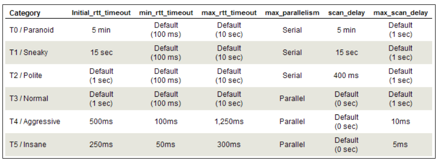

[<- Índice](../Pentesting.md)
# Ritmo y Optimización

## Grupos de Objetivos

> Aunque un poco fuera del alcance de estas notas, cabe mencionar que cuando *Nmap* lidia con escaneos de varios objetivos, ***agrupa*** a los objetivos de modo que pueda realizar escaneos en **paralelo**.

Por ejemplo, para 1000 objetivos podriamos agruparlos en grupos de 200 de modo que escaneemos esos 200 a la vez y solo repitamos ese proceso 5 veces.
Claro que es más fácil de decir que hacer, pero eso ya será trabajo de *Nmap*.

*Nmap* regula automáticamente el tamaño de los grupos conforme a las condiciones de la red, pero podemos acotarlo con **tamaños máximos y mínimos de grupo**.

Esto se realiza con las banderas `--min-hostgroup` y/o `--max-hostgroup` seguidos del número de hosts.

```bash
time nmap 192.168.90.1-100
# ... 35.140 total

time nmap 192.168.90.1-100 --min-hostgroup 50
# ... 12.809 total
```

Por supuesto que entre más grandes sean los grupos, más veloz se ejecutará el escaneo, la única **desventaja** es que solo se reportan los resultados hasta que se **completan** los escaneos del **grupo completo**.
Entonces si deseas retroalimentación continua del comando tal vez no sea la mejor idea fijar grupos mínimos enormes.

## Ritmo

> Igualmente que los grupos, ==*Nmap* se encarga por si solo de fijar las variables referentes a tiempo y optimización más adecuadas== según la condición de la red desde la que escanea y del objetivo en cuestión. Por ***variables de tiempo***, me refiero a ajustes como: *Tiempo de espera entre el escaneo de cada puerto*, *Paralelismo*, *Tamaño de grupos por escanear*, *Número de paquetes enviados por segundo*, etc.

Sin embargo, esta herramienta nos ofrece ***múltiples*** banderas avanzadas para personalizar este tipo de variables. Planeo escribir únicamente de las más entendibles pero antes debo mencionar que, para facilidad nuestra, *Nmap* ofrece una manera sencilla de indicar una ***plantilla de ritmo*** que orienta la velocidad y agresevidad del escaneo de una manera más sencilla, ajustando automáticamente el resto de variables según el **nivel** especificado.

### Plantillas de Ritmo

Mediante la bandera `-T`, podemos indicarle a *Nmap* el nivel de ***ritmo*** que deseamos entre 0 y 5, indicandolo inmediatamente después de la bandera. Estos niveles del ritmo más bajo al ritmo más alto tambien se denominan:

- `-T0`: ***Paranoid***
- `-T1`: ***Sneaky***
- `-T2`: ***Polite***
- `-T3`: ***Normal*** (Es el *ritmo* por defecto de la herramienta)
- `-T4`: ***Agressive***
- `-T5`: ***Insane***

Estos nombres nos dan una **buena idea** de la intensidad del escaneo que ajustan, por detrás simplemente están ajustando las siguientes variables de esta manera:



Ejecutando algunas pruebas con el comando `time`:

```bash
time nmap -T2 192.168.90.1
# ... 6:53.52 total
# Casi 7 minutotes!

time nmap -T4 192.168.90.1
# ... 5.340 total
```

Ya visto esto, ahondemos en algunas ==opciones que vale la pena conocer==.
Muchas de estas suelen recibir parametros de tiempo, de no indicarse la unidad se asume por defecto que son segundos (`s`), pero podemos especificar milisegundos (`ms`), minutos (`m`) e incluso `h` para horas si lo requerimos.

También no hay que olvidar que *Nmap* ajusta ***dinámicamente*** estas opciones por lo que se suelen manejar ***máximos*** y ***mínimos*** en lugar de especificar un **valor específico**.

Igualmente recordar que las opciones siguientes son para personas especialistas que saben lo que hacen, si no tienes idea de que ajustes estás dando podrías estropear tu mismo el escaneo por lo que si es así, te recomiendo quedarte con las tan útiles **plantillas de ritmo**.

#### Opciones detalladas

##### `rtt-timeout`

> Hace referencia al ==tiempo que espera *Nmap* una respuesta de los paquetes que envía, antes de verse obligado a retransmitirlos o incluso de darse por vencido== definitivamente.

Podemos especificar un *timeout* **inicial** asi como sus límite **máximo** y **mínimo**.

Por supuesto, gestionar adecuadamente el *timeout* **máximo** y el **inicial** resultan en una gran optimización para el escaneo, aun así se corre el riesgo de que los paquetes respuesta no lleguen en tiempo y *Nmap* se vea forzado a retransmitir mientras estos aun están en tránsito, menguando la eficiencia del análisis. 

```bash
time nmap scanme.nmap.org
# ... 8.510 total

nmap --initial-rtt-timeout 500ms --max-rtt-timeout 1 scanme.nmap.org
# ... 5.097 total
```

##### `parallelism`

> Hace referencia al ***paralelismo entre los puertos de un objetivo***, es decir, que tantos paquetes se **envían a la vez** a **distintos puertos** de un **mismo objetivo**.

*Nmap* permite ajustar el límite **máximo** y **mínimo** de este tipo de paralelismo.

Ajustar el **mínimo** permite aumentar la rápidez del escaneo en redes *"lentas"* aunque se corre el reisgo de perder la precisión del escaneo.
Por otra parte ajustar el **máximo** permite tener un escaneo más controlado y sigiloso a costa de hacerlo más lento.

```bash
time nmap 192.168.90.1
# ... 1.539 total

nmap --min-parallelism 100 192.168.90.1
# ... 1.343 total

nmap --max-parallelism 1 192.168.90.1
# ... 6.459 total
```

##### `scan-delay`

> Hace referencia al  ==tiempo que se espera entre **rondas de paquetes enviados**==.

En este caso podemos fijar un valor específico para este **retraso de tiempo** o podemos brindarle un **límite máximo** para que *Nmap* realice los ajustes por su cuenta sin exceder ese límite.

Fijar un **valor específico** puede ayudarnos a controlar el ritmo del escaneo para que sea más lento y sigiloso, mientras que poner un **máximo** puede acelerar el escaneo bajo el riesgo de ejecutar retransmisiones sin sentido o incluso **perder puertos abiertos**.

```bash
time nmap -F 192.168.90.1
# ... 1.436 total

time nmap -F 192.168.90.1 --scan-delay 500ms
# ... 52.704 total
```

### Otras opciones

> Algunas opciones interesantes respecto a optimización de *Nmap* que no cuadran exactamente en las secciones anteriores pero que podrían ser útiles.

#### Tasa de envío

Una alternativa a `--scan-delay` para controlar la tasa de envío de los paquetes son las banderas `--min-rate` y `--max-rate` que reciben el número de paquetes que se desea enviar **por segundo**.

De esta manera, simplemente especificamos la velocidad **mínima** y **máxima** de envío de paquetes y dejamos que *Nmap* calcule el *tiempo de espera* adecuado para mantener una tasa de envío adecuada.

```bash
time nmap 192.168.90.1
# ... 1.371 total

time nmap 192.168.90.1 --min-rate 2000
# ... 0.412 total

time nmap 192.168.90.1 --max-rate 1 -F # Incluso en 'Fast mode'
# ... 1:56.22 total
```

#### Timeout de objetivo

En caso de que por cualquier razón, un objetivo de los escaneados esté tomando mucho tiempo en contestar, esto puede afectar gravemente el tiempo de escaneo y la eficiencia de este.

Por lo tanto podemos definir un *Timeout* el cual si se excede, decidiremos dar el objetivo lento por caido y continuar el escaneo.

Sin duda, una opción decisiva en escaneos en redes lentas o de bajo desempeño.

```bash
nmap 192.168.90.0/24 --host-timeout 30
```

En este ejemplo, si el objetivo no brinda alguna respuesta en 30 segundos, se ignorará y se irá por el siguiente objetivo.

#### Máximo de retransmisiones

Podemos especificar el máximo de retransmisiones de paquetes que deseamos que se hagan en caso de que el objetivo no brinde respuestas a nuestros paquetes.

Útil de igual manera como el *Timeout* anterior, para limpiar el escaneo de objetivos lentos, posiblemente caídos o interrumpidos por otro dispositivo.

Por defecto, se permiten hasta 10 retransmisiones.

```bash
nmap 192.168.90.0/24 --max-retries 5
```

---

Espero estas opciones puedan ayudar a entender y controlar lo más a nuestro gusto la velocidad, eficiencia y optimización del escaneo, adaptandolo a las necesidades específicas de cada caso.

# Enlaces

[<- Técnicas de Escaneo](Nmap-TecnicasEscaneo.md) | [NSE ->](Nmap-NSE.md)