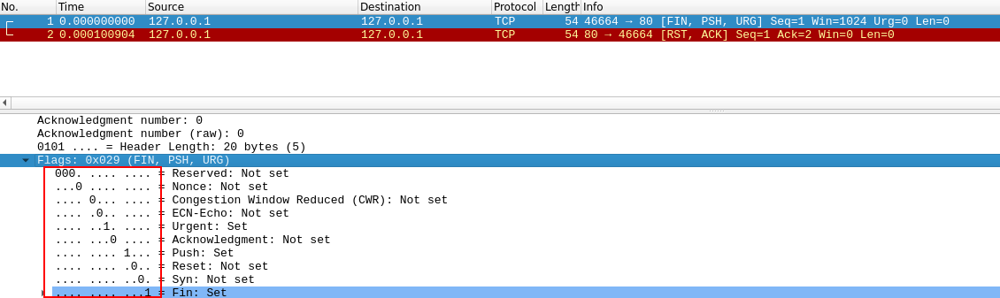

[<- Índice](../Pentesting.md)
# Técnicas de Escaneo

## TCP

> Poseemos una gran variedad de alternativas para el ==escaneo de servicios *TCP*==, que es por mucho el protocolo de transporte más utilizado para servidores.

Incluso otros tipos de escaneos, no precisamente de servicios, pueden brindarnos valiosa información del objetivo.

### Principales para servicios

> En notas anteriores, ya hemos hablado sobre los 2 tipos más importantes de escaneo *TCP* para *Nmap*.

El ***escaneo de conexión completa*** (`-sT`), por defecto cuando *Nmap* se ejecuta ==sin permisos de superusuario==, que realiza un *Three Way Handshake* completo.

Y por otra parte el ***escaneo de conexión incompleta o sigilosa*** (`-sS`) que realiza un *Three Way Handshake* a medias.

Estas 2 técnicas por supuesto, son las ==más fiables a la hora de escanear puertos== lo que también las hace las técnicas mas prevenidas y detectadas por los sistemas de defensa del objetivo.

Si estamos dispuestos a sacrificar algo de precisión por un mayor sigilo, existen unas cuantas técnicas no convencionales de escaneo que podemos utilizar.

### Especiales para servicios

Las posteriores técnicas de escaneo plantean una ***ideología distinta*** de escaneo basada en las ==convenciones establecidas en los distintos documentos *RFC*==, que fungen como documentación y guia para la implementación de distintos protocolos de transporte.

Específicamente sobre la que dicta que:

> *"Cualquier **puerto cerrado** que reciba un paquete con las banderas **URG, PUSH o FIN** activas en el segmento TCP, debe considerar este paquete como **malformado** y responder un paquete con la bandera **RST**"*

\> Página 65, *RFC* 793

De esta manera, podemos identificar *"consistentemente"* puertos cerrados, sin embargo estas técnicas de escaneo son ==incapaces de determinar adecuadamente si el puerto esta abierto o filtrado== ya que en ***ambos casos*** no debe haber respuesta por parte del objetivo.

Entonces, de no recibir respuesta, estos tipos de escaneo marcan al puerto como `open|filtered`.

#### FIN

> La ***técnica de escaneo FIN*** consiste en enviar un paquete con la bandera *FIN* activa, esperando la respuesta explicada anteriormente.

Podemos ejecutarlo indicando la bandera `-sF` en el comando:

```bash
sudo nmap -sF 192.168.90.1 -p 1-150

# Initiating FIN Scan at 10:46
# 
# Scanning 192.168.90.1 [150 ports]
# 
# Completed FIN Scan at 10:46, 1.23s elapsed (150 total ports)
# 
# Nmap scan report for 192.168.90.1
# Host is up (0.021s latency).
# 
# Not shown: 146 closed tcp ports (reset)
# 
# PORT   STATE         SERVICE
# 22/tcp open|filtered ssh
# 23/tcp open|filtered telnet
# 53/tcp open|filtered domain
# 80/tcp open|filtered http
# 
# Nmap done: 1 IP address (1 host up) scanned in 1.45 seconds
```

#### Xmas

> La ***técnica de escaneo Xmas*** envia un paquete con las banderas *FIN*, *URG* y *PUSH* activas.

Se le llama ***Xmas*** porque visto en *Wireshark*, se dice que las banderas del paquete parecen un árbol de navidad.



Se ejecuta con la bandera `-sX`:

```bash
sudo nmap -sX 192.168.90.1 -p1-150 -v

# Initiating XMAS Scan at 10:46
# 
# Scanning 192.168.90.1 [150 ports]
# 
# Completed XMAS Scan at 10:46, 1.23s elapsed (150 total ports)
# 
# Nmap scan report for 192.168.90.1
# Host is up (0.021s latency).
# 
# Not shown: 146 closed tcp ports (reset)
# 
# PORT   STATE         SERVICE
# 22/tcp open|filtered ssh
# 23/tcp open|filtered telnet
# 53/tcp open|filtered domain
# 80/tcp open|filtered http
# 
# Nmap done: 1 IP address (1 host up) scanned in 1.45 seconds
```

#### NULL

> La ***técnica de escaneo NULL*** consiste en enviar un paquete ==sin banderas activas==, pues de igual manera muchos sistemas lo tratan como un **paquete malformado** y responden con el esperado *RST* en caso de estar cerrado.

Se ejecuta con la bandera `-sN`:

```bash
sudo nmap -sN 192.168.90.1 -p1-150 -v

# Initiating NULL Scan at 10:46
# 
# Scanning 192.168.90.1 [150 ports]
# 
# Completed NULL Scan at 10:46, 1.23s elapsed (150 total ports)
# 
# Nmap scan report for 192.168.90.1
# Host is up (0.021s latency).
# 
# Not shown: 146 closed tcp ports (reset)
# 
# PORT   STATE         SERVICE
# 22/tcp open|filtered ssh
# 23/tcp open|filtered telnet
# 53/tcp open|filtered domain
# 80/tcp open|filtered http
# 
# Nmap done: 1 IP address (1 host up) scanned in 1.45 seconds
```

---

Aunque interesantes, se sabe que estas 3 técnicas de escaneo ==fallan contra muchos sistemas Microsoft== pues estos no implementaron esta respuesta *RST* en sus puertos cerrados.

Por eso debo remarcar que aunque son escaneos muy interesantes y potencialmente sigilosos, no plenamente consistentes ni confiables.

### Detección de puertos no-filtrados

En la actualidad, dada la situación y concientización sobre la ciberseguridad, las organizaciones disponen de dispositivos de defensa como *Firewall*'s capaces de filtrar e impedir las comunicaciones con el objetivo.

Entonces se ha vuelto muy ***valiosa*** la ==capacidad de discernir entre un puerto filtrado y un puerto alcanzable==.

> Para identificar los puertos alcanzables o **no-filtrados**, disponemos de la ***técnica de escaneo TCP-ACK*** que, aunque inutil para determinar el estado del puerto, nos permite identificar puertos alcanzables mediante su respuesta.

Falla en determinar los **estados**, porque **convencionalmente** los dispositivos deben devolver un paquete con la bandera *RST* ante cualquier inicio de conversación con *ACK*, sin importar si el puerto está abierto o cerrado.

Sin embargo, podemos aprovecharnos de esto para identificar fácilmente puertos filtrados ya que ==siempre deberíamos de recibir una bandera *RST*==, en cualquier otro escenario consideramos el puerto como ***filtrado***, ya sea que no hayamos recibido respuesta o hayamos recibido una respuesta de error.

Entonces, este tipo de escaneo únicamente reporta los **puertos alcanzables** como `unfiltered`.

```bash
sudo nmap -sA 8.8.8.8 -p1-150 --reason

# Starting Nmap 7.95 ( https://nmap.org ) at 2024-11-27 12:49 CST
# Nmap scan report for dns.google (8.8.8.8)
# Host is up, received syn-ack ttl 123 (0.011s latency).
#
# Not shown: 149 filtered tcp ports (no-response)
#
# PORT   STATE      SERVICE REASON
# 53/tcp unfiltered domain  reset ttl 64
# 
# Nmap done: 1 IP address (1 host up) scanned in 2.43 seconds
```

## UDP

Escanear **servicios *UDP*** es una tarea algo compleja debido a la naturaleza de este protocolo, que como sabemos, ==carece de un seguimiento sobre la comunicación==.

> La idea tras un ***escaneo UDP*** es enviar paquetes *UDP* a los puertos objetivo, esperando una super ==rara respuesta *UDP*== o ==al menos una respuesta de error *ICMP* que nos indique que el puerto es inalcanzable==.

En caso de ser un puerto conocido, *Nmap* adecua automáticamente el contenido del datagrama de modo que sea **más probable** recibir una respuesta del servicio usualmente alojado en ese puerto.

Aunque la mayoria de los servicios relevantes en los servidores se basan en *TCP* e incluso a pesar de la impracticidad de este tipo de escaneo, ***es importante saber escanear adecuadamente servicios UDP*** pues muchos sistemas de defensa practicamente ignoran o malconfiguran el cuidado de estos servicios.

Además nos podemos perder de servicios interesantes que muchas veces suelen basarse en *UDP* como ***¡DNS!***, **SMNP** e incluso ***DHCP***.

- En el irregular e improbable caso de recibir una **respuesta *UDP***, *Nmap* marca el puerto como `open`.
- En caso de recibir una **respuesta *ICMP* de puerto inalcanzable**, *Nmap* marca el puerto como `closed`.

En caso de no recibir una respuesta, *Nmap* reenviará algunas veces el paquete en caso de que este se haya perdido y también por temas de confirmación, para después finalmente marcar el puerto como `open/filtered`.

Para mitigar la **mayor desventaja** de este tipo de escaneo, el ==tiempo de escaneo==, se recomienda altamenta reducir el número de objetivos y puertos seleccionados bajo alguna medida preferida.

Por ejemplo, podemos reducir el escaneo a ***únicamente*** los ==20 puertos UDP más utilizados por servidores== adicionando la bandera `--top-ports` o podemos escanear solo el puerto o puertos que nos interese, etc.

```bash
sudo nmap -sU -p53 8.8.8.8 --reason

# Starting Nmap 7.95 ( https://nmap.org ) at 2024-11-27 12:33 CST
# Nmap scan report for dns.google (8.8.8.8)
# Host is up, received syn-ack ttl 123 (0.016s latency).
# 
# PORT   STATE SERVICE REASON
# 53/udp open  domain  udp-response ttl 64
# 
# Nmap done: 1 IP address (1 host up) scanned in 0.36 seconds

sudo nmap -sU --top-ports 10 192.168.90.1 --reason

# Starting Nmap 7.95 ( https://nmap.org ) at 2024-11-27 12:36 CST
# Nmap scan report for 192.168.90.1
# Host is up, received arp-response (0.17s latency).
# 
# PORT     STATE         SERVICE      REASON
# 53/udp   open          domain       udp-response ttl 64
# 67/udp   open|filtered dhcps        no-response
# 123/udp  closed        ntp          port-unreach ttl 64
# 135/udp  closed        msrpc        port-unreach ttl 64
# 137/udp  closed        netbios-ns   port-unreach ttl 64
# 138/udp  closed        netbios-dgm  port-unreach ttl 64
# 161/udp  closed        snmp         port-unreach ttl 64
# 445/udp  closed        microsoft-ds port-unreach ttl 64
# 631/udp  closed        ipp          port-unreach ttl 64
# 1434/udp closed        ms-sql-m     port-unreach ttl 64
# 
# Nmap done: 1 IP address (1 host up) scanned in 11.85 seconds
```

# Enlaces

[<- Enumeración de *Hosts*](EscaneoHosts.md) |