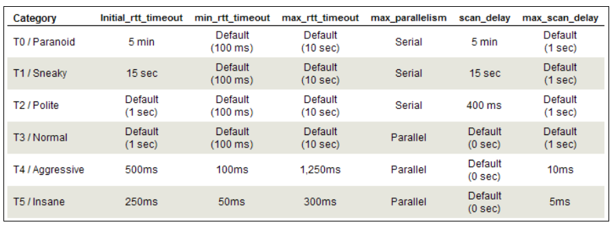

[<- Índice](../../../Pentesting.md)
# Ritmo y Optimización

> La ***Optimización*** en el desempeño del escaneo es un aspecto importante al escanear redes extensas o al considerar inestable el estado de la red. *Nmap* permite ajustar opciones como la velocidad, frecuencia, los tiempos de espera y el número de paquetes enviados para que podamos personalizar el rendimiento de la herramienta de una manera avanzada.

A continuación, detallaré algunos apartados importantes que nos permite configurar *Nmap*.

Cabe recalcar, que las opciones que reciben parametros de tiempo pueden especificarse como milisegundos (`ms`), segundos (`s`), minutos (`m`) e incluso horas (`h`).

### Tiempo de espera

> Cuando *Nmap* envía un paquete, espera un tiempo denominado ***RTT*** (*Round-Trip-Time*) para recibir la respuesta del puerto escaneado, una vez transcurrido este tiempo *Nmap* da por perdido el paquete y lo retransmite. Tras las correspondientes retransmisiones, *Nmap* da por filtrado el puerto y continua.

*Nmap* posee 3 opciones que nos permiten configurar el *RTT*, acompañadas de la medida de tiempo deseada.

- `--initial-rtt-timeout`
- `--max-rtt-timeout`
- `--min-rtt-timeout`

Es así porque *Nmap* intenta autoregularse a lo largo del escaneo, es decir, *Nmap* parte de un *RTT* **inicial** que dependiendo del desempeño de la red, **aumenta** en caso de que la red responda muy lento o **reduce** en caso opuesto.

Entonces podemos definir dicho *RTT* **inicial**, además de las **cotas superior e inferior** de modo que *Nmap* se mantenga entre los valores que deseemos.

Por supuesto, podemos optimizar el escaneo reduciento el **máximo** y e tiempo inicial, por ejemplo:

```bash
# Normal
time nmap 192.168.90.1

# ... 4.882 total

# Optimizado
time nmap -F --initial-rtt-timeout 100ms --max-rtt-timeout 200ms 192.168.90.1

# ... 2.698 total
```

Sin embargo, reducir demasiado estas opciones puede resultar contraproducente pues estariamos forzando retransmisiones antes de recibir la respuesta, impactando negativamente en el resultado del escaneo.

Por otra parte, en casos especiales, podemos aumentar este tiempo de espera al incrementar el **mínimo** y las demás, si así lo requerimos.

### Retransmisiones

> Como se menciono anteriormente, *Nmap* **retransmite** paquetes automáticamente en caso de no recibir una respuesta. Por defecto, *Nmap* retransmite el paquete 10 veces más antes de dar por filtrado el puerto.

Podemos especificar el máximo de retransmisiones mediante la opción `--max-retries`, desde 0 que indica no retransmisiones hasta el número deseado.

```bash
# Sin retransmisiones
sudo nmap --max-retries 0 192.168.90.1

# 20 retransmisiones
sudo nmap --max-retries 20 192.168.90.1
```

Nuevamente, hay que considerar que esta opción empeora la precisión del escaneo si se fija con un valor demasiado bajo.

### Velocidad

> También podemos fijar la tasa **mínima** y **máxima** de envío de paquetes por segundo, de modo que tengamos un control directo sobre la velocidad del escaneo. Similar a los tiempos de espera, *Nmap* regula automáticamente la velocidad de los paquetes según el estado de la red, de ahí que controlemos las cotas **superior** e **inferior**.

Esto se realiza con las siguientes opciones acompañadas del número que representa los **paquetes por segundo**:

- `--min-rate`
- `--max-rate`

Fijar más alto la **tasa mínima** de envío, reduce significativamente el tiempo de escaneo:

```bash
# Normal
time sudo nmap 192.168.90.1
# ... 1.689 total

# Optimizado
time sudo nmap --min-rate 2000 192.168.90.1
# ... 0.570 total
```

Por otra parte, reducir la **tasa máxima**, permite realizar escaneos más controlados y sigilosos sobre el objetivo, de modo que no sea tan escandaloso el número de paquetes recibidos.

```bash
# Normal
time sudo nmap -F 192.168.90.1
# ... 2.142 total

# Reducido
time sudo nmap -F --max-rate 4 192.168.90.1
# ... 25.518 total
```

### Plantillas de Tiempo

> *Nmap* posee muchisimas más opciones que las mostradas anteriormente, referentes al rendimiento de la herramienta, y como no siempre es posible personalizar cada opción, *Nmap* ofrece una serie de **plantillas de tiempo** que fijan automáticamente estas opciones acorde a la ***agresividad*** que deseamos que tenga nuestro escaneo.

Estas plantillas se indican mediante la bandera `-T` seguida del nivel de **agresividad** que puede indicarse mediante el número o el nombre correspondiente.

- `-T 0` / `-T paranoid`
- `-T 1` / `-T sneaky`
- `-T 2` / `-T polite`
- `-T 3` / `-T normal`
- `-T 4` / `-T aggressive`
- `-T 5` / `-T insane`

De hecho, *Nmap* por defecto utiliza la plantilla normal (`-T 3`).

Los desarroladores determinaron las opciones específicas de la siguiente manera:



# Enlaces

[<- Técnicas de Escaneo](Nmap-TecnicasEscaneo.md) | [NSE ->](Nmap-NSE.md)