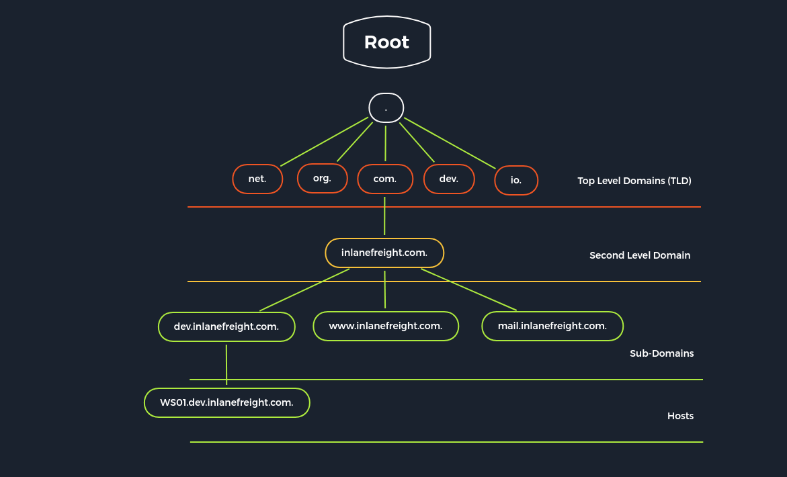

[<- Índice](../../../Pentesting.md)
# Domain Name System

> ***DNS*** (*Domain Name System*) es una de las partes más importantes y vitales del *Internet*. Este permite que utilicemos nombres de dominio para establecer conexiones en lugar de tener que recordar todas las direcciones *IP* de los servidores que nos brindan servicios.

Recordemos que la jerarquía de nombres de dominio, se ve como sigue:



Existe una gran cantidad de servidores *DNS* distribuidos globalmente con el objetivo de realizar las resoluciones de nombres de dominio a sus respectivas direcciones IP.

Además, estos servidores se dividen en varios tipos según su propósito.

| Tipo de Servidor DNS            | Descripción                                                                                                                                                                                                                                       |
| ------------------------------- | ------------------------------------------------------------------------------------------------------------------------------------------------------------------------------------------------------------------------------------------------- |
| Servidor **raíz**               | Servidores responsables de los ***TLD*** (*Top Level Domain*) como `com`, `mx`, `org`, etc. Son el último recurso, en caso de que un servidor de autoritativo no pueda resolver la solicitud. Actualmente únicamente existen 13 en todo el mundo. |
| Servidores **autoritativos**    | Estos servidores estan encargados de ciertos dominios y se consideran la fuente **oficial** de los registros *DNS* de estos.                                                                                                                      |
| Servidores **no-autoritativos** | Estos serviddores son aquellos que no estan encargados de ningún dominio, y responden solicitudes basandose en su caché de consultas o mediante consultas recursivas.                                                                             |
| Servidores de **caché**         | Estos servidores estan se encargan de mantener como caché la información de otros servidores *DNS*.                                                                                                                                               |
| Servidores de **redirección**   | Este tipo de servidores tiene una única función, redirigir la consulta *DNS* a otro servidor.                                                                                                                                                     |
| Servidores de **resolución**    | Son básicamente **servidores no-autoritativos** pero que realizan resoluciones de nombre de forma locam mediante una computadora o *router*.                                                                                                      |

Sin embargo, el protocolo *DNS* no solo consiste en la resolución de nombres a direcciones *IP*, si no que puede proporcionarnos información adicional referente al dominio, como sus servidores de correo electrónico, sus servidores *DNS* propios y más.

Para esto, la información se divide en una serie de ***Registros*** que almacenan distintos tipos de información, según sea el caso.

| *Registro DNS* | Descripción                                                                                                                                        |
| -------------- | -------------------------------------------------------------------------------------------------------------------------------------------------- |
| `A`            | En estos, se almacenan las direcciones *IPv4* relacionadas al dominio.                                                                             |
| `AAAA`         | Estos almacenan las direcciones *IPv6* relacionadas al dominio.                                                                                    |
| `MX`           | Estos almacenan los servidores de correo electrónico del dominio.                                                                                  |
| `NS`           | Estos almacenan los servidores *DNS* del dominio.                                                                                                  |
| `TXT`          | Estos pueden almacenar información en texto plano muy variada, por ejemplo llaves de validación para servicios, llaves de certificados *SSL*, etc. |
| `CNAME`        | Este registro almacena los alias del dominio solicitado, para cuando más de un dominio apuntas a la misma dirección IP.                            |
| `PTR`          | Este registro funciona como un inverso a los registros `A`, resolviendo direcciones IP a nombres de dominio.                                       |
| `SOA`          | Estos registros almacenan información correspondiente a la zona *DNS* y datos de contacto administrativo.                                          |

## Configuración

> Existen varios tipos de configuraciones para un servidor *DNS*, dada la versatilidad del protocolo, sin embargo las 3 más importantes son:

1. Configuración **local** del servidor *DNS*
2. Configuración de **zonas**
3. Configuración de **resoluciones inversas**

Para la configuración, tomaremos de ejemplo el servidor ***Bind 9***, comúnmente utilizado en distribuciones *Linux*, cuyos archivos de configuraciones **locales** son:

- `named.conf.local`
- `named.conf.options`
- `named.conf.log`

Dentro de estos archivos, podemos definir tanto configuraciones **globales**, para todas las zonas, como configuraciones específicas **por zona**.

```bash
cat /etc/bind/named.conf.local

# //
# // Do any local configuration here
# //
# 
# // Consider adding the 1918 zones here, if they are not used in your
# // organization
# // include "/etc/bind/zones.rfc1918";
# zone "domain.com" {
#     type master;
#     file "/etc/bind/db.domain.com";
#     allow-update { key rndc-key; };
# };
```

Para los archivos de configuración de **zonas**, se reaiza en archivos "*db.*" seguido del nombre del dominio.
En estos, es forzoso especificar exactamente un registro `SOA` y al menos un registro `NS`, con el objetivo de mejorar la legibilidad de la configuración y de sentar base a la estructura de la zona.

```bash
cat /etc/bind/db.domain.com

# ;
# ; BIND reverse data file for local loopback interface
# ;
# $ORIGIN domain.com
# $TTL 86400
# @     IN     SOA    dns1.domain.com.     hostmaster.domain.com. (
#                     2001062501 ; serial
#                     21600      ; refresh after 6 hours
#                     3600       ; retry after 1 hour
#                     604800     ; expire after 1 week
#                     86400 )    ; minimum TTL of 1 day
# 
#       IN     NS     ns1.domain.com.
#       IN     NS     ns2.domain.com.
# 
#       IN     MX     10     mx.domain.com.
#       IN     MX     20     mx2.domain.com.
# 
#              IN     A       10.129.14.5
# 
# server1      IN     A       10.129.14.5
# server2      IN     A       10.129.14.7
# ns1          IN     A       10.129.14.2
# ns2          IN     A       10.129.14.3
# 
# ftp          IN     CNAME   server1
# mx           IN     CNAME   server1
# mx2          IN     CNAME   server2
# www          IN     CNAME   server2
```

Para las **resoluciones inversas**, con los registros `PTR`, es necesario definir otro archivo "*db.*", seguido de los los octetos de dirección IP correspondientes.
En este archivo se definen los registros `PTR` que contienen los nombres de dominio relacionados.

```bash
cat /etc/bind/db.10.129.14

# ;
# ; BIND reverse data file for local loopback interface
# ;
# $ORIGIN 14.129.10.in-addr.arpa
# $TTL 86400
# @     IN     SOA    dns1.domain.com.     hostmaster.domain.com. (
#                     2001062501 ; serial
#                     21600      ; refresh after 6 hours
#                     3600       ; retry after 1 hour
#                     604800     ; expire after 1 week
#                     86400 )    ; minimum TTL of 1 day
# 
#       IN     NS     ns1.domain.com.
#       IN     NS     ns2.domain.com.
# 
# 5    IN     PTR    server1.domain.com.
# 7    IN     MX     mx.domain.com.
# ...
```

### Opciones peligrosas

> Las **opciones** listadas a continuación predisponen el servidor *DNS* a ataques y brechas en la seguridad.

| Opción            | Descripción                                                                                 |
| ----------------- | ------------------------------------------------------------------------------------------- |
| `allow-query`     | Define que dispositivos tienen permitido realizar una consulta *DNS* al servidor.           |
| `allow-recursion` | Define que dispositivos tienen permitido realizar solicitudes *DNS* recursivas al servidor. |
| `allow-transfer`  | Define que dispositivos tienen permitido realizar transferencias de zona del servidor.      |
| `zone-statistics` | El servidor almacena datos estadísticos de las zonas *DNS*                                  |

## Enumeración

> Al realizar enumeraciones utilizando utilidades como `dig` o `nslookup`, hay que asegurarnos de realizar las solicitudes *DNS* explícitamente al servidor objetivo, por ejemplo, utilizando `@` con `dig`. De otro modo, nuestra computadora realizará la consulta al servidor más conveniente, en lugar de al objetivo.

Por ejemplo, un buen inicio sería solicitando los registros `NS` del dominio principal de la organización a algún servidor que cuente el servicio *DNS* presente.

```bash
dig ns inlanefreight.htb @10.129.14.128

# ; <<>> DiG 9.16.1-Ubuntu <<>> ns inlanefreight.htb @10.129.14.128
# ;; global options: +cmd
# ;; Got answer:
# ;; ->>HEADER<<- opcode: QUERY, status: NOERROR, id: 45010
# ;; flags: qr aa rd ra; QUERY: 1, ANSWER: 1, AUTHORITY: 0, ADDITIONAL: 2
# 
# ;; OPT PSEUDOSECTION:
# ; EDNS: version: 0, flags:; udp: 4096
# ; COOKIE: ce4d8681b32abaea0100000061475f73842c401c391690c7 (good)
# ;; QUESTION SECTION:
# ;inlanefreight.htb.             IN      NS
# 
# ;; ANSWER SECTION:
# inlanefreight.htb.      604800  IN      NS      ns.inlanefreight.htb.
# 
# ;; ADDITIONAL SECTION:
# ns.inlanefreight.htb.   604800  IN      A       10.129.34.136
# 
# ;; Query time: 0 msec
# ;; SERVER: 10.129.14.128#53(10.129.14.128)
# ;; WHEN: So Sep 19 18:04:03 CEST 2021
# ;; MSG SIZE  rcvd: 107
```

En algunas versiones de *Bind*, incluso es posible solicitar la versión del servidor *DNS* mediante la clase *CHAOS* del registro `TXT`, claro, solo si esta realmente se encuentra presente.

```bash
dig CH TXT version.bind 10.129.120.85

# ; <<>> DiG 9.10.6 <<>> CH TXT version.bind
# ;; global options: +cmd
# ;; Got answer:
# ;; ->>HEADER<<- opcode: QUERY, status: NOERROR, id: 47786
# ;; flags: qr aa rd; QUERY: 1, ANSWER: 1, AUTHORITY: 0, ADDITIONAL: 1
# 
# ;; ANSWER SECTION:
# version.bind.       0       CH      TXT     "9.10.6-P1"
# 
# ;; ADDITIONAL SECTION:
# version.bind.       0       CH      TXT     "9.10.6-P1-Debian"
# 
# ;; Query time: 2 msec
# ;; SERVER: 10.129.120.85#53(10.129.120.85)
# ;; WHEN: Wed Jan 05 20:23:14 UTC 2023
# ;; MSG SIZE  rcvd: 101
```

#### Transferencias de Zona (AXFR)

> Las **transferencias de zona** se refiere a transferir los registros de las zonas presentes de un servidor *DNS* a otro dispositivo. Este procedimiento, comunmente abreviado como ***AXFR*** (*Asynchronous Full Transfer Zone*), tiene el objetivo de trasnmitir las modificaciones en estas zonas a otros servidores, o de crear **copias de seguridad** de esta información en caso de que este servidor falle, para que otro más pueda remplazarlo temporalmente.

Estas transferencias, consisten de todos los registros *DNS* presentes en la zona solicitada del servidor.

Usualmente, cada **zona** tiene configurado un servidor *DNS* **principal**, y el resto de servidores en la zona, probablemente presentes por temas de distribución de carga, seguridad y repuesto, son denominados servidores *DNS* **secundarios**.

Como mencionamos anteriormente, los cambios en las configuraciones de las zonas suelen realizarse en un único servidor, este se le denomina **maestro**, mientras que al resto de servidores se sincronizan mediante una **transferencia de zona**, por lo que se les denomina **esclavos**.

Un servidor **principal** siempre es un servidor **maestro**, mientras que los servidores **secundarios** pueden ser tanto **maestros** como **esclavos** al momento de recibir y transferir la información.

Claramente, no es nada recomendable permitir las transferencias de zona a cualquier dispositivo, pues cualquier tercero podría obtener una visualización completa de la zona del servidor solicitada. Por supuesto, al enumerar el servidor si que podría ser valioso para nosotros, por lo que siempre es buena idea revisar si se permiten las transferencias de zona.

Esto, mediante `dig`, se ve de la siguiente forma:

```bash
dig axfr inlanefreight.htb @10.129.14.128

# ; <<>> DiG 9.16.1-Ubuntu <<>> axfr inlanefreight.htb @10.129.14.128
# ;; global options: +cmd
# inlanefreight.htb.      604800  IN      SOA     inlanefreight.htb. root.inlanefreight.htb. 2 604800 86400 2419200 604800
# inlanefreight.htb.      604800  IN      TXT     "MS=ms97310371"
# inlanefreight.htb.      604800  IN      TXT     "atlassian-domain-verification=t1rKCy68JFszSdCKVpw64A1QksWdXuYFUeSXKU"
# inlanefreight.htb.      604800  IN      TXT     "v=spf1 include:mailgun.org include:_spf.google.com include:spf.protection.outlook.com include:_spf.atlassian.net ip4:10.129.124.8 ip4:10.129.127.2 ip4:10.129.42.106 ~all"
# inlanefreight.htb.      604800  IN      NS      ns.inlanefreight.htb.
# app.inlanefreight.htb.  604800  IN      A       10.129.18.15
# internal.inlanefreight.htb. 604800 IN   A       10.129.1.6
# mail1.inlanefreight.htb. 604800 IN      A       10.129.18.201
# ns.inlanefreight.htb.   604800  IN      A       10.129.34.136
# inlanefreight.htb.      604800  IN      SOA     inlanefreight.htb. root.inlanefreight.htb. 2 604800 86400 2419200 604800
# ;; Query time: 4 msec
# ;; SERVER: 10.129.14.128#53(10.129.14.128)
# ;; WHEN: So Sep 19 18:51:19 CEST 2021
# ;; XFR size: 9 records (messages 1, bytes 520)
```

A su vez, si descubrimos más zonas, podríamos repetir este procedimiento en la nueva zona descubierta hasta que hayamos indagado una buena cantidad de información acerca de los subdominios de la empresa.

#### Fuerza bruta

> Aunque carezcamos de la valiosa autorización de realizar transferencias de zonas, aún podemos intentar enumerar los subdominios presentes en el servidor mediante **fuerza bruta**.

Esto lo podemos realizar mediante simples consultas al registro `A` con los posibles subdominios y recabar especialmente aquellas que nos dan una respuesta de vuelta.

Esto con apoyo de un diccionario, el correspondiente formateo y desde la terminal, se vería algo similar a esto:

```bash
for subdomain in $(cat /usr/share/wordlists/seclists/Discovery/DNS/subdomains-top1million-5000.txt) ; do dig "${subdomain}.inlanefreight.com" @10.129.78.56 | grep -vE ";|SOA|^\s*$" | grep $subdomain ; done
```

Aunque claro, existen herramientas dedicadas a este tipo de enumeración y más como [*DNSRecon*](https://github.com/darkoperator/dnsrecon), [*Gobuster*](https://github.com/OJ/gobuster.git) con el comando `dns` y demás.

```bash
dnsrecon -t brt -d inlanefreight.com -n 10.129.78.56 -D /usr/share/wordlists/seclists/Discovery/DNS/subdomains-top1million-5000.txt
```

# Enlaces

[<- NFS](NFS.md) | [SMTP ->](SMTP.md)