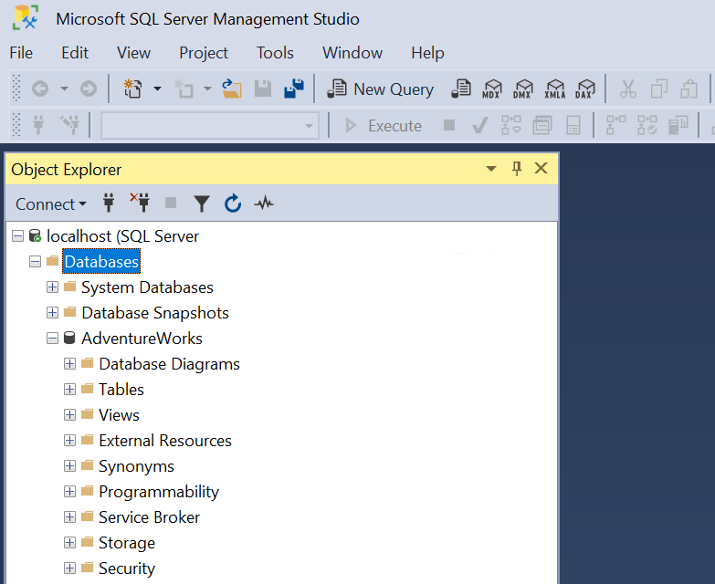

[<- Índice](../../../Pentesting.md)
# Microsoft SQL

> ***MSSQL*** (*Microsoft SQL*) es otro sistema de administración de bases de datos relacionales desarrollado por *Microsoft* como un proyecto de código cerrado pensado principalmente para sistemas *Windows*.

Es una opción **popular** para administradores y desarrolladores de aplicaciones *.NET* ya que este sistema de bases de datos posee una gran compatibilidad y soporte con el *framework .NET*.

Aunque existen implementaciones de **MSSQL** para sistemas *Linux* y *macOS*, lo más común es que encuentres este servicio en objetivos *Windows*.

### Clientes MSSQL

> **MSSQL** posee su propia implementación oficial de un cliente para su sistema de bases de datos, [SQL Server Management Studio](https://learn.microsoft.com/en-us/ssms/download-sql-server-management-studio-ssms?view=sql-server-ver15) o **SSMS** por sus siglas.

Posee todas las funcionalidades esperadas de un cliente y más, además de la gran compatibilidad típica de un desarrollo oficialmente relacionado con el sistema.

Por lo mismo es comúnmente instalado y configurado por los administradores de bases de datos en cualesquiera equipos donde se espera un uso continuo del servicio.
Esto abre la posibilidad de encontrar este *software* configurado en algún equipo comprometido y que represente un acceso sencillo a las bases de datos.



Claro, este no es el único cliente disponible para este servicio y con el tiempo han surgido otras opciones extraoficiales como:

- [`mssql-cli`](https://docs.microsoft.com/en-us/sql/tools/mssql-cli?view=sql-server-ver15)
- [SQL Server PowerShell](https://docs.microsoft.com/en-us/sql/powershell/sql-server-powershell?view=sql-server-ver15)
- [HeidiSQL](https://www.heidisql.com/)
- [SQLPro]()
- [Impacket - MSSQL client](https://github.com/fortra/impacket/blob/master/examples/mssqlclient.py)

Entre estas, sin duda destaca el cliente de **Impacket** (`mssqlclient.py`) por su alta disponibilidad en cualquier entorno *Linux* y por su funcionalidad sencilla pero útil.

### Bases de datos MSSQL

El servidor se aloja en el puerto **1433** *TCP* como cualquier otro servicio.

Los **servidores** *MSSQL* tienen bases de datos preconfiguradas para cualquier instalación que contienen información básica y necesaria como la estructura de las otras bases de datos configuradas por administradores.

Un repaso de las más importantes es:

| Base de datos preconfigurada | Descripción                                                                                                                 |
| ---------------------------- | --------------------------------------------------------------------------------------------------------------------------- |
| **master**                   | Almacena toda la información del servidor *MYSQL*.                                                                          |
| **model**                    | Plantilla para la creación de bases de datos, cualquier cambio en esta se refleja en bases de datos creadas posteriormente. |
| **msdb**                     | En esta se almacenan todas las tareas programadas y alertas del servidor.                                                   |
| **tempdb**                   | Almacena objetos e información temporal.                                                                                    |
| **resource**                 | Es una base de datos únicamente de lectura y contiene todos los objetos necesarios para el funcionamiento del servidor.     |

## Configuración

> En una nueva instalación de *MSSQL*, el servicio corre típicamente bajo el usuario `SERVICE\MSSQLSERVER`, posee un mecanismo de autenticación estándar denominado **Windows Authentication** y, por defecto, no forza la encriptación en las conexiones.

**Windows Authentication** implica que la autenticación se redirige al sistema operativo *Windows* del servidor, es decir, que éste utilizará los mecanismos tradicionales como la base de datos *SAM* o su controlador de dominio (en caso de *Active Directory*) para autenticar al usuario que solicite interactuar con el servidor *MSSQL*.

### Configuraciones peligrosas

Al igual que *MySQL*, la configuración de un sistema de bases de datos es una tarea extensa, compleja y variada.
Hay muchisimos ajustes que podrían malconfigurarse y representar una vulnerabilidad para el servidor, demasiados para repasarlos unoi por uno, pero podríamos aprovecharnos de aspectos como:

- Clientes *MSSQL* que se conectan al servidor sin encriptación, tal vez podríamos interceptar algunas credenciales.
- El uso de certificados **autofirmados** para la encriptación, ya que son fácilmente suplantables.
- El uso de **Named pipes**, un mecanismo de comunicación interprocesos alternativo a conexiones *TCP/IP*, que podrían estar malconfigurados.
- Credenciales débiles o credenciales por defecto, por ejemplo la cuenta preconfigurada del usuario `sa`.

Recordemos que muchas configuraciones de servidores se realizan bajo presión y con prisa, es fácil cometer errores, por lo que siempre es buena idea ponerse en los pies de un administrador para intentar entender que se pudo haber hecho mal.

# Enumeración

#### Nmap

> Como siempre, **Nmap** provee un gran arsenal de *scripts* para enumerar de forma básica el servicio.

Puede indicarnos por ejemplo:

- *Hostname del servidor* (o *ServerName*)
- *Nombre de instancia del servidor*
- *Versión de MSSQL*
- **Named pipes** habilitadas

```bash
sudo nmap --script ms-sql-info,ms-sql-empty-password,ms-sql-xp-cmdshell,ms-sql-config,ms-sql-ntlm-info,ms-sql-tables,ms-sql-hasdbaccess,ms-sql-dac,ms-sql-dump-hashes --script-args mssql.instance-port=1433,mssql.username=sa,mssql.password=,mssql.instance-name=MSSQLSERVER -sV -p 1433 10.129.201.248

# Starting Nmap 7.91 ( https://nmap.org ) at 2021-11-08 09:40 EST
# Nmap scan report for 10.129.201.248
# Host is up (0.15s latency).
# 
# PORT     STATE SERVICE  VERSION
# 1433/tcp open  ms-sql-s Microsoft SQL Server 2019 15.00.2000.00; RTM
# | ms-sql-ntlm-info: 
# |   Target_Name: SQL-01
# |   NetBIOS_Domain_Name: SQL-01
# |   NetBIOS_Computer_Name: SQL-01
# |   DNS_Domain_Name: SQL-01
# |   DNS_Computer_Name: SQL-01
# |_  Product_Version: 10.0.17763
# 
# Host script results:
# | ms-sql-dac: 
# |_  Instance: MSSQLSERVER; DAC port: 1434 (connection failed)
# | ms-sql-info: 
# |   Windows server name: SQL-01
# |   10.129.201.248\MSSQLSERVER: 
# |     Instance name: MSSQLSERVER
# |     Version: 
# |       name: Microsoft SQL Server 2019 RTM
# |       number: 15.00.2000.00
# |       Product: Microsoft SQL Server 2019
# |       Service pack level: RTM
# |       Post-SP patches applied: false
# |     TCP port: 1433
# |     Named pipe: \\10.129.201.248\pipe\sql\query
# |_    Clustered: false
# 
# Service detection performed. Please report any incorrect results at https://nmap.org/submit/ .
# Nmap done: 1 IP address (1 host up) scanned in 8.52 seconds
```

#### MSSQL Ping de Metasploit

El *framework* de **Metasploit** provee un valioso modulo auxiliar para enumerar servicios *MSSQL* llamado `mssql_ping`.
Éste recupera información útil del servidor, similar a *Nmap*, como el *hostname*, nombre de la instancia, versión, *named pipes*, etc.

```msfconsole
msf6 > search mssql_ping

Matching Modules
================

   0  auxiliary/scanner/mssql/mssql_ping  .                normal  No     MSSQL Ping Utility


Interact with a module by name or index. For example info 0, use 0 or use auxiliary/scanner/mssql/mssql_ping

msf6 > use 0

msf6 auxiliary(scanner/mssql/mssql_ping) > set rhosts 10.129.230.249
rhosts => 10.129.230.249

msf6 auxiliary(scanner/mssql/mssql_ping) > run
[*] 10.129.230.249        - SQL Server information for 10.129.230.249:
[+] 10.129.230.249        -    ServerName      = ILF-SQL-01
[+] 10.129.230.249        -    InstanceName    = MSSQLSERVER
[+] 10.129.230.249        -    IsClustered     = No
[+] 10.129.230.249        -    Version         = 15.0.2000.5
[+] 10.129.230.249        -    tcp             = 1433
[+] 10.129.230.249        -    np              = \\ILF-SQL-01\pipe\sql\query
[*] 10.129.230.249        - Scanned 1 of 1 hosts (100% complete)
[*] Auxiliary module execution completed

msf6 auxiliary(scanner/mssql/mssql_ping) >
```

#### mssqlclient.py

Si tenemos algunas credenciales en nuestro poder, podemos utilizar el cliente de **Impacket**, `mssqlclient.py` para interactuar con el servidor *MSSQL* utilizando *T-SQL*, una versión extendida de *SQL* desarrollada para *MSSQL*.

La sintaxis del comando para conectarse es `mssqlclient.py <usuario>:<contraseña>@<IP>`.
A no ser que te encuentres ante un entorno de *Active Directory*, es prácticamente necesario indicar la bandera `-windows-auth` para que el cliente sepa como manejar la autenticación correctamente.

Un ejemplo del comando es:

```bash
mssqlclient.py backdoor:Password1@10.129.230.249 -windows-auth
```

Si no indicas la contraseña en el comando no hay problema, igual se solicitará durante la ejecución del programa.

Una vez dentro, para enumerar las bases de datos nos resultan útiles los siguientes comandos:

| Comando                                                                      | Descripción                                       |
| ---------------------------------------------------------------------------- | ------------------------------------------------- |
| `select name from sys.databases`                                             | Lista las bases de datos presentes en el servidor |
| `USE <base_de_datos>`                                                        | Selecciona la base de datos indicada              |
| `select name from sys.tables`                                                | Lista las tablas de la base de datos seleccionada |
| `select name from sys.columns where object_id = OBJECT_ID('<nombre_tabla>')` | Lista las columnas de la tabla especificada       |
| `select * from <tabla>`                                                      | *Dumpea* la tabla indicada completa               |

# Enlaces

[<- MySQL](MySQL.md) | [OracleTNS ->](OracleTNS.md)