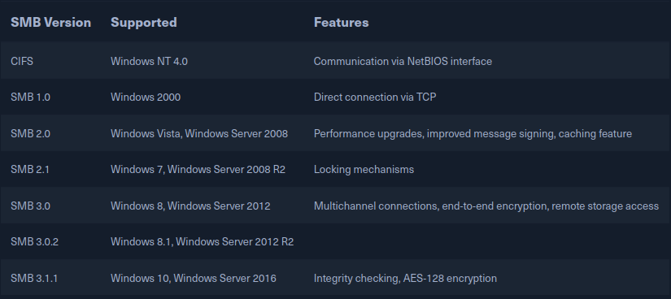

[<- Índice](../../../Pentesting.md)
# Server Message Block

> ***SMB*** (*Server Message Block*) es un protocolo de capa de aplicación que, bajo un modelo servidor-cliente, regula el acceso a archivos, directorios y demás recursos de red como impresoras, *routers* o interfaces. Además, permite el intercambio de información entre distintos procesos a través de la red.

Aunque en sus inicios fue un protocolo acogido por una gran variedad de público, con el tiempo fue integrado de forma más particular a sistemas operativos *Windows*, donde se implemento *SMB* con un enfoque **retrocompatible** para que los nuevos equipos pudieran comunicarse con los viejos equipos, a pesar de la versión de sistema operativo *Windows* que tuvieran.

Adicionalmente, con el surgimiento de ***Samba***, la comunicación entre distintas plataformas *Linux* y *Windows* es posible mediante *SMB*.

El protocolo *SMB* tambien permite la comunicación del cliente con otros participantes de la red para acceder a archivos y servicios en toda la red, siempre que ambos hayan establecido la conexión con el servidor como intermediario.

*SMB* se basa en el protocolo de transporte ***TCP*** para el establecimiento de sesiones y para transmisiones más seguras y estables.

Tambien hay que notar que la jerarquía de un **servidor SMB** es parcialmente independiente de la estructura del servidor.
Los **permisos** de los recursos se definen segun la ***ACL*** (*Access Control Lists*), que permite controlar granularmente los atributos como la **ejecución**, **lectura**, **escritura** y **control total** para cada usuario y grupo.
Recordemos que el *ACL* define estas propiedades en los recursos compartidos y no son forzosamente iguales a los permisos locales del servidor.

## Samba

> Como se menciono anteriormente, **Samba** es una implementación de código libre del protocolo *SMB*, principalmente pensada para dipositivos *UNIX*. *Samba* basa principalmente su implementación en el protocolo de red ***CIFS*** (*Common Internet File System*) que se considera un dialecto de *SMB* originalmente creado por *Microsoft*, permitiendo que *Samba* se comunique perfectamente con dispositivos modernos.

Por esto último, *Samba* es también conocido como *SMB/CIFS*.

***CIFS*** se alínea más a la primera versión disponible de *SMB* con la única diferencia del puerto por defecto del servicio, pues los dispositivos más antiguos establecian las conexiones a través de los puertos 137, 138 o 139, mientras que ***CIFS*** únicamente opera en el puerto 445.

#### Versiones

Existen muchas versiones de *SMB*, desde la **versión 1** hasta versiones modernas como ***SMB 2*** y ***SMB 3*** que ofrecen significativas mejoras y optimizaciones para infraestructuras modernas, dejando obsoleta a la versión 1 y a ***CIFS***, aunque aún se utilicen estás en ciertos ambientes.



Con la versión 3, *SMB* incluso fue incorporado a *Active Directory*.

#### Conceptos importantes

En una red *SMB*, cada dispositivo participa en un **grupo de trabajo** (*workgroup*) donde se comparten los recursos. Este **grupo de trabajo** identifica a todos los recursos que se deseen compartir con los otros miembros en el grupo y puede haber varios grupos según la organización y segmentación en la organización.

*IBM* desarrollo una ***API*** (*Application programming interface*) para conectar computadoras denominada ***NetBIOS*** (*Network Basic Input/Output System*). Esta **API** brinda una plantilla para la conexión y transferencia de datos entre computadoras.

Para que funcione adecuadamente, las computadroas que formen parte de un ambiente **NetBIOS** necesitan un nombre, comúnmente, denominado ***NBNS*** (*NetBIOS Name Server*), pero en algunos sistemas modernos se le llama ***WINS*** (*Windows Internet Name Service*).

Con estos nombres, ***NetBIOS*** permite la conexión entre distintos dispositivos a partir de sus nombres, sin necesidad de especificar sus direcciones IP, proporcionando funcionalidades como la resolución de nombres, gestión de sesiones, transmisión de datagramas, etc.

***SMBv1*** y *Samba*, de hecho, utiliza ***NetBIOS*** como herramienta principal, como una especie de capa de transporte.
Sin embargo, a partir de la versión 2 de ***SMB***, *SMB* comenzo a basarse directamente sobre *TCP/IP*.

#### Configuración de Samba

> *Samba* ofrece una gran cantidad de opciones a configurar en el archivo `/etc/samba/smb.conf`. Estos se dividen en **ajustes globales**, que se aplican a todos los recursos compartidos por igual, y los **ajustes individuales** que se aplican a cada carpeta compartida. A continuación algunos ejemplos y explicaciones de estas configuraciones.
> 

| Opción                         | Descripción                                                                                  |
| ------------------------------ | -------------------------------------------------------------------------------------------- |
| `[sharename]`                  | El nombre de la carpeta compartida                                                           |
| `workgroup = WORKGROUP/DOMAIN` | El **grupo de trabajo** pertinente a la carpeta, que aparecera cuando se solicite el acceso. |
| `path=/path/here`              | Ruta local al directorio que se compartirá.                                                  |
| `server string = STRING`       | Nombre del servidor, que aparecerá cuando la conexión se establezca.                         |
| `unix password sync = yes`     | Sincronizar las contraseñas *SMB* con las contraseñas locales en un sistema *UNIX*.          |
| `usershare allow guests = yes` | Permitir el acceso a usuarios no autenticados (invitados) a la carpeta compartida.           |
| `browseable = yes`             | Define si deberia listarse esta carpeta como disponible.                                     |
| `guest ok = yes`               | Es un ajuste global que indica si se permite usuarios sin autenticar en el servidor.         |
| `read only = yes`              | Ajuste global que define si los archivos compartidos son únicamente de lectura.              |
| `create mask = 0700`           | Que permisos se definen por defecto para los archivos que se crean.                          |

## Configuraciones peligrosas

> Algunos ejemplos de configuraciones peligrosas que podríamos encontrar presentes en el servidor son:

| Opción                      | Descripción                                                                               |
| --------------------------- | ----------------------------------------------------------------------------------------- |
| `browseable = yes`          | Permite el listado de las carpetas compartidas disponibles                                |
| `read only = no`            | Se permite la creación y modificación de archivos                                         |
| `writable = yes`            | Un ajuste individual que permite la creación y modificación de archivos en dicha carpeta. |
| `guest ok = yes`            | Permite la conexion de usuario no autenticados.                                           |
| `enable privileges = yes`   | Permite la asignación de privilegios a *SID*'s específicas.                               |
| `create mask = 0777`        | Los nuevos archivos que se crean cuentan con todos los permisos.                          |
| `directory mask = 0777`     | Los nuvos directorios que se crean cuentan con todos los permisos.                        |
| `logon script = script.sh`  | Que script se ejecuta al iniciar sesión                                                   |
| `magic script = script.sh`  | Que script debe ser ejecutado cuando el script de inicio de sesión concluya.              |
| `magic output = script.out` | Donde se almacena la salida del *"magic script"*                                          |

## `smbclient`

> Para interactuar con un servidor *SMB* contamos con la utilidad `smbclient` que funge precisamente como cliente para la comunicación.

Lo primero para establecer una conexión suele ser listar las carpetas compartidas disponibles con apoyo de la bandera `-L` y, de no contar con credenciales, indicamos la bandera `-N` que indica al servidor que deseamos establecer una sesión anónima o nula, sin autenticarnos.

Seguido, especificamos la dirección IP del servidor, precedido por doble diagonal como se muestra en el ejemplo:

```bash
smbclient -N -L //10.134.15.123

#         Sharename       Type      Comment
#         ---------       ----      -------
#         print$          Disk      Printer Drivers
#         home            Disk      INFREIGHT Samba
#         dev             Disk      DEVenv
#         notes           Disk      CheckIT
#         IPC$            IPC       IPC Service (DEVSM)
# SMB1 disabled -- no workgroup available
```

`IPC$` y `print$` son carpetas compartidas por defecto, que tienen información de procesos compartidos y *drivers* de impresoras respectivamente. Por otra parte, tenemos las carpetas `home`, `dev` y `notes` que podemos explorar más a fondo.

Para conectarnos a una carpeta en específico, la especificamos despues de la dirección *IP*, y ya no especificamos la bandera `-L` como se muestra a continuación:

```bash
smbclient -N //10.134.15.123
```

Lo que establecera la conexión con la carpeta compartida y nos brindará una interfaz muy parecida a la del cliente *FTP* que, de hecho, comparte muchos comandos.

Por ejemplo, podemos descargar y cargar, siempre que tengamos los permisos, con `get` y `put` respectivamente.

Tambien podemos ejecutar comandos locales, en nuestra computadora, de la forma `!comando`, para una interacción más fácil con nuestro sistema desde dentro del cliente.

## Enumerando el servicio

A parte de contar con nuestro cliente `smbclient`, tenemos unas cuantas maneras más de interactuar y recopilar información del servicio como lo son:

### Nmap

> Nuevamente, el [NSE](../nmap/Nmap-NSE.md) nos brinda una buena cantidad de *Scripts* para recabar información a partir de *Nmap*, listables de la siguiente manera:

```bash
ls /usr/share/nmap/scripts/smb-*
```

Algunos destacables por ejemplo son:

| Script              | Descripción                                                                                               |
| ------------------- | --------------------------------------------------------------------------------------------------------- |
| `smb-os-discovery`  | Intenta determinar detalles del servidor como sistema operativo, nombre *NetBIOS*, grupo de trabajo, etc. |
| `smb-vuln-ms17-010` | Verifica si el objetivo es vulnerable a *Eternal Blue*.                                                   |
| `smb-enum-*`        | Una serie de *scripts* que puede enumerar dominios, grupos, usuarios, carpetas compartidas, etc.          |
| `smb-brute`         | Realiza fuerza bruta sobre el acceso al servidor *SMB* para intentar determinar credenciales de acceso.   |

### RPCclient

> ***RPC*** (*Remote Procedure Call*) es un ***modelo de comunicación*** que permite que un programa ejecute procedimientos o funciones en un sistema remoto, como si se tratara de procesos locales. Este modelo senta las bases para diversas aplicaciones complejas que funcionan de manera remota. 

Podemos interactuar con un servidor *SMB* mediante *RPC* ejecutando ciertas funciones de forma remota sobre el servidor y obteniendo resultados en base a lo que solicitamos.

Para esto, utilizamos la utilidad `rpcclient` junto con las opciones `-U` para indicar un usuario y `-N`, similar a `smbclient`, para indicar que deseamos entrar sin contraseña.

```bash
rpcclient -U "" -N 10.134.56.78
```

En este caso, indicamos una cadena vacía para el usuario, pues no tenemos uno y deseamos tener una sesión anónima.

En esta nueva interfaz del cliente *RPC*, podemos indicar una gran cantidad de funciones que podemos listar por completo con `help`.

Las que son particularmente de nuestro itneres, por ejemplo, son:

| Función                   | Descripción                                                                            |
| ------------------------- | -------------------------------------------------------------------------------------- |
| `srvinfo`                 | Imprime la información disponible del servidor                                         |
| `enumdomains`             | Enumera todos los dominios presentes en la red                                         |
| `querydominfo`            | Provee informacón acerca del servidor, dominio y usuarios de un dominio en específico. |
| `netshareenumall`         | Enumera **todas** las carpetas compartidas disponibles.                                |
| `netsharegetinfo <share>` | Provee información acerca de una carpeta compartida específica.                        |
| `enumdomusers`            | Enumera todos los usuarios del dominio.                                                |
| `queryuser <RID>`         | Provee información acerca de un usuario específico.                                    |

Con `rpcclient` podemos obtener una gran cantidad de información a partir de estas funciones, como información de usuarios y grupos, además de que podemos realizar unas técnicas algo más complejas como una enumeración completa de usuarios.

#### Información de un usuario

> Podemos recabar más información de los usuarios listados por `enumdomusers` utilizando el comando `queryuser` seguido del identificador *RID* del usuario.

```rpcclient
rpcclient $> enumdomusers

user:[mrb3n] rid:[0x3e8]
user:[cry0l1t3] rid:[0x3e9]

rpcclient $> queryuser 0x3e9

		User Name   :   cry0l1t3
        Full Name   :   cry0l1t3
        Home Drive  :   \\devsmb\cry0l1t3
        Dir Drive   :
        Profile Path:   \\devsmb\cry0l1t3\profile
        Logon Script:
        Description :
        Workstations:
        Comment     :
        ...
```

#### Información de grupos

> Similar a un usuario, podemos recabar más información de un grupo utilizando el comando `querygroup` seguido del *RID* del grupo.

```rpcclient
rpcclient $> querygroup 0x201

        Group Name:     None
        Description:    Ordinary Users
        Group Attribute:7
        Num Members:2
```

#### Enumeración de usuarios mediante fuerza bruta

> A los usuarios existentes en el servidor se les asigna un *RID* entre el rango 500 y 1100, en hexadecimal de la forma `0xnnn`. De este modo, podemos utilizar `seq` para generar el rango mencionado anteriormente, convertirlo a hexadecimal con apoyo de `printf` y realizar las consultas mediante `rpcclient` iterando por los números generados.

```bash
for i in $(seq 500 1100) ; do rpcclient -U '%' 10.23.45.118 -c "queryuser 0x$(printf '%x\n' $i)" | grep -E "User Name|user_rid|group_rid" && echo "" ; done
```

De este modo, obtendremos el nombre de usuario, el *RID* y el *RID* de su grupo por cada usuario disponible en el servidor.

### Scripts

> Ya que conocemos los fundamentos básicos de la enumeración de *SMB*, cabe mencionar unos cuantos *Scripts* que automatizan la enumeración brindandonos mucha información muy rápido.

No debemos confiarnos únicamente en una herramienta, si no que debemos experimentar con varias y de forma manual si es preciso para obtener la mayor cantidad de información y lo más precisa posible.

#### Impacket - Samrdump.py

> El *script* [samrdump.py](https://raw.githubusercontent.com/fortra/impacket/refs/heads/master/examples/samrdump.py), parte de la colección ***Impacket***, realiza una enumeración sobre los dominios y usuarios de un servidor *SMB* y es una alternativa muy buena al extenso comando de enumeración que realizamos anteriormente.

Basta con indicarle la dirección *IP* del objetivo al script, y además cuenta con unas cuantas opciones más que podemos revisar con la bandera `-h`.

```bash
./samrdump.py 10.129.34.56

# Impacket v0.11.0 - Copyright 2023 Fortra
# 
# [*] Retrieving endpoint list from 10.129.44.193
# Found domain(s):
#  . DEVSMB
#  . Builtin
# [*] Looking up users in domain DEVSMB
# [*] No entries received.
```

#### SMBmap

> ***SMBmap*** es una herramienta más completa y enfocada a la enumeración *SMB* que permite listas carpetas compartidas, permisos, contenidos, carga y descarga de archivos y muchas acciones más.

Para listar las carpetas compartidas:

```bash
smbmap -H 10.129.48.57

# [+] Finding open SMB ports....
# [+] User SMB session established on 10.129.14.128...
# [+] IP: 10.129.14.128:445       Name: 10.129.14.128                                     
#         Disk                                                    Permissions     Comment
#         ----                                                    -----------     -------
#         print$                                                  NO ACCESS       Printer Drivers
#         home                                                    NO ACCESS       INFREIGHT Samba
#         dev                                                     NO ACCESS       DEVenv
#         notes                                                   NO ACCESS       CheckIT
#         IPC$                                                    NO ACCESS       IPC Service (DEVSM)
```

Con la opción `-r` podemos obtener el contenido de una carpeta compartida y/o de una subcarpeta, por ejemplo:

```bash
smbmap -H 10.129.48.57 -r sambashare/contents

# [*] Detected 1 hosts serving SMB
# [*] Established 1 SMB connections(s) and 0 authenticated session(s)    [+] IP: 10.129.44.193:445	Name: 10.129.44.193       	Status: NULL Session
# 	Disk                                               	Permissions	Comment
# 	----                                               	-----------	-------
# 	print$                                            	NO ACCESS	Printer Drivers
# 	sambashare                                        	READ ONLY	InFreight SMB v3.1
# 	./sambasharecontents
# 	dr--r--r--                0 Mon Nov  8 07:43:45 2021	.
# 	dr--r--r--                0 Mon Nov  8 07:43:14 2021	..
# 	fr--r--r--               38 Mon Nov  8 07:43:45 2021	flag.txt
# 	IPC$                                              	NO ACCESS	IPC Service (InlaneFreight SMB server (Samba, Ubuntu))
# [*] Closed 1 connections         
```

Incluso podemos descargar un archivo con la bandera `--download`, por ejemplo:

```bash
smbmap -H 10.129.48.57 --download sambashare/contents/flag.txt
```

#### CrackMapExec


#### Enum4Linux

# Enlaces

[<- FTP](FTP.md) | 