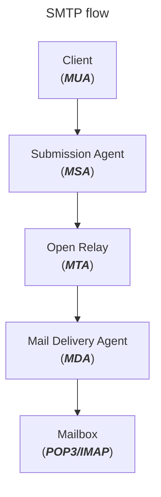

[<- Índice](../../../Pentesting.md)
# Simple Mail Transfer Protocol

> ***SMTP*** (*Simple Mail Transfer Protocol*) es un protocolo de aplicación para envíar correos electrónicos a través de la red. Aunque su comunicación se basa en un modelo cliente-servidor, un **servidor** también puede actuar como intermediario entre un cliente y otro servidor de correo, o incluso como intermediario entre otros 2 servidores.

Por defecto, un servidor *SMTP* está a la escucha en el puerto 25, aunque en ***SMTPS***, donde la comunicación es cifrada mediante *TLS*, el puerto por defecto se cambia al 587 (qué es el más adecuado)  o al 465.

Para la correcta tranmisión de los correos, el **cliente** se conecta al **servidor** y transfiere el remitente del correo, la dirección de correo del destinatario, el contenido del correo y algunos otros parametros.
Posteriormente, el servidor retransmite esta información a otro servidor *SMTP* para que haga las retransmisiones necesarias para llegar a su destino.

---

Ahondando en la comunincación, el **cliente**, también denominado como ***MUA*** (*Mail User Agent*) formatea el correo realizado por el usuario a un encabezado y un cuerpo, y lo transmite al servidor **SMTP**.

Este encabezado contendrá información vital del correo como el **remitente**, **destinatario**, tiempo de **envío** y de **recepción**, servidores por los que pasó y el **formato** y el **contenido** del correo.

Este servidor, recibe este correo mediante una sección de su *software* denominada ***Relay*** o ***MSA*** (*Mail Submission Agent*), encargada de revisar la validez y autenticidad del correo, para despues ser revisada por otra sección denominada ***MTA*** (*Mail Transfer Agent*) que se encarga de determinar el tamaño del correo, realizar algunas últimas revisiones, almacenarlo y finalmente enviarlo.

Para el envío del correo, el ***MTA*** determina la dirección IP del servidor *SMTP* destinatario (o intermediario) mediante una consulta *DNS*, de este modo ya puede transmitir el correo.

Una vez que llegue al servidor destinatario, una sección de este denominada ***MDA*** (*Mail Delivery Agent*) recibe los paquetes de red, los reensambla para formar el correo original y finalmente lo transfiere al **buzon de correo** (o *Mailbox* en inglés) del destinatario, usualmente implemetandos por protocolos como ***POP3*** o ***IMAP***.

Este proceso, visualmente, se ve de la siguiente manera:



Sin embargo, *SMTP* tiene 2 principales desventajas como protocolo de comunicación.

1. La primera es que *SMTP* no posee formalmente ningun mecanismo de **confirmación** de entrega del correo. A raíz de esto, a lo largo de los años se han implentado diversas formas de advertir al usuario, por ejemplo, mediante mensajes de error.
2. No tiene mecanismos propios de **autenticación**, de modo que no hay forma de validar los remitentes de los correos. Esto propicia la existencia de muchísimo *spam*, *phishing* y la utilización de cuentas falsas.

Por estas y más razones, se ha desarrollado una extensión de *SMTP* llamada ***ESMTP*** (*Extended SMTP*) que es la versión más utilizada actualmente, pues soluciona problemáticas previas con el protocolo y permite de forma nativa la encriptación de la comunicación mediante *TLS*.

## Configuración

Cada servidor de correo puede ser configurado de mpultiples maneras según se requiera, para el servidor ***Postfix***, en el archivo `/etc/postfix/main.cf`

```bash
cat /etc/postfix/main.cf | grep -vE "#|^\s*$"

# smtpd_banner = ESMTP Server 
# biff = no
# append_dot_mydomain = no
# readme_directory = no
# compatibility_level = 2
# smtp_tls_session_cache_database = btree:${data_directory}/smtp_scache
# myhostname = mail1.inlanefreight.htb
# alias_maps = hash:/etc/aliases
# alias_database = hash:/etc/aliases
# smtp_generic_maps = hash:/etc/postfix/generic
# mydestination = $myhostname, localhost 
# masquerade_domains = $myhostname
# mynetworks = 127.0.0.0/8 10.129.0.0/16
# mailbox_size_limit = 0
# recipient_delimiter = +
# smtp_bind_address = 0.0.0.0
# inet_protocols = ipv4
# smtpd_helo_restrictions = reject_invalid_hostname
# home_mailbox = /home/postfix
```

Y podemos interactuar con este servidor mediante **comandos** que le indican al servidor que acciones se desea que ejecute.

| Comando         | Descripción                                                                                                         |
| --------------- | ------------------------------------------------------------------------------------------------------------------- |
| `AUTH PLAIN`    | Es una extensión del servicio encargada de autenticar al cliente.                                                   |
| `HELO` / `EHLO` | El cliente indica un nombre de computadora para iniciar sesión en el servidor.                                      |
| `MAIL FROM`     | Se indica el remitente del correo.                                                                                  |
| `RCPT TO`       | Se indica el destinatario del correo.                                                                               |
| `DATA`          | El cliente inicia la transmisión del correo.                                                                        |
| `RSET`          | El cliente aborta la transmisión ya iniciada de un correo pero mantiene la conexión entre el cliente y el servidor. |
| `VRFY`          | Se le indica un destinatario para revisar si esta disponible un buzón de envío de dicho usuario.                    |
| `NOOP`          | El cliente solicita una respuesta del servidor, para confrmar su actividad y no desconectarse por inactividad.      |
| `QUIT`          | El cliente termina la sesión.                                                                                       |

Particularmente, con la utilidad `telnet` podemos iniciar una conexión con el servidor *SMTP* y despues interactuar con él mediante los comandos antes vistos.

```bash
telnet 10.129.65.43 25
```

#### Iniciar una sesión

Por ejemplo, para iniciar una **sesión SMTP** recordemos que se utiliza el comando `HELO` o `EHLO`.

```telnet
Trying 10.129.28.53...
Connected to 10.129.28.53.
Escape character is '^]'.

220 InFreight ESMTP v2.11
HELO ookami
250 mail1
```

`HELO` no hace más que iniciar la sesión con el servidor, el servidor acepta la sesión y nos responde con un código de respuesta afirmativo y el nombre del servidor, en este ejemplo, `mail1`.

Por otra parte, el comando `EHLO`, introducido junto con la extensión a ***ESMTP***, es un comando más moderno que también le indica al servidor que liste que características, comandos y extensiónes soporta.

```telnet
Trying 10.129.28.53...
Connected to 10.129.28.53.
Escape character is '^]'.

220 InFreight ESMTP v2.11
EHLO ookami
250-mail1
250-PIPELINING
250-SIZE 10240000
250-VRFY
250-ETRN
250-STARTTLS
250-ENHANCEDSTATUSCODES
250-8BITMIME
250-DSN
250-SMTPUTF8
250 CHUNKING
```

#### VRFY

El comando `VRFY` podría ser utilizado como una enumeración de usuarios, pues se espera que únicamente los usuarios válidos tengan un **buzón de correos** en el servidor, aunque no es un método confiable pues depende totalmente de la configuración de este.

En un caso ideal, podría verse así:

```telnet
Trying 10.129.28.53...
Connected to 10.129.28.53.
Escape character is '^]'.

220 InFreight ESMTP v2.11

HELO ookami
250 mail1

VRFY root
252 2.0.0 root

VRFY ookami
550 5.1.1 <ookami>: Recipient address rejected: User unknown in local recipient table
```

Sin embargo, de confirmarse cualquier usuario que indiquemos, sería una enumeración nada fiable.

```telnet
Trying 10.129.14.128...
Connected to 10.129.14.128.
Escape character is '^]'.

220 ESMTP Server 

VRFY root
252 2.0.0 root


VRFY cry0l1t3
252 2.0.0 cry0l1t3


VRFY testuser
252 2.0.0 testuser


VRFY aaaaaaaaaaaaaaaaaaaaaaaaaaaa
252 2.0.0 aaaaaaaaaaaaaaaaaaaaaaaaaaaa
```

Por esta misma razón, es importante no fiarse completamente de una sola herramienta o enumeración manual.

#### Envíar un correo

Para enviar un correo, podemos utilizar los comandos `MAIL FROM`, `RCPT TO` y `DATA`.
Mediante los primeros 2 indicamos el remitente y el destinatario del correo, mientras que con `DATA` podemos especificar el contenido del correo.
Una vez que coloquemos un único punto (`.`) el servidor da por terminado el contenido del mensaje e inicia la transferencia del correo.

Todo esto se ve de la siguiente manera:

```telnet
Trying 10.129.28.53...
Connected to 10.129.28.53.
Escape character is '^]'.

220 InFreight ESMTP v2.11

EHLO ookami
250-mail1
250-PIPELINING
250-SIZE 10240000
250-VRFY
250-ETRN
250-STARTTLS
250-ENHANCEDSTATUSCODES
250-8BITMIME
250-DSN
250-SMTPUTF8
250 CHUNKING

MAIL FROM: <ookami@unam.mx>
250 2.1.0 Ok

RCPT TO: <root@inlanefreight.htb> NOTIFY=success,failure
250 2.1.5 Ok

DATA
354 End data with <CR><LF>.<CR><LF>

From: ookami
To: root
Subject: Pwn
Hi, See you later!
.

250 2.0.0 Ok: queued as 672768A2

QUIT
221 2.0.0 Bye

Connection closed by foreign host.
```

### Opciones peligrosas

Al transmitir un correo, se corre el riesgo de ser filtrado como *spam* en caso de que el servidor destinatario no reconozca al servidor remitente.

Para evitarlo, es común el uso de un **servidor de confianza** (también denominado *Relay Server*) en el que el destinatario confía, para retransmitir el mensaje a través de él.

Los servidores *SMTP* permiten configurar esta retransmisión y limitarla a ciertos segmentos de red o a un proceso de autenticación, lo cual es altamente recomendable para evitar que cualquiera envíe correos a través del servidor.

En caso de que no sea así, representa una vulnerabilidad de **transmisión libre** (u *Open Relay*) para el servidor por el mal uso que se le puede dar.

```ini
# Configuración
mynetworks = 0.0.0.0/0
```

# Enumeración

> Podemos enumerar de forma rápida y eficiente el servicio mediante los *scripts* presentes en *Nmap*. Por ejemplo, `smtp-commands` enumera los comandos y funcionalidades del servidor mediante el comando `EHLO`, y el *script* `smtp-open-relay` realiza una serie de pruebas sobre el servidor para permitir si permite la **retransmisión libre** de correos electrónicos.

```bash
sudo nmap 10.129.14.128 --script smtp-commands -sV -p25

# Starting Nmap 7.80 ( https://nmap.org ) at 2021-09-27 17:56 CEST
# Nmap scan report for 10.129.14.128
# Host is up (0.00025s latency).
# 
# PORT   STATE SERVICE VERSION
# 25/tcp open  smtp    Postfix smtpd
# |_smtp-commands: mail1.inlanefreight.htb, PIPELINING, SIZE 10240000, VRFY, ETRN, ENHANCEDSTATUSCODES, 8BITMIME, DSN, SMTPUTF8, CHUNKING, 
# MAC Address: 00:00:00:00:00:00 (VMware)
# 
# Service detection performed. Please report any incorrect results at https://nmap.org/submit/ .
# Nmap done: 1 IP address (1 host up) scanned in 14.09 seconds
```

```bash
sudo nmap 10.129.14.128 -p25 --script smtp-open-relay

# PORT   STATE SERVICE
# 25/tcp open  smtp
# | smtp-open-relay: Server is an open relay (16/16 tests)
# |  MAIL FROM:<> -> RCPT TO:<relaytest@nmap.scanme.org>
# |  MAIL FROM:<antispam@nmap.scanme.org> -> RCPT TO:<relaytest@nmap.scanme.org>
# |  MAIL FROM:<antispam@ESMTP> -> RCPT TO:<relaytest@nmap.scanme.org>
# |  MAIL FROM:<antispam@[10.129.14.128]> -> RCPT TO:<relaytest@nmap.scanme.org>
# |  MAIL FROM:<antispam@[10.129.14.128]> -> RCPT TO:<relaytest%nmap.scanme.org@[10.129.14.128]>
# |  MAIL FROM:<antispam@[10.129.14.128]> -> RCPT TO:<relaytest%nmap.scanme.org@ESMTP>
# |  MAIL FROM:<antispam@[10.129.14.128]> -> RCPT TO:<"relaytest@nmap.scanme.org">
# |  MAIL FROM:<antispam@[10.129.14.128]> -> RCPT TO:<"relaytest%nmap.scanme.org">
# |  MAIL FROM:<antispam@[10.129.14.128]> -> RCPT TO:<relaytest@nmap.scanme.org@[10.129.14.128]>
# |  MAIL FROM:<antispam@[10.129.14.128]> -> RCPT TO:<"relaytest@nmap.scanme.org"@[10.129.14.128]>
# |  MAIL FROM:<antispam@[10.129.14.128]> -> RCPT TO:<relaytest@nmap.scanme.org@ESMTP>
# |  MAIL FROM:<antispam@[10.129.14.128]> -> RCPT TO:<@[10.129.14.128]:relaytest@nmap.scanme.org>
# |  MAIL FROM:<antispam@[10.129.14.128]> -> RCPT TO:<@ESMTP:relaytest@nmap.scanme.org>
# |  MAIL FROM:<antispam@[10.129.14.128]> -> RCPT TO:<nmap.scanme.org!relaytest>
# |  MAIL FROM:<antispam@[10.129.14.128]> -> RCPT TO:<nmap.scanme.org!relaytest@[10.129.14.128]>
# |_ MAIL FROM:<antispam@[10.129.14.128]> -> RCPT TO:<nmap.scanme.org!relaytest@ESMTP>
# MAC Address: 00:00:00:00:00:00 (VMware)
```

# Enlaces

[<- DNS](DNS.md) | [IMAP/POP3 ->](IMAP_POP3.md)