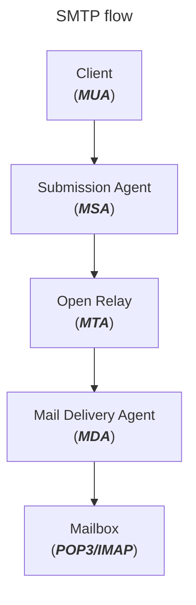

[<- Índice](../../../Pentesting.md)
# Simple Mail Transfer Protocol

> ***SMTP*** (*Simple Mail Transfer Protocol*) es un protocolo de aplicación para envíar correos electrónicos a través de la red. Aunque su comunicación se basa en un modelo cliente-servidor, un **servidor** también puede actuar como intermediario entre un cliente y otro servidor de correo, o incluso como intermediario entre otros 2 servidores.

Por defecto, un servidor *SMTP* está a la escucha en el puerto 25, aunque en ***SMTPS***, donde la comunicación es cifrada mediante *TLS*, el puerto por defecto se cambia al 587 (qué es el más adecuado)  o al 465.

Para la correcta tranmisión de los correos, el **cliente** se conecta al **servidor** y transfiere el remitente del correo, la dirección de correo del destinatario, el contenido del correo y algunos otros parametros.
Posteriormente, el servidor retransmite esta información a otro servidor *SMTP* para que haga las retransmisiones necesarias para llegar a su destino.

Ahondando en la comunincación, el **cliente**, también denominado como ***MUA*** (*Mail User Agent*) formatea el correo realizado por el usuario a un encabeza y un cuerpo y lo transmite al servidor **SMTP**.

Este servidor, recibe este correo mediante una sección de su *software* denominada ***Relay*** o ***MSA*** (*Mail Submission Agent*), encargada de revisar la validez y autenticidad del correo, para despues ser revisada por otra sección denominada ***MTA*** (*Mail Transfer Agent*) que se encarga de determinar el tamaño del correo, realizar algunas últimas revisiones, almacenarlo y finalmente enviarlo.

Para el envío del correo, el ***MTA*** determina la dirección IP del servidor *SMTP* destinatario (o intermediario) mediante una consulta *DNS*, de este modo ya puede transmitir el correo.

Una vez que llegue al servidor destinatario, una sección de este denominada ***MDA*** (*Mail Delivery Agent*) recibe los paquetes de red, los reensambla para formar el correo original y finalmente lo transfiere al **buzon de correo** (o *Mailbox* en inglés) del destinatario, usualmente implemetandos por protocolos como ***POP3*** o ***IMAP***.

Este proceso, visualmente, se ve de la siguiente manera:

Sin embargo, *SMTP* tiene 2 principales desventajas como protocolo de comunicación.

1. La primera es que *SMTP* no posee formalmente ningun mecanismo de **confirmación** de entrega del correo. A raíz de esto, a lo largo de los años se han implentado diversas formas de advertir al usuario, por ejemplo, mediante mensajes de error.
2. No tiene mecanismos propios de **autenticación**, de modo que no hay forma de validar los remitentes de los correos. Esto propicia la existencia de muchísimo *spam*, *phishing* y la utilización de cuentas falsas.

Por estas y más razones, se ha desarrollado una extensión de *SMTP* llamada ***ESMTP*** (*Extended SMTP*) que es la versión más utilizada actualmente, pues soluciona problemáticas previas con el protocolo y permite de forma nativa la encriptación de la comunicación mediante *TLS*.

## Configuración

# Enlaces

[<- DNS](DNS.md) |