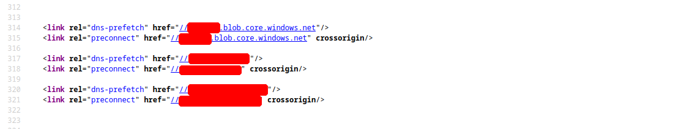

[<- Índice](../../Pentesting.md)
# Enumeración de Dominios

> La información acerca de los dominios del objetivo es un componente vital de cualquier ***Prueba de Penetración***, y no es solo por los subdominios existentes, si no por la presencia general en el *Internet* que estos representan.

Estos nombres pueden incluso proporcionamos pistas acerca del rol, funcionalidad y estructura de la infraestructura del cliente

### Certificados SSL

> Una de las primeras fuentes de información acerca de los dominios, bien pueden ser los certificados *SSL* del sitio principal del sitio web del cliente. Usualmente, estos certificados podrían incluir más de un dominio o subdominio pues puede utilizarse para todos los nombrados.

Otra alternativa, son los sitios de ***Registros de Transparencia Certificados***.
La **Transparencia de Certificados** tiene el propósito de posibilitar la verificación de los certificados digitales que permiten las conexiones seguras a través del *Internet* (*HTTPS*). Entonces todas las autoridades que brindan certificados estan obligadas a registrar los dominios que autorizan para su consulta pública.

Estos se pueden consultar en sitios como [crt.sh](https://crt.sh/)


Incluso podemos consultarlo en formato *JSON* mediante la terminal con apoyo de *cURL* y `jq`.

```bash
curl 'https://crt.sh?q=fciencias.unam.mx&output=json' -s | jq

# ...
# {
#     "issuer_ca_id": 16418,
#     "issuer_name": "C=US, O=Let's Encrypt, CN=Let's Encrypt Authority X3",
#     "common_name": "aztlan.fciencias.unam.mx",
#     "name_value": "aztlan.fciencias.unam.mx",
#     "id": 135397916,
#     "entry_timestamp": "2017-05-10T04:39:17.722",
#     "not_before": "2017-05-10T03:39:00",
#     "not_after": "2017-08-08T03:39:00",
#     "serial_number": "038e519620aa5c9d1a8ceaa47055e738672e",
#     "result_count": 2
# },
# ...
```

E incluso podemos filtrar aun más esta salida para obtener directamente una lista de nombres de dominio, para una visualización rápida.

```bash
curl 'https://crt.sh?q=hackthebox.com&output=json' -s | jq . | grep 'name'| grep -v 'CN=' | cut -d : -f 2 | cut -d \" -f 2 | sort -u

# ...
# status.hackthebox.com
# tableau.hackthebox.com
# trust.hackthebox.com
# ...
```

### Resolución a direcciones *IP*

> Una vez obtenidos los nombres de dominio, y validado que pertenece al **alcance** de la prueba, podemos resolverlos estos dominios a sus **alias** o direcciones *IP* mediante la herramienta de tu preferencia, en este ejemplo, se realizará con `host` y a partir de un archivo `nombres.txt` que contenga algunos nombres de dominio de ejemplo.

```bash
# Alias 
for nombre in $(cat nombres.txt) ; do host $nombre | grep 'is an alias' | cut -d ' ' -f 1,6 ; done
# trust.hackthebox.com trust.cname.drata.com.

# Direcciones IP
for nombre in $(cat nombres.txt) ; do host $nombre | grep 'has address' | cut -d ' ' -f 1,4 ; done

# status.hackthebox.com 109.176.239.70
# status.hackthebox.com 109.176.239.69
# trust.cname.drata.com 172.64.146.8
# trust.cname.drata.com 104.18.41.248
```

De este modo, podemos correlacionar los auténticos nombres de dominio con sus direcciones *IP* para posteriores análisis más exhaustivos.

### Shodan

> [*Shodan*](https://www.shodan.io/) es un poderoso motor de búsqueda sobre dispositivos y sistemas permanentemente conectados *Internet* como servidores, camaras públicas, controles de tráfico y cualquier dispositivo *IoT*.

También, realiza una enumeración básica de los puertos abiertos presentes en los dispositivos y sus respectivos servicios como *HTTP*, *HTTPS*, *FTP*, *SNMP*, etc.

Esto junto con todos los datos adicionales que proporciona, nos brinda una gran cantidad de información de los objetivos sin necesidad de interactuar directamente con ellos.

Por ejemplo, buscando la dirección `109.176.239.70` en *Shodan*:


### Registros *DNS*

> Otra manera de seguir enumerando más dominios y direcciones *IP* es la enumeración de los registros *DNS* relacionados a estos nombres de dominio.

Algunos de los más destacados son:

- Registros `A`: Estos registros almacenan las direcciones IP relacionadas a los nombres de dominio, son la opción por defecto al realizar una consulta *DNS*.
- Registros `MX`: En estos, residen los servidores de correo electrónico responsables de administrar los correos de la compañia, en caso de haberlos.
- Registros `NS`: Este tipo de registros indican los servidores *DNS* propios de la compañia, en caso de haberlos.
- Registros `TXT`: Este tipo de registros contienen datos en texto plano utiles para la empresa, usualmente, llaves de verificación para terceras partes y para otros aspectos de seguridad.

Nuevamente, puedes consultarlos con la herramienta de tu preferencia. En esta ocasión, utilzare `dig` como ejemplo:

```bash
dig NS fciencias.unam.mx +noall +answer

# fciencias.unam.mx.	5785	IN	NS	ns4.unam.mx.
# fciencias.unam.mx.	5785	IN	NS	ns3.unam.mx.
# fciencias.unam.mx.	5785	IN	NS	ns5.unam.mx.
# fciencias.unam.mx.	5785	IN	NS	ns2.unam.mx.
# fciencias.unam.mx.	5785	IN	NS	ns1.unam.mx.

dig MX fciencias.unam.mx +noall +answer

# fciencias.unam.mx.	6591	IN	MX	0 hp.fciencias.unam.mx.

dig TXT valhalla.fciencias.unam.mx +noall +answer

# valhalla.fciencias.unam.mx. 6279 IN	TXT	"v=spf1 ip4:132.248.181.82 -all"
```

Aunque en esta ocasión, no hay gran información en el registro `TXT`, , muchas veces contiene pistas acerca de las terceras partes que ofrecen servicios a la organización, y dependiendo del giro de la empresa, determinar que funcionalidades están presentes.

# Enumeración de instancias en la nube

> Hoy en día, servicios en la nube como *AWS*, *GCP*, *Azure* y demás están ganando popularidad en empresas modernas. Despues de todo, estos servicios permiten una administración más cómoda de los recursos y un control centralizado.

Aunque las empresas que ofrecen estos servicios en la nube se encargan de asegurar estas tecnologías, no signifca que las empresas que las utilizan esten libres de vulnerabilidades. 

La presencia de configuraciones inseguras pueden poner en riesgo los recursos que disponga la organización, por ejemplo si no se tiene un control de autenticación adecuado.

Como *Pentesters*, no debemos perder de vista estas tecnologías y enfocar nuestra atención en las *S3 buckets* (*AWS*), *blobs* (*Azure*) y las *cloud storage* (*GCP*).

### Dominios

> Puede darse el caso que estas instancias esten registradas como dominios a nombre de la empresa, por temas de comodidad para que los empleados puedan disponer de ellos. Claro que esto, nos brinda la información directamente desde la enumeración de dominios.

Por ejemplo, si durante la enumeración encontramos un dominio `s3-website-us-west-2.amazonaws.com` a nombre de la empresa y **dentro del alcance**, es altamente probable (como su nombre indica) que se trate de una instancia en la nube por parte de *Amazon* que ahora conocemos.

Sin embargo, esta no es la única forma de encontrarlas.

### Google Dorks

> Gracias a los versátiles *Google Dorks* podemos encontrar instancias en la nube en la red con apoyo de *Dorks* como `intext` e `inurl`. Mediante `inurl` filtramos con los dominios conocidos de instancias en la nube mientras que con `intext` filtramos aquellos resultados que contengan, por ejemplo, el nombre de la empresa.

```google
intext:unam inurl:amazonaws.com
```


Podemos repetir este mismo procedimiento con dominios conocidos de *Azure*, por ejemplo:

```google
intext:unam inurl:blob.core.windows.net
```

Con este método, podemos notar que los links presentados pueden contener una variedad de tipos de archivos, como documentos, presentaciones, códigos, *PDF*s, etc. Esto es una gran fuente de información pues muchos de estos archivos pueden contener información sensible que no es recomendable que este expuesta a Internet.

Bajo casos graves, puede haber incluso filtraciones importantes de contraseñas, llaves *SSH*, archivos de configuración, etc.

#### Código fuente

Este contenido alojado en la nube también podría estar referenciado en las páginas web principales de la organización a modo que aligeran la carga de archivos en el servidor web.



### GrayHatWarfare

> ***GrayHatWarfare*** es un potente motor de busqueda que recopila los archivos que encuentra alojados en instancias de la nube **accesibles**. Es decir, nos muestra los archivos abiertos al Internet disponibles desde instancias de la nube que podemos filtrar para encontrar archivos relevantes a nuestro objetivo.

Es capaz de enumerar archivos de instancias de *AWS*, *Azure* y *GCP*, ademas de ordenarlas y filtrarlas por palabras clave, tipos de archivo, nombre, etc.

Por ejemplo al buscar en la sección *Bucket*, la palabra `openai` obtenemos las siguientes instancias:


# Enumeración de Staff

> Investigar e identificar el perfil de empleados de la organización y sus mismos empleados puede revelar mucha información acerca de la infraestructura de sus tecnologías y aplicaciones.

Podemos investigar este tipo de información acerca de los empleados y de las publicaciones en plataformas reconocidas como *LinkedIn* o *Xing*.

### Publicaciones de Empleo

Si en una publicación de empleo se indica que se prefieron ciertos lenguajes de programación, bases de datos y *frameworks*, podemos enfocar nuestros esfuerzos a entender estas tecnologías y saber aprovechar las posibles vulnerabilidades presentes.

Por ejemplo, si la empresa solicita tener experiencia con *Django*, es altamente probable que lo utilice en sus aplicaciones y conviene investigar las vulnerabilidades o configuraciones negligentes más comunes que presenta este *Framework*.

### Empleados

> Como empleados y personas en busca de mejores oportunidades, las personas tienden a hacer público su trabajo en publicaciones y repositorios para que puedan demostrar su experiencia en caso de requerirlo, por ejemplo, al buscar empleo.

Podemos extraer mucha información valiosa de estos proyectos acerca de las posibles tecnologías que está utilizando en su trabajo actual, además de posibles filtraciones de datos sensibles como sus correos personales de la empresa, nombres de usuario y hasta información más importante como contraseñas, tokens y llaves.

# Enlaces