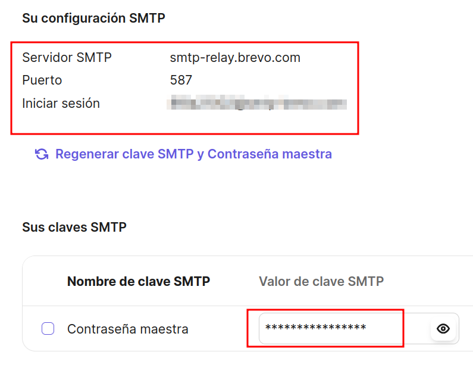
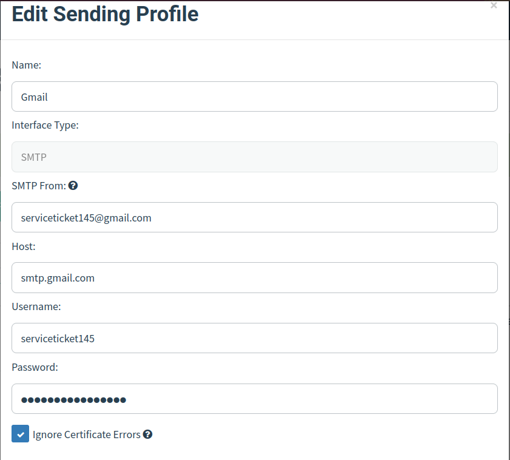

# Laboratorio de Phishing

### VPS

> Para este laboratorio, configuré un **Droplet** (*VPS*) de *Digital Ocean* con Ubuntu y el **nombre de dominio** `calcifer.lat`.

Es importante configurar correctamente el registro *DNS* **A** de nuestro dominio al *VPS*, y el registro **CNAME** de cualquier dominio (`*`) a el dominio principal, en este caso `calcifer.lat`.

| Tipo      | Host | Valor          |
| --------- | ---- | -------------- |
| **A**     | `@`  | `<IP>`         |
| **CNAME** | `*`  | `calcifer.lat` |

---
### Configuración de  *Evilginx*

##### Instalación

<p  align="center">
  
</p>

Primero, debemos asegurarnos de tener instalado el lenguaje **Golang** en el *VPS*, además de su compilador `go`.
De modo que ejecutamos:

```bash
sudo apt install golang-go
```

Ya que contemos con el compilador, en algun espacio de trabajo clonamos el repositorio oficial de **Evilginx**:

```bash
git clone https://github.com/kgretzky/evilginx2.git
```

Despues, dentro de la carpeta que acabamos de clonar, compilamos el código fuente para generar un ejecutable `evilginx2`. Esto con la instrucción:

```bash
go build
```

Opcionalmente, se podría configurar un *script* `/usr/local/bin/evilginx2`  con siguiente contenido para poder ejecutar `evilginx2` desde cualquier ruta:

```bash
#!/bin/bash
(cd /usr/share/evilginx2 && ./evilginx2 "$@")
```

Así, podemos iniciar `evilginx2` para que genere los archivos de configuración necesarios y debería verse algo similar a:


El error al iniciar el **nameserver** es típico y se soluciona editando el archivo `/etc/systemd/resolved.conf`, particularmente fijando las siguientes opciones de la sección `[Resolve]`:

- `DNS=1.1.1.1`
- `FallbackDNS=8.8.8.8`
- `DNSStubListener=no`

Después, creamos un enlace simbólico necesario con el siguiente comando:

```bash
sudo ln -sf /run/systemd/resolve/resolv.conf /etc/resolv.conf
```

Y después de reiniciar el **VPS**, ya no debería salir esta advertencia.

##### Phishlets y lures

Para este laboratorio, se utilizaron **Phishlets** del repositorio [Evilginx2-Phishlets](https://github.com/An0nUD4Y/Evilginx2-Phishlets), particularmente `facebook.yaml` y `outlook.yaml`.
Es necesario descargarlos y ubicarlos en la ubicación del directorio `evilginx2` que clonamos, en la carpeta `phishlets`.

Una vez descargados, deberían reflejarse en la intefaz de `evilginx2` al iniciarlo:


Antes de activarlos, primero debemos designarles un **subdominio** de nuestro dominio principal `calcifer.lat`.
Se recomienda un nombre genérico, pues muchos `phishlets` agregan subdominios por su cuenta, pero relacionado al sitio objetivo.
Para **Facebook** seleccioné el subdominio `meta.calcifer.lat` y se asigna con el siguiente comando dentro de la interfaz:

```evilginx2
# phishlets hostname <nombre> <subdominio>

phishlets hostname facebook meta.calcifer.lat
```

Después, se activa el phishlet y **Evilginx** automáticamente generará los certificados *TLS/SSL* necesarios.


Finalmente, se debe crear un **lure**, el enlace malicioso que entregaremos como **carga útil**, con la instrucción:

```evilginx2
# lures create <nombre_phishlet>

lures create facebook
```

Y generar la **URL** correspondiente, en base al **ID** asignado al nuevo **lure**, en este caso 0, con:

```evilginx2
# lures get-url <id>

lures get-url 0
```

Esto nos brinda una **URL** de un recurso malicioso dentro del subdominio indicado previamente, por ejemplo `https://www.meta.calcifer.lat/ycWnmuCs`, que detonará la funcionalidad maliciosa de **proxy inverso** sobre el *login* de *Facebook*.

##### Captura de sesión

Obviando por el momento los mecanismos de entrega, cuando la **victima** acceda al enlace, lo recibirá un **login** auténtico de *Facebook*:


Una vez que este inicie sesión con sus credenciales, **Evilginx** capturará las credenciales y la **Cookie** de sesión devuelta por el sitio legítimo, **Facebook** en este caso.

```txt
[17:56:59] [+++] [2] Username: [rooteda8@gmail.com]
[17:56:59] [+++] [2] Password: [<--Redacted-->]
[17:57:01] [+++] [2] all authorization tokens intercepted!
```

Podemos visualizar todas las sesiones capturadas con el comando `sessions`, e inspeccionar detalles y el **token** capturado de una en particular especificando el **id** de la sesión, de la forma `sessions <id>`.


Ahora, como **atacantes**, podemos utilizar esta **cookie** capturada para autenticarnos en el sitio legítimo `www.facebook.com`, **importandola** con alguna extensión compatible como [Cookie editor](https://cookie-editor.com/).


Una vez **importada**, al recargar la página deberíamos estar *logeados* como el usuario capturado:


---

## Servidor de correos

> Antes de entrar de lleno a **Gophish**, debemos asegurarnos de contar con un **servidor de correos** capaz de **retransmitir** los correos que generemos para la campaña.

Algunas opciones comunes son:

1. Montar nuestro propio servidor.
2. Utilizar un servicio ***SMTP Relay*** de nuestro dominio.
3. Utilizar un servicio (y dominio) de **terceros** (*Gmail*, *Outlook*, etc).

Claro, lo más recomendable es ==montar nuestro propio servidor==, en algun servicio de **hosting** que lo permita.

Sin embargo, esto es **ligeramente** dificil para este laboratorio por las restricciones y demás medidas de seguridad que se implementan sobre los **VPS** para evitar el **spam** de correos, pero aún es bastante factible con el presupuesto adecuado.

Por otra parte, actualmente los servicios de **SMTP Relay** poseen igualmente estrictas medidas de seguridad para evitar el maluso y spam de correos mediante su plataforma:

#### Servidor SMTP Relay

> Para este ejemplo se utilizó [**Brevo**](https://www.brevo.com/), un servicio de **Email Relay** gratuito y confiable, que no debería ser demasiado distinto de otros servicios similares.

Cabe recalcar que fui bloqueado de Brevo casi instantáneamente después de configurar el **Relay**, de modo que insisto que las medidas de seguridad continuan evolucionando y la mayoría de estos servicios podrían impedirnos su uso para este propósito.

<p  align="center">
  
</p>

Despues de registrar una cuenta gratuita, es importante configurar varios aspectos:

1. ***Autenticar el dominio o subdominio a utilizar en el remitente***

Siguiendo el ejemplo práctico anterior, con **Facebook**, sería ideal registrar y autenticar un **dominio** `facebook.calcifer.lat`.

Para esto vamos a la sección **Remitentes, dominios y direcciones IP dedicadas**, después a **Dominios** y seleccionamos **Añadir un dominio**.

Lo siguiente es escribir el nombre seleccionado, `facebook.calcifer.lat`, y seguir los pasos indicados para **autenticarlo automáticamente** en conjunto con nuestro **provedor de nombre**, en este caso **Namecheap**.


2. ***Designar un nuevo remitente***

Dentro de la subsección de **Remitentes**, agregaremos uno nuevo con la opción **Añadir remitente**, para el dominio recien creado. Digamos **Servicio al Cliente `<servicioclientes@facebook.calcifer.lat>`**:


3. ***Identificar las credenciales e información del servidor SMTP***

Finalmente, en la sección correspondiente de **SMTP**, deberemos identificar el servidor **SMTP** asignado a nosotros, el puerto y las credenciales necesarias para autenticarnos.

Esto con el fin de indicarlo para la configuración de **Gophish** más tarde:



#### Servicio de terceros

> Finalmente, lo que se terminó utilizando para este laboratorio fue el servicio **SMTP** provisto por *Gmail* para todos sus usuarios registrados. Básicamente nos permite enviar un correo desde una cuenta de **Gmail**, que autenticamos, a cualquier correo.

Es más restrictivo en el sentido de que el remitente **no** será de nuestro dominio, ni podemos personalizar su nombre como en las opciones anteriores.
Se reduce el remitente especificamente a una cuenta *Gmail* desde el dominio típico `gmail.com`.

- El servidor **SMTP** siempre será el mismo, `smtp.gmail.com` con el puerto **587**.
- El usuario será el mismo usuario que hayamos decidido para la cuenta *Gmail*, sin especificar el dominio `@gmail.com`.
- Para obtener la contraseña, primero debemos activar la **verificación en 2 pasos** en la cuenta, y así poder solicitar una [**Contraseña de aplicación**](https://myaccount.google.com/apppasswords) relacionada a la cuenta.

---
## Gophish

<p  align="center">
  
</p>

> Ahora sí, retomando la **entrega**, avanzamos a la configuración de **Gophish** en el **VPS**, como principal *software* de **administración** del envío de correos durante la campaña.

Lo primero es descargar la última versión del comprimido **pre-compilado** del *software* en la página [*Releases*](https://github.com/kgretzky/gophish/releases) del repositorio oficial.
Recordemos utilizar el repositorio con la versión **integrada** con **Evilginx**, publicada por el creador de esta última.

Despues de descomprimirlo, se obtiene un ejecutable `gophish` que, con los permisos adecuados, despliega el **panel administrativo** en un servidor web dentro de la red *loopback*: `https://localhost:3333`.

Además en la misma terminal, nos mostrará las credenciales para autenticarnos en el panel de **Gophish**. Después de hacerlo y actualizar la contraseña, deberíamos ver desplegada la herramienta:


#### Perfil de envío

Lo primero es configurar en *Sending Profiles* nuestro servidor **SMTP** y **remitente** por utilizar (el servidor **SMTP** de *Gmail* y la cuenta recién creada):



Puedes enviarte un correo de prueba para verificar que el **perfil** este bien configurado, y se vería algo así:


#### Plantilla de correo

> Lo siguiente es definir una **plantilla de correo** que estaremos enviando durante la campaña haciendo ligeras modificaciones por usuario. Para esto primero debemos seleccionar un correo legítimo adecuado a nuestros objetivos.

Por ejemplo, seleccione un aviso de inicio de sesión de *Facebook*, para lo que visualicé el **codigo fuente** y copie su contenido:


Este texto se importa a **Gophish** en el botón **Import Email** y generará un correo similar en las vistas previas:


Para terminar, solo resta adecuar y personalizar el correo según el objetivo y necesidades de la **campaña**.
Por eso **Gophish** nos ofrece una nomenclatura tipo **plantillas web** (`{{.algo}}`) para indicar donde se debe insertar un valor personalizado para cada usuario. Algunas de las más útiles son:

- `{{.FirstName}}`: Será remplazado por el primer nombre del usuario objetivo.
- `{{.LastName}}`: Será remplazado por el apellido de cada usuario objetivo.
- `{{.Email}}`: Remplazado por el correo del usuario objetivo
- `{{.Position}}`: Se remplaza por la posición en la empresa indicada para el objetivo.
- `{{.From}}`: El correo que se esta impersonando
- `{{.URL}}`: Se remplaza por el **payload principal** de la campaña en cuestión, una de las plantillas más importantes.

Finalmente, la **plantilla** se vería algo similar a:


Y la más importante, `{{.URL}}`, quedó embebida en el **botón** de "**No fui yo**" que buscamos que la víctima presione al no reconocer este inicio de sesión.
Siempre es buena idea esconder el **enlace malicioso** de la vista mediante técnicas similares a esta, con un botón, una imágen o cualquier cosa que "recubra" el enlace sutilmente.

Adicionalmente, se recomienda adjuntar una **imágen de seguimiento** (*Tracking Image* o *Tracking URL*) para que **Gophish** pueda determinar el estado del correo y las interacciones con este.

#### Objetivos

> Lo siguiente es definir los usuarios objetivos de esta campaña, que recibirán estos correos maliciosos y que buscamos sean engañados por esta.

En la sección **Users & Groups**, para cada objetivo se define su **nombre**, **apellido**, **correo** y **posición** en la empresa. Estos son los mismos datos que serán insertados posteriormente en la **plantilla**, justo en los *placeholders* que definimos.


#### Inicio de la campaña

> Ahora, solo resta crear e iniciar la **campaña de Phishing** que llevamos preparando. No sin antes configurar **Evilginx** para que trabaje en conjunto con **Gophish**.

Para esto, dentro de la línea de comandos de **Evilginx**, debemos indicar 3 cosas:

- La **URL** al panel administrativo de **Gophish** (Como en este ejemplo se estan ejecutandose en el mismo **VPS**, la **URL** es simplemente `https://localhost:3333`).

- La **llave API** correspondiente de nuestra instancia **Gophish**, extraida de nuestro perfil dentro de **Gophish**.

- En caso de que el panel administrativo no utilicé un certificado *TLS* válido (como viene por defecto), se requiere indicar a **Evilginx** que permita conexiones inseguras.

Para lo cual, se ejecutan las siguientes instrucciones en la línea de comandos de **Evilginx**:

```evilginx
config gophish admin_url https://localhost:3333

config gophish api_key acdebca6a5678ac...

config gophish insecure true
```

Finalmente, podemos crear una nueva **campaña** con el botón correspondiente, indicar la **plantilla**, **usuarios objetivo** y **perfíl de envío**, definir el comienzo y final de la campaña, etc.

Notaremos el importante campo de **Evilginx Lure URL**, donde tras generar un **lure** adecuado en **Evilginx**, lo indicaremos en esta sección y con eso, la **campaña** esta completamente lista para lanzarse.

Gracias a la integración, **Evilginx** compartirá información con **Gophish** para que este pueda determinar el comportamiento de los usuarios respecto al **enlace malicioso**, como cuando abren el correo, si clickean o no el **link** e incluso si envían sus datos o no en el sitio malicioso.


Todo esto sin afectar el funcionamiento normal de **Evilginx**, que nos permitirá capturar las sesiones de todos aquellos que caigan para posiblemente impersonarlos después, concluyendo así la campaña de **Phishing**.

# Enlaces

[<- Fundamentos del Phishing](RedTeam_PhishingTeoria.md) |