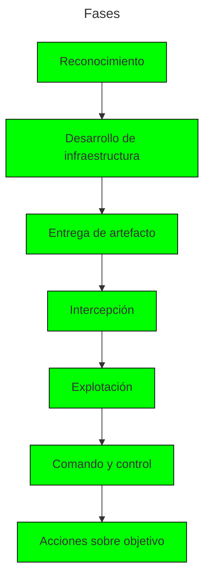

# Phishing 101

### Temario

1. Fundamentos de Phishing
2. ATT&CK y Cyber Kill Chain
3. Reconocimiento
4. Armamento: Infraestructura
5. Armamento: Integración
6. Entrega
7. Evasión (MFA)
8. Explotación
9. El gato y el ratón

### ¿Por qué Phishing?

> El ***Phishing*** es el vector inicial de ataque más popular y utilizado por adversarios modernos.

![[redteam_initialvectors.png]]

#### ¿Por qué es tan exitoso?

Debido a que abusa de las **relaciones de confianza** inherentes en las **relaciones profesionales**.
Aunado al ritmo de trabajo, donde usualmente un trabajador prioriza la eficiencia y rapidez, prestando menos atención a los detalles sútiles del **Phishing**.

---
## Estructura táctica

> Los **identificadores** relacionados al **Phishing** en el framework *MITRE ATT&ACK* son:

- **T1598**: *Phishing* for Information
- **T1566**: Phishing
	- **T1566.002**: Spearphishing Link
	- **T1566.001**: Spearphishing Attachment
- **T1199**: Trusted relationships

#### Cyber Kill Chain

> Por otra parte, las etapas del **Phishing** reconocidas por el framework *Cyber Kill Chain*, y en las que nos estaremos basando son:

---
## ¿Qué es una campaña?

> En general, una **campaña** es una **operación ofensiva** con **propósito** que puede ser en **masa** o **dirigida** a público específico.

| Concepto               | Definición        | Características    |
| ---------------------- | ----------------- | ------------------ |
| ***Campaña***          | *Ciberataque*     | Operación ofensiva |
| ***Campaña en masa***  | Ataque masivo     | Genérica           |
| ***Campaña dirigida*** | Ataque adaptativo | Personalizada      |

### Componentes

Los componentes de una campaña de **Phishing** son:

- **Infraestructura de red**
- **Certificados SSL**
- **Archivos y recursos en general** (No forzosamente maliciosos)
- **Dominios**
- **Evasión**
- **Payload** (Carga útil maliciosa)

#### Infraestructura

> Por parte de la **infraestructura de red**, típicamente requeriremos de un **VPS** (*Virtual Private Server*) para una interacción más completa con el *Internet*, apoyado de *software* malicioso enfocado a *Phishing*.

Algunos ejemplos de aplicaciones de **hosting** y de **software** que podríamos estar utilizando son:

- ***Servicios de hosting***
	- AWS
	- Azure
	- Hostinger
	- DigitalOcean
	- Hetzner

- ***Software***
	- ***Evilginx***
	- ***GoPhish***

Además, debemos considerar la seguridad de nuestro propio servidor, por lo que se suele implementar medidas de seguridad como:

- ***Redirectores***
	- *Iptables* o (*Firewall* en general)
	- *Socat*
	- *nginx*

#### Dominios

> Además, requerimos apropiarnos de uno o más **dominios** adecuados para la entrega de los correos bajo ese nombre, cuidando factores como:

- **Ubicación geográfica**: Debe ser un dominio relacionado con la ubicación del objetivo.

- **LOTS** (*Living Off Trusted Sites*): Idealmente, podriamos aprovecharnos de otros servicios o dominios populares, a los que típicamente se les tiene mayor confianza. **LOTS** es una base de datos de este tipo de dominios.

- **Reputación**: Queremos que el dominio no posea mala reputación en el *Internet*, ya sea por usos anteriores o cualquier otro factor.

En cuanto al nombre principal, algunas técnicas para nombrar o escoger el dominio son:

- **TLD bait**: Escoger un dominio del mismo nombre pero con otro **TLD**. Si la victima es `victim.com`, utilizar por ejemplo `victim.net`.

- **Typosquatting**: Ligeras fallas ortográficas que puedan pasar desapercibidas, por ejemplo, google.com => gogle.com.

#### Recursos y archivos

> Todos los archivos y recursos que requerimos para nuestra campaña, dependiendo del propósito y metodología de esta.

Por ejemplo, si queremos mimetizar o impersonar otro sitio web, lo más típico es que **clonemos** el sitio, con herramientas como:

- **Web Clone**
	- *Web2zip*
	- *HTTrack*
	- `wget`
	- *Scripting*

En cambio si la campaña va de interceptar las comunicaciones mediante un **proxy inverso**, requerimos de *software* y recursos como **Evilginx** o similares, incluso podríamos configurar **Nginx** convencional a mano para realizar esta tarea.

- **Proxying**
	- ***Evilginx***
	- Modlishka
	- Vanilla nginx (a mano)

Y en general, ocuparemos las **plantillas de correo** y **firmas corporatiivas** de la empresa para la falsificación de los correos.
Las **firmas** no son más que el "estilo" del correo que normalmente usan, por ejemplo, si utilizan un logo, en que posición, un *banner* tal vez, terminos y condiciones, etc.

- **Mail**
	- Plantillas HTML
	- Firma corporativa

#### Evasión

> Adicionalmente, deben tenerse en cuenta técnicas de **evasión de detección**, no únicamente para antivirus en cuanto a la **carga útil**, si no en contra de todas las medidas que puedan impedir que nuestro correo se entregue en el buzon principal.

Algunas cuestiones a tener en cuenta son:

- Cambios de firma
- Momento de entrega ideales
- Vulnerabilidades: *Open redirect*
- Empleo de ofuscación / *Smuggling*
- JA3, JA4 *Fingerprints* y certificados

#### Carga útil (Payload)

>En este punto, debemos decidir que **carga útil** estaremos utilizando como el componente central **malicioso** de la campaña.

Empezando por el tipo de **payload**:

- **Tipo**
	- Enlace (*URL*)
	- Archivo adjunto
	- Macro

Seguido de que próposito o enfoque le daremos:

- **Acción**
	- Acceso inicial
	- Robo de credenciales
	- Clickjacking

Idealmente se busca que estas **cargas útiles** sean reutilizables, en caso de necesitarlo, por lo que se prioriza también la **modularidad** y el establecimiento de **plantillas**.

- **Reutilización**
	- Plantillas
	- Modular

Opcionalmente, se recomienta adicionar a estos **payloads** propiedades de **trazabilidad**, osea la capacidad de identificar o monitorear las interacciones con ellos mediante técnicas bien conocidas como:

- **Trazabilidad**
	- *Pixel Tracking*
	- *Canary*

---
## Evilginx

Permite posicionarse entre el objetivo y el servicio legítimo, a partir de *phishlets* y *lures* o cebos, integrandose con *GoPhish*.

#### Que es un phishlet

Es un archivo de configuración en formato yaml que 