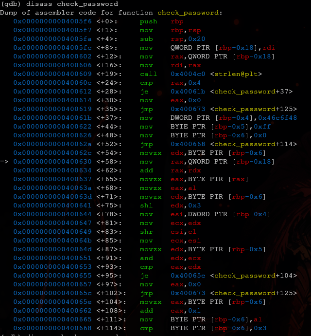

# Arquitectura de computadora

## Componentes

- **CPU**
- **Memoria**
	- La más conocida es la *RAM*
- **Entrada/Salida**

### CPU
Posee los siguientes componentes

- Unidad de control
- *ALU*
- Registros
	- Propósito general (*EAX* para 32 bits, *RAX* para 64 bits)
	- Especiales (*EIP* para 32 bits, *RSP* para 64 bits)

### Memoria

- **Caches**
	- L1, L2, L3
- **RAM**
	- Pila (Funciones y variables locales) y montículo
	- Buffer

## Endianess

- **Little-endian**

## Instrucciones

| Complex ISC                                                                     | Reduced ISC                                                              |
| ------------------------------------------------------------------------------- | ------------------------------------------------------------------------ |
| - Instrucciones complejas - Código compacto - Menos ciclos - Más común | - Pocas instrucciones - Código largo - Más ciclos - Menos común |
| **x86**                                                                         | **ARM**                                                                  |

## Registros y banderas (x86)

- **EAX/RAX**: Para operaciones aritmeticas
- **EAX/RAX**: Para referenciar direcciones en memoria
- **EAX/RAX**: Contador, loops, etc
- **EAX/RAX**: Datos

### Banderas

Registros de propósito especial

- **Zero flag**: Una operación resultó en 0
- **Carry flag**: Indica si una operación realizada previamente resulto en un número mayor a la capacidad del registro.

# Ensamblador

Analizaremos principalmente la sintaxis de *Intel* para x86 de 64 bits

## Operandos

La sintaxis principal es de la forma:

> `<Mnemónico> <dst> <src>`

Donde `dst` y `src` son direcciónes de memoria de destino y fuente, y la lista de mnemónicos es:

- **push**: Guarda la referencia a la pila anterior
- **mov**: Copia el valor fuente al destino
- **sub**: Resta la fuente al destino
- **lea**: Guarda la dirección de memoria de la fuente al destino
- **call**: Llama a otra función
- **cmp**: Compara. Afecta las bandera
- **j\<algo>** Revisan banderas y "saltan"

> Un opcode es mas o menos el programa ya en hexadecimal.

%% Investigar que es opcode %%

## Análisis de ejecutables

### Ejercicio 1

### Ejercicio 2

Para este ejercicio se nos brindó un ejecutable *ELF* de *UNIX* donde la función mas interesante (y la que debiamos analizar) era la siguiente:

Para analizarla utilizamos la herramienta `gbd` configurandola para hacer *desassembly* tipo *Intel*
#### Algunas observaciones

Por la línea `0x40060e`, nos damos una idea que el programa obtiene la longitud de la cadena recibida, y la compara con el número 4.
De no cumplirse esta comparación, no puede se ejecuta el salto condicional de igualdad `je` y el programa salta incondicionalmente al final de la función donde termina su ejecución.

> En resumen, la cadena debe ser de 4 caracteres

#### Solución

Después de un poco de tanteo con los *breakpoints* de la herramienta, descubrí una especie de ciclo que podiamos aprovechar entre las lineas:
##### -  `0x400653`
##### - `0x400668`

> Recalco que creo bastante posible encontrar unas mejores cotas que estas que propongo

Marque estos *breakpoints* y ejecute el programa pasandole como parametro la palabra *test* con el comando `run test`.

Cada vez que se detenia en alguno de estos *breakpoints*, revisaba el estado de los registros y me di cuenta que existia un registro `rdx` que almacenaba el siguiente caracter que se esperaba que tuviera la contraseña.

Por ejemplo, en la primera "iteración" al revisar los registros se esperaba un caracter `0x48` (o sea *H*), entonces actualizaba la primera letra de la contraseña propuesta, por ejemplo, para esta segunda "iteración" corrí el programa con `run Hest`.

De esta manera, ahora pasaba la primera "iteración" sin problemas, pero no pasaba la segunda comparación donde `rdx` almacenaba otro nuevo caracter.

> Repitiendo este proceso descubri que la contraseña esperada era `Hol` seguido de un caracter ilegible, quedando algo asi como `Hol `