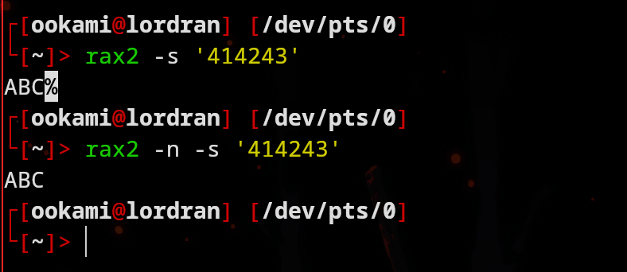

[<- Índice](../Reversing.md)
# Rax2

> `rax2` es una valiosa utilidad incluida junto con el *Framework* de **radare2**, se trata de un **evaluador** de expresiones matemáticas **minimalista** que permite, entre otras cosas:
> 
> - Conversiones entre bases númericas de números enteros, negativos y de punto flotante.
> - Procesamiento de distintas representaciones de cadenas de texto (cadenas de texto claro, de texto en hexadecimal, *base64*, direcciones IP, etc)

### Conversiones

#### Decimal

Empezando por unas de las conversiones más importantes, `rax2` puede hacer conversiones **hexadecimal-decimal** (y viceversa) de números enteros básicamente de forma directa, sin especificar ninguna bandera o notación extra.
Por otra parte, para los numeros de punto flotante, si debemos especificar una letra `f` al final del número.

```bash
#  int        ->  hex              ;  rax2 10
#  hex        ->  int              ;  rax2 0xa
#  -int       ->  hex              ;  rax2 -77
#  -hex       ->  int              ;  rax2 0xffffffffffffffb3
#
#  float      ->  hex              ;  rax2 3.33f
#  hex        ->  float            ;  rax2 Fx40551ed8
```

`rax2` también soporta conversiones de números en **base decimal** hacia números binarios o ternarios, sin embargo, en esta ocasión si varía un poco la especificación.

Para la conversión ésta conversión de decimal a binario o ternario, debemos especificar **al principio** del número la letra `b` o `t` respectivamente

```bash
#  int        ->  bin              ;  rax2 b30
#  int        ->  ternary          ;  rax2 t42
```

Por otra parte, para la conversión de dichas bases de vuelta a decimal, debemos indicar **al final** del número una letra `d` (de decimal) en caso de números binarios y las letras `dt` en caso de números ternarios.

```bash
#  bin        ->  int              ;  rax2 11110d
#  ternary    ->  int              ;  rax2 1120dt
```

#### Hexadecimal

Para las conversiones relacionadas a números hexadecimales, podemos trabajar también con números en **base octal**, además se siguen notaciones parecidas a los ejemplos anteriores.

Por ejemplo, de no especificar la letra `d`, de forma predeterminada convierte números binarios y ternarios a representación **hexadecimal**, en lugar de decimal.

> Sin embargo, deberemos indicar una letra `b` al final, cuando se trata de un número binario.

```bash
#  bin        ->  hex              ;  rax2 11110b
#  ternary    ->  hex              ;  rax2 1120t
#  oct        ->  hex              ;  rax2 35o
```

Tambien podemos convertir desde hexadecimal a cada una de las bases mencionadas anteriormente, especificando las letras `Bx`, `Tx`, `Ox` segun sea el caso.

```bash
#  hex        ->  bin              ;  rax2 Bx63
#  hex        ->  ternary          ;  rax2 Tx23
#  hex        ->  oct              ;  rax2 Ox12 (O is a letter)
```

#### General

Si las notaciones antes descritas resultan muy confusas, podemos apoyarnos de la bandera `b` seguida de la base que se desea como respuesta.
Esta bandera **únicamente** soporta las siguientes bases como argumentos:

- 2
- 3
- 8
- 10
- 16

De esta manera, obtendremos el resultado en la abse indicada, solo debemos recordar las notaciones para especificar la base:

- `<número>b` para números **binarios**
- `<número>t` para números **ternarios**
- `<número>o` para números **octales**
- `<número>` para números **decimales**
- `0x<número>` para números **hexadecimales**

**Ejemplos**:

```bash
# Conversión binario a hexadecimal
rax2 -b 16 10101b
# -> 0x15

# Conversión de ternario a octal
rax2 -b 8 102t
# -> 013

# Conversión de decimal a ternario
rax2 -b 3 308
# -> 102102t
```

#### Operaciones

Para terminar con esta sección de números, cabe recalcar que `rax2` también permite la evaluación de las siguientes operaciones aritmeticas básicas y el recorrimiento de bits.

- **Suma** `+`
- **Resta** `-`
- **Multiplicación** `*`
- **División** `/`
- **Módulo** `%`
- **Recorrimiento de bits** `<<`

Simplemente podemos utilizarlas como haríamos con cualquier lenguaje de programación, con las notaciones antes vistas.

```bash
rax2 -b 10 '102t*10t'
# -> 33

rax2 101010b/10b
# -> 0x15

rax2 '105o%11o' | rax2 -
# -> 6

rax2 '1<<8'
# -> 0x100
```

### Cadenas de texto

`rax2` también permite la conversión de cadenas de texto *"crudas"* (sin importar si hay caracteres no-legibles) a cadenas códificadas en hexadecimal, recibiendolas como argumentos a continuación de la bandera `-S` o directamente desde la entrada estándar.

```bash
#  raw ->  hex

rax2 -S 'ABC'
# -> 414243

echo -n 'DEF' | rax2 -S
# -> 444546

rax2 -S < /ruta/a/binario
```

Por otra parte, para la operación inversa hay que especificar la bandera `-s` y una cadena codificada en hexadecimal, de cualquiera de las 2 formas especificadas anteriormente.

```bash
#  hex ->  raw

rax2 -s '414243'
# -> ABC

echo -n '444546' | rax2 -s
# -> DEF

rax2 -s < archivo
```

En este tipo de conversiones, podría resultar útil la bandera `-n` que agrega un salto de línea al final del resultado que muestra en pantalla, posiblemente mejorando la legibilidad del resultado, por ejemplo:



(Recordemos que ese porcentaje marca el final de la línea, no es ningún resultado de `rax2`)

#### Base64

Tambien podemos realizar codificaciones y decodificaciones de *base64* mediante las banderas `-E` y `-D` respectivamente, de forma similar al comando `base64`.

```bash
# Codificación
rax2 -E 'Fernando'
echo 'Fernando' | rax2 -E -

# Decodificación
rax2 -D 'RmVybmFuZG8='
echo 'RmVybmFuZG8=' | rax2 -D -
```

#### Cadenas y arreglos de *C*/*Python*

Tambien `rax2` nos facilita la conversión de números a *strings* *C* para incorporar fácilmente a un código que estemos desarrollando.
Aunque genere código en *C*, personalmente pienso que es fácil adaptarlo a un código en *Python* también.

Esto se realiza con las banderas `-c` para una cadena y `-C` para un arreglo.

```bash
rax2 -c 0x7fffffffffdc0a

echo 0x7fffffffffdc0a | rax2 -c -

# -> \x0a\xdc\xff\xff\xff\xff\x7f\x00
```

Cabe recalcar que esta conversión, la realiza como *little-endian* (de ahí que este invertido) y asegurandose que el tamaño del *string* sea acorde a la arquitectura nativa, típicamente *x86-64*.
Como ese es mi caso, se asegura que sea un string de 64 *bits* de tamaño, es decir, 8 caracteres.
Si es de menos longitud, rellena con caracteres nulos (`\x00`) y si es de más anunciará un error.

Por otra parte, tambien podemos convertir **texto crudo** a arreglos de *C* para su procesamiento en el código de la siguiente manera:

```bash
rax2 -C Danna

# unsigned char buf[] = {
#   0x44, 0x61, 0x6e, 0x6e, 0x61
# };
# unsigned int buf_len = 5;

echo -n 'Texto crudo xd' | rax2 -C

# unsigned char buf[] = {
#   0x54, 0x65, 0x78, 0x74, 0x6f, 0x20, 0x63, 0x72, 0x75, 0x64, 0x6f, 0x20, 0x78, 0x64
# };
# unsigned int buf_len = 14;
```

Recalco que lo anterior esta pensado **únicamente** para **texto crudo**, sin embargo si deseamos convertir números a estos arreglos, podemos realizar una conversión previa con apoyo de la misma herramienta.

```bash
rax2 -s 0x7fffffffffdc0a | rax2 -C

# unsigned char buf[] = {
#   0x7f, 0xff, 0xff, 0xff, 0xff, 0xdc, 0x0a
# };
# unsigned int buf_len = 7;
```

De igual manera, si deseamos introducir texto, en lugar de números, para convertirlo en un *string* podemos realizar una conversión parecida.

```bash
echo "0x$(rax2 -S Danna)" | rax2 -c

# \x61\x6e\x6e\x61\x44\x00\x00\x00
```

### Algunas funciones interesantes

Entre otras opciones que destacan de esta herramienta, puedo recomendar las siguientes:

- **Imprimir tabla ascii**: `rax2 -a`
- **Forzar siempre la base decimal**: `rax2 -d 10+1`
- **Convertir Epoch a una fecha en un formato más convencional**:

```bash
rax2 -t 1744662291
# -> Mon Apr 14 14:24:51 2025
```

- **Convertir una dirección IP a número y viceversa**:

```bash
rax2 -i 192.168.100.1

rax2 -i 0x0164a8c0
```

- **Convertir bytes a kilobytes, megabytes, gigabytes, etc**:

```bash
rax2 -u 1024
# -> 1K

rax2 -u '1024*1024'
# -> 1M

rax2 -u '1024*1024*1024'
# -> 1G
```

- **Convertir una cadena a su representación en binario y viceversa**:

```bash
rax2 -z 'h4x0r'

rax2 -Z '0110100000110100011110000011000001110010'
```