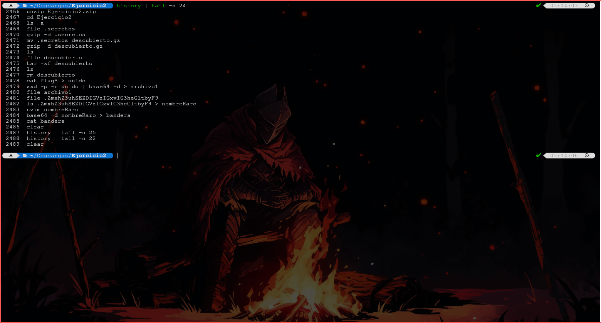

# Ejercicio 2

## Procedimiento

1. Primero había que descomprimir el archivo zip con el comando `unzip`.
2. Despues, en la carpeta descomprimida hay un archivo `.secretos`, que en realidad es un archivo *gz*, que podemos descomprimir. Yo lo guarde en un archivo llamado `descubierto`.
3. Este último archivo, resulta ser un archivo *tar*, por lo que despues de descomprimirlo, descubrimos 4 archivos: `flag0`, `flag1`, `flag2` y `hint.txt`.
4. Concatenando los archivos `flag*` con `cat`, usando `xxd -p -r` para desencriptar el hexadecimal, y usando `base64 -d`a la salida anterior, obtenemos una salida que podemos redirigir a un archivo para descubrir que es la primera imágen escondida (capibara).
5. Sin embargo, en la descompresión del *tar*, tambien obtuvimos un archivo oculto nombrado de manera extraña.
6. El archivo anterior es la segunda imágen escondida, un coco.
7. Sin embargo, el nombre del archivo, podemos desencriptarlo con `base64 -d`y obtener la bandera que buscamos (*¡HFC es lo máximo!*).

## Imágenes encontradas

