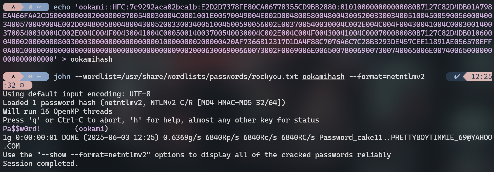
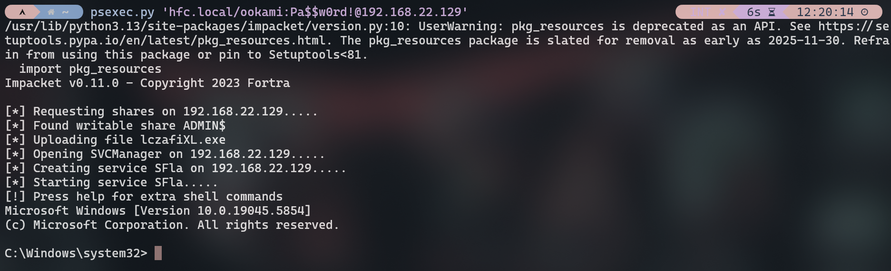
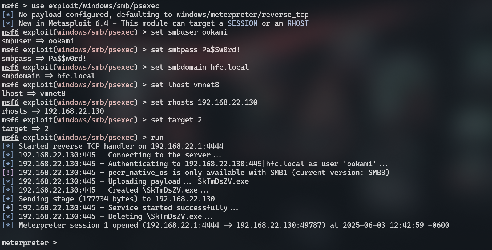

[<- Índice](../SistemasWindows.md)
# Acceso inicial a una Shell

> Hasta el momento, hemos visto algunas maneras de capturar credenciales tanto como **hashes** de contraseñas, que podriamos *crackear*, como en texto claro. Ahora veremos algunas nociones básicas de como podríamos aprovechar estas contraseñas capturadas para conseguir ejecución remota en algún dispositivo.

### PsExec

> ***PsExec*** es una herramienta de línea de comandos en sistemas *Windows* que permite ejecutar procesos de forma remota en otros sistemas, disponible para usuarios autenticados del dominio y con suficientes **privilegios** en el dispositivo, a través del servicio **SMB** en el puerto 445.

Es una de las opciones más utilizadas para obtener ejecución remota de comandos a partir de credenciales en texto claro y existen varias implementaciones de esta herramienta que podemos utilizar.

###### Impacket `psexec.py`

Por ejemplo, supongamos que el usuario `ookami` del dominio `hfc.local` es **administrador local** en la estación de trabajo `PC-OOKAMI` con IP `192.168.22.129`.

Previamente capturamos su **hash** con un ataque **LLMNR Posioning** y con apoyo de **John The Reaper**, lo crackeamos para descubrir que la contraseña es `Pa$$w0rd!`.



Dado que se cumple que podemos autenticarnos como el usuario y que este posee suficientes privilegios sobre el dispositivo, podemos aprovechar el **script** de *Impacket* para conseguir ejecución remota:

```bash
psexec.py 'hfc.local/ookami:Pa$$w0rd!@192.168.22.129'
```



###### Metasploit `exploit/windows/smb/psexec`

Alternativamente, **Metasploit** tambien ofrece el módulo **`psexec`** como su propia implementación para esta herramienta.
Como es usual, solo debemos proveer a **Metasploit** con todas las opciones necesarios y ejecutar la explotación.

Para este ejemplo se probaron varios **targets**, pues el target **Powershell** por defecto, no funciona.
El que me funcionó bien es **Native upload** con el índice **2**.

```msfconsole
msf6 exploit(windows/smb/psexec) > show targets

Exploit targets:
=================

    Id  Name
    --  ----
    0   Automatic
    1   PowerShell
=>  2   Native upload
    3   MOF upload
    4   Command
```



# Enlaces

[<- Vectores de ataque iniciales](HACKAD_Begginers_Initial2.md) | [PowerView ->](HACKAD_Begginers_PowerView.md)