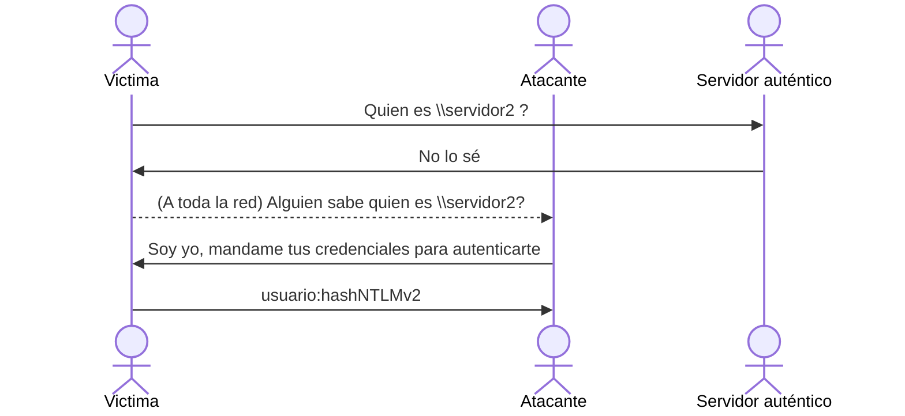

# Vectores de ataque iniciales contra Active Directory

> En esta sección hablaremos de 2 importantes **vectores de ataque** relacionados a **Active Directory**, que podríamos aprovechar como un acercamiento **inicial** al entorno.

- ***LLMNR Poisoning***
- ***SMB Relay***
- ***IPv6 Attacks***

Todas estas técnicas pertecen más a un enfoque **interno** de la prueba de penetración pues se requiere que tengamos conectividad completa a la red del **directorio activo**, que típicamente es la *intranet* de la organización.

### LLMNR Poisoning

> ***LLMNR*** es un protocolo de red, mayormente de sistemas *Windows*, utilizado para identificar dispositivos dentro de la red mediante **nombres**, independientemente del protocolo **DNS**.

Es la evolución del protocolo obsoleto **NBT-NS** y surgió como una alternativa a los **nombres de dominio** y los sistemas **DNS**.

Sin embargo, este protocolo posee una debilidad clave pues en ciertos casos, ==envía el nombre de usuario y el *hash* **NTLMv2** de la contraseña de este usuario== si es **requerido**.

Aunque esta funcionalidad busca ser un mecanismo simple de autenticación, podemos aprovecharnos si hacemos creer a algun dispositivo **víctima** que nosotros podemos resolver el nombre que solicitó.

Esto solo podría funcionar cuando el verdadero servidor **DNS** o **LLMNR** asignado falla en resolver el nombre indicado. Por lo que la víctima manda un mensaje **Broadcast** a toda la red preguntando por dicho nombre.

Se vería de la siguiente manera:

